# CTF夺旗赛教程：P39：Windows系统安全配置规范 🔧

在本节课中，我们将学习Windows系统安全配置规范。主要内容包括系统服务管理、进程安全、日志审核策略以及文件权限控制。掌握这些知识有助于加固Windows系统，为CTF竞赛和实际安全运维打下基础。

---

## 系统服务 🛠️

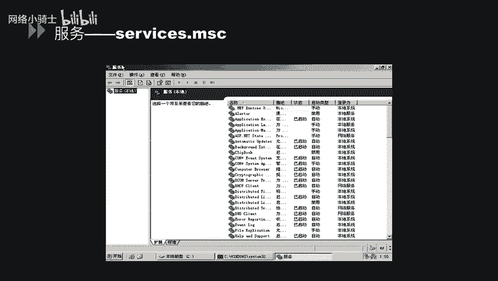

上一节我们介绍了Windows系统安全的基础概念，本节中我们来看看如何管理系统服务。系统服务是在后台运行的程序，为操作系统和其他应用程序提供功能。

想查看系统中有哪些服务，可以使用 `services.msc` 命令。在CMD中直接输入此命令，即可打开服务管理界面。该界面会显示当前系统中存在的所有服务，包括其状态（如“已启动”或“已停止”）和启动类型（如“手动”、“禁用”、“自动”等）。

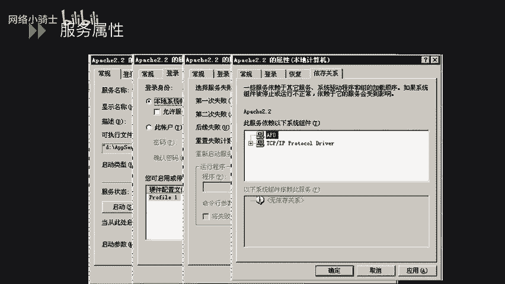

接下来，我们可以查看某个服务的具体属性。以“Apache2.2”服务为例，右键点击并选择“属性”。在“常规”选项卡中，可以看到服务名称、可执行文件路径以及启动类型设置。在“登录”选项卡中，可以设置运行此服务的账户身份。“恢复”选项卡允许配置服务失败时计算机的响应，例如不操作、重启服务或重启计算机。“依存关系”选项卡列出了此服务所依赖的其他服务或组件。

通过系统命令也可以开启和关闭服务。以下是相关命令示例：
*   停止服务：`net stop [服务名]`
*   启动服务：`net start [服务名]`

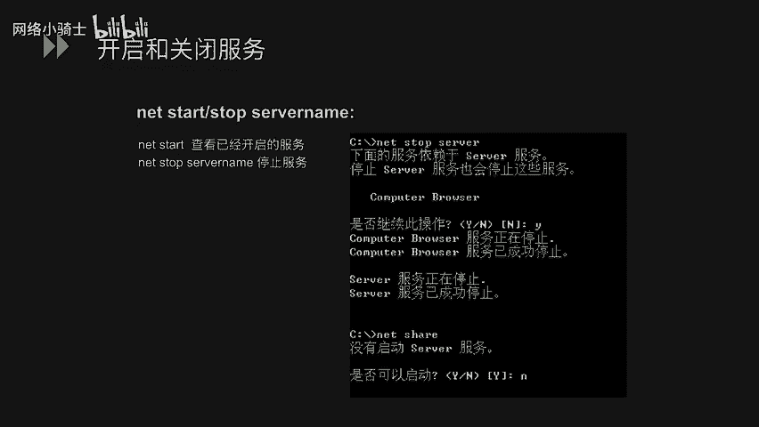

在安全配置方面，某些不必要或存在漏洞的服务可能带来威胁。建议遵循最小化安装原则，停止非必需的服务并将其启动类型改为“手动”。例如：
*   **Server服务**：曾存在MS06-040和MS08-067漏洞，可导致远程代码执行。
*   **Print Spooler服务**：曾存在MS10-061漏洞，可导致远程代码执行。

服务配置信息也存储在注册表中。路径位于 `HKEY_LOCAL_MACHINE\SYSTEM\CurrentControlSet\Services`。每个服务项下的 `Start` 键值决定了该服务的启动方式。

---

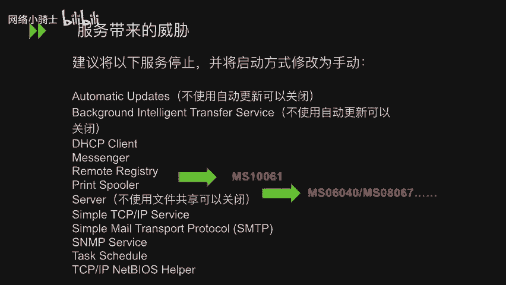

## 服务于进程安全 🔍

了解了系统服务的管理后，我们进一步探讨进程安全。进程是正在运行的程序的实例。

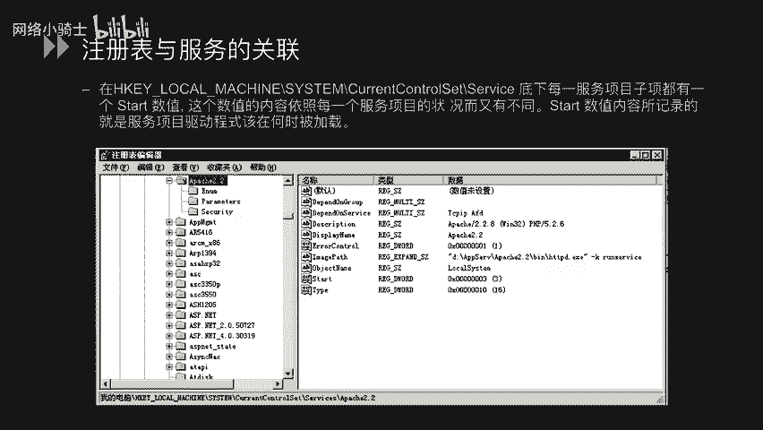

首先，需要熟悉系统的基本进程。可以通过任务管理器查看，了解哪些是正常的系统进程，这有助于识别可疑活动。

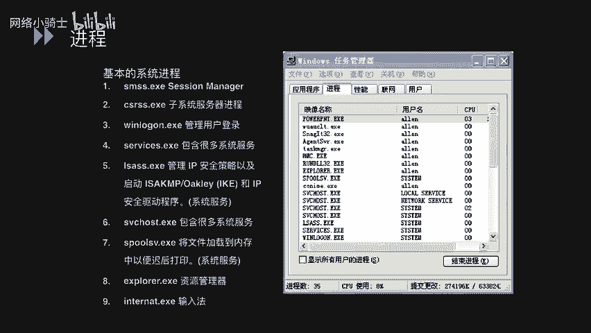

当发现某个网络端口被占用时，需要查明是哪个进程在使用它。以下是查看端口与进程对应关系的方法：
1.  使用命令 `netstat -ano` 查看所有网络连接和监听端口及其对应的进程ID（PID）。
2.  在任务管理器的“详细信息”或“进程”选项卡中，根据找到的PID定位对应的进程名称。

---

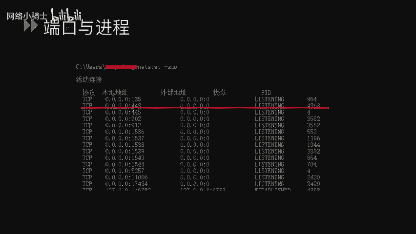

## 日志审核 📝

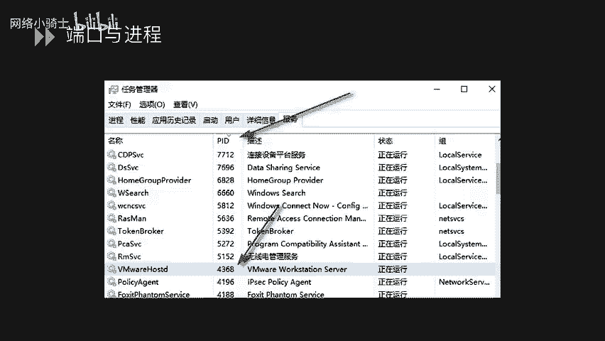

进程安全监控离不开日志。接下来，我们学习如何配置Windows的日志审核策略。完善的日志记录是事后分析和追踪攻击行为的关键。

Windows日志主要存放在以下位置：
*   **默认日志**：包括“应用程序”、“安全”、“系统”日志，存放于 `%SystemRoot%\System32\Winevt\Logs\`。
*   **IIS等服务日志**：如FTP连接日志、HTTP事务日志，通常存放于 `%SystemDrive%\inetpub\logs\LogFiles\`。

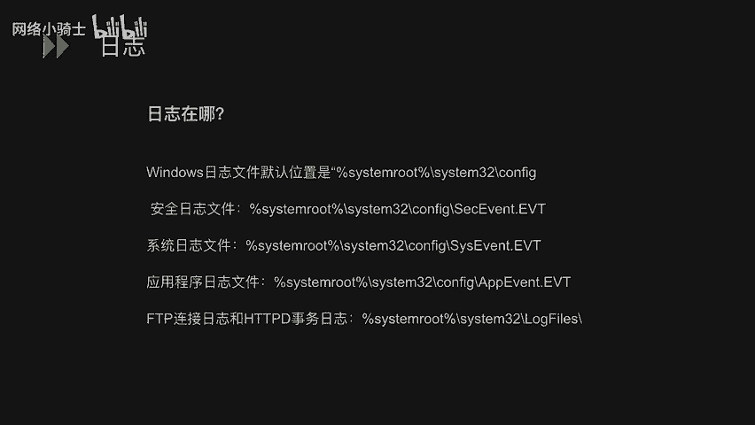

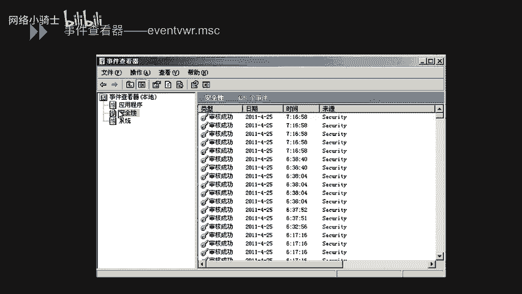

可以通过 `eventvwr.msc` 命令打开“事件查看器”来查看这些日志。

为了有效记录安全事件，需要配置审核策略。使用 `secpol.msc` 命令打开“本地安全策略”，在“本地策略”->“审核策略”中，可以针对各类事件（如账户登录、对象访问等）设置审核策略，选项包括“无审核”、“成功”、“失败”或“成功和失败”。

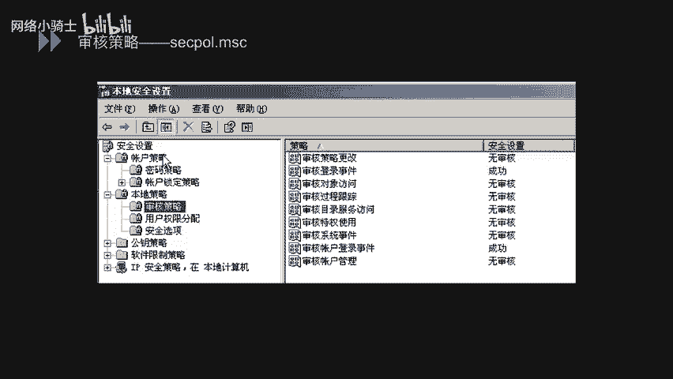

---

## 文件权限控制 🔐

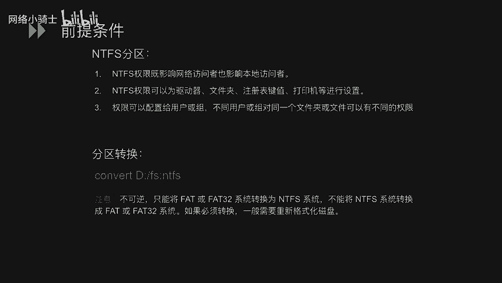

最后，我们进入文件权限控制部分。本节内容主要针对NTFS文件系统。NTFS权限同时影响网络访问者和本地访问者，可以为驱动器、文件夹、文件等对象设置权限，并且可以为不同的用户或组分配不同的权限。

如果磁盘是FAT或FAT32格式，可以使用 `convert [盘符]: /fs:ntfs` 命令转换为NTFS格式（此过程不可逆）。

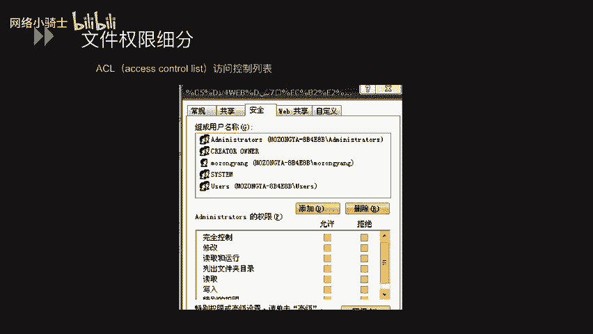

在文件或文件夹的“属性”->“安全”选项卡中，可以管理权限。上半部分列表是“组或用户名”，下半部分是对应选中对象的“权限”列表，如“完全控制”、“修改”、“读取和执行”等。每个权限都可以设置为“允许”或“拒绝”。

Windows文件权限具有以下特性：
1.  **权限优先顺序**：当权限设置发生冲突时，系统按以下顺序确定最终权限：直接设置的“拒绝” > 直接设置的“允许” > 继承的“拒绝” > 继承的“允许”。
2.  **移动/复制对权限的影响**：
    *   在同一NTFS分区内移动：保留原权限。
    *   在不同NTFS分区间移动或复制：继承目标位置的新权限。
    *   移动或复制到FAT/FAT32分区：所有NTFS权限丢失。

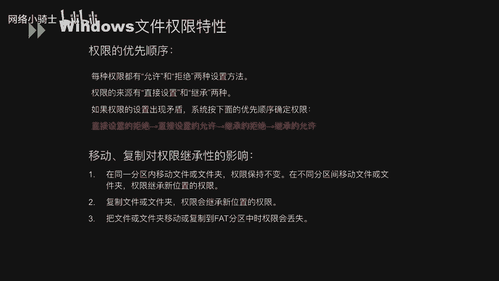

---

本节课中我们一起学习了Windows系统安全配置规范的四个核心部分：系统服务管理、进程安全关联、日志审核策略以及NTFS文件权限控制。通过合理配置这些方面，可以显著提升Windows系统的安全性。