# CTF夺旗赛教程：P3：杂项的基本解题思路上半部分

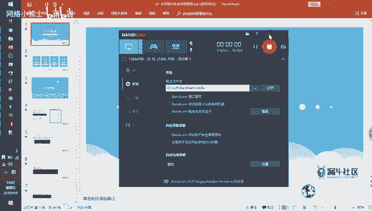

## 概述

在本节课中，我们将学习CTF竞赛中“杂项”题型的基本解题思路。杂项题目内容庞杂，但核心在于掌握各类文件的分析与处理工具。我们将从最简单的文件操作与隐写开始，逐步深入到图片隐写技术，为后续学习打下基础。


---

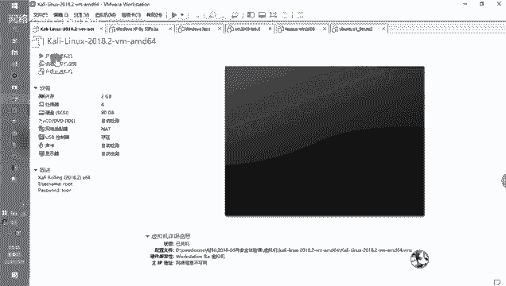

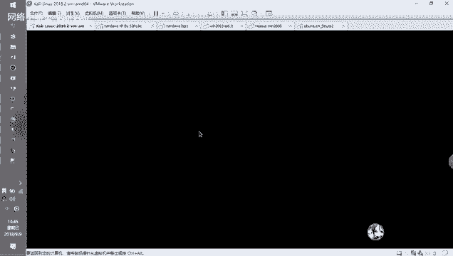

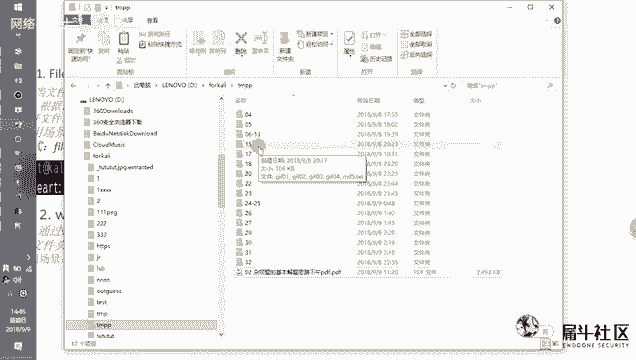

## 文件操作与隐写

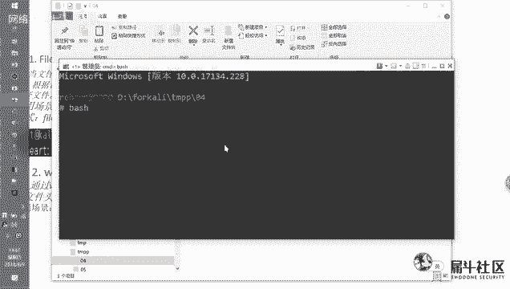

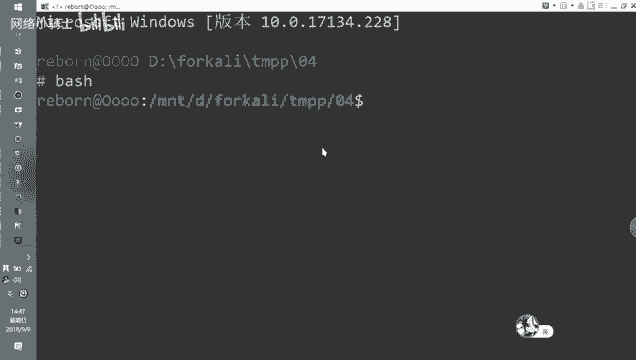

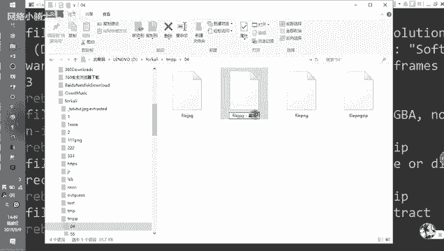

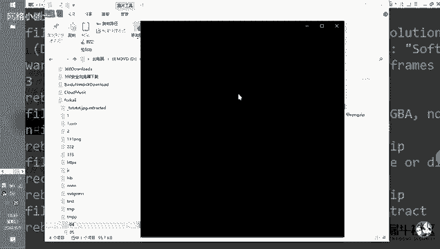

上一节我们介绍了CTF的五大题型，本节中我们来看看“杂项”题目的第一个核心考点：文件操作与隐写。这类题目通常会提供一个文件，解题的第一步就是识别和处理这个文件。

### 文件类型识别

很多时候，出题人不会直接告诉你文件的类型。例如，一个文件可能被删除了后缀名。这时，我们需要使用工具来识别其真实类型。

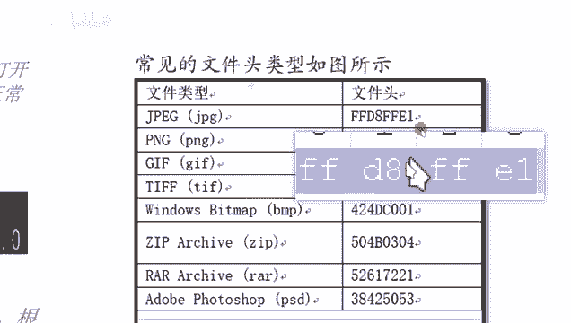

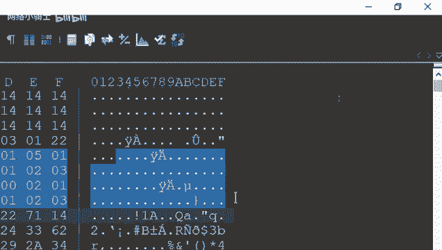

以下是识别文件类型的常用方法：

*   **`file` 命令**：这是一个Linux下的命令行工具，可以识别文件的类型。其基本用法是 `file 文件名`。
    ```bash
    file unknown_file
    ```
*   **十六进制编辑器**：所有文件在计算机底层都以二进制形式存储，转换为十六进制后，不同文件类型的“文件头”有特定标识。我们可以用十六进制编辑器查看文件头来判断类型。常用工具有 `010 Editor`、`WinHex` 和 `Notepad++`（需安装Hex-Editor插件）。

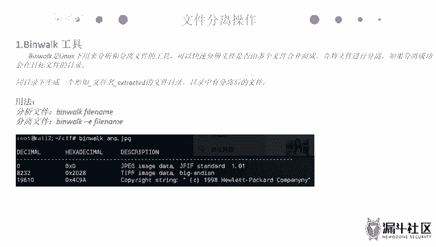

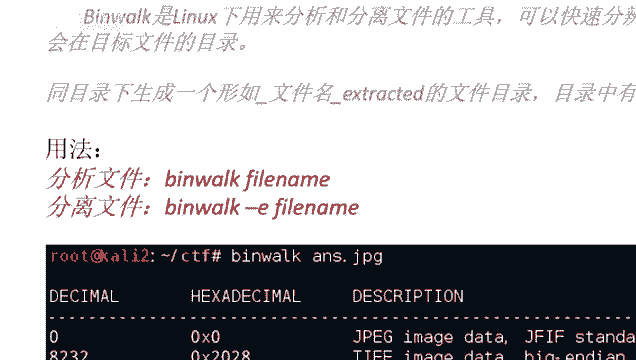

### 文件隐写与分离

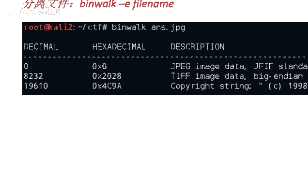

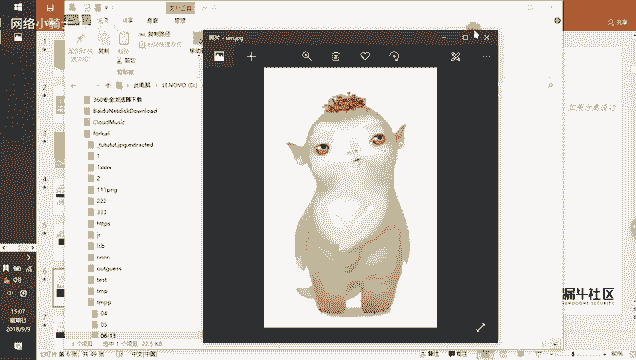

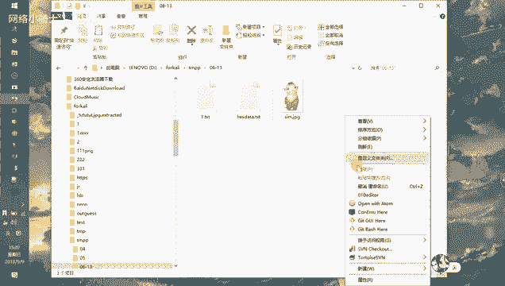

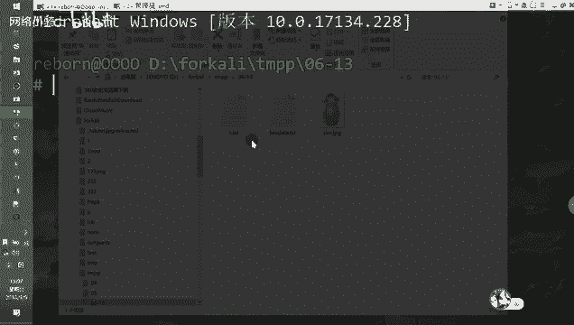

识别出文件类型后，下一步是检查其中是否隐藏了其他信息或文件。一种常见的手法是将多个文件（如图片和压缩包）合并成一个文件。

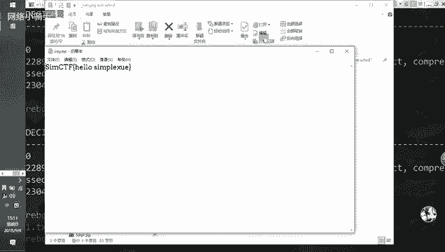

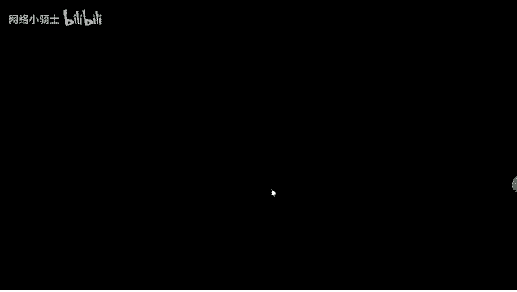

以下是文件分离的几种方法：

*   **`binwalk` 工具**：这是一个强大的自动化文件分析工具。使用 `binwalk 文件名` 可以分析文件中可能包含的其他文件。使用 `binwalk -e 文件名` 可以自动分离出这些文件。
    ```bash
    binwalk -e suspicious_image.jpg
    ```
*   **`foremost` 工具**：这是另一个文件恢复工具，用法与 `binwalk` 类似，有时在 `binwalk` 失效时可以尝试使用。
    ```bash
    foremost -o output_dir suspicious_image.jpg
    ```
*   **`dd` 命令**：这是一个更底层的工具，允许你按指定的数据块大小和数量来精确切割或提取文件的一部分。当自动化工具有效时，可以手动计算偏移量进行提取。
    ```bash
    dd if=input_file.jpg of=extracted.zip bs=1 skip=22895
    ```
    *   `if`：输入文件
    *   `of`：输出文件
    *   `bs`：块大小（字节）
    *   `skip`：跳过开头的块数
*   **手动提取**：使用十六进制编辑器（如010 Editor）直接选中隐藏数据所在的十六进制区域，然后将其另存为一个新文件。

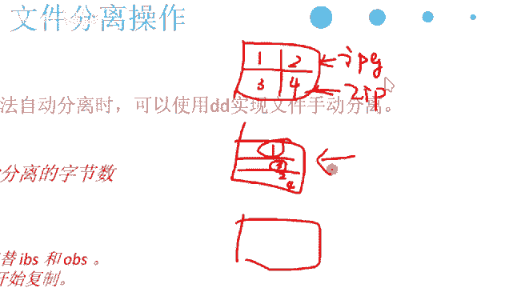

### 文件合并

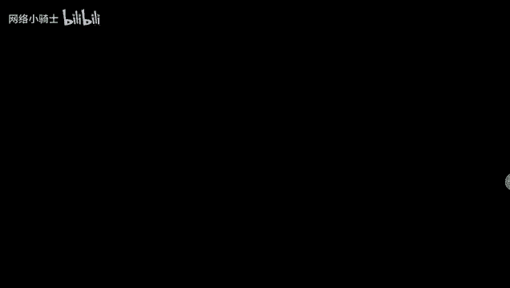

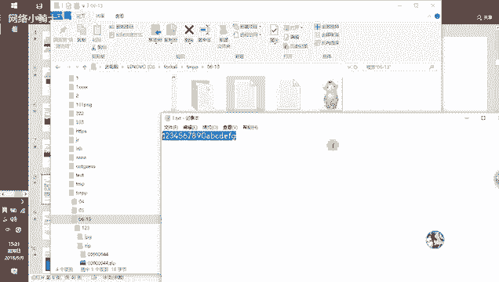

与文件分离相反，有时题目会将一个完整文件（如图片）分割成多个碎片提供给你，需要你将其合并还原。

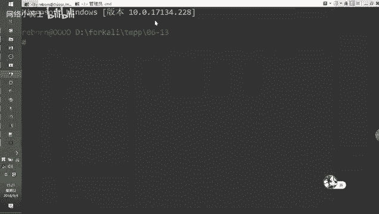

以下是文件合并的方法：

*   **Linux (`cat`命令)**：
    ```bash
    cat fragment1 fragment2 fragment3 > combined_file
    ```
*   **Windows (`copy`命令)**：
    ```cmd
    copy /B fragment1+fragment2+fragment3 combined_file
    ```

合并后，务必使用 `MD5` 校验工具检查合并文件的哈希值是否与题目给出的一致，以确保合并正确。

### 基础隐写与搜索

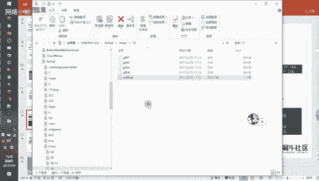

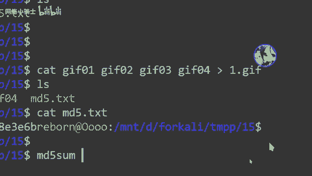

最简单的隐写方式是将 `flag` 直接以文本或十六进制形式藏在文件的开头或末尾。

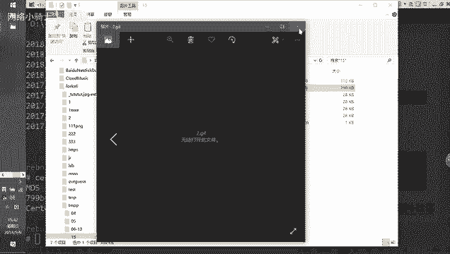

以下是查找隐藏信息的方法：

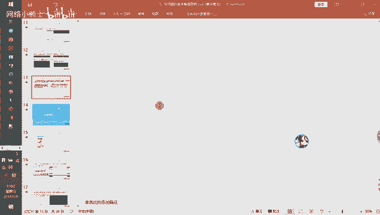

*   使用高级文本编辑器（如 `Notepad++`、`Sublime Text`）或十六进制编辑器打开文件。
*   利用编辑器的查找功能（`Ctrl+F`），搜索关键词如 `flag`、`key`、`ctf` 等。
*   注意在十六进制模式下进行搜索。


---

## 图片隐写技术

上一节我们介绍了通用的文件操作，本节中我们聚焦于一种更具体的文件类型——图片。图片隐写是杂项题目中非常常见且花样繁多的考点。

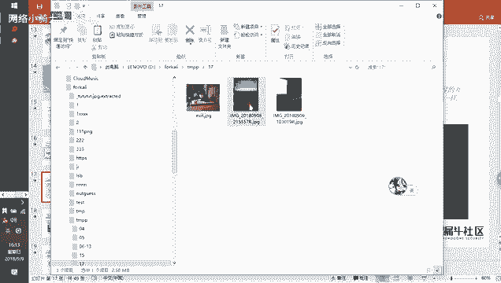

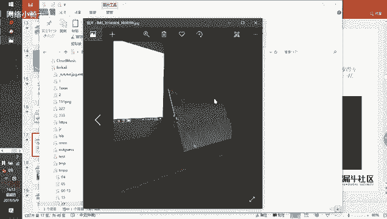

### 图片基本信息与元数据

一张图片不仅包含像素信息，还可能携带拍摄时产生的元数据（EXIF）。这些信息有时就直接包含 `flag` 或解题提示。

以下是查看和分析图片信息的方法：

*   **查看属性**：在Windows中，右键点击图片选择“属性”，在“详细信息”选项卡中查看EXIF信息。
*   **命令行工具**：在Linux中，可以使用 `exiftool` 命令查看图片的元数据。
    ```bash
    exiftool photo.jpg
    ```
*   **GPS信息**：如果图片开启了GPS定位，EXIF中会包含经纬度信息。可以使用谷歌地球等工具输入坐标进行定位，这本身也可能是一道题目。

### 图片处理与通道分析

复杂的图片隐写会利用图片的颜色通道、最低有效位等特性来隐藏信息。

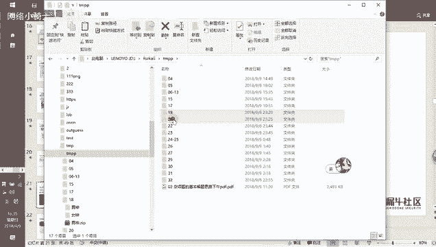

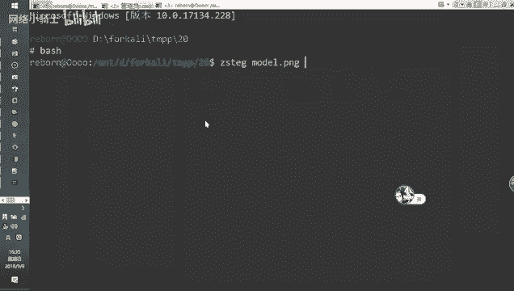

以下是几种常见的图片隐写及分析技术：

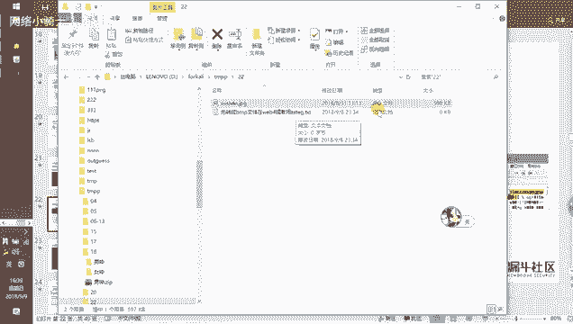

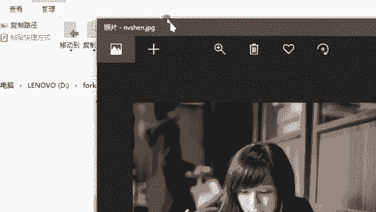

*   **图片差异操作**：当题目给出两张看似相同的图片时，可以尝试对它们进行像素级的运算（如异或、相加、相减），结果可能会显示出隐藏的二维码或文字。可以使用 `Stegsolve` 工具进行此类操作。
*   **最低有效位隐写**：将信息隐藏在RGB颜色值每个字节的最低位（LSB），因为修改最低位对人眼视觉影响最小。这是CTF中的高频考点。
    *   **`Stegsolve`**：在 `Analyse` -> `Data Extract` 功能中，可以尝试不同的位平面和通道组合来提取LSB隐藏的信息。
    *   **`zsteg`**：一个命令行工具，能自动检测PNG和BMP图片中的LSB隐写数据。
        ```bash
        zsteg hidden_image.png
        ```
    *   **`wbStego`**：一个图形化工具，支持在BMP图片中隐写和提取数据。
    *   **Python脚本**：对于出题人魔改过的LSB隐写，可能需要自己编写或修改脚本进行提取。
*   **图片修复**：出题人可能破坏图片的文件结构，使其无法正常打开。常见于PNG格式。
    *   **CRC校验错误**：PNG文件的`IHDR`块有一个CRC校验值。如果图片尺寸被修改，CRC值就会不匹配。可以使用 `TweakPNG` 工具检查并修复，或直接用十六进制编辑器修改回正确的CRC值。
    *   **尺寸修改**：有时直接修改了图片的高度或宽度值，导致只显示图片的一部分。需要计算正确的图片尺寸并修改回来。可以使用现成的Python脚本辅助计算。

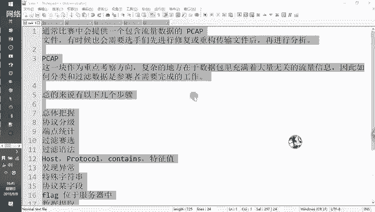

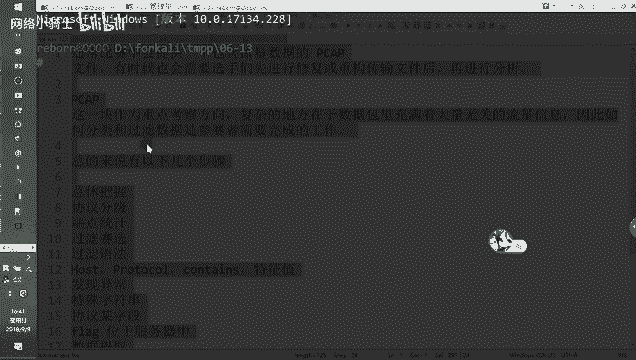

### 图片加密

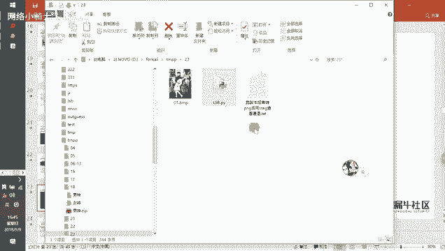

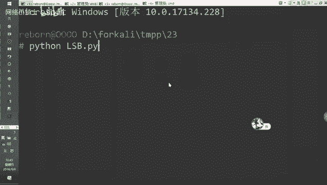

有些题目会对图片本身进行加密，需要先解密才能看到隐藏信息。

以下是几种常见的图片加密及解密方法：

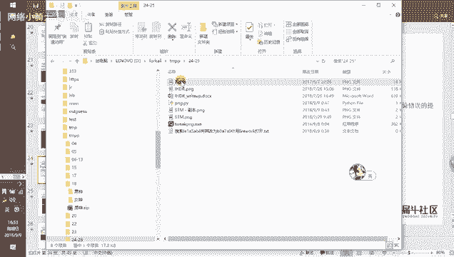

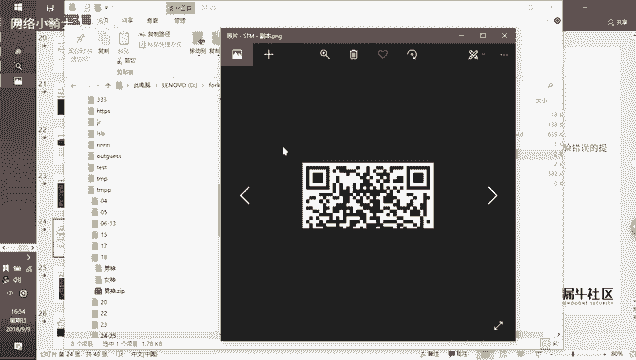

*   **识别加密方式**：对于JPG图片，可以使用 `jsteg`、`outguess`、`F5` 等工具进行加密。可以先使用 `stegdetect` 工具来检测图片可能使用的隐写加密算法。
    ```bash
    stegdetect -s 10.0 encrypted.jpg
    ```
*   **对应工具解密**：
    *   `jsteg`：使用 `jsteg` 工具进行解密。
        ```bash
        jsteg reveal encrypted.jpg output.txt
        ```
    *   `outguess`：需要先编译源代码，然后使用其解密功能。
        ```bash
        outguess -r encrypted.jpg extracted_data
        ```
    *   `F5`：这是一个Java工具，需要Java环境运行。
        ```bash
        java Extract encrypted.jpg -p password
        ```

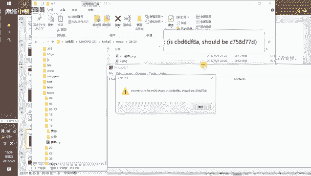

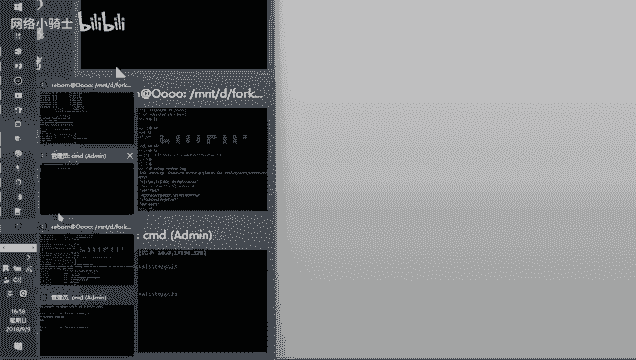

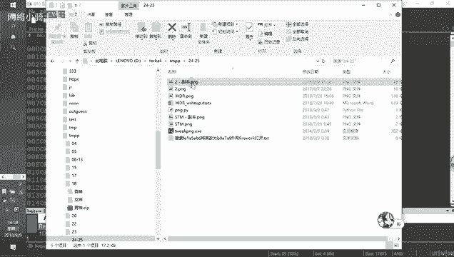

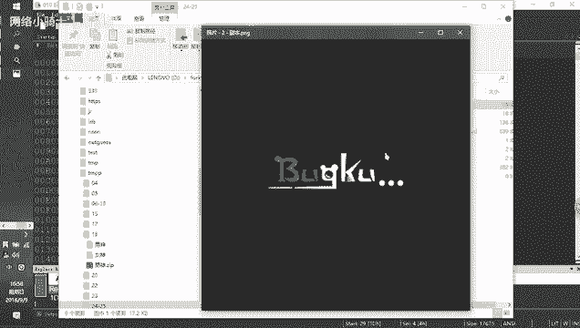

### 二维码处理

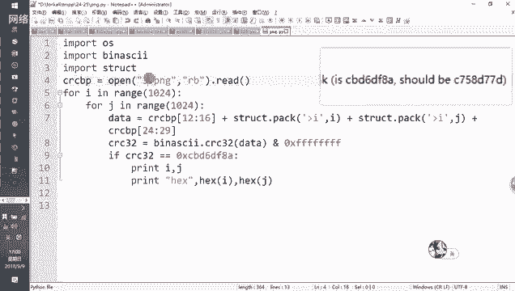

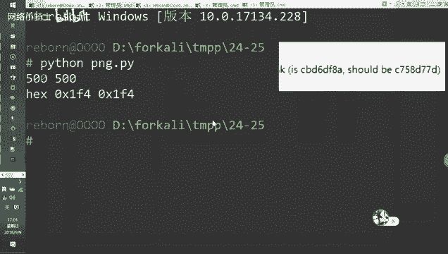

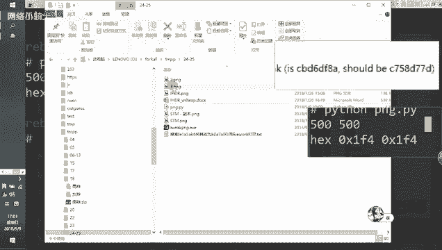

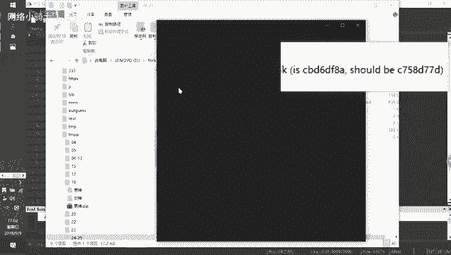

在杂项题中，经常需要处理二维码，但得到的二维码往往无法直接扫描。

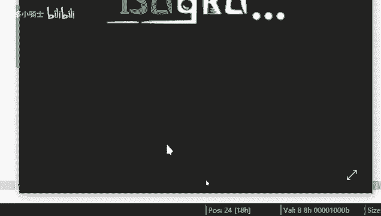

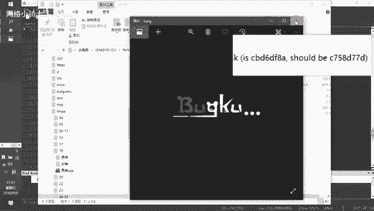

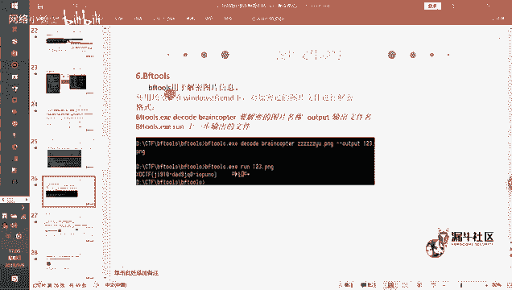

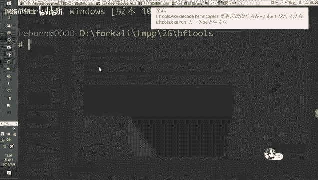

以下是处理问题二维码的常见技巧：

*   **补全定位点**：如果二维码的三个“回”字形定位点被破坏或替换，需要将其修补为标准的黑白方块。
*   **颜色取反**：如果二维码是黑底白码，需要将其反色（反相）成标准的白底黑码。可以使用画图工具或 `Stegsolve` 的 `Invert` 功能。
*   **通道分离**：彩色二维码可能将有效信息藏在某一个颜色通道（如红色通道）中，需要用 `Stegsolve` 等工具查看各个通道的图像。

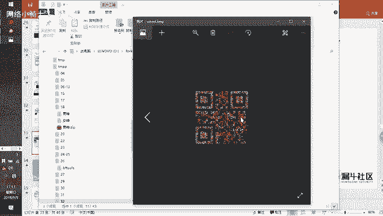

---

## 总结

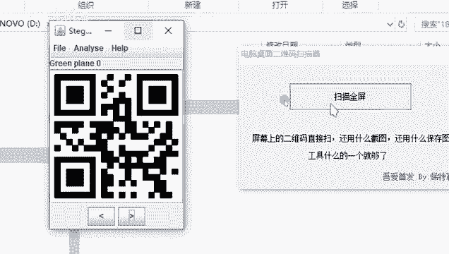

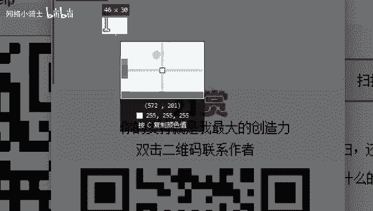

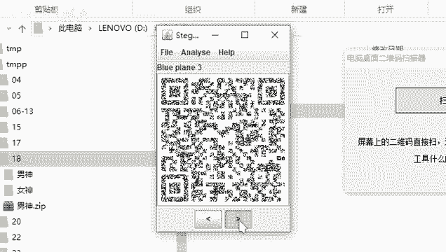

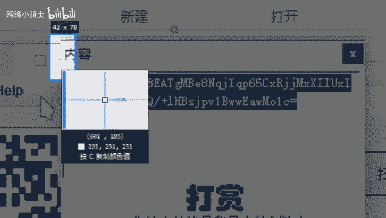

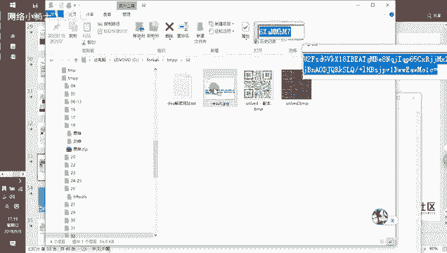

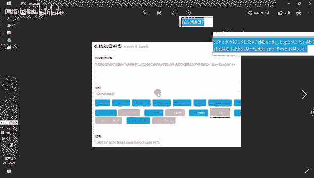

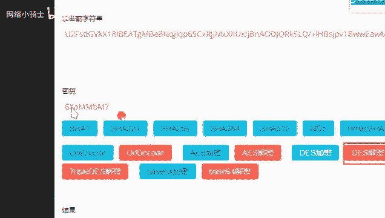

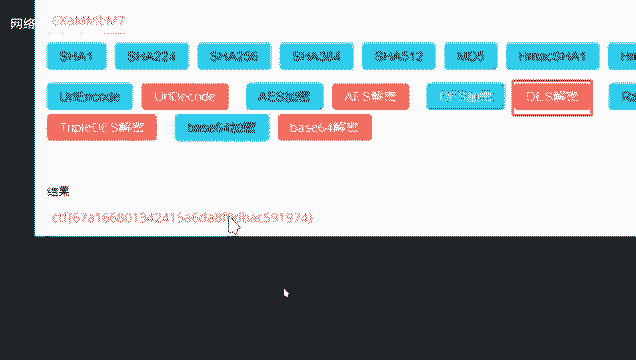

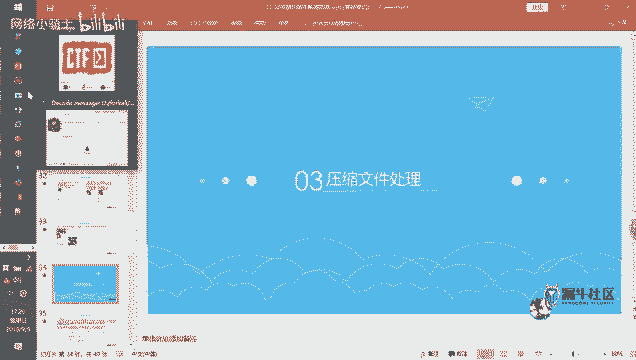

本节课我们一起学习了CTF杂项题型上半部分的核心解题思路。我们首先掌握了文件操作的基础，包括类型识别、隐写分离与合并。随后，我们深入探讨了图片隐写的多种技术，从元数据分析、通道操作、LSB隐写到图片修复和加密解密。关键在于熟悉各种工具（`file`, `binwalk`, `Stegsolve`, `zsteg`等）的使用场景，并保持灵活的思维，能够根据题目提示和文件特征选择正确的分析方法。下节课我们将继续学习杂项题型中关于压缩包和流量分析的部分。