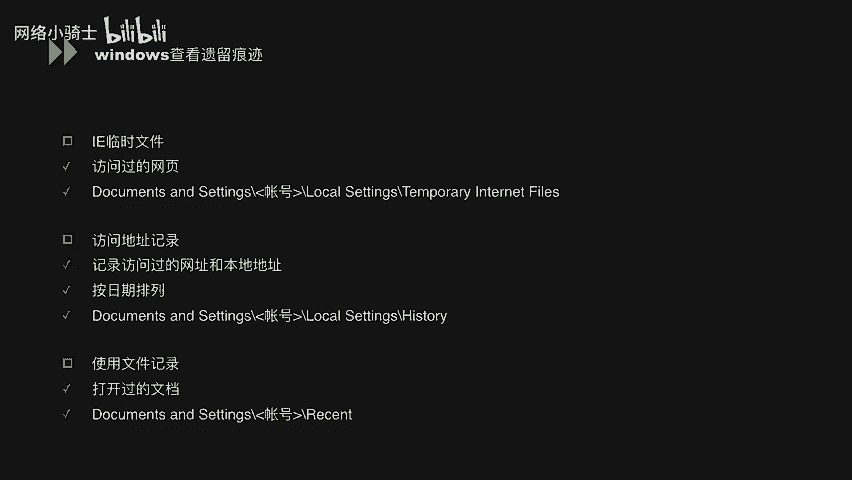
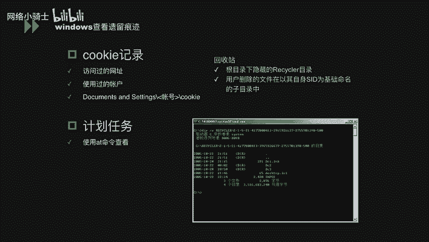
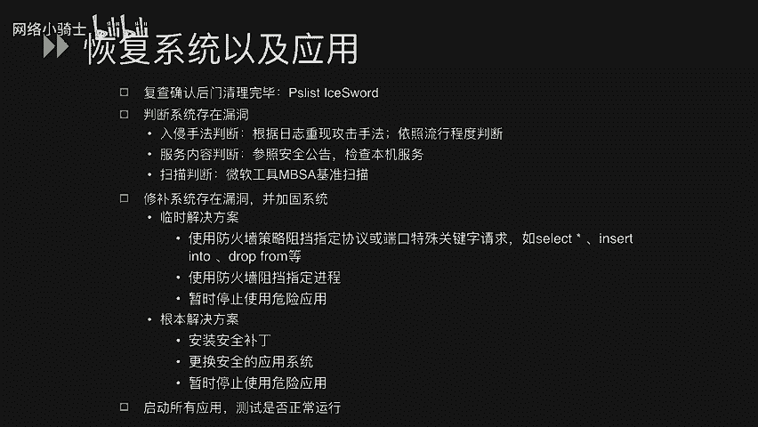

# CTF夺旗赛教程：P40：Windows系统安全_3 - Windows入侵调查

在本节课中，我们将学习Windows系统安全的第三个核心部分：Windows入侵调查。我们将了解如何及早发现系统异常、如何分析日志以判断入侵情况，以及如何恢复系统与应用程序的正常运行。

## 及早发现系统异常

上一节我们介绍了Windows系统安全的基础概念，本节中我们来看看如何主动发现系统被入侵的迹象。及早发现异常是进行有效响应的第一步。

我们可以通过以下几个方面来监测系统是否出现异常：

以下是系统层面的监测点：

1.  **系统启动方面**：检查系统日志中记录的运行时间、网络连接时间等信息，判断系统是否有非预期的重启记录。
2.  **系统资源方面**：监控进程是否异常占用大量CPU或物理内存，以及磁盘空间是否被未知文件快速消耗。
3.  **网络流量方面**：留意是否收到大量SYN、SMP数据包或其他可能表明遭受DDoS攻击的异常流量。

除了直接观察系统，还可以通过以下途径获取异常信息：

1.  **边界安全设备**：查看部署在网络边界的IPS（入侵防御系统）、WAF（Web应用防火墙）等安全产品的告警日志。
2.  **用户反馈**：关注其他管理员或用户关于系统功能异常的报告。

发现异常后，需要检查攻击者可能遗留的痕迹。以下是Windows系统中常见的痕迹位置：

1.  **IE临时文件**：记录用户访问过的网页信息。
2.  **访问地址记录**：记录在资源管理器或浏览器中访问过的本地及网络地址，可按日期排序查看。
3.  **使用过的文档记录**：记录用户近期打开、修改或移动过的文档。
4.  **Cookie信息**：浏览器保存的Cookie可能包含访问过的网站及登录账户信息。
5.  **计划任务**：通过 `schtasks` 命令查看，攻击者可能创建了定时执行恶意操作的任务。
6.  **回收站**：检查回收站中是否有未及时清理的可疑文件。
7.  **注册表**：查看注册表中记录的用户账户（包括隐藏账户）和已安装/卸载的软件信息。
8.  **用户配置文件**：检查 `C:\Users\`（或 `C:\Documents and Settings\`）目录。若存在以某用户名命名的文件夹但该用户已不在用户列表中，则表明该账户曾被创建后又删除。

## 查看日志分析入侵情况

在发现系统异常后，下一步是深入分析日志，以确定入侵的具体方式和时间。日志分析是追溯攻击路径的关键。

分析入侵情况的基本流程是：首先查看各类审核日志，然后结合上一小节提到的攻击痕迹，综合分析入侵原因，最终定位安全漏洞。

Windows安全日志中记录了不同的登录类型，这对于判断攻击者的入侵方式至关重要。以下是常见的登录类型代码及其含义：

*   **类型2：交互式登录**（在本地控制台登录）。
*   **类型3：网络登录**（例如通过共享文件夹访问）。
*   **类型4：批处理登录**（由批处理作业使用）。
*   **类型5：服务登录**（服务启动的登录）。
*   **类型7：解锁**（解锁已锁定的工作站）。
*   **类型10：远程交互**（通过远程桌面、终端服务登录）。

例如，如果日志中出现了类型10的登录记录，但管理员并未进行远程操作，则很可能系统已被入侵。

要有效分析日志，必须确保日志记录功能完备。以下是两个前提条件：

1.  **开启审核策略**：在组策略或本地安全策略中启用需要记录的审核项（如登录审核、对象访问审核等）。
2.  **保证日志存储**：调整Windows日志默认的覆盖策略，延长保存时间，或配置日志服务器进行集中存储和备份。

以下是需要重点关注的几类日志及其能提供的信息：

1.  **系统日志**：记录驱动程序、系统进程、服务状态变化及补丁安装情况。
    *   **关键信息**：非计划内的系统重启、服务异常、弹出连接数超限等对话框的时间点。
2.  **应用程序日志**：记录应用程序的活动情况。
    *   **关键信息**：防火墙或杀毒软件被关闭/禁用、杀毒软件报警、软件被异常安装或卸载的时间点。
3.  **安全性日志**：记录登录尝试、特权使用及审核策略更改。
    *   **关键信息**：用户登录成功/失败记录、审核策略被更改的时间点。
4.  **Web日志（以IIS为例）**：记录Web服务器接收到的所有HTTP请求。
    *   **特定请求分析**：关注URL中包含 `uploadfile.asp`、`download.asp` 等字符的上传/下载请求；包含 `select`、`insert into`、`drop` 等SQL关键字的数据库操作请求；包含单引号(`‘`)、`and 1=1` 等字符的注入测试参数。
    *   **服务器状态码分析**：`200-299` 表示成功；`400-499` 表示客户端错误；`500-599` 表示服务器端错误。异常的失败请求可能指向攻击行为。

## 恢复系统以及应用程序

通过日志和痕迹分析确认入侵方式后，最终目标是清除威胁，恢复系统安全。本节我们将学习系统恢复与加固的步骤。

恢复系统及应用程序主要包含以下四个步骤：

1.  **清除后门**：根据分析结果，彻底查找并删除攻击者安装的后门程序、恶意账户及计划任务等。
2.  **判断漏洞**：结合入侵手法（如日志中发现的SQL注入尝试），判断系统存在的安全漏洞。参考安全公告，检查本机服务是否存在已知漏洞，或使用微软基准安全分析器（MBSA）等工具进行扫描。
3.  **修补与加固**：针对发现的漏洞采取修复措施。
    *   **临时解决方案**：在不修改应用本身的情况下缓解风险，例如使用防火墙规则阻止敏感端口的访问、禁用危险的系统进程或应用程序。但这并非根本解决之道。
    *   **根本解决方案**：为操作系统和服务安装安全补丁；更换存在漏洞的应用程序为更安全的版本；在修复前，暂时停止运行存在高风险的服务或应用。
4.  **验证测试**：完成修补和加固后，需全面测试系统各项功能是否正常运行，并确认原有漏洞已被有效修复。

本节课中我们一起学习了Windows入侵调查的全过程：从如何及早发现系统异常迹象，到如何深入分析各类日志以追踪攻击行为，最后到如何清除威胁、修复漏洞并恢复系统。掌握这些技能对于防御和应对Windows系统攻击至关重要。