# CTF夺旗赛教程：P41：Windows系统安全_4 - 应急响应

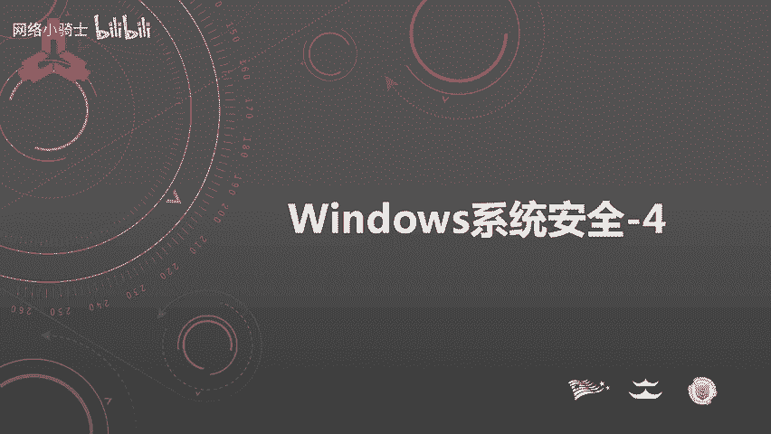

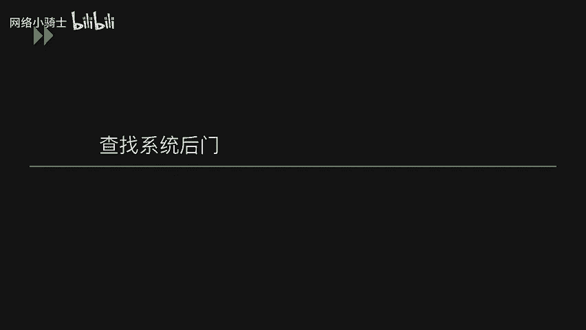

在本节课中，我们将学习Windows系统应急响应的核心内容，主要包括两部分：如何查找系统中可能存在的后门程序，以及如何全面分析系统日志以追踪攻击者的行为。

上一节我们介绍了Windows系统安全的基础概念，本节中我们来看看当系统可能遭受入侵后，如何进行应急响应。

## 查找系统后门

攻击者在获取系统权限后，通常会在系统中留下后门，以便日后再次访问。以下是几种查找后门的方法和工具。

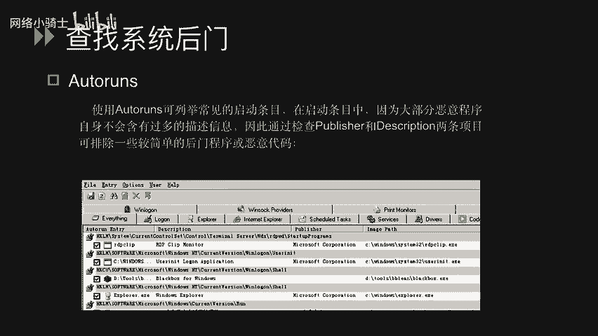

### 按启动项查找后门

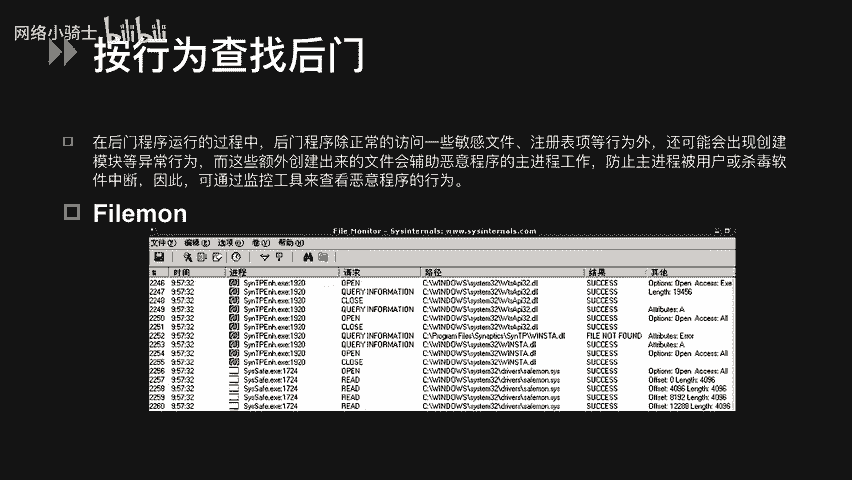

我们可以通过检查系统启动时自动加载的程序来发现可疑项。`Autoruns` 是一款强大的工具，它比Windows自带的 `msconfig.exe` 能显示更多启动项细节，包括驱动程序、核心程序和应用程序。

以下是 `Autoruns` 的核心功能：
*   它能列出所有启动条目，包括 `Winlogon`、IE浏览器加载的DLL和其他组件。
*   大部分恶意程序缺乏详细的描述信息。因此，通过检查条目的 **`Publisher`（发布者）** 和 **`Description`（描述）** 字段，可以初步判断程序的合法性。例如，正常程序通常有明确的发布者（如Microsoft），而恶意程序此项常为空。

### 按行为查找后门

后门程序在运行时，除了访问敏感文件和注册表，还可能创建辅助文件或模块。监控这些异常行为有助于发现后门。

以下是两款行为监控工具：
1.  **Filemon**：这是一款文件监控工具。它会以进程为线索，记录该进程对文件的所有访问操作（如读取、写入）及其结果。你可以通过过滤特定进程名（例如 `csrss.exe`）来聚焦监控目标。
2.  **Regmon**：这是一款出色的注册表监控软件。它会记录所有与注册表相关的操作（读取、修改、删除），并允许用户对记录进行保存、过滤和查找，为系统维护提供便利。

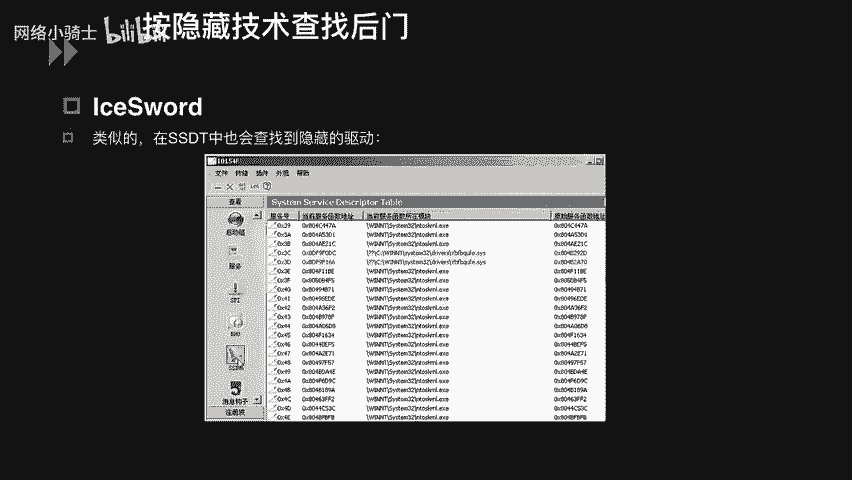

### 按隐藏技术查找后门

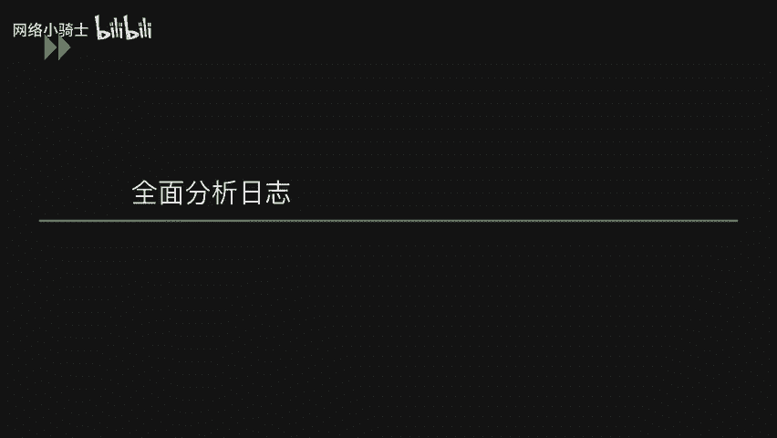

攻击者为了隐蔽自身，常会隐藏进程或驱动。我们可以使用专门工具来发现这些隐藏项。

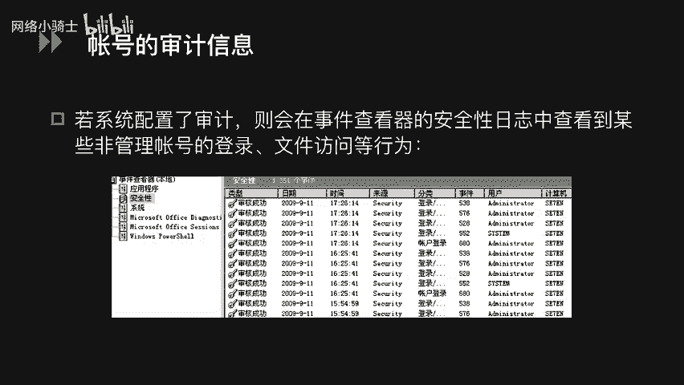

**IceSword（冰刃）** 是一款功能强大的安全检测工具。利用它的进程查看功能，可以检测系统中是否存在隐藏进程（隐藏进程会被标记为红色）。同样，在其SSDT（系统服务描述符表）查看功能中，隐藏的驱动也会被标记。系统中正常的常用进程通常不会隐藏，因此被标记为红色的项非常可疑，需要进一步分析。

以上我们介绍了查找系统后门的几种思路和工具。接下来，我们将学习如何通过分析系统日志，来追溯攻击者是如何入侵系统的。

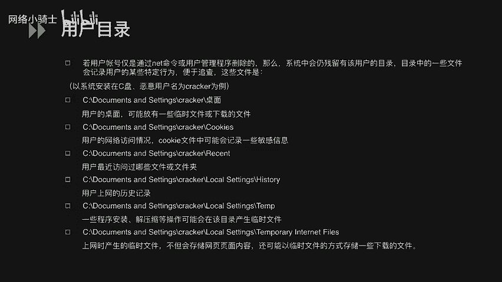

## 全面分析系统日志

系统日志记录了大量的操作和事件，是进行安全事件回溯的关键。

### 账号审计信息

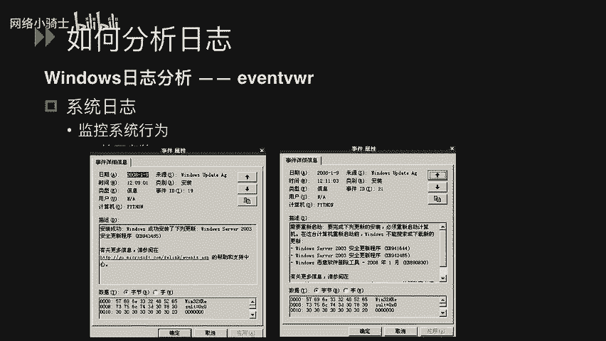

如果系统配置了审计策略，就可以在“事件查看器”的“安全日志”中查看账号的登录、文件访问等行为记录。日志中会包含事件发生的时间、来源、类别以及执行操作的用户账号（如管理员、SYSTEM或自定义用户），这有助于我们发现异常登录行为。

### 用户目录痕迹

无论是管理员还是攻击者，登录系统后都会留下操作痕迹。这些痕迹通常保存在用户目录中，例如：
*   **桌面**：可能遗留临时下载的文件。
*   **网络访问记录**：`Cookie` 文件可能包含敏感信息，如访问历史和登录状态。
*   **最近访问记录**：记录用户最近访问的文件夹和文件。
*   **程序安装与解压记录**：记录软件安装或文件解压的操作历史。

### 具体日志分析示例

了解日志结构后，我们可以开始具体分析。

**1. 分析安全日志**
安全日志包含多种事件类别。例如：
*   **登录/注销事件**：记录哪个用户在何时登录系统。
*   **对象访问事件**：记录对特定目录或文件进行了何种操作。
*   **策略更改事件**：记录用户对系统审核策略所做的修改。

**2. 分析系统日志**
系统日志记录操作系统层面的事件。例如：
*   事件日志服务本身的启动或停止。
*   Windows系统更新的成功安装记录。

**3. 分析应用程序日志（以IIS日志为例）**
IIS日志默认路径为 `%SystemRoot%\system32\LogFiles`，通常按日期（每天一个文件）命名。它记录了每次Web访问的详细信息。

一条典型的IIS日志格式如下：
`2017-12-24 15:42:20 192.168.10.67 GET /NSfocus.html - 8080 192.168.10.61 Mozilla/4.0+(compatible;+MSIE+6.0;+Windows+NT+5.1) 200`

我们可以这样解析它：
*   `2017-12-24 15:42:20`：访问时间。
*   `192.168.10.67`：服务器IP地址。
*   `GET`：HTTP请求方法。
*   `/NSfocus.html`：请求的资源路径。
*   `8080`：服务器端口。
*   `192.168.10.61`：客户端IP地址。
*   `Mozilla/4.0...`：客户端浏览器标识。
*   `200`：服务器返回的HTTP状态码（表示成功）。

**4. 从日志中发现攻击行为**
理解了日志格式，我们就可以从中寻找攻击痕迹。

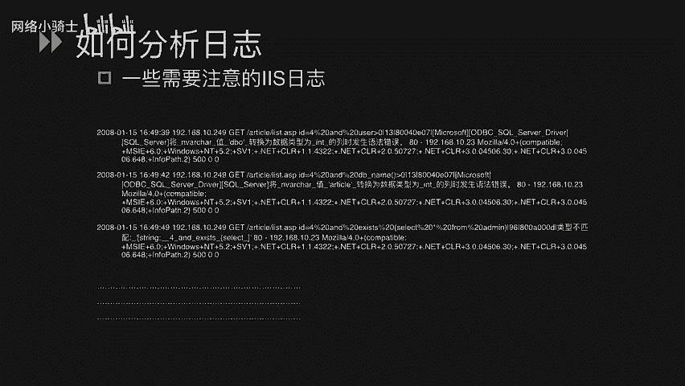

*   **目录遍历/扫描**：如果日志中出现大量对类似 `/admin/`、 `/backup/`、 `/data/` 等目录的请求，并且返回状态码混杂着 `200`（成功）和 `404`（未找到），这很可能是一次目录扫描攻击，攻击者正在探测服务器上存在的敏感目录。
*   **SQL注入尝试**：攻击者会在请求参数中插入SQL语句片段来测试漏洞。例如，日志中出现以下特征的请求：
    *   `GET /page.asp?id=1' AND 1=1 --`
    *   `GET /login.php?user=admin' OR '1'='1`
    *   `GET /search.php?q=test'; SELECT * FROM users --`
    这些包含 **`'`**、**`AND`**、**`OR`**、**`SELECT`**、**`FROM`** 等关键词的请求，是明显的SQL注入测试。如果在日志中发现大量此类请求，就需要立即检查对应的Web应用是否存在SQL注入漏洞。
*   **其他攻击**：日志中还可能包含跨站脚本（XSS）、文件包含、文件上传等攻击的特征字符串。了解这些攻击的常见手法和特征，能帮助我们更有效地从海量日志中定位安全事件。

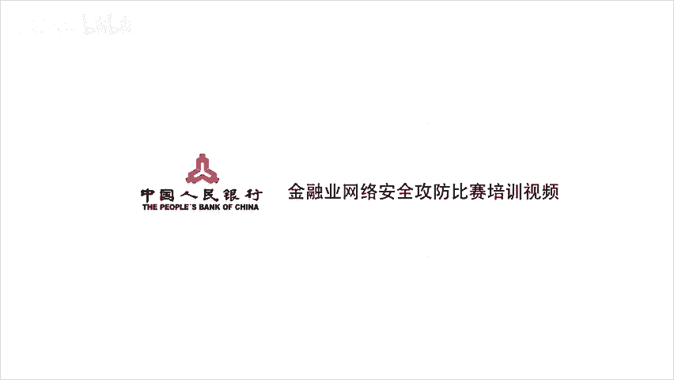

本节课中我们一起学习了Windows应急响应的两个核心部分：如何利用多种工具（如Autoruns、Filemon、IceSword）查找系统中可能隐藏的后门程序；以及如何系统地分析安全日志、系统日志和应用程序日志（特别是IIS日志），通过识别异常登录、目录扫描、SQL注入等特征，来追溯攻击路径并发现系统潜在的安全漏洞。掌握这些技能是进行有效安全防御和事件响应的基础。