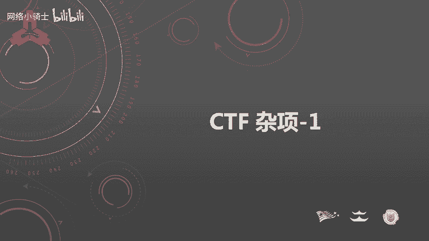
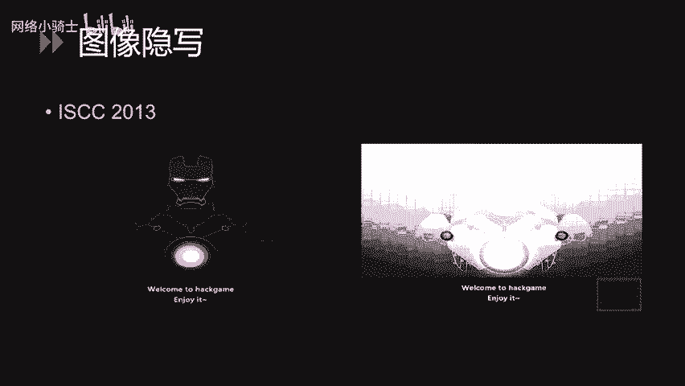
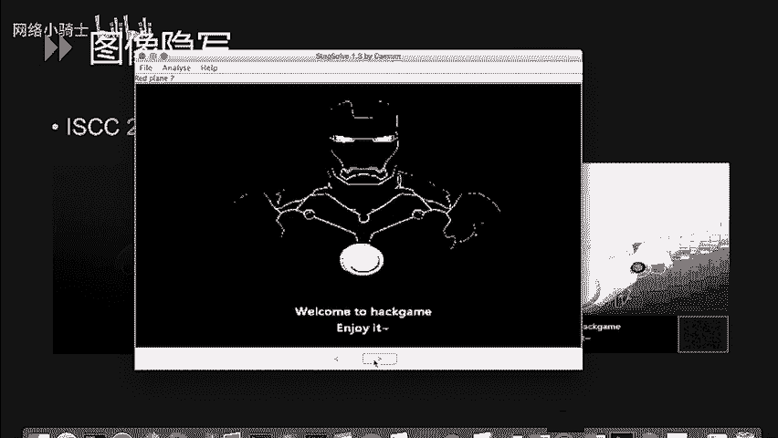
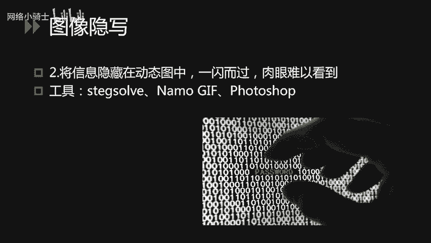
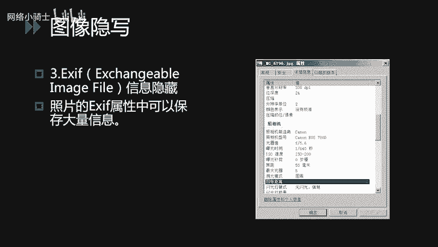
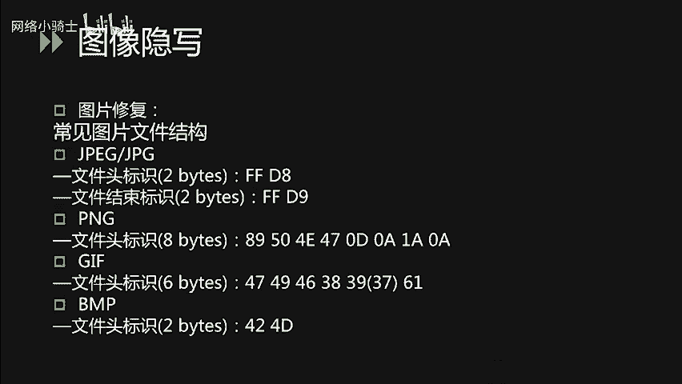
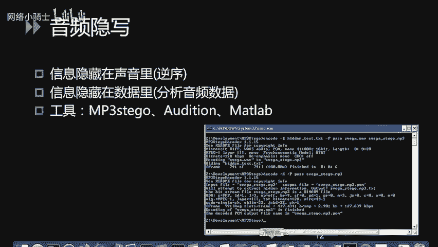
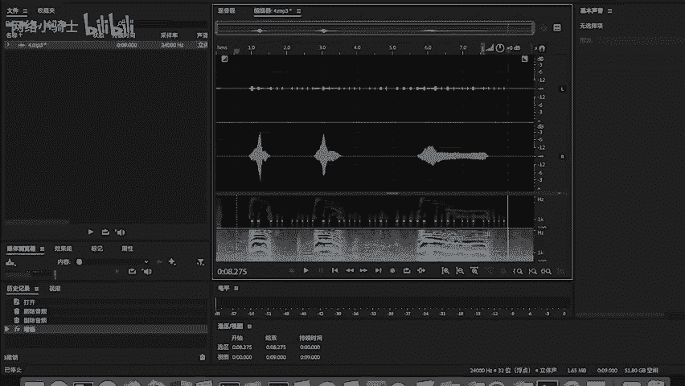
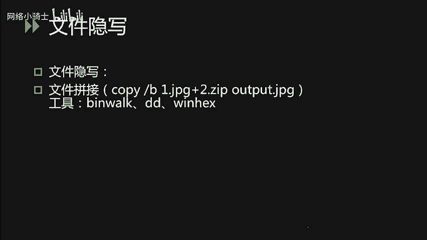
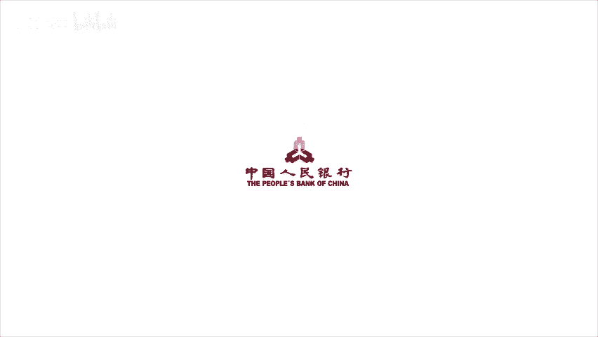

# CTF夺旗赛教程：P42：CTF杂项-1

## 概述
在本节课中，我们将要学习CTF竞赛中三个重要的领域：隐写术、密码编码学和杂项取证技术。这些类型的题目在CTF中占有相当大的比重，掌握它们是成为CTF高手的关键一步。



## 什么是隐写术？
隐写术是将信息隐藏在其他载体中，不让计划的接收者之外的人获取到信息的一种技术。古时候，人们将隐写术用于机密信息的传递，例如战争场景。在电影中，我们常看到间谍将密报纸张在火上烤或在水中浸泡以显示文字，这是一种基于物理方式的传统隐写术。

在CTF中遇到的隐写术，大部分以多媒体文件为载体，可以是图片、音频、视频或压缩包文件。此类题目的出题非常灵活，我们无法枚举所有类型，只能介绍常见的出题思路和典型类型。

## CTF中常见的隐写术类型
CTF中隐写术的题目以两种类型较为常见。

以下是两种主要方法：
1.  **插入法**：将需要隐藏的消息插入文件中的某个空白部位。例如，常见的图片EXIF隐写。
2.  **替换法**：通过改变原有文件中某部分的文件内容达到隐写的效果。

## 图像隐写术详解
上一节我们介绍了隐写术的基本概念，本节中我们来看看具体的图像隐写技术。常见的图像隐写可以分为以下几类。



以下是几种典型的图像隐写技术：
*   **最低有效位隐写**：利用像素三原色原理。例如，纯红色的RGB值为`(255, 0, 0)`，其二进制表示为`(11111111, 00000000, 00000000)`。如果将红色通道的最后一位从1改为0，变为`(11111110, 00000000, 00000000)`，肉眼无法察觉颜色变化，但最低有效位已改变。我们可以利用这种像素颜色值的细微变化来隐藏信息。解题工具如`Stegsolve`。
*   **GIF多帧隐写**：将需要隐藏的信息藏在GIF中的某一帧或很多帧中。可以使用`Stegsolve`的帧预览功能，或使用`Photoshop`等图像处理软件逐帧查看。
*   **EXIF信息隐藏**：将flag值藏在图片的EXIF信息中。EXIF可以保存大量信息，如相机型号、拍摄参数等。解题时，在Windows上右键图片打开“属性”即可查看。
*   **图片修复技术**：题目提供一个已破损的图片文件，需要根据各种文件头的构造对图片进行修复。首先需要熟悉常见图片类型（如JPEG、PNG、GIF、BMP）的文件头特征。



## 隐写术解题工具与示例
了解了图像隐写的类型后，我们来看看如何使用工具解决具体问题。



**1. 最低有效位隐写示例**
使用`Stegsolve`打开图片，点击下方箭头查看不同通道、不同色差下的图像。当调整到特定组合时，可能看到隐藏的二维码，扫码即可得到信息。



**2. 图片修复示例**
解决此类问题需要使用16进制编辑器，如`WinHex`、`010 Editor`。通过修复错误的文件头，使图片能够正常打开。有时，一道题目可能同时需要修复图片，并从修复后的图片中读取有效内容。



## 音频与视频隐写
隐写术不仅限于图像，在音频和视频中同样常见。

**音频隐写**
音频隐写可能需要用到音频分析软件。例如，使用音频编辑软件`Audition`打开CTF题目文件，可能会发现左右声道信息不同，隐藏的信息可能存在于某个声道中。通过分析波形或频谱，可能发现摩斯电码等特征，手动或借助工具将其转换为字母即可解题。



**视频隐写**
视频隐写与GIF多帧隐写相似，出题人员习惯将flag值藏在视频的多个帧中。可以使用视频编辑软件或专用工具对视频进行逐帧分析，提取隐藏的内容。



## 文件隐写与拼接
文件的隐写在CTF题目中也较为常见。

简单的题目会使用Windows下的`copy /B`命令将两个文件拼接。例如：
```cmd
copy /B image.jpg + secret.zip output.jpg
```
这个命令将一张图片和一个ZIP压缩包合并输出为一张图片（即“图种”）。直接打开看到的仍是图片，但文件后半部分实际是一个ZIP压缩包。解题时，可将图片文件重命名为`.zip`后缀，然后用解压软件打开。

如果无法肉眼识别是由哪两种文件拼接而成，可以使用Linux下的`binwalk`命令进行分析。这个命令可以将合并后的文件拆分成多个原始文件的组合。也可以使用16进制查看器，查找对应的文件头特征值（如`PK`（ZIP）、`Rar!`（RAR）、`FF D8 FF`（JPEG）），从而进行手动拆分。





## 总结
本节课中，我们一起学习了CTF中隐写术、密码编码和杂项取证的基础知识。我们重点探讨了隐写术的概念、常见类型（如图像的LSB、GIF多帧、EXIF隐写、文件修复）以及针对音频、视频和文件拼接的隐写技术。掌握这些基本方法和工具（如Stegsolve、十六进制编辑器、binwalk），是解决CTF杂项题目的重要第一步。