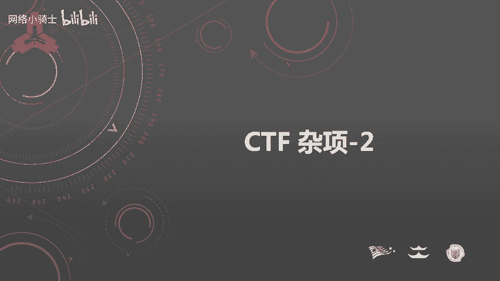
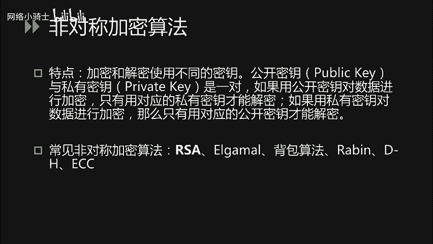
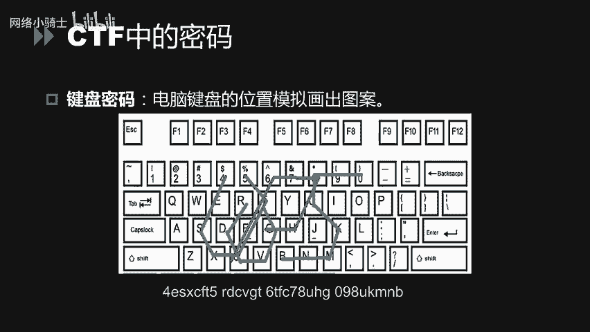
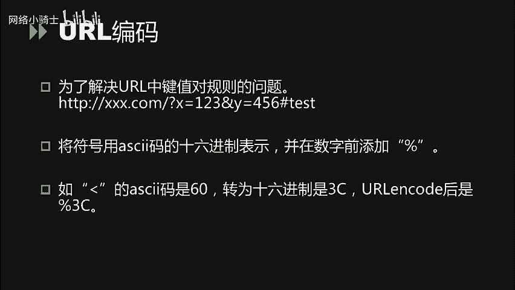
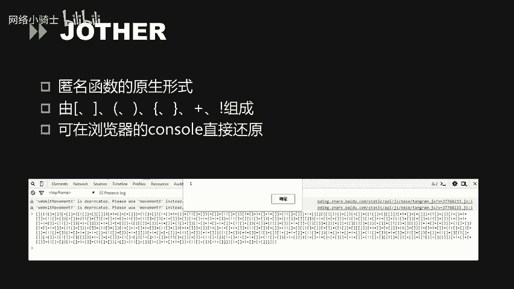
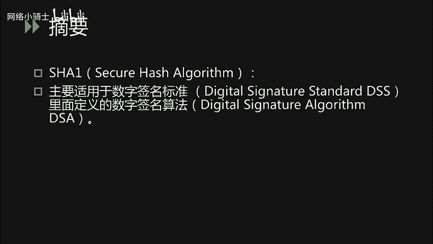
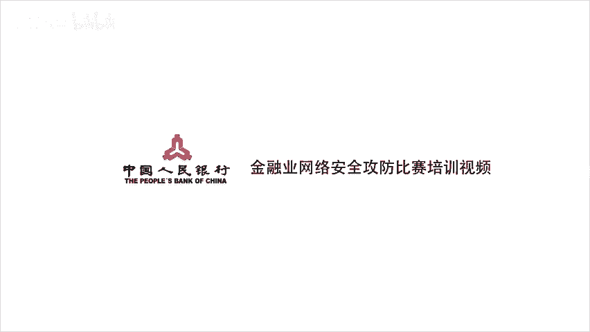

# CTF夺旗赛教程：P43：46.46.CTF 杂项_2 - 密码、编码与摘要基础 🧩



在本节课中，我们将学习CTF比赛中密码学、编码和摘要算法的基础知识。我们将从核心概念的定义和区别入手，然后分别介绍古典密码、现代密码、常见编码以及摘要算法，帮助你建立清晰的认知框架。

---

## 概述

本节内容主要围绕CTF中的“杂项”题目展开，重点讲解密码、编码和摘要这三类基础知识。理解它们的区别是解题的关键。

---

## 密码、编码与摘要的区别 🔑

在深入学习具体技术前，必须明确密码、编码和摘要三者的核心区别。

*   **密码**：目的是保证信息传输的**安全性**。它通过**密钥**和加密算法将明文转化为密文，也必须通过密钥和解密算法才能恢复为明文。公式可表示为：`密文 = Encrypt(明文, 密钥)`，`明文 = Decrypt(密文, 密钥)`。
*   **编码**：目的是为了数据**传输或存储的兼容性**。它将数据转换成某种标准格式（如Base64），任何人都可以通过对应的解码方法还原原始信息，**没有密钥的概念**。
*   **摘要（哈希）**：目的是验证信息的**完整性**。它将任意长度的数据通过哈希算法（如MD5）计算成一个固定长度的哈希值。这个过程是**单向的**，理论上无法从哈希值反推出原始数据。公式可表示为：`哈希值 = Hash(数据)`。

简单来说：
*   **密码**：可逆，需要密钥。
*   **编码**：可逆，无需密钥。
*   **摘要**：不可逆。

---

## 古典密码学 🏛️

古典密码通常指计算机出现前使用的加密方法，在CTF中常作为入门题目出现。它们主要分为**置换密码**和**替换密码**两类。

上一节我们明确了基本概念，本节中我们来看看具体的古典密码算法。

### 凯撒密码

凯撒密码是一种最简单的替换密码，本质是**位移密码**。它将字母表中的每个字母向后（或向前）移动一个固定的位数（密钥K）。

**加密过程**：
1.  将26个字母顺序排列。
2.  将整个字母表向后移动K位。
3.  用移动后的字母替换原文中的字母。

例如，明文 `hello`，密钥 `K=1`：
*   h -> i
*   e -> f
*   l -> m
*   l -> m
*   o -> p
得到密文 `ifmmp`。

**解密与破解**：
由于只有26种可能的位移（K=0~25），可以通过**暴力枚举**所有情况，找到有意义的明文。可以使用Python脚本快速实现：

```python
def caesar_decrypt(ciphertext):
    for k in range(26):
        plaintext = ''
        for char in ciphertext:
            if char.isalpha():
                shift = (ord(char.lower()) - ord('a') - k) % 26
                plaintext += chr(shift + ord('a'))
            else:
                plaintext += char
        print(f'K={k}: {plaintext}')

caesar_decrypt("ifmmp")
```

### ROT13

ROT13是凯撒密码中K=13的特殊情况。因为字母表有26个字母，所以加密和解密是同一个操作：`ROT13(ROT13(text)) = text`。

### 栅栏密码

栅栏密码是一种典型的**置换密码**。它的加密方式是将明文分成N栏（组），然后按栏读取形成密文。

**加密举例**（栏数=2）：
明文：`HELLOWORLD`
1.  分成两栏：`H L O O L` 和 `E L W R D`
2.  依次从两栏中取字：取第一栏第一个`H`，第二栏第一个`E`，第一栏第二个`L`，第二栏第二个`L`...
3.  得到密文：`HLELOWRDLD`

**解密**：知道栏数后，可以反向操作恢复明文，也有在线工具可用。

### 维吉尼亚密码

维吉尼亚密码使用一个**关键词**作为密钥，属于多表替换密码。它需要一个维吉尼亚方阵进行加解密。

**加密过程**：
1.  明文：`HELLO`
2.  密钥：`KEY`（重复至与明文等长：`KEYKE`）
3.  查表：明文字母`H`对应行，密钥字母`K`对应列，交叉点`R`即为密文。
4.  依次得到密文：`RIJVS`

**解密**：需要密钥，或使用词频分析等破解方法。



---

## 现代密码学 💻

现代密码学在CTF中题目相对较少，但了解其分类很重要。

### 对称加密

加密和解密使用**相同的密钥**。
*   **特点**：加解密速度快，适合加密大量数据。
*   **常见算法**：DES, 3DES, AES。
*   **CTF应用**：通常需要找到密钥或对密钥进行暴力破解。可以使用准备好的工具或脚本，如Python的`pycryptodome`库。
    ```python
    from Crypto.Cipher import AES
    # 示例代码结构
    cipher = AES.new(key, AES.MODE_ECB)
    plaintext = cipher.decrypt(ciphertext)
    ```

### 非对称加密

使用一对密钥：**公钥**和**私钥**。
*   **特点**：
    *   用公钥加密，只能用对应的私钥解密。
    *   用私钥加密（签名），可以用对应的公钥验证。
*   **常见算法**：RSA, ElGamal。
*   **CTF应用**：通常需要理解算法原理，进行数学推导或利用已知漏洞。



---

## CTF中的特殊密码与编码 🎨

CTF中常出现一些基于图形或特殊规则的“趣味”密码。

以下是几种常见的类型：

*   **猪圈密码**：使用由点和线构成的基本图形来代表字母。解题关键在于识别并对照密码表。
*   **培根密码**：使用`A`和`B`的组合来隐藏信息。通常每5个`A/B`为一组，对应一个字母。可以将`A`视为0，`B`视为1，转换为二进制后得到字母序号。
*   **键盘密码**：利用键盘上字母的布局形状来编码。例如，给出`4ESX`，可能在键盘上连起来是一个`U`形。需要观察字母在键盘（电脑或手机九宫格）上的相邻关系，画出轨迹得到字母。

---

## 常见编码方式 📝

编码的目的是为了方便传输或存储。以下是CTF中常见的编码。

### ASCII码

美国信息交换标准代码，用7位二进制数（后扩展为8位）表示一个字符。看到一串数字（特别是十进制32-126或十六进制20-7E）时，可以考虑是否是ASCII码。

### Base64编码

将二进制数据转换成由64个可打印字符（A-Z, a-z, 0-9, +, /）组成的字符串。
*   **原理**：将每3个字节（24位）的数据，重新划分为4组6位数据，每组前面补两个0，形成4个新的8位字节，再查表转换为字符。
*   **特征**：末尾常出现`=`或`==`作为填充标志。
*   **示例**：`"Man"` 的Base64编码是 `"TWFu"`。

### URL编码

用于在URL中安全传输特殊字符。格式为：`%`后面跟着字符ASCII码的两位十六进制数。
*   **例如**：`<` 的ASCII码是60，十六进制是`3C`，URL编码后为 `%3C`。
*   **用途**：编码问号(`?`)、等号(`=`)、空格等URL保留字或特殊字符。

### JSFuck与JJEncode



这两种都是JavaScript的**混淆编码**。
*   **JSFuck**：仅用6个字符`[ ] ( ) ! +`就能编写任何JavaScript代码。
*   **JJEncode**：原理类似，使用更多一些的符号。
*   **解密方法**：最简单的方式是，将编码后的字符串直接复制到浏览器的**开发者工具（F12）的Console（控制台）** 中按回车执行，即可看到输出结果。

### 摩斯电码

用短点（`.`）和长划（`-`）的组合来表示字母、数字和标点。点划之间用空格分隔，字符之间用`/`或更长的空格分隔。
*   **特征**：看到由点、划、空格组成的字符串，或由两种明显不同符号（如`ABAB`）交替出现的字符串，可尝试摩斯电码。
*   **工具**：在线解码工具非常普及。

### 二维码



二维码是一种二维图形编码。CTF题目可能给出二维码图片，需要你用扫码工具或在线解码网站读取其中隐藏的信息。

---

## 常见摘要算法 🔒

摘要算法用于验证数据完整性，CTF中常需要破解或利用其特性。

### MD5

是最常见的哈希函数之一。
*   **特性**：
    1.  **固定长度输出**：无论输入多大，输出总是128位（通常表示为32位十六进制字符串）。
    2.  **雪崩效应**：输入微小改变，输出哈希值差异巨大。
    3.  **不可逆性**：理论上无法从哈希值反推原始数据。
*   **CTF应用**：
    *   破解弱密码：很多网站提供“MD5在线解密”，其实是查询预先计算好的“明文-密文”对彩虹表。
    *   文件完整性校验。
    *   注意：MD5已被证明存在碰撞漏洞（可找到两个不同数据具有相同MD5值）。

### SHA家族

安全哈希算法家族（如SHA-1, SHA-256），原理和特性与MD5类似，但更安全，输出长度更长。在CTF中的用法也类似。

---

## 总结

本节课我们一起学习了CTF中密码、编码和摘要的基础知识。



1.  **明确了核心区别**：密码（可逆，需密钥）、编码（可逆，无需密钥）、摘要（不可逆）。
2.  **学习了古典密码**：如凯撒密码（位移）、栅栏密码（置换）、维吉尼亚密码（多表替换）。
3.  **了解了现代密码分类**：对称加密（如AES）和非对称加密（如RSA）。
4.  **认识了趣味密码与编码**：如猪圈密码、培根密码、键盘密码、Base64、URL编码、摩斯电码等。
5.  **掌握了摘要算法**：如MD5和SHA系列的特性与简单应用。



掌握这些基础知识是解CTF杂项题目的第一步。在实际比赛中，要灵活运用这些知识，并结合在线工具、脚本编写来解决问题。