# CTF夺旗赛教程：P44：CTF 杂项_3 - 隐写术与编码常用工具详解 🛠️

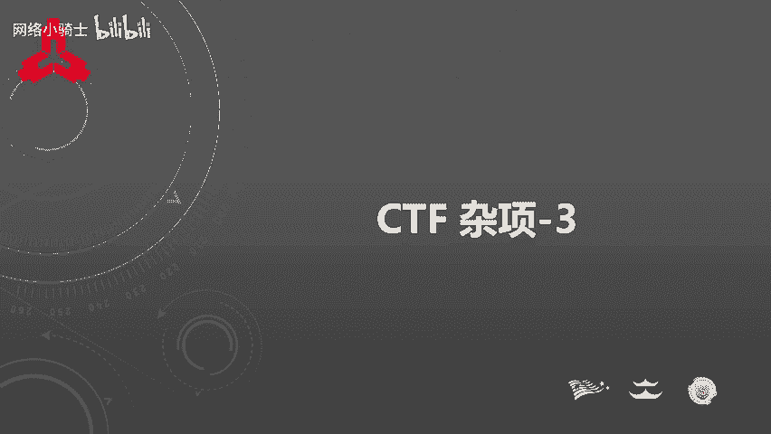

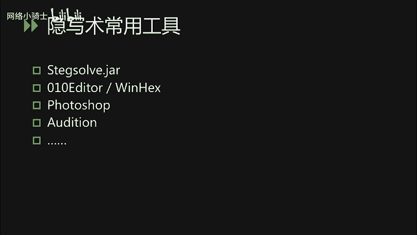

在本节课中，我们将学习CTF杂项题目中，特别是隐写术和密码编码类题目常用的解题工具。掌握这些工具能有效提升解题效率。

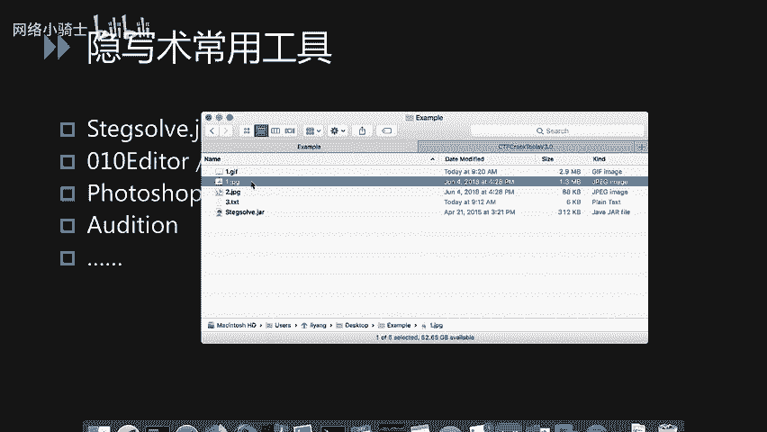

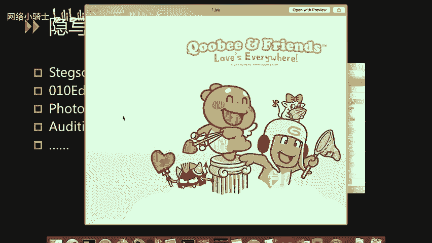

上一节我们介绍了隐写术的基本概念，本节中我们来看看处理这类题目时有哪些实用的工具。

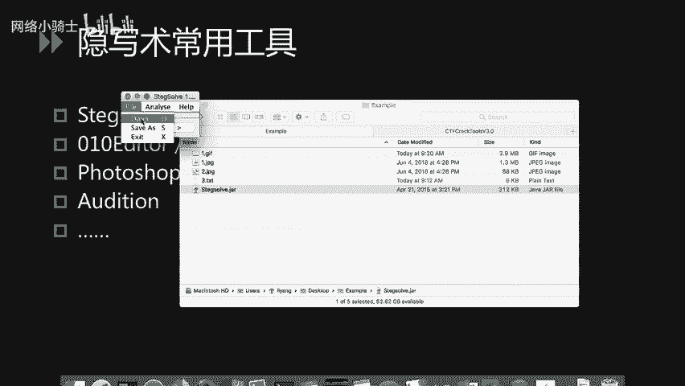

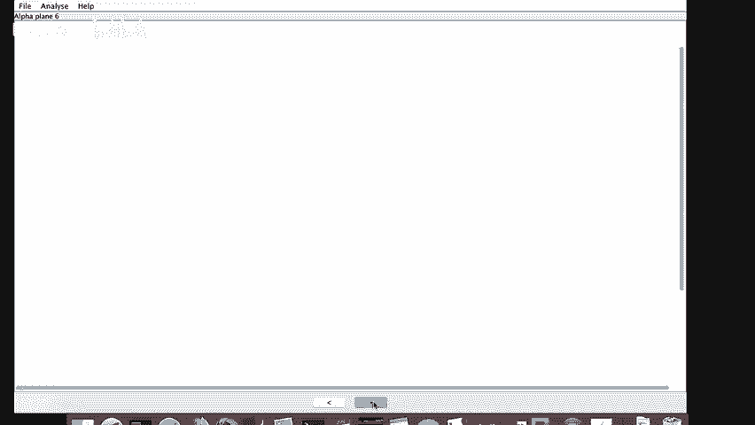

## 图片隐写术工具

因为隐写术题目没有固定套路，这里列举一些最常用的工具。以下是图片隐写术的常用工具介绍。

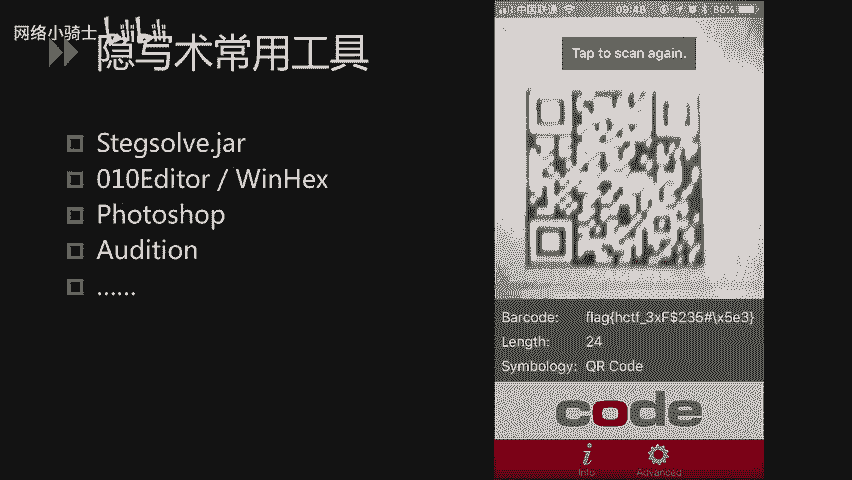

*   **Stegsolve**：这是一个图片隐写术的常用工具，可以解决90%以上的图片隐写题目。它是一个JAR包文件，在安装Java环境后可直接运行。其核心功能是通过调整**颜色通道**和**阈值**来查看隐藏信息。例如，使用 `java -jar stegsolve.jar` 命令运行，然后通过界面下方的箭头切换不同视图。
*   **二维码识别工具**：当从图片中提取出二维码但杂色较多时，推荐使用识别能力强的手机扫码工具（如手机QQ扫码），它们通常能更快速地识别复杂或带杂色的二维码。

下面我们通过两个示例演示Stegsolve的操作。

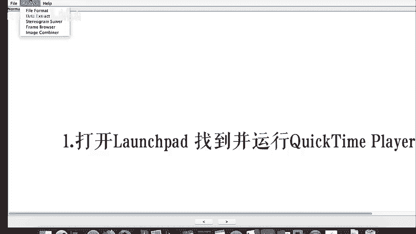

1.  **示例一：隐藏的二维码**
    *   题目给出一张看似正常的图片，直接查看无任何隐藏信息。
    *   使用Stegsolve打开图片，通过切换不同颜色通道和阈值进行查看。
    *   在某个视图下，屏幕上出现一个二维码。由于杂色干扰，部分扫码工具可能无法识别，此时可尝试其他扫码工具（如手机QQ）进行识别，直接得到flag值。

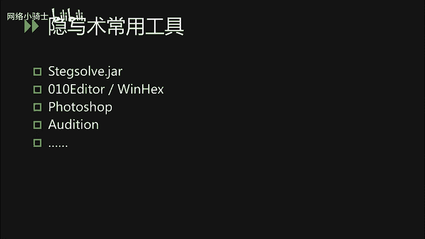

2.  **示例二：GIF图中的快速闪现信息**
    *   题目是一个GIF动图，直接播放时，flag值在底部一闪而过，速度太快无法记录。
    *   使用Stegsolve打开GIF，点击顶部的 `Analyse` 按钮，选择 `Frame Browser` 功能。
    *   点击窗口底部的箭头逐帧浏览，当浏览到包含flag的帧时，程序会智能地将flag提取并显示在屏幕左上角。

此外，Stegsolve还具备其他分析功能，例如通过 `Analyse` -> `File Format` 分析文件格式，或检查文件的附加数据等。

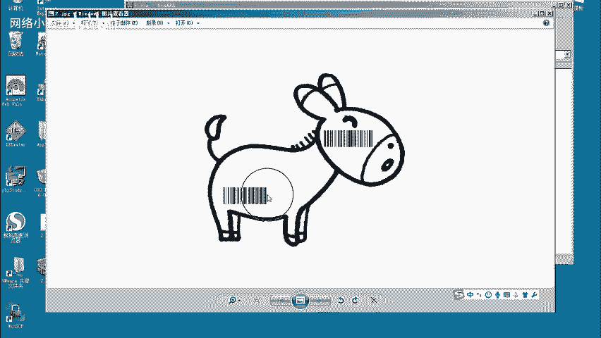

## 十六进制编辑器

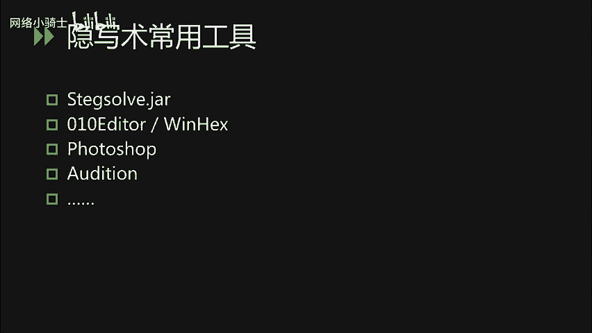

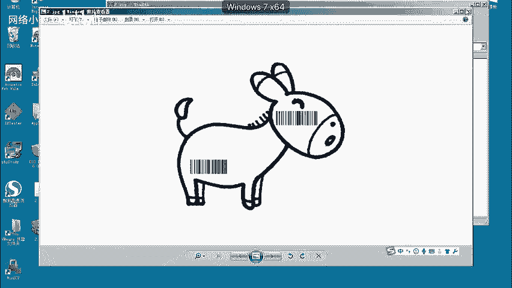

在Windows平台上，常用的十六进制编辑器有010 Editor、WinHex等。这里重点介绍010 Editor，因为它有一个非常实用的“导入十六进制文本”功能。

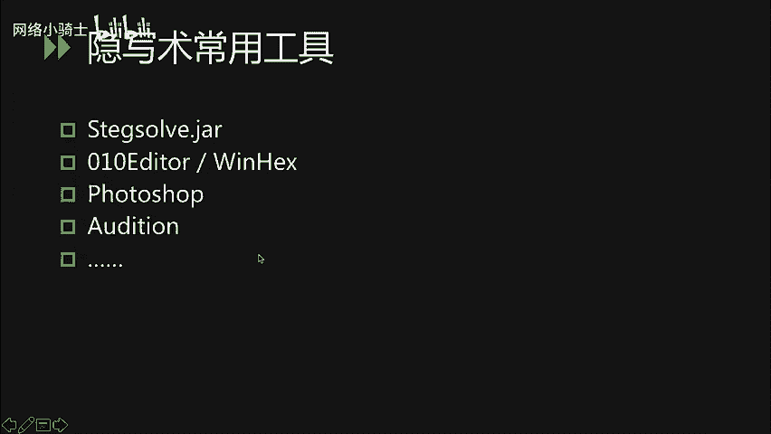

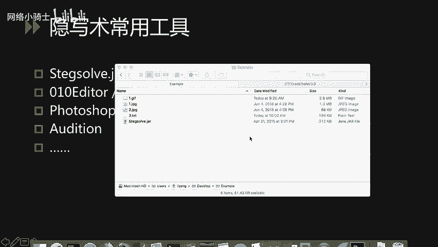

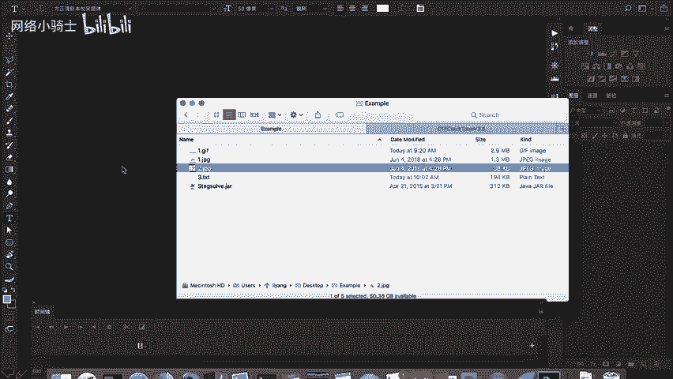

以下是一个使用场景示例：
*   题目给出一串十六进制数字代码，例如 `504B0304...`。
*   我们猜测这是一个十六进制文件被导出成了文本格式。使用010 Editor的 `File` -> `Import` -> `Import Hex Text` 功能加载这串文本。
*   加载后，可以看到文件头是 `PK`。熟悉文件格式的人能认出这是ZIP压缩包的文件头签名。
*   将其保存为 `.zip` 文件后，即可正常打开压缩包。解压后可能得到包含条形码的图片，但条形码可能不完整，需要进一步处理。

## 图像处理软件 (Photoshop)

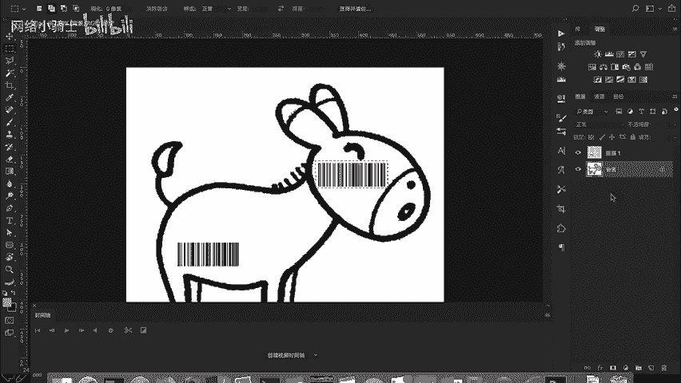

近年来，CTF比赛中常出现需要拼接二维码或条形码的题目。因此，掌握Photoshop的基本功能很有必要。

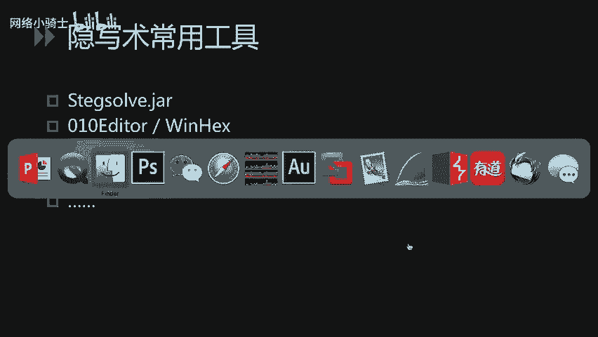

以下是使用Photoshop拼接条形码的基本步骤：
1.  打开包含不完整条形码的图片。
2.  使用 **矩形选框工具** 选中条形码的有效部分。
3.  使用 `Ctrl+C` (Windows) 或 `Command+C` (Mac) 复制选区。
4.  **新建一个图层**，然后粘贴 (`Ctrl+V` / `Command+V`) 到新图层上。
5.  重复步骤2-4，选取条形码的另一部分。
6.  使用 **移动工具** 将两个部分移动到合适位置进行拼接。可以调整**图层混合模式**（如“变暗”）来更好地对齐。
7.  拼接完成后，即可使用扫码工具或在线解码网站识别完整的条形码。

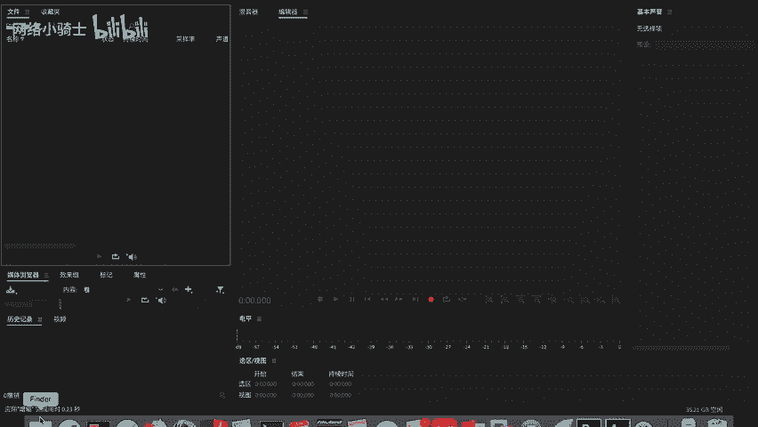

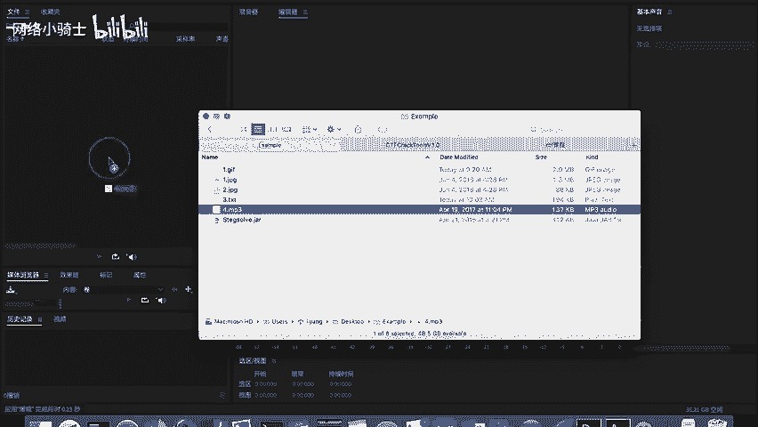

## 音频隐写术工具 (Audition)

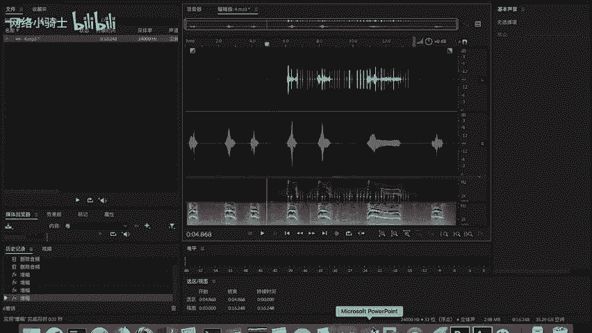

Audition是Adobe公司出品的音频处理软件，常用于处理CTF中的音频隐写题目。

基本操作流程如下：
1.  打开Audition，在左侧文件窗口加载音频题目文件。
2.  双击文件进入编辑视图。视图中的 `L` 和 `R` 分别代表左右声道，可以单独开启或关闭。
3.  观察波形，信息可能只存在于单个声道。例如，若信息主要在左声道，可关闭右声道。
4.  使用光标**选取无信息的音频段并删除**，只保留包含隐藏信息的部分。
5.  使用顶部工具栏的快捷按钮（如“振幅与压限”）**增大振幅**，使隐藏的波形变化更加清晰可见。
6.  有时可能需要使用 `效果` 菜单下的更高级功能进行进一步分析。

## 密码学与编解码工具

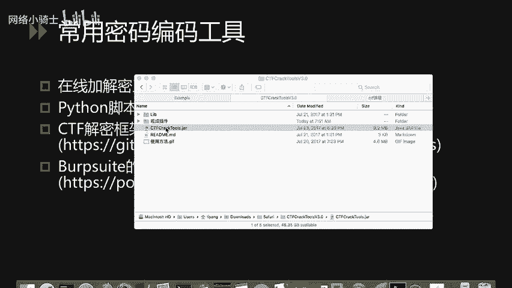

处理密码编码题目时，通常有多种工具选择。

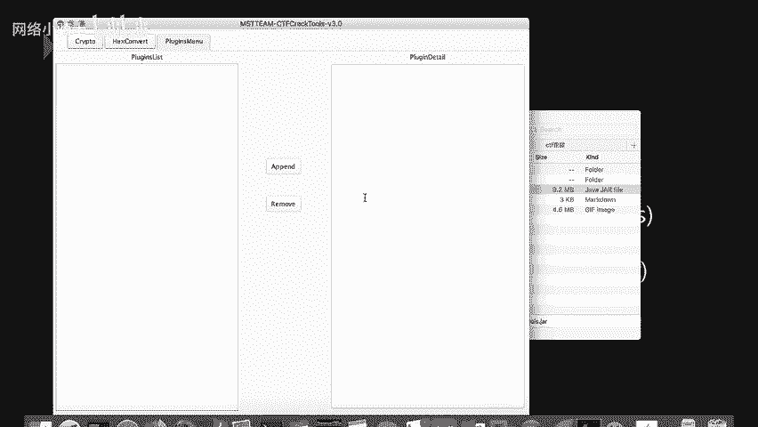

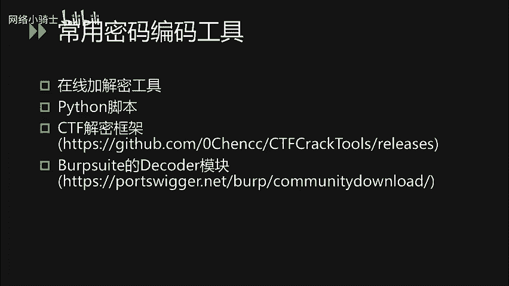

*   **在线工具**：通过搜索引擎可以找到大量在线的加解密、编码解码工具网站，方便快速进行常见算法的操作。
*   **Python脚本**：由于Python编写方便且资源丰富，使用Python脚本在本地进行加解密操作非常灵活。可以通过搜索找到各种算法的现成脚本。
*   **CTF集成框架**：推荐一个由国内安全团队编写的CTF工具框架——**CTFcrackTools**。该框架具备多个功能模块，并支持以插件形式集成自定义的Python脚本，方便在答题时统一管理和调用多种解密工具。其GitHub地址可在相关资料中找到。
*   **Burp Suite Decoder模块**：在渗透测试工具Burp Suite中，内置了强大的Decoder模块。它可以直接进行常见的编码解码操作。例如，对于字符串 `hello world`，可以使用右侧的 `Encode as` 进行多种编码（如Base64、URL编码），也可以使用 `Decode as` 进行相应的解码。因其集成在Burp Suite中，对于Web类题目尤其方便。

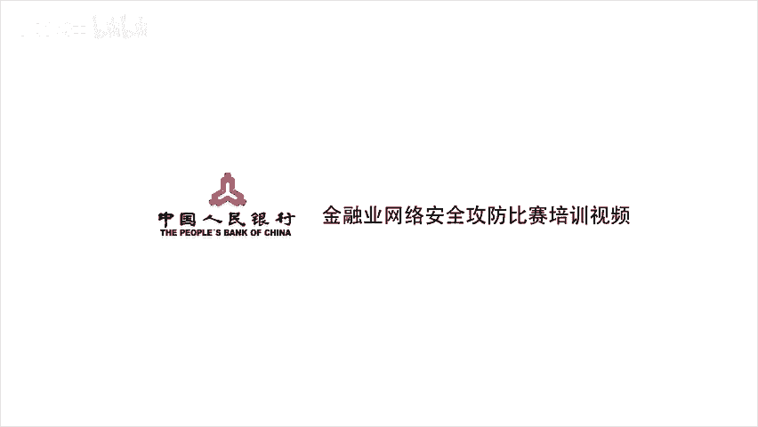

本节课中我们一起学习了CTF杂项题目中涉及隐写术和编码的几类核心工具：用于图片分析的Stegsolve、用于文件分析的010 Editor、用于图像处理的Photoshop、用于音频分析的Audition，以及用于密码编解码的在线工具、Python脚本和集成框架。熟练运用这些工具是解决相关题目的关键。