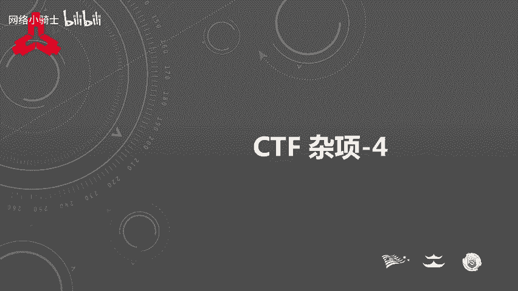
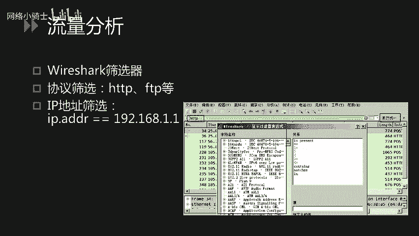
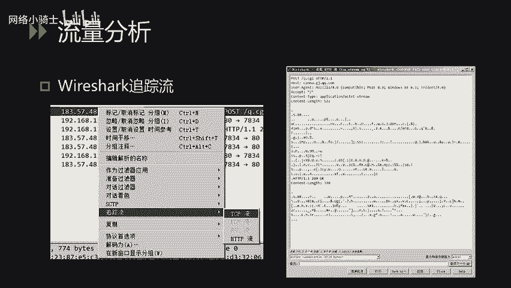
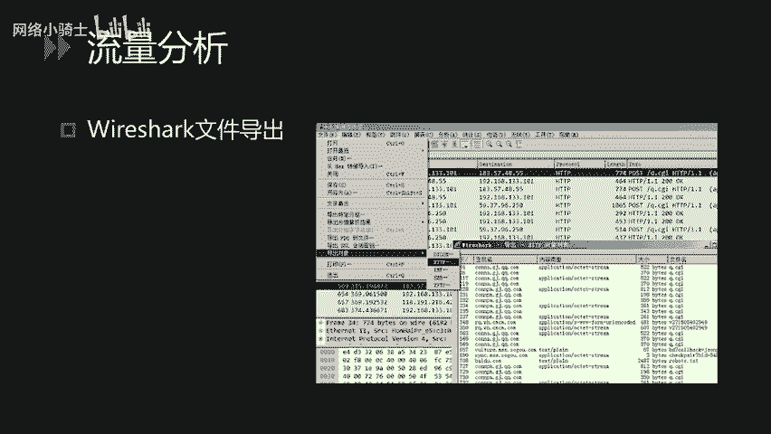
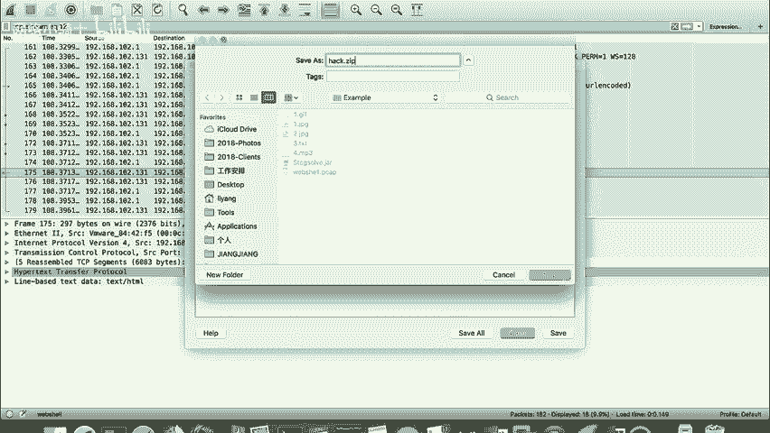
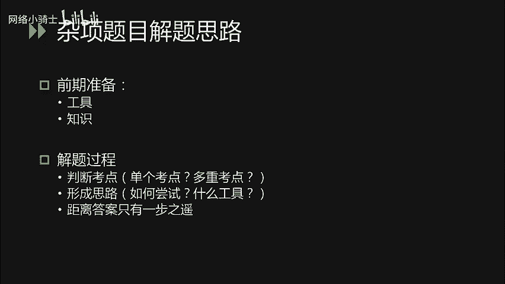
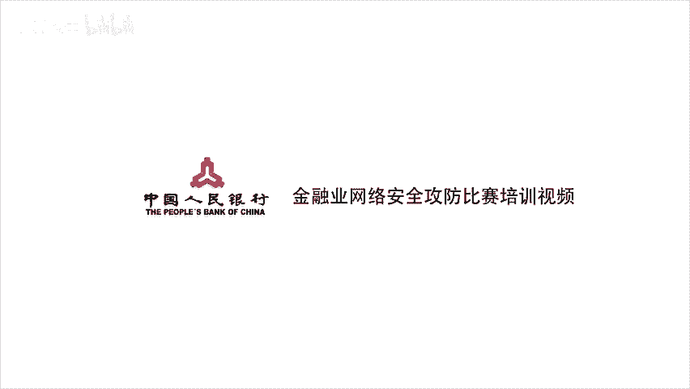

# CTF夺旗赛教程：P45：CTF 杂项_4 - 取证技术与解题思路 🕵️

在本节课中，我们将学习CTF比赛中取证技术（Forensics）的分析方法以及杂项（Misc）题目的通用解题思路。课程将涵盖流量分析工具的使用、日志分析技巧，并帮助你建立应对复杂杂项题目的系统性思维。

## 流量分析技术

上一节我们介绍了各类编码与密码，本节中我们来看看如何从网络流量中寻找线索。Wireshark是最常用的流量分析工具，其功能强大，但在CTF中，我们主要使用筛选器、追踪流和文件导出这几个核心功能。

### Wireshark筛选器

通过Wireshark的筛选器，我们可以根据协议、IP地址、端口等信息过滤数据包，从而快速定位到关键信息。

以下是Wireshark筛选器的基本使用方法：
*   点击筛选器输入框右侧的表达式按钮，可以使用内置的过滤表达式。
*   表达式支持逻辑运算符，例如等号（`==`）、不等号（`!=`）、大于（`>`）、小于（`<`）或匹配（`contains`）等。

### 追踪流功能

网络流量分析的核心是理清请求与响应的对应关系。Wireshark的追踪流功能可以清晰地展示一次完整会话的通信内容。

以下是使用追踪流功能的步骤：
*   在数据包列表中选择一条记录，右键点击。
*   选择“追踪流” -> “TCP流”或“HTTP流”。
*   在弹出的新窗口中，可以完整查看该次会话的请求和响应内容，并支持查找、过滤或保存。

### 文件导出功能

如果流量中包含文件传输（如HTTP下载、FTP传输），我们可以直接将其导出到本地进行分析。

以下是文件导出功能的操作流程：
*   点击菜单栏的“文件” -> “导出对象” -> “HTTP…”（或其他协议）。
*   在列表中找到目标文件（通常可通过大小、内容类型判断），将其保存到本地。

为了加深理解，我们来看一个CTF题目实例。题目文件名为`web shell.pcap`，提示我们需要分析一个Webshell的上传与利用过程。

1.  使用筛选器 `http` 过滤出所有HTTP流量。
2.  观察发现，攻击者先访问了`upload.php`进行上传操作，随后访问了`hack.php`，这很可能就是上传的Webshell。
3.  右键追踪`hack.php`的HTTP流，发现其响应内容经过Base64编码，解码后显示为列目录操作。
4.  继续查看后续流量，发现一个响应的数据包中包含`PK`文件头，这是ZIP压缩包的标志。
5.  使用“文件”->“导出对象”->“HTTP…”功能，找到对应的响应包（编号175），将其导出并保存为`.zip`文件。
6.  尝试解压导出的ZIP文件，发现失败，原因是文件头存在异常字符，需要使用十六进制编辑器（如010 Editor）进行修复。
7.  修复后，发现压缩包被加密。回顾攻击流量，找到攻击者使用`zip -P [password]`命令加密的痕迹，从中获取密码即可成功解压得到Flag。

## 电子取证与日志分析

刚才我们讲解了如何使用Wireshark进行流量分析，接下来我们看看电子取证中的另一个重要部分：日志分析。常见的日志包括Web服务器的访问日志（access log）、系统日志等。

我们以Web访问日志为例。一条典型的日志格式如下：
`192.168.1.100 - - [10/Oct/2023:14:32:01 +0800] "GET /index.php?id=1 HTTP/1.1" 200 1234`

其含义依次是：客户端IP、访问时间、HTTP方法、请求路径、协议版本、**状态码**、响应体大小。

在CTF中，日志分析题目可能要求：
*   **发现注入点**：攻击者进行SQL盲注时，可能会根据页面返回的**状态码**（如200成功，500错误）来判断注入是否成功。参赛者需要熟悉SQL语法和盲注原理，通过分析日志中的状态码变化来还原注入过程，甚至编写脚本自动化获取数据。
*   **查找Webshell**：在大量的访问日志中，通过搜索特定关键词（如`eval`、`system`、`.php?`后接可疑参数）来定位攻击者上传或访问的Webshell路径。
*   **发现敏感路径**：攻击者可能通过目录扫描访问了某些敏感后台或文件，通过分析日志可以找到这些路径，进而作为解题的突破口。

此类题目没有固定套路，需要对常见的攻击模式有深入了解，并熟练使用文本编辑器（如Notepad++）的搜索功能处理大文件。

## 杂项题目解题思路

杂项题目是CTF中的“万花筒”，可能综合考察编码、隐写、取证、逆向等多个领域的知识。其解题思路与其他类型题目有相似之处，但更强调知识的广度与临场应变能力。

以下是应对杂项题目的一般性步骤：
1.  **前期准备**：积累各类题型的解题工具（如编解码工具、隐写分析工具、取证工具）和知识点。善用搜索引擎学习和下载所需资源。
2.  **识别考点**：仔细审题，包括文件名、题目描述、附件内容等，判断题目考察的是单个知识点还是多个知识点的组合。例如，题目“困在栅栏里的凯撒”就明确提示了**栅栏密码**和**凯撒密码**两个考点。
3.  **形成思路**：确定考点后，需要思考解题顺序（先解栅栏还是先解凯撒？）和最高效的尝试方法（手动推算还是使用工具？）。
4.  **执行与调整**：按照思路进行尝试。如果未能解出，不要轻易放弃，可能只差一步（如编码后的结果需要再次解码）。同时也需冷静判断当前思路是否正确，必要时果断调整或战略放弃，将时间投入到其他题目。
5.  **持续练习**：提升杂项能力最有效的方法是多在在线CTF平台（如CTFHub、BugKu）上练习，并多看其他选手的解题报告（Writeup），积累经验和技巧。

## 课程总结

本节课中我们一起学习了CTF取证技术和杂项题目的核心解题方法。我们掌握了使用Wireshark进行流量分析的三大功能：**筛选过滤**、**追踪流**和**文件导出**。我们也了解了如何分析Web访问日志来发现攻击痕迹。最后，我们梳理了应对综合性杂项题目的系统性思路：从识别考点、形成解题策略，到执行尝试与灵活调整。记住，广泛的知識储备、熟练的工具使用以及大量的实战练习，是成为CTF杂项解题高手的关键。