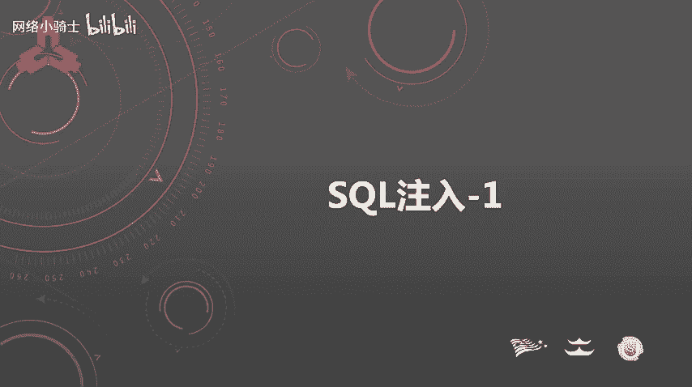
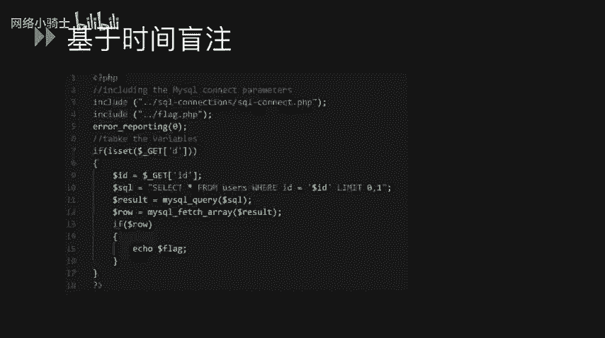
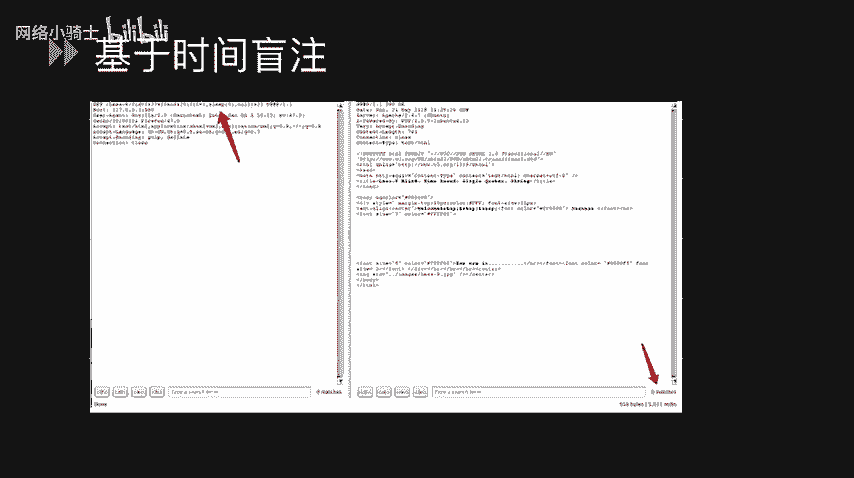
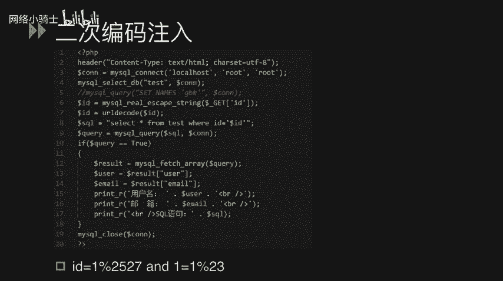

# CTF夺旗赛教程：P46：SQL注入基础



在本节课中，我们将学习SQL注入在CTF竞赛中的基本概念、常见类型及其攻击原理。SQL注入是Web安全领域的重要考点，理解其原理是成为CTF高手的关键一步。

## 什么是SQL注入？💉

SQL注入是攻击者通过将恶意的SQL命令插入到POST提交的数据或URL参数值中，从而造成额外的SQL语句执行的一种攻击方式。

这些额外的SQL语句通常是攻击者构造的恶意指令，可能是查询语句，也可能是删除或更新数据的语句。这些语句不仅可能导致数据库信息泄露，还可能对数据库造成严重的破坏性威胁。

在CTF竞赛中，我们最常遇到的是MySQL数据库。因此，本节将重点讲解MySQL数据库的注入技巧以及可能遇到的问题。

## SQL注入的常见类型🔍

SQL注入有多种类型，我们将逐一进行讲解。

### 1. 字符型注入

我们来看一个示例。以下代码中，第4行有一条SQL语句：`SELECT * FROM users WHERE name = ‘$name’`，其中 `$name` 变量是从GET参数中获取的值。

攻击者可以向 `name` 参数输入构造好的恶意值，从而执行额外的SQL语句。例如，输入：
```
name = test' UNION SELECT ...
```
这里的单引号 `‘` 用于闭合原SQL语句中的引号，然后通过 `UNION SELECT` 进行联合查询，以获取额外数据。

### 2. 数字型注入

我们看另一个示例。代码中有一条SQL语句：`SELECT content FROM test WHERE id = $id`。变量 `$id` 同样从GET参数获取，且它是一个数字变量，因此我们称之为数字型注入。

攻击者可以构造如下Payload：
```
id = 1 UNION SELECT ...
```
通过 `UNION SELECT` 进行联合查询，执行额外的SQL语句。

有时，开发者会使用安全函数来过滤输入，例如 `addslashes()` 或 `mysql_real_escape_string()` 对单引号进行转义，以增强安全性。

### 3. 布尔型盲注

我们讲解第三种类型：布尔型盲注。在示例代码的第9行，SQL语句在变量 `$id` 后加上了 `LIMIT 1` 限制。这种情况下，无法直接使用 `UNION SELECT` 进行查询。

此时，攻击者只能通过“盲注”的方式，即根据页面返回的“真”（True）或“假”（False）状态，来逐位推断数据库中的信息。

以下是探测步骤：
1.  输入 `id=1‘`，破坏SQL语句结构，导致无回显。
2.  输入 `id=1‘ AND 1=1`，此时语句为真，页面应有正常回显。
3.  输入 `id=1‘ AND 1=2`，此时语句为假，页面应无回显或回显异常。

通过这种方式，可以判断此处存在SQL注入漏洞。接下来，就需要利用盲注技术获取敏感信息。

盲注常用到以下几个函数：
*   **`LENGTH(str)`**：返回字符串 `str` 的长度。
*   **`SUBSTRING(str, pos, len)`**：从字符串 `str` 的第 `pos` 位开始，截取 `len` 个字符。
*   **`ASCII(char)`**：返回字符 `char` 的ASCII码值。
*   **`SLEEP(seconds)`**：让数据库休眠 `seconds` 秒。
*   **`IF(condition, value_if_true, value_if_false)`**：条件判断函数。



例如，我们可以通过 `IF(LENGTH(DATABASE())>8, SLEEP(5), 1)` 这样的语句，结合页面响应时间，来猜测当前数据库名的长度。然后，再使用 `SUBSTRING` 和 `ASCII` 函数，逐位猜解数据库名、表名和列名的具体字符。

### 4. 时间型盲注



时间型盲注与布尔型盲注原理相似，都是无法直接获得回显时的注入手段。区别在于，时间型盲注依据的是页面响应时间的差异。

在示例中，我们在注入点输入包含 `SLEEP()` 函数的Payload，例如：
```
id=1‘ AND SLEEP(5) --+
```
如果页面响应时间明显延迟（约5秒），则说明 `SLEEP()` 函数被执行，从而证明存在SQL注入漏洞。通过调整 `SLEEP` 的时间和条件，可以逐步推断出数据库信息。

### 5. 宽字节注入

宽字节注入通常发生在PHP使用 `GBK`、`BIG5` 等宽字节字符集连接MySQL时。问题根源在于转义函数 `addslashes()` 或 `mysql_real_escape_string()` 会在单引号前添加反斜杠 `\`（编码为 `%5C`）进行转义。

在 `GBK` 编码中，某些特定字符（如 `%df`）与 `%5C` 组合会被解码为一个繁体汉字（如“運”），从而使反斜杠“消失”，单引号成功逃逸，导致注入。

**修复方法**：将数据库连接字符集统一设置为 `UTF-8`。

### 6. 二次编码注入

二次编码注入是由于安全函数冗余使用导致的问题。在示例中，代码先使用 `mysql_real_escape_string()` 对输入进行转义，但随后又调用了 `urldecode()` 函数进行URL解码。

攻击者可以输入经过双重URL编码的Payload，例如单引号 `‘` 编码一次为 `%27`，再编码一次为 `%2527`。转义函数不会对 `%25` 进行转义，但 `urldecode()` 会将其解码回 `%27`，最终在SQL语句中还原为一个有效的单引号，从而绕过防护。

## 总结📚

本节课我们一起学习了SQL注入的基础知识。我们了解了SQL注入的定义，它本质上是由于程序未对用户输入进行充分过滤，导致恶意SQL代码被拼接并执行。

我们详细探讨了六种常见的SQL注入类型：**字符型注入**、**数字型注入**、**布尔型盲注**、**时间型盲注**、**宽字节注入**和**二次编码注入**。每种类型都有其特定的应用场景和绕过技巧。




理解这些基础类型是后续学习更复杂注入手法和防御措施的前提。在CTF实战中，需要根据目标的具体情况，灵活选择和组合这些技术。