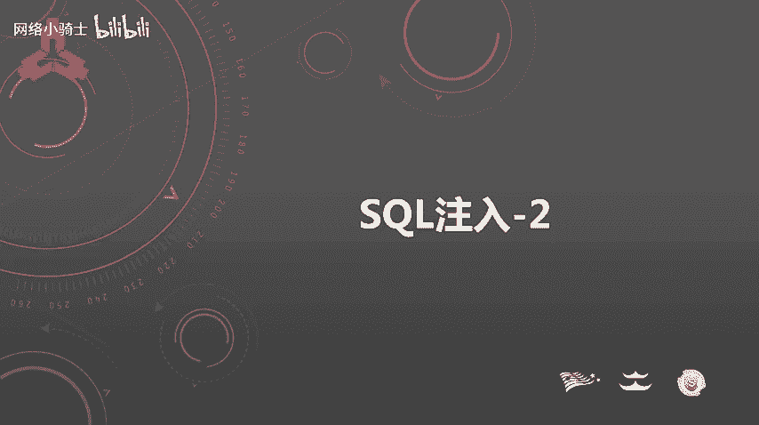
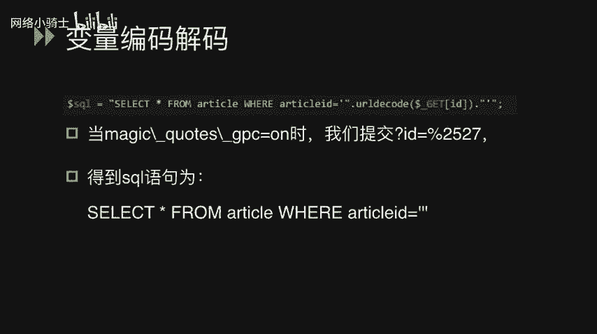
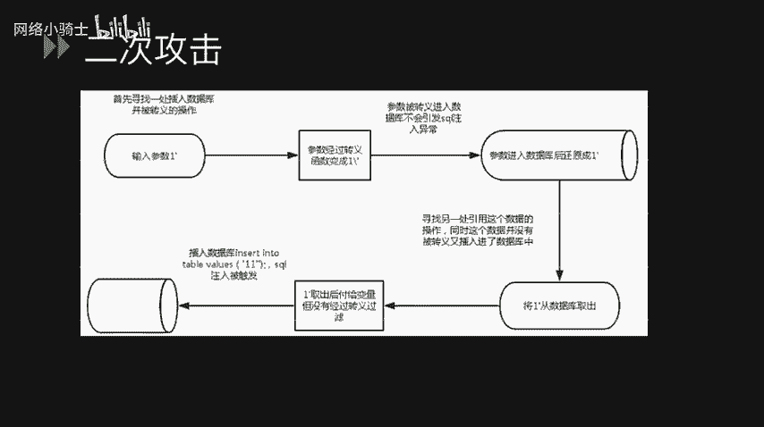
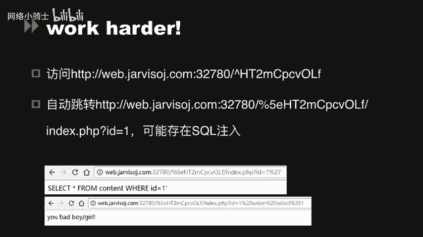
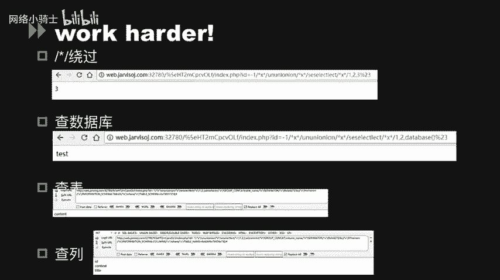
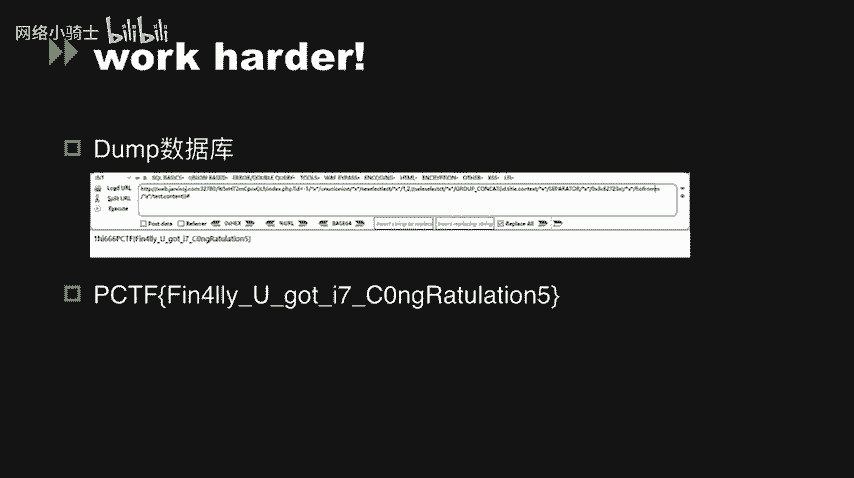
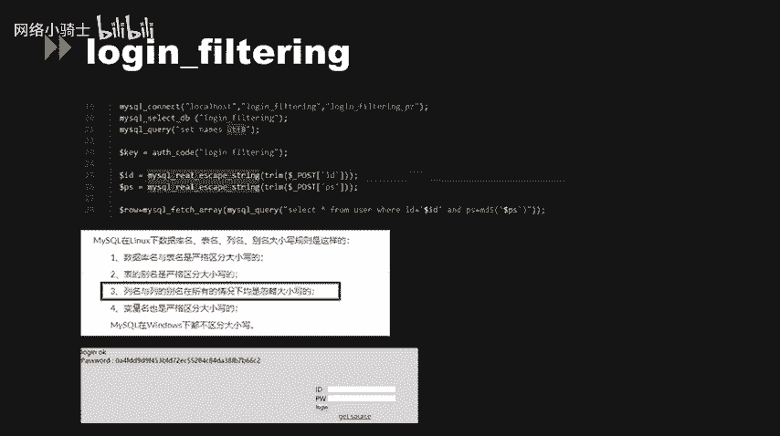

# CTF夺旗赛教程：P47：SQL注入_2



## 概述
在本节课中，我们将学习SQL注入在CTF竞赛中的几种高级应用场景，特别是围绕PHP的魔术引号（magic_quotes_gpc）安全机制展开。我们将探讨其原理、缺陷、如何被绕过，以及相关的二次攻击和宽字节注入等概念，并通过分析三道CTF题目来巩固理解。

---

## 魔术引号（magic_quotes_gpc）详解

上一节我们介绍了SQL注入的基础原理，本节中我们来看看PHP中一个曾用于防御注入的安全机制——魔术引号。

在CTF中，PHP的配置选项 `magic_quotes_gpc` 是一个关键点。当此选项被设置为 `on` 时，所有来自GET、POST、COOKIE数据的单引号（`‘`）、双引号（`“`）、反斜线（`\`）和NULL字符都会被自动加上一个反斜线进行转义。

从原理上讲，这与 `addslashes()` 函数作用完全相同。例如，用户输入一个反斜线（`\`），系统会将其转义为 `\\`；输入一个单引号（`‘`），则会被转义为 `\‘`。

**代码示例：转义效果**
```php
// 假设 magic_quotes_gpc = ON
$user_input = "' OR 1=1 -- ";
// 实际接收到的字符串会变成：
// "\‘ OR 1=1 -- "
```

在PHP版本小于4.2.3时，此选项是全局设置。自PHP 5.3.0起被废弃，并在5.4.0中被移除。

### 为何关闭魔术引号？
开发者社区最终选择关闭此选项，主要基于以下几点考虑：
1.  **影响一致性**：并非所有接收到的数据都需要存入数据库，对全部数据进行转义会影响程序逻辑的一致性。
2.  **性能损耗**：对所有输入数据进行转义操作，会对程序执行效率产生一定影响。
3.  **导致误判**：在不需要转义的地方（如通过表单发送邮件），看到被转义的数据（如一堆反斜杠）可能导致显示问题。
4.  **存在缺陷**：该机制可能影响`$_SERVER`等超全局变量，导致一些如CRLF注入的漏洞被利用。

针对转义后数据需要还原的情况，可以使用 `stripslashes()` 函数进行处理，它是 `addslashes()` 的逆操作。

---

## 编码与解码问题

在变量处理过程中，编码与解码函数的不当使用可能引入漏洞。

以下是PHP中常见的几组编解码函数：
*   **Base64**： `base64_encode()` 与 `base64_decode()`
*   **URL编码**： `urlencode()` / `rawurlencode()` 与 `urldecode()` / `rawurldecode()`
*   **序列化**： `serialize()` 与 `unserialize()`

### 二次编码注入漏洞
当程序对用户输入进行多层解码时，可能绕过 `magic_quotes_gpc` 的防护。

考虑以下场景：
1.  全局开启了 `magic_quotes_gpc`。
2.  代码使用 `urldecode()` 对用户输入的参数 `id` 进行解码。
3.  执行的SQL语句为：`SELECT * FROM article WHERE articleid=‘$id‘`

攻击者可以输入 `%2527` 作为 `id` 参数：
*   首先，`magic_quotes_gpc` 检查 `%2527`，未发现单引号，故不做转义。
*   然后，`urldecode()` 函数对 `%2527` 进行解码。`%25` 解码为 `%`，所以 `%2527` 变成 `%27`。
*   如果代码再次处理或存储该值，`%27` 在后续的URL解码中会变成单引号（`‘`），从而逃逸出来，引发SQL注入。

**公式描述绕过过程：**
`%2527` (输入) → (magic_quotes_gpc 无操作) → `urldecode()` → `%27` → (可能的二次解码) → `‘` (单引号逃逸)



---

## 二次攻击（二次注入）

二次攻击与二次解码攻击不同，它涉及数据存入和取出两个阶段。



以下是二次攻击的业务逻辑过程：
1.  **寻找插入点**：找到一处将用户输入插入数据库，并进行了转义（如使用`addslashes`）的操作。
2.  **首次输入与存储**：攻击者输入 `1‘`。由于转义存在，它变成 `1\‘` 被存入数据库。此时不会触发SQL注入。
3.  **数据取出与复用**：在应用的另一处逻辑中，程序从数据库取出该数据（`1\‘`）并赋值给一个变量。**关键点在于，取出时数据被 `stripslashes()` 或类似方式还原成了 `1‘`，且未经过滤**。
4.  **触发注入**：这个未经转义的 `1‘` 被拼接到新的SQL语句中执行，从而引发注入漏洞。

**核心问题**：数据在存入时被转义，但在取出后被**信任地使用**，且没有在使用的上下文环境中再次进行转义或过滤。

---

## 魔术引号的新型攻击

反斜杠（`\`）不仅是转义符，在Windows路径中，它也是目录分隔符。这个特性可能被利用。

考虑以下代码片段：
```php
$orderSN = $_GET[‘orderSN‘]; // 用户输入
$orderSN = substr($orderSN, 0, 1); // 只取第一个字符
// 假设 magic_quotes_gpc = ON，用户输入 ‘\
// 那么 $orderSN = ‘\‘
$sql = "SELECT * FROM orders WHERE orderSN=‘“ . $orderSN . “‘ AND orderTN=‘“ . $_GET[‘orderTN‘] . “‘";
```
攻击者可以：
*   设置 `orderSN=\`
*   设置 `orderTN=‘ OR 1=1 -- `
最终生成的SQL语句为：
`SELECT * FROM orders WHERE orderSN=‘\‘ AND orderTN=‘‘ OR 1=1 -- ‘`
由于 `orderSN` 值的单引号被反斜杠转义，`AND` 之前的条件提前闭合，使得 `orderTN` 参数中的注入载荷生效。

---

## 其他魔术引号选项

除了 `magic_quotes_gpc`，PHP历史上还有两个相关选项：
1.  **magic_quotes_runtime**：对从数据库或文件取出的数据进行转义。这理论上可以防御二次注入，但可能影响 `fgets()`、`fread()` 等函数，已在PHP 7.0移除。
2.  **magic_quotes_sybase**：只转义单引号为双引号（Sybase风格），且会覆盖 `gpc` 设置。同样在PHP 5.4.0被移除。

---

## CTF例题实战分析

### 例题一：基础绕过与注释符利用
题目提供了一个URL，提示访问 `index.phps` 查看源码。分析源码后，发现需要绕过两个关键判断：
1.  变量 `$data` 的验证。
2.  `eregi()` 函数的匹配。

**绕过方法：**
*   对于 `$data`，可以使用 `php://input` 流来传递数据以绕过常规赋值。
*   对于 `eregi()`，可以利用其截断特性或大小写敏感问题进行绕过（`eregi()` 在匹配 `“111“` 时，`“111%00“` 可能被截断而通过）。

成功绕过后会获得一个提示路径，访问该路径发现SQL注入点。题目过滤了空格，可以使用注释符 `/**/` 代替空格进行注入。

**注入Payload示例：**
```sql
‘union/**/select/**/1,2,database()--+
‘union/**/select/**/1,2,group_concat(table_name)/**/from/**/information_schema.tables/**/where/**/table_schema=database()--+
```
通过逐步查询数据库、表、列，最终获取flag。

### 例题二：宽字节注入
题目源码使用了 `mysql_real_escape_string()` 函数进行转义，这通常能有效防御注入。但这里存在**宽字节注入**漏洞。



当数据库编码为GBK等宽字符集时，如果用户输入 `%df‘`，经过 `addslashes` 或 `magic_quotes_gpc` 转义后变成 `%df\‘`（`\` 的URL编码是 `%5c`）。在GBK编码下，`%df%5c` 恰好构成一个合法的宽字符“運”，从而使得后面的单引号（`‘`）逃逸。

**自动化利用：**
可以使用SQLMap工具的 `--tamper` 参数，指定 `unmagicquotes.py` 脚本来自动化利用此漏洞。





### 例题三：大小写绕过
题目同样使用了 `mysql_real_escape_string()`，并且第21行代码将字符集设置为UTF-8，因此无法使用宽字节注入。

**绕过思路：**
研究发现，在MySQL（Linux下）的标识符大小写规则中，**列名和列别名在所有情况下都是忽略大小写的**。而登录验证的SQL语句可能是：
`SELECT * FROM users WHERE username=‘$user‘ AND password=‘$pass‘`
如果 `username` 和 `password` 是列名，攻击者可以通过输入 `USERNAME` 和 `PASSWORD`（全大写）来尝试绕过。因为MySQL在比较列名时不区分大小写，这可能导致逻辑错误，从而绕过认证。

**关键规则公式：**
`列名（Column Name）` 比较 ≡ `忽略大小写（Case-Insensitive）`

通过此方法，可以构造特定的用户名和密码，绕过登录框获取最终的key（flag）。

---

## 总结
本节课我们一起深入学习了SQL注入的几种高级利用技术：
1.  **魔术引号（magic_quotes_gpc）** 的原理与缺陷，理解了它为何被废弃。
2.  **二次编码注入** 如何通过多层解码绕过转义。
3.  **二次攻击（二次注入）** 的核心在于“存入转义，取出信任使用”的逻辑漏洞。
4.  利用反斜杠的**目录跳转特性**或**转义特性**构造的新型攻击。
5.  在CTF实战中，掌握了使用 `/**/` 绕过空格过滤、利用**宽字节注入**漏洞以及利用MySQL列名**大小写不敏感**规则进行绕过的技巧。




这些知识将帮助你在CTF比赛中更有效地识别和利用复杂的SQL注入漏洞。