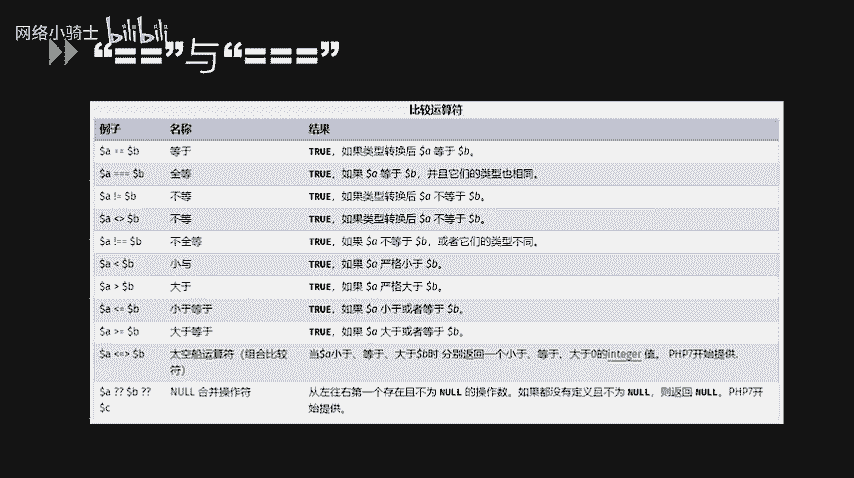
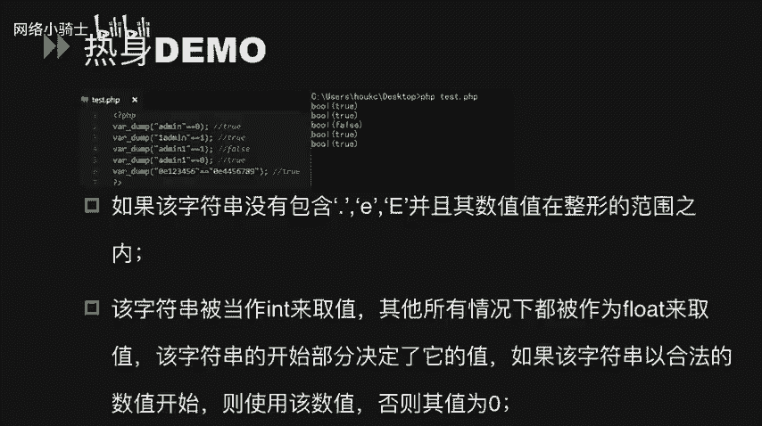
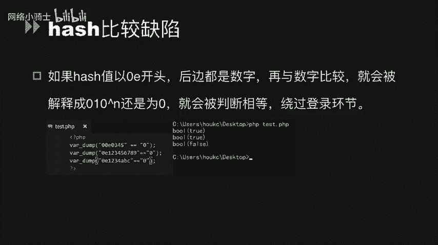
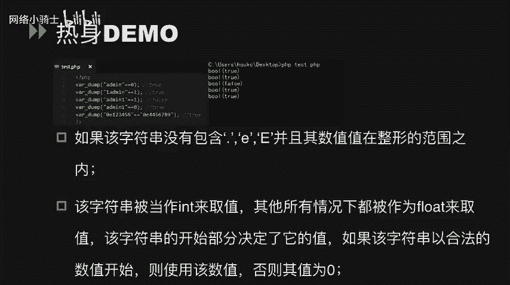
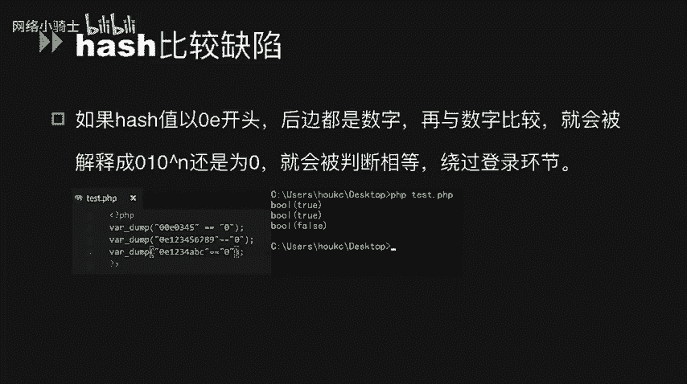
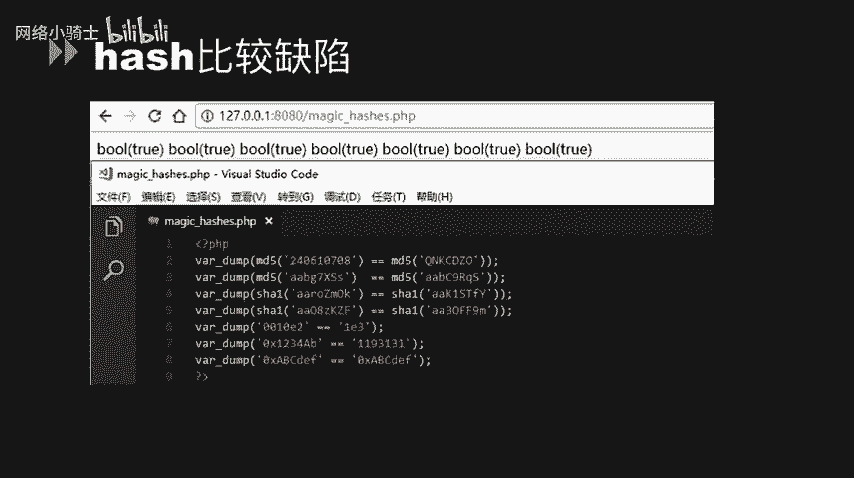
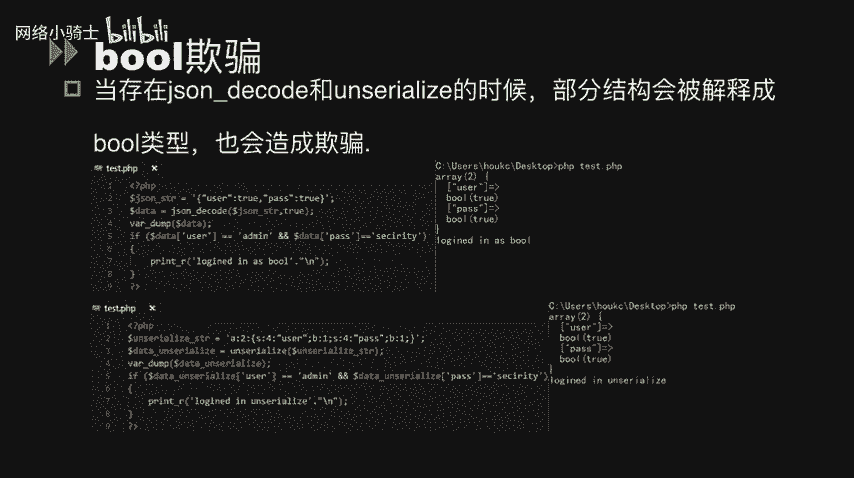
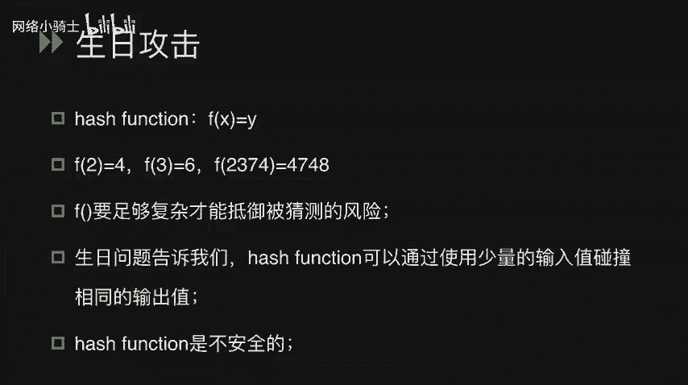
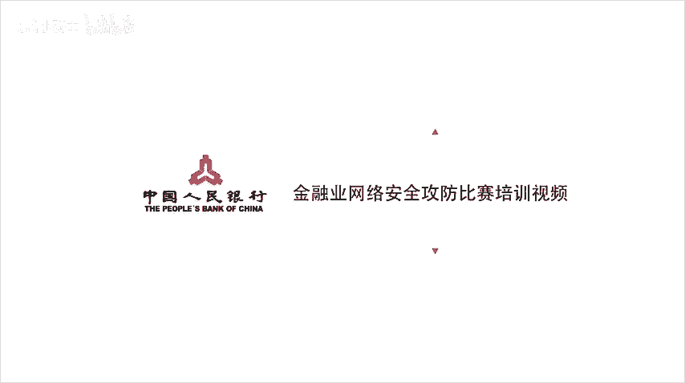

# CTF夺旗赛教程：P49：代码审计_1


## 概述
在本节课中，我们将要学习CTF竞赛中PHP代码审计的基础知识。代码审计是发现和利用Web应用程序漏洞的关键技能。我们将从PHP语言中两个核心的比较运算符开始，逐步深入到哈希比较缺陷、布尔欺骗、数字转换欺骗以及相关函数的松散特性，并通过实例演示如何利用这些特性绕过安全验证。

## PHP中的比较运算符：`==` 与 `===`



上一节我们概述了PHP代码审计的重要性，本节中我们来看看PHP中两个基础的比较运算符：双等号（`==`）和三个等号（`===`）。

*   **双等号 (`==`)**：称为松散比较。在进行比较前，会尝试将操作数转换为相同类型。
*   **三个等号 (`===`)**：称为严格比较。要求比较的两个值不仅值相等，数据类型也必须相同。

两者的核心区别在于类型转换。`===` 会先判断类型是否相同，再比较值。而 `==` 会先尝试进行类型转换，使两者类型一致后再比较值。

当使用 `==` 比较一个数字和一个字符串时，字符串会被转换为数值。转换规则是：从字符串起始部分读取数字，直到遇到非数字字符为止。如果起始字符不是数字，则转换为0。

以下是几个演示松散比较的例子：

```php
var_dump("admin" == 0); // 输出: bool(true)。"admin"转换为数字0。
var_dump("1admin" == 1); // 输出: bool(true)。"1admin"转换为数字1。
var_dump("admin1" == 1); // 输出: bool(false)。"admin1"起始字符'a'非数字，转换为0。
var_dump("admin1" == 0); // 输出: bool(true)。"admin1"转换为数字0。
```

## 哈希比较缺陷 (Magic Hash)



理解了松散比较的原理后，我们来看一个在CTF中常见的应用：哈希比较缺陷，也称为“魔法哈希”。



这个缺陷源于PHP处理科学计数法字符串的方式。当一个字符串以 `0E` 或 `0e` 开头，后面跟随纯数字时，在松散比较中，它会被解释为科学计数法的零（即 0 × 10^n = 0）。



```php
var_dump("0e123456" == "0e987654"); // 输出: bool(true)
// 两者都被解释为 0 == 0，因此结果为真。
```



这个特性常被用来绕过基于MD5、SHA1等哈希值的身份验证。攻击者可以寻找两个不同的原始输入，使它们的哈希值都以 `0e` 开头且后面为纯数字，这样在松散比较时就会相等。

以下是一些著名的“魔法哈希”碰撞示例：

*   `md5('240610708') == md5('QNKCDZO')` // 两者哈希值均为 `0e` 开头。
*   `sha1('aaroZmOk') == sha1('aaK1STfY')` // 两者哈希值均为 `0e` 开头。
*   `md5('s878926199a') == md5('s155964671a')` // 同理。



## 布尔欺骗 (Boolean Trick)

除了哈希比较，另一种常见的欺骗手段涉及布尔类型转换。当使用 `json_decode()` 或 `unserialize()` 函数处理部分数据结构时，可能会产生非预期的布尔值 `true`。

以下是两个示例：

**示例一：使用 `json_decode()`**
```php
$json_string = '{"user":true, "pass":true}';
$data = json_decode($json_string, true);
if ($data['user'] == 'admin' && $data['pass'] == 'security') {
    echo "Login Success!";
}
// 输出: Login Success!
// 因为布尔值 true 在松散比较中等于字符串 'admin' 和 'security' (true == 非空字符串 为真)。
```

**示例二：使用 `unserialize()`**
```php
$serialized_string = 'a:2:{s:4:"user";b:1;s:4:"pass";b:1;}';
$data = unserialize($serialized_string);
if ($data['user'] == 'admin' && $data['pass'] == 'security') {
    echo "Login Success!";
}
// 输出: Login Success!
// 原理同上，反序列化后的布尔值 true 通过了松散比较。
```

## 数字转换欺骗



数字转换欺骗是指字符串在转换为数值时产生的非直观结果，可用于绕过数字验证。

以下是几个相关示例：

*   `intval('2')` 结果为 2。
*   `intval('3abcd')` 结果为 3（读取到`3`后停止）。
*   `intval('abcd')` 结果为 0（起始非数字）。

```php
// 示例1：十六进制字符串比较
var_dump("123456" == "0x1e240"); // 输出: bool(true)
// PHP会将 "0x1e240" 识别为十六进制数并转换为十进制 123456。

// 示例2：科学计数法字符串比较
$userID = "0.999999";
if ($userID == 1) {
    echo "SQL Query: SELECT * FROM users WHERE id=$userID";
}
// 输出: SQL Query: SELECT * FROM users WHERE id=0.999999
// 字符串 "0.999999" 在比较时被转换为浮点数，由于浮点数精度问题， (float)0.999999 == 1 可能为真。

// 示例3：用户输入验证绕过
// 假设代码: if ($_GET['uid'] == 1) { // do something }
// 用户输入 ?uid=1abc， 则 `"1abc" == 1` 为真，因为字符串被转换为数字1。
```

## PHP函数的松散特性

某些PHP函数在接收非预期类型的参数时，行为可能变得松散，从而引入安全风险。

以下是两个关键函数：

**1. `strcmp()` 函数**
`strcmp($str1, $str2)` 用于比较两个字符串。但当 `$str2` 是一个数组时，函数会返回 `NULL`。在松散比较中，`NULL == 0` 为真。

```php
$key = "secret";
if (strcmp($key, $_GET['t']) == 0) { // 用户传入 ?t[]=anything
    echo "Welcome!";
}
// 如果传入 t[]=a (一个数组)，strcmp($key, array()) 返回 NULL。
// NULL == 0 为真，因此会输出 "Welcome!"。
```

**2. `md5()` 函数**
`md5($string)` 计算字符串的MD5哈希值。如果传入一个数组，函数不会报错，但会返回 `NULL`。这使得任意两个数组的MD5值在松散比较中都相等。

```php
$arr1 = array('a' => 'apple');
$arr2 = array('b' => 'banana');
if (md5($arr1) == md5($arr2)) {
    echo "MD5 matches!";
}
// 输出: MD5 matches!
// md5($arr1) 和 md5($arr2) 都返回 NULL， NULL == NULL 为真。
```

## 哈希函数与生日攻击 🎂

最后，我们来探讨哈希函数的一个理论基础：生日攻击。这解释了为什么找到哈希碰撞比想象中容易。

生日问题是一个著名的概率问题：在一个有N个人的房间里，至少有两个人生日相同的概率是多少？直觉上可能需要很多人，但统计学表明，当人数达到23时，概率就超过50%；达到70人时，概率超过99.9%。

将这个原理应用到哈希函数上：对于一个输出长度为n位的哈希函数，我们不需要尝试 2^n 次来“破解”它。根据生日悖论，只需要大约 2^(n/2) 次尝试，就有很高的概率找到一对碰撞（两个不同的输入产生相同的哈希输出）。



**结论**：这证明了哈希函数在理论上是可能发生碰撞的。虽然对于强哈希算法（如SHA256）在实际中仍非常安全，但它提醒我们，**绝对依赖哈希值是否相等（尤其是松散比较）来做关键安全判断是危险的**。在安全设计中，应优先使用严格比较（`===`），并考虑加盐（Salt）等机制增强安全性。



## 总结
本节课中我们一起学习了PHP代码审计的入门知识。我们从 `==` 和 `===` 的区别出发，详细分析了哈希比较缺陷、布尔欺骗、数字转换欺骗等利用松散比较进行攻击的手法。我们还了解了 `strcmp()` 和 `md5()` 等函数在接收非常规参数时的松散特性，最后从生日攻击的角度理解了哈希函数存在碰撞的理论必然性。掌握这些基础概念和技巧，是成为一名合格的CTF选手并进行有效代码审计的第一步。