# CTF夺旗赛教程：P4：杂项的基本解题思路（下半部分）


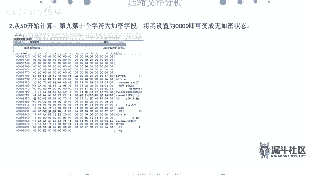


在本节课中，我们将继续学习CTF杂项题目的解题思路，重点聚焦于压缩文件处理和流量分析两大核心内容。上一节我们介绍了文件和图片隐写，本节中我们来看看如何应对压缩包和网络流量包中的挑战。

## 压缩文件处理

压缩文件是CTF中常见的载体，通常以ZIP或RAR格式出现。处理它们主要涉及伪加密识别、密码破解和文件修复。

### 伪加密识别与修复

伪加密是指压缩包的文件头中，加密标志位被人为修改，导致解压软件误认为需要密码，但实际上并未真正加密。现代解压软件（如360压缩、2345好压）通常能自动识别并修复伪加密。但在CTF中，我们仍需掌握手动修复的方法。

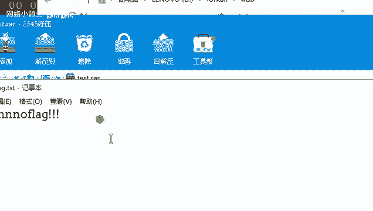

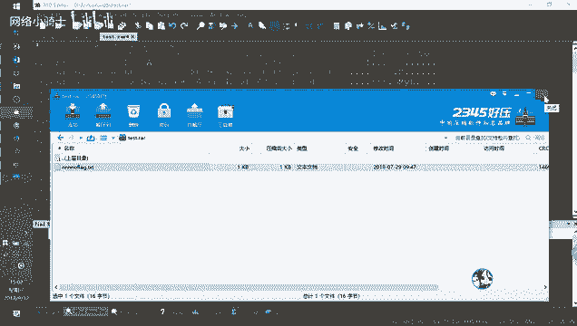

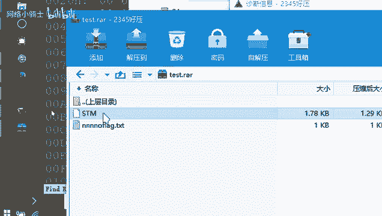

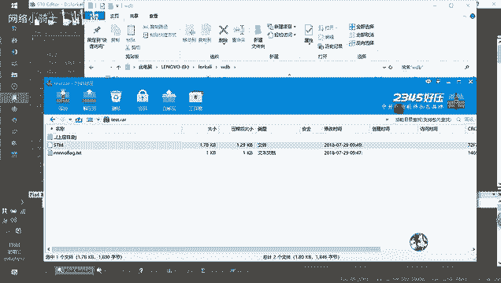

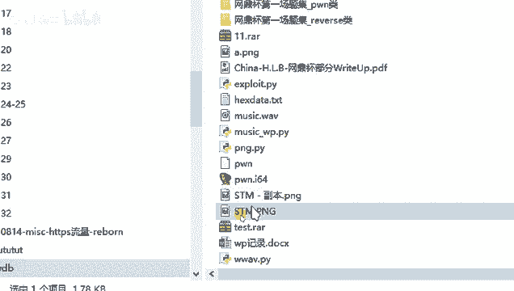

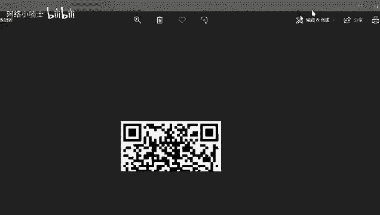

以下是修复伪加密的步骤：

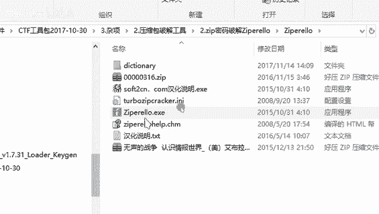


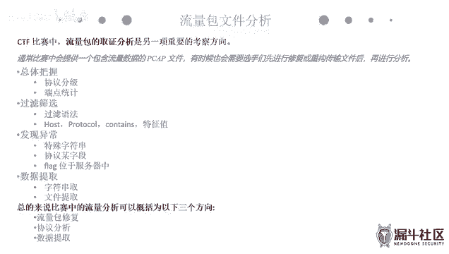

1.  使用十六进制编辑器（如WinHex或010 Editor）打开压缩包。
2.  搜索十六进制值 `504B0102`（ZIP文件头）或定位到RAR文件头的特定位置。
3.  找到加密标志位（ZIP通常是从`504B0102`开始计数的第9-10字节；RAR通常是第24字节），将其修改为 `00`。
4.  保存文件后，即可正常解压。


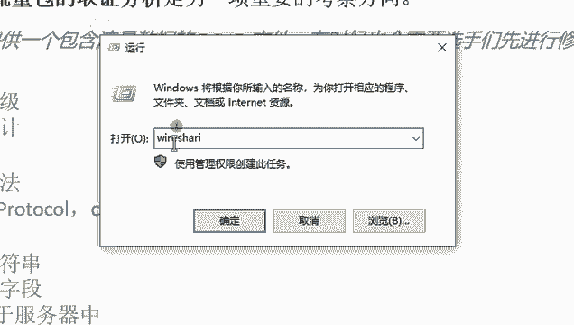

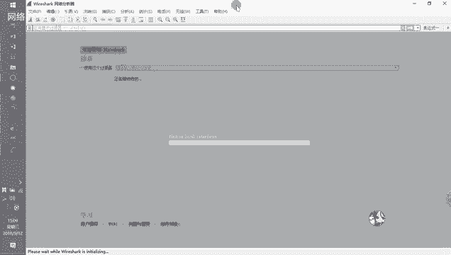

**核心概念：伪加密标志位**
*   **ZIP文件**：定位到 `504B0102` 后，第9-10字节为加密标志。`0900` 通常表示加密，改为 `0000` 即可。
*   **RAR文件**：文件头第24字节的尾数表示加密，将其改为 `0`。

### 密码破解

当压缩包被真正加密时，我们需要尝试破解密码。常用工具是ARCHPR（用于RAR）和Ziperello（用于ZIP）。

以下是破解密码的几种策略：

*   **暴力破解**：尝试所有可能的字符组合。适用于密码位数较少或有明确范围（如6位纯数字）的情况。
*   **字典攻击**：使用常见的密码字典进行尝试。效率高于暴力破解，但依赖于字典质量。
*   **掩码攻击**：当已知密码部分字符时（如前三位是`ABC`），可以指定已知部分，只暴力破解未知部分，大幅提升效率。
*   **明文攻击**：如果已知压缩包内某个未加密文件的内容，可以利用该“明文”去反推加密密钥。注意，用于攻击的明文文件必须使用与目标压缩包相同的压缩算法重新压缩。

**核心工具：ARCHPR**
```bash
# 使用示例：选择攻击类型（暴力、字典、掩码），设置字符集和长度，导入压缩包后开始破解。
```

### 文件修复与结构分析

有时压缩包本身可能损坏，或者文件头信息错误导致无法正常列出所有文件。这时需要对压缩包格式有深入了解。

一个压缩包由多个“块”组成，每个块有头部信息。例如，在RAR格式中，文件头的“块类型”字段值为 `0x74`。如果该值被错误修改，解压软件就无法识别该文件。我们需要用十六进制编辑器找到错误的位置，并将其修正为正确的值（如将 `0x7A` 改为 `0x74`），从而恢复出隐藏的文件。

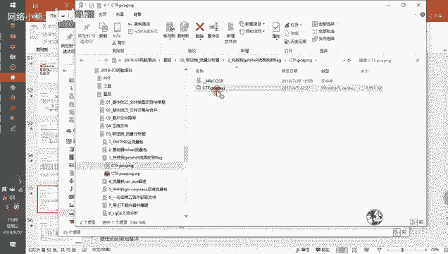

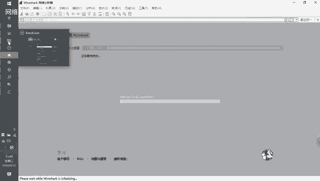

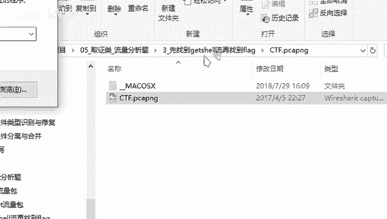

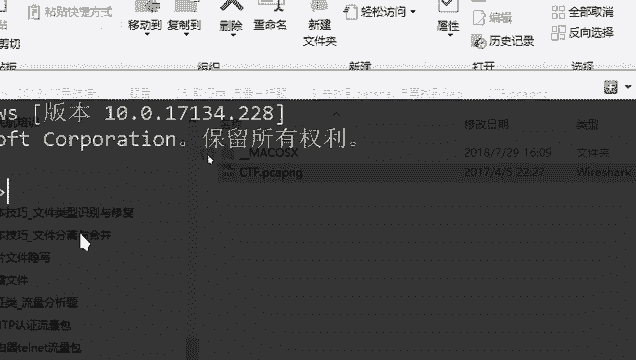

## 流量分析取证

流量分析题是CTF中的重点和难点，通常会提供一个网络数据包捕获文件（如`.pcap`），要求从中找到隐藏的Flag或提取出传输的文件。

### 必备工具：Wireshark

Wireshark是进行流量分析的核心工具。首先，你需要熟悉其基本界面：数据包列表、协议分层详情和原始数据视图。

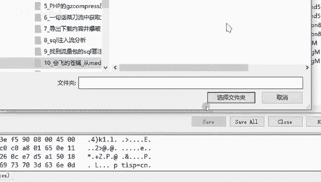


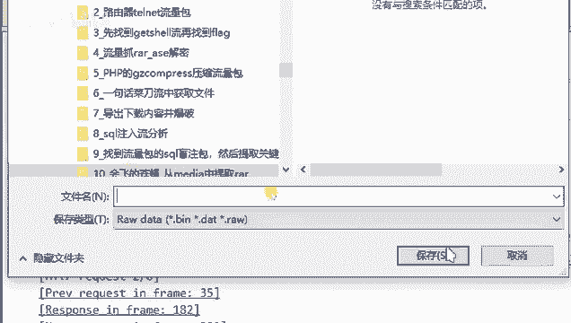

### 基本分析流程

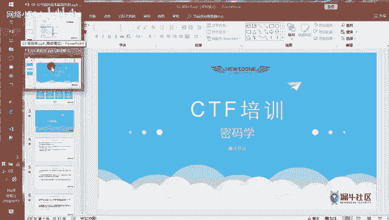

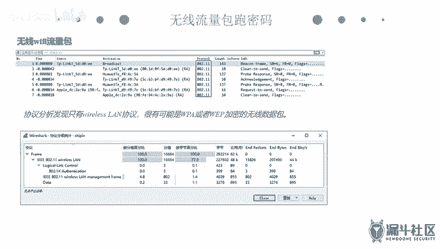

1.  **协议统计**：打开数据包后，点击 `统计` -> `协议分级`，可以快速了解数据包主要由哪些协议构成（如HTTP、TCP、DNS）。这有助于确定分析重点。
2.  **过滤数据包**：Wireshark支持强大的过滤语法，可以快速定位关键数据。
    *   过滤IP：`ip.src == 192.168.1.1` 或 `ip.dst == 192.168.1.1`
    *   过滤端口：`tcp.port == 80`
    *   过滤协议：`http`、`tcp`、`dns`
    *   过滤内容：`http contains “flag”` 或 `tcp contains “key”`（此方法非常实用）
3.  **追踪流**：右键某个数据包，选择 `追踪流` -> `TCP流/HTTP流`，可以重组并查看整个会话的完整内容，Flag或关键信息常隐藏于此。
4.  **导出对象**：对于HTTP、FTP等协议，可以直接导出传输的文件。点击 `文件` -> `导出对象` -> `HTTP...`，可以列出并保存所有通过HTTP传输的文件。
5.  **手动提取数据**：对于非标准协议或需要提取特定字段（如USB流量数据），可以使用 `文件` -> `导出分组字节流` 功能，或使用命令行工具 `tshark` 进行更精确的提取。

**核心命令：tshark提取特定字段**
```bash
tshark -r 流量包.pcap -T fields -e usb.capdata > usbdata.txt
# 此命令将流量包中usb.capdata字段的数据导出到usbdata.txt文件。
```

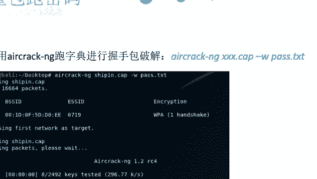

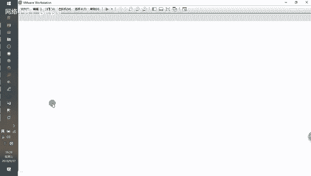

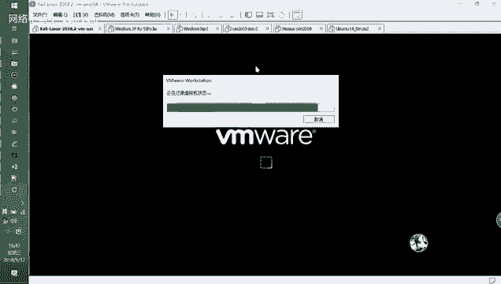

### 特殊流量分析

#### HTTP/S流量

*   **HTTP**：重点关注`GET`/`POST`请求，特别是上传/下载文件的请求。Flag可能直接在报文内容中，也可能是通过Webshell（如“菜刀”流量）执行的命令结果。
*   **HTTPS**：HTTPS流量是加密的。如果题目提供了SSL/TLS的私钥（`.pem`文件），可以在Wireshark的 `编辑` -> `首选项` -> `Protocols` -> `TLS` 中导入密钥，以解密流量。

#### 无线（Wi-Fi）流量

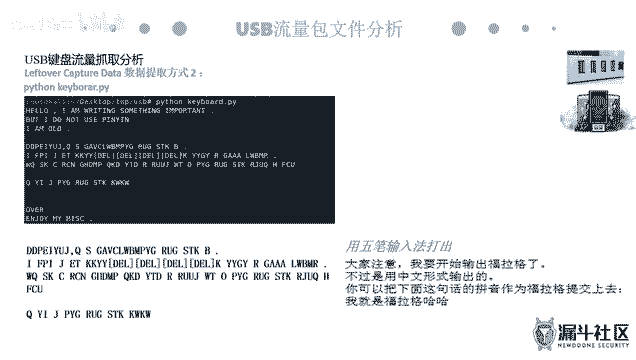

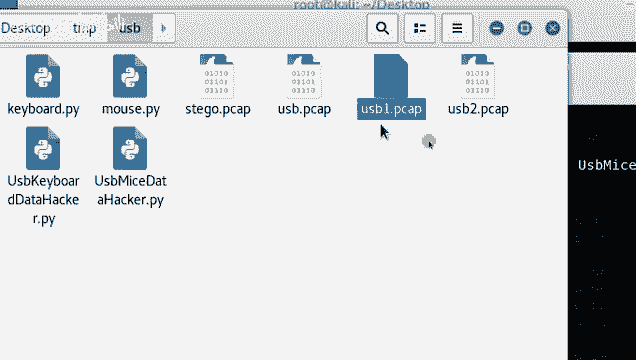

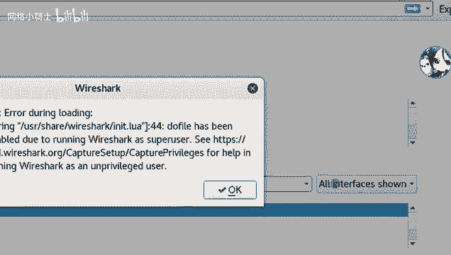

目标是破解WPA/WPA2的握手包以获得Wi-Fi密码。使用`Aircrack-ng`套件。
```bash
# 1. 查看握手包信息
aircrack-ng 无线包.pcap
# 2. 使用字典进行破解
aircrack-ng -w 密码字典.txt 无线包.pcap
```

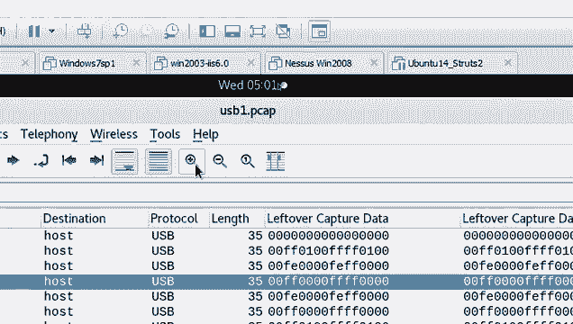

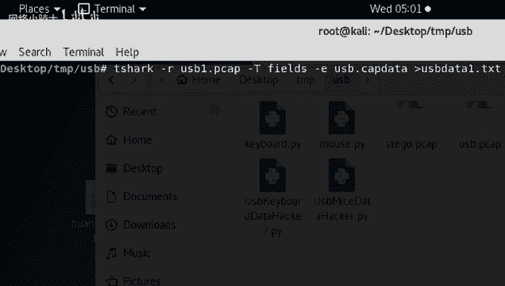

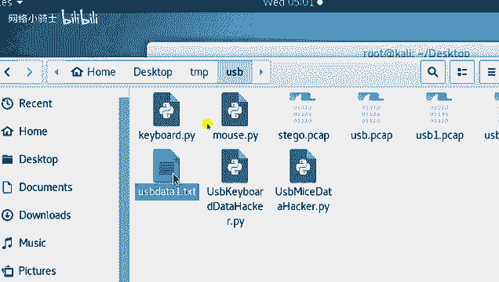

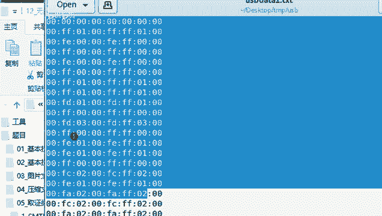

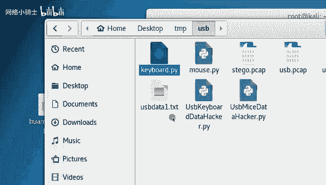

#### USB流量

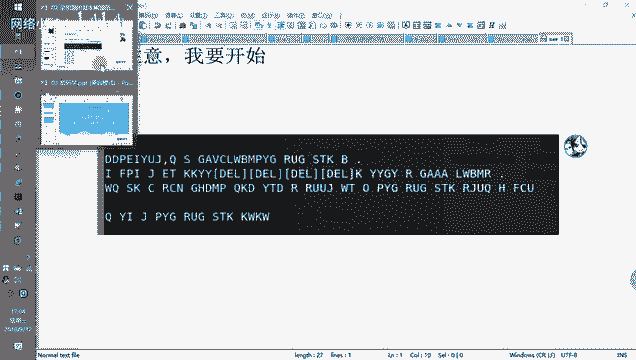

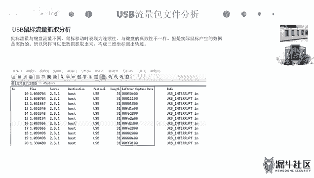

USB流量可能包含键盘击键或鼠标移动数据。
*   **键盘流量**：数据通常为8个字节，其中第3个字节为键值。需要对照USB HID键值表，将捕获的键值数据转换为实际的按键字符。
*   **鼠标流量**：数据通常为4个字节，包含按键状态和X、Y轴的相对移动坐标。通过脚本处理坐标数据，可以绘制出鼠标移动轨迹，轨迹图形可能就是Flag。

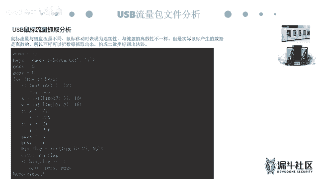

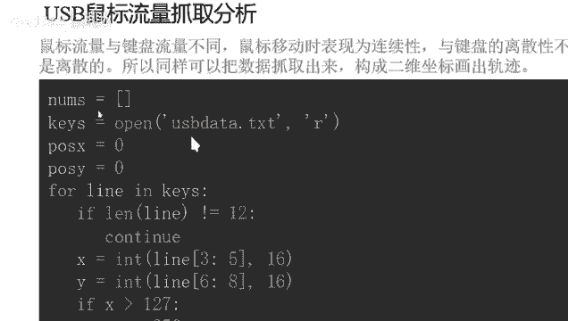

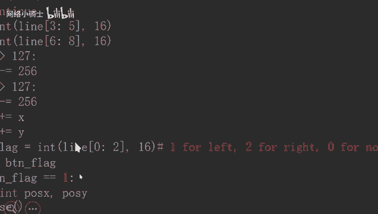

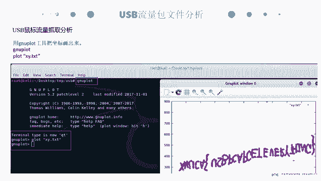

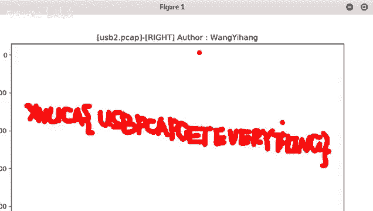

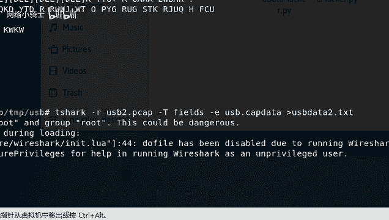

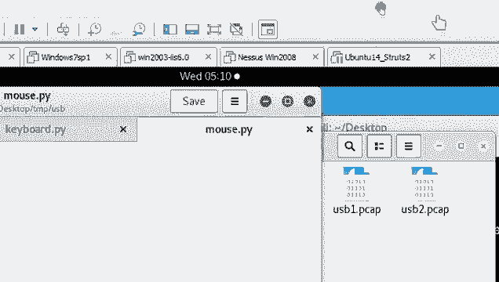

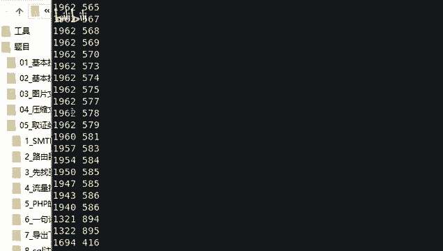

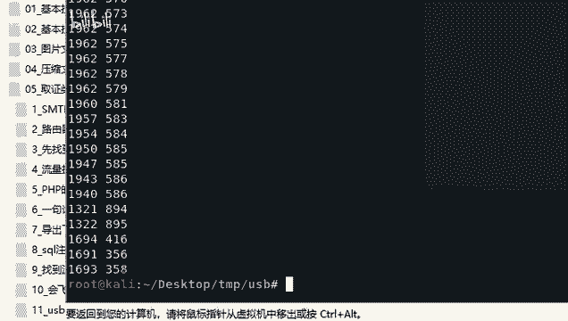

**核心概念：USB数据提取与转换**
1.  使用Wireshark或tshark过滤并导出`usb.capdata`。
2.  编写或使用现有Python脚本，将键值或坐标数据转换为可读字符串或坐标序列。
3.  对于鼠标流量，使用绘图工具（如gnuplot）将坐标序列绘制成图。

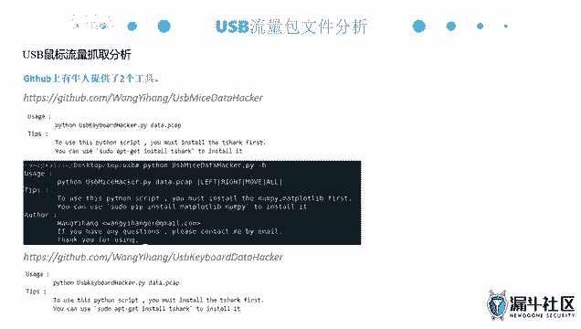

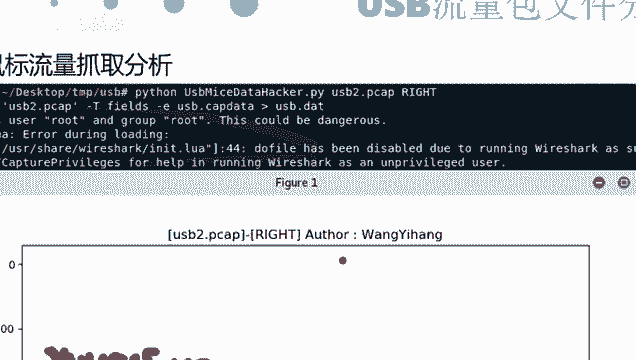

## 总结

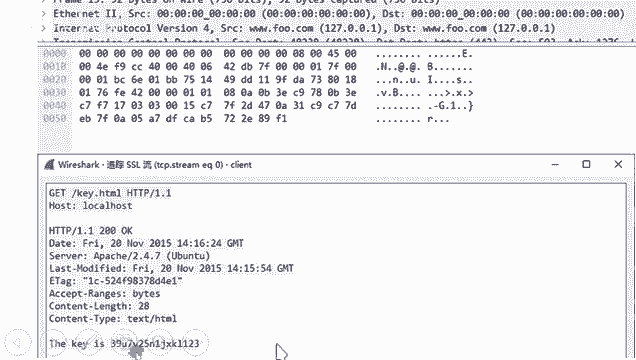

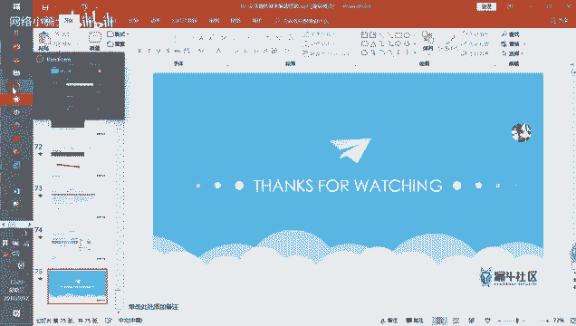

本节课我们一起学习了CTF杂项中压缩文件处理和流量分析取证的核心解题思路。对于压缩包，我们掌握了伪加密修复、密码破解和文件结构修复的方法。对于流量包，我们学习了使用Wireshark进行协议分析、过滤、追踪流和导出对象的基本操作，并深入探讨了HTTP/S、无线和USB等特殊流量的分析技巧。掌握这些技能，你便能应对大多数CTF竞赛中相关的杂项题目。