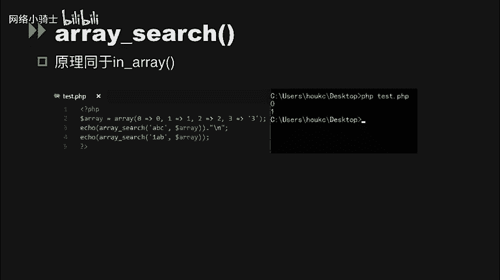
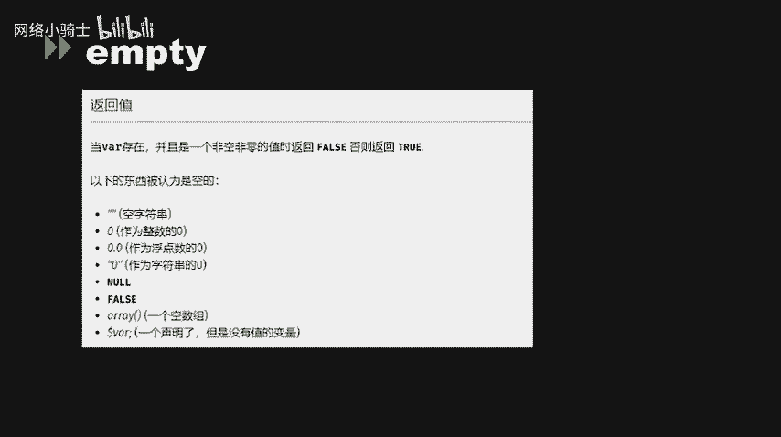
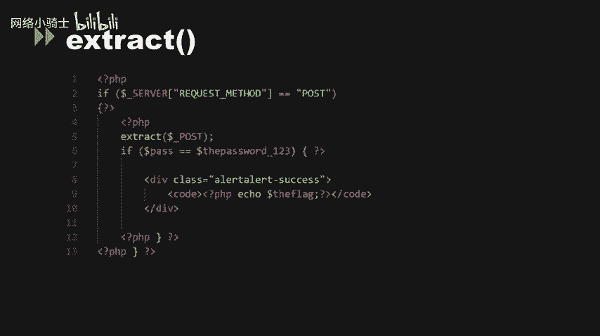
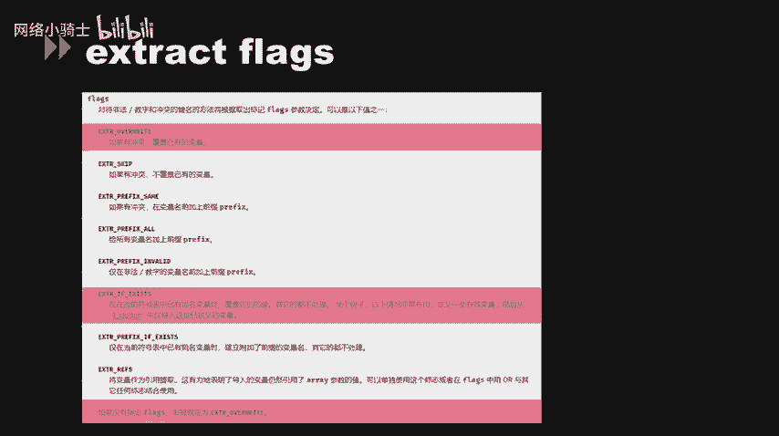
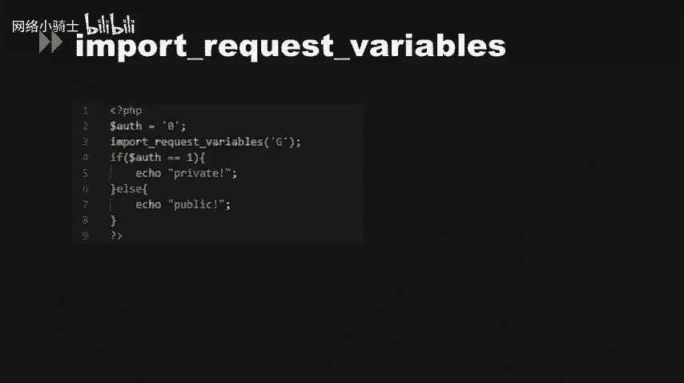

# CTF夺旗赛教程：P50：代码审计_2


在本节课中，我们将学习PHP代码审计中的几个核心概念，包括松散比较的绕过、类型转换问题以及变量覆盖漏洞。这些知识对于理解和解决CTF中的Web类题目至关重要。

## 松散比较与MD5绕过

上一节我们介绍了代码审计的基本概念，本节中我们来看看PHP中松散比较带来的安全问题。

在CTF比赛中，常会遇到使用松散比较（`==`）进行条件判断的题目。松散比较在比较前会尝试进行类型转换，这可能被攻击者利用。

以下是利用MD5函数缺陷绕过松散比较的几种情况：

1.  **哈希缺陷绕过**：当代码要求两个参数不相等但MD5值相等时，可以利用MD5函数处理数组时的特性。因为`md5(array())`会返回`NULL`，所以传入两个不同的数组，它们的MD5值在松散比较下都等于`NULL`，从而满足条件。
    ```php
    // 示例：$a != $b 但 md5($a) == md5($b)
    // Payload: a[]=1&b[]=2
    // md5($_GET['a']) 和 md5($_GET['b']) 均返回 NULL， NULL == NULL 成立。
    ```



2.  **MD5碰撞**：当代码要求两个不同的参数，其MD5值必须严格相等（`===`）时，上述方法失效。此时需要使用MD5碰撞，即找到两个不同的明文，但它们的MD5哈希值完全相同。这可以通过“选择前缀碰撞”攻击实现，网络上可以找到现成的碰撞字符串对。
    ```php
    // 示例：$a !== $b 但 md5($a) === md5($b)
    // 使用已知的MD5碰撞字符串对，例如：
    $str1 = "4dc968ff0ee35c209572d4777b721587d36fa7b21bdc56b74a3dc0783e7b9518afbfa200a8284bf36e8e4b55b35f427593d849676da0d1555d8360fb5f07fea2";
    $str2 = "4dc968ff0ee35c209572d4777b721587d36fa7b21bdc56b74a3dc0783e7b9518afbfa200a8284bf36e8e4b55b35f427593d849676da0d1555d8360fb5f07fea2";
    // 这两个十六进制字符串的原始二进制数据不同，但MD5值相同。
    ```

## 类型转换相关问题



理解了比较的漏洞后，我们再来看看PHP中其他因类型转换引发的安全问题。

以下是几个需要关注的函数和行为：

*   **`switch`语句**：`switch`在进行比较时是松散比较。如果传入字符串，PHP会尝试将其转换为整数。例如，`switch(“2abc”)`会将字符串`“2abc”`强转为整数`2`，然后跳转到`case 2`的分支。
*   **`is_numeric`函数**：该函数会判断变量是否为数字或数字字符串。它也会将十六进制格式（如`0x…`）的字符串判断为数字。如果这个值未经妥善处理直接进入SQL语句，可能引发安全问题。
    ```php
    // 示例
    $id = $_GET[‘id‘]; // 用户输入 0x31
    if (is_numeric($id)) { // 判断为 true
        $sql = “SELECT * FROM users WHERE id = $id“; // SQL: ... WHERE id = 0x31
        // 在某些数据库（如MySQL）中，0x31会被解析为字符 ‘1‘，可能造成非预期的查询。
    }
    ```
*   **`in_array`与`array_search`函数**：这两个函数在默认情况下（未设置`$strict`参数为`true`）使用松散比较。在数组中搜索字符串时，字符串会被强制转换为整数进行匹配，可能导致逻辑绕过。
    ```php
    // 示例
    $array = array(0, 1, 2, 3);
    $input = “abc“;
    if (in_array($input, $array)) { // “abc“ 被强转为 0，匹配 $array[0]，返回 true
        // 条件成立，可能被绕过
    }
    ```
*   **`empty`、`isset`、`strpos`函数**：这些函数对输入`“0“`（字符串0）的返回值可能出乎意料。例如，`empty(“0“)`返回`true`，`strpos(“abc“, “a“)`返回`0`（索引位置），在条件判断中`0 == false`成立。如果代码编写不严谨，可能被利用。

## 变量覆盖漏洞 🚩

变量覆盖是PHP代码审计中一类常见的高危漏洞，它允许攻击者控制程序中的变量值。

以下是几种典型的变量覆盖场景：

1.  **双美元符号（`$$`）变量变量**：使用`$$`可以将一个变量的值作为另一个变量的变量名。如果这个值来自用户输入且未过滤，就会导致变量覆盖。
    ```php
    // 示例
    foreach ($_GET as $key => $value) {
        $$key = $value; // 危险操作
    }
    // 如果请求 ?name=admin，则变量 $name 被创建并赋值为 “admin“。
    // 如果请求 ?flag=1，则变量 $flag 被创建并赋值为 “1“。
    ```



2.  **`extract`函数**：该函数从数组中将键值对导入到当前符号表，键名作为变量名，键值作为变量值。这是最典型的变量覆盖函数。
    ```php
    // 示例
    $size = “large“;
    extract($_GET); // 覆盖来自用户输入
    echo $size; // 如果请求 ?size=small，此处将输出 small
    ```
    `extract`函数的行为受其第三个参数`$flags`控制。默认情况下（未指定或为`EXTR_OVERWRITE`），它会覆盖已有的同名变量，从而产生漏洞。



3.  **`parse_str`函数**：该函数将查询字符串解析到变量中，功能类似于`extract`。
    ```php
    // 示例
    parse_str($_SERVER[‘QUERY_STRING‘]); // 危险操作
    // 请求 /test.php?id=123&flag=yes
    // 将导致变量 $id 和 $flag 被创建或覆盖。
    ```

4.  **`import_request_variables`函数（已废弃）**：在早期PHP中，该函数用于将GET、POST、Cookie变量导入全局作用域。如果`register_globals`配置关闭，程序员可能用此函数“恢复”全局变量注册功能，从而引入变量覆盖风险。
    ```php
    // 示例
    import_request_variables(‘G‘); // 导入GET变量
    // 请求 /test.php?admin=1
    // 将导致全局变量 $admin 被创建并赋值为 1。
    ```

**利用变量覆盖解题示例**：
假设题目代码如下：
```php
$flag = ‘xxx‘; // 真实flag
$token = ‘secret‘;
extract($_POST);
if ($token === ‘secret‘) {
    echo $flag;
}
```
攻击者可以通过POST请求提交`token=secret`，`extract($_POST)`会覆盖原有的`$token`变量，使其值变为`secret`，从而通过检查输出`$flag`。
Payload: `POST: token=secret`

## 总结

本节课中我们一起学习了PHP代码审计中的几个关键点：
1.  **松散比较（`==`）** 和 **MD5函数** 的特性可能被用于绕过条件判断，包括利用数组返回`NULL`和MD5碰撞。
2.  PHP的**自动类型转换**在`switch`、`is_numeric`、`in_array`等函数或语句中可能引发非预期的逻辑，导致安全绕过。
3.  **变量覆盖漏洞** 是一类高危漏洞，主要由`$$`、`extract()`、`parse_str()`等函数不当使用引起，允许攻击者控制程序变量，从而篡改逻辑、绕过认证或直接获取敏感数据。




理解这些原理是进行有效代码审计和解决CTF Web挑战的基础。在实战中，需要仔细阅读代码，寻找这些模式的出现点。