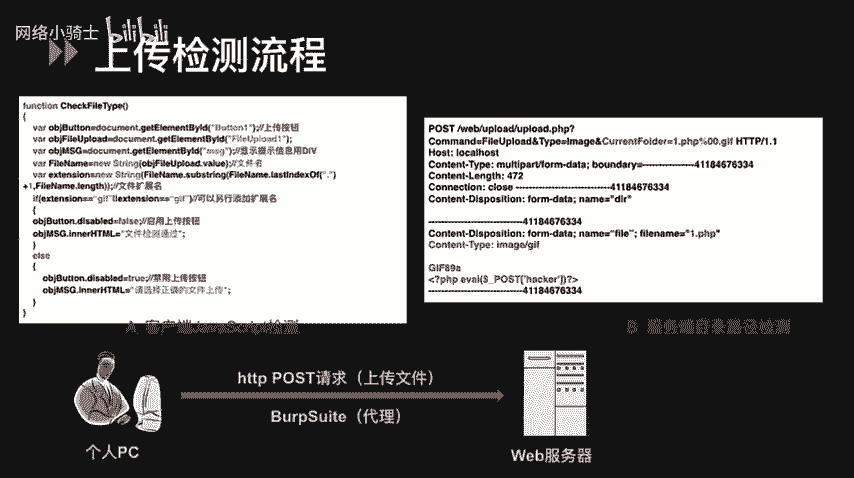
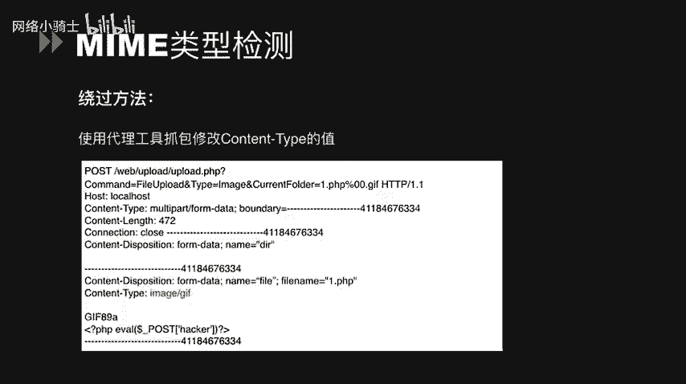
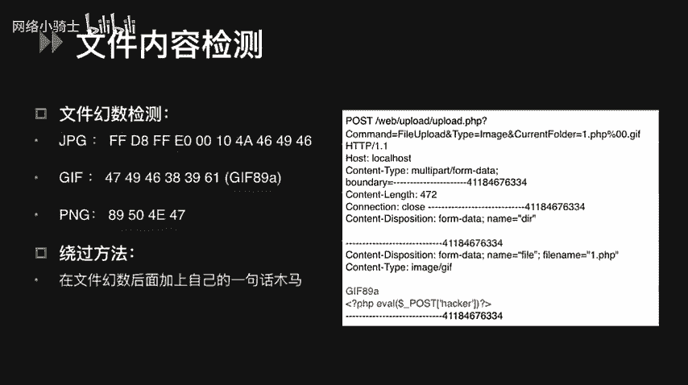
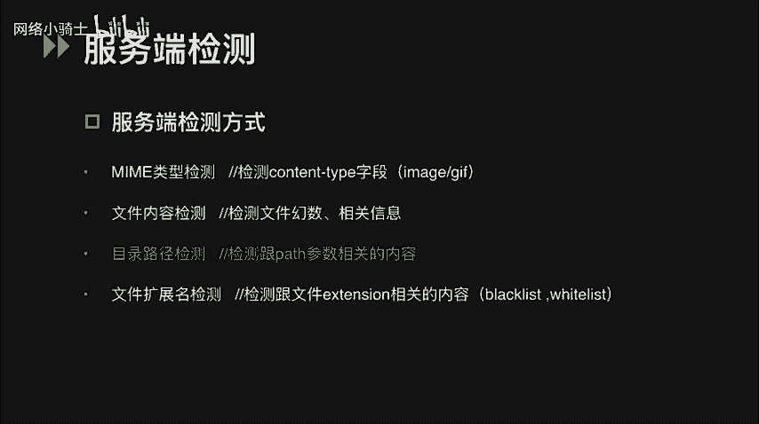
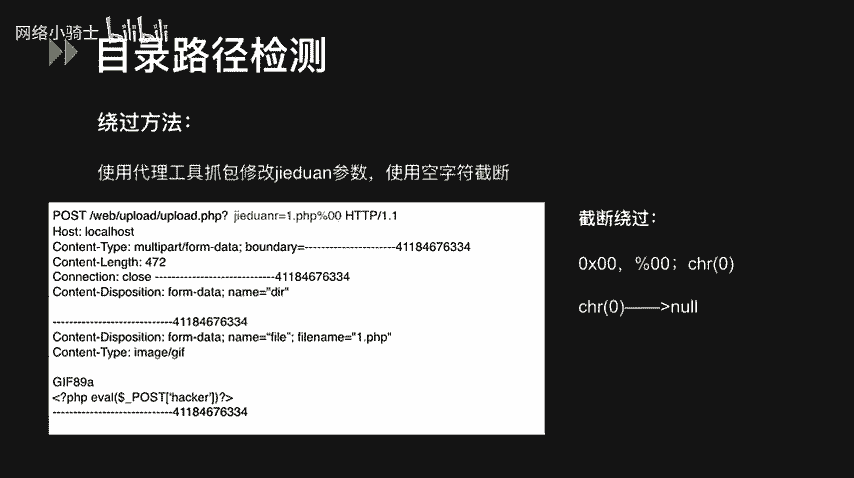
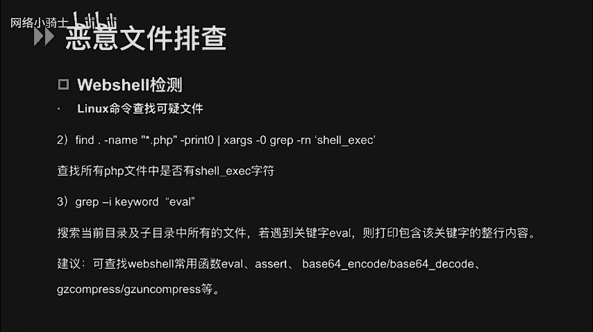
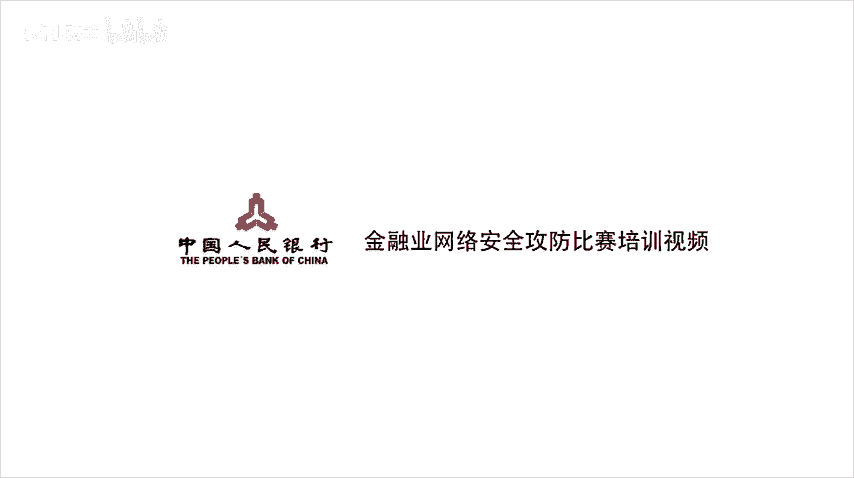

# CTF夺旗赛教程：P51：文件上传漏洞详解 🚩

## 概述
在本节课中，我们将学习CTF比赛中常见的“文件上传”题型。这类题目通常要求选手上传一个文件到服务器，如果上传成功，服务器可能会返回一个flag值，或者在“混战”模式下，通过上传一个特殊的“木马”文件来获取服务器权限，进而找到flag。本节课将系统讲解文件上传漏洞的原理、检测方式及绕过方法。


---

## 什么是文件上传漏洞？🔍
在Web应用程序中，文件上传功能非常普遍，例如允许用户上传头像、文档或图片。如果程序对用户上传的文件类型没有进行严格限制或限制被攻击者绕过，就可能产生文件上传漏洞。

如果攻击者成功上传了恶意文件（例如Web Shell），就可能获取网站服务器的操作权限。这可能导致网站被完全控制，攻击者可以执行编辑网页、上传/下载文件、查看数据库甚至执行任意系统命令等操作。

---

## 什么是Web Shell？🐚
Web Shell，常被称为“网页木马”或“后门工具”，是一段被上传到服务器并允许攻击者远程执行命令的恶意脚本。

以下是一个典型的PHP一句话木马示例：
```php
<?php @eval($_POST['c']); ?>
```
这段代码的含义是：通过`eval()`函数执行通过POST请求传递的参数`c`的值。攻击者只需发送一个POST请求，其中`c`参数值为想要执行的PHP命令，即可在服务器上执行任意操作。

例如，如果设置`c=phpinfo();`，服务器将执行`phpinfo()`函数，并返回包含服务器敏感信息的页面。



---

## 文件上传检测流程 📂
文件从客户端上传到服务器的过程中，可能会经历一次或多次安全性校验。检测通常发生在两个位置：**客户端**和**服务器端**。

### 客户端检测
客户端检测通常由网页中的JavaScript代码实现，最常见的是在文件选择后、正式上传前，检查文件的扩展名是否合法。

以下是一段客户端JS检测文件扩展名的示例代码：
```javascript
// 示例：只允许上传 .gif 文件
if (!filename.endsWith('.gif')) {
    alert('只允许上传GIF文件！');
    return false;
}
```
**如何判断是客户端检测？**
1.  在选择文件后、点击上传按钮前，浏览器就弹出错误提示（如“只允许上传某类文件”）。
2.  通过配置HTTP代理工具（如Burp Suite）进行抓包。如果选择了文件但未点击上传时，代理工具没有收到任何网络请求，则说明是纯客户端检测。

**绕过客户端检测的方法：**
以下是两种常见的绕过方式：
1.  **抓包修改**：配置代理工具（如Burp Suite）拦截上传请求，将通过客户端检测的合法文件名（如 `shell.jpg`）修改为恶意文件名（如 `shell.php`）。
2.  **禁用或修改JS**：使用浏览器开发者工具或插件（如Firefox的Firebug）查看并修改上传页面的源代码，直接禁用或篡改负责检测的JavaScript函数。

---

## 服务端检测与绕过 🛡️
文件请求到达服务器后，服务器端会进行更严格的检测。在讲解具体检测方式前，需要了解PHP中用于处理上传文件的 `$_FILES` 对象。该对象包含上传文件的信息，例如：
*   `$_FILES['file']['name']`：客户端文件的原名称。
*   `$_FILES['file']['type']`：文件的 MIME 类型。
*   `$_FILES['file']['tmp_name']`：文件被上传后在服务器储存的临时文件名。



服务端的检测方式主要有以下四种，我们将逐一讲解其原理和绕过方法。

### 1. MIME类型检测
MIME类型描述了文件的媒体格式。服务器通过检查HTTP请求头中的 `Content-Type` 字段来判断文件类型。

**检测代码示例：**
```php
if ($_FILES['file']['type'] != 'image/jpeg') {
    die('只允许上传JPEG图片！');
}
```
这段代码使用 `$_FILES` 对象的 `type` 属性来读取文件类型，并判断是否为 `image/jpeg`。



**绕过方法：**
使用代理工具拦截上传请求，将请求头中的 `Content-Type` 字段修改为服务器允许的类型（如 `image/jpeg`），即使实际文件是 `shell.php`。

---



### 2. 文件内容检测
服务器会检查文件的实际内容，而不仅仅是文件名或类型。主要有两种方式：

**A. 文件幻数检测**
“幻数”是位于文件开头的一串字节，用于标识文件格式。例如，GIF文件以 `GIF89a` 开头，ZIP文件以 `PK` 开头。

**绕过方法：**
在合法文件（如图片）的幻数之后，直接插入恶意代码。例如，在一个GIF文件的 `GIF89a` 标识后，添加PHP一句话木马代码。这样文件既能通过幻数检测，又能被服务器当作PHP脚本解析。

**B. 文件相关信息检测**
服务器可能检测图片的尺寸、大小等属性。

**绕过方法：**
先准备一个结构完整的合法文件（如图片），然后通过代码注入的方式将恶意代码写入文件，同时确保文件大小、尺寸等属性符合检测要求。通常，直接对一个结构完整的文件进行代码注入再上传即可。

---



### 3. 目录路径检测
这种检测与文件上传后的保存路径有关，漏洞常出现在路径拼接环节。

**漏洞代码示例：**
```php
$temp_name = $_FILES['file']['tmp_name'];
$target_path = "/uploads/" . $_GET['save_path'] . $_FILES['file']['name'];
move_uploaded_file($temp_name, $target_path);
```
这段代码中，`move_uploaded_file()` 函数用于将临时文件移动到最终路径 `$target_path`。漏洞在于 `$target_path` 中包含了用户可控的 `$_GET['save_path']` 变量。

**绕过方法（空字节截断）：**
在HTTP请求的参数中，利用空字节（`%00`, `\x00`, `\x20`）来截断路径。例如，设置 `save_path=shell.php%00`，服务器在处理时，`%00` 后的内容会被截断。如果程序原本想添加 `.jpg` 后缀，最终路径可能变成 `/uploads/shell.php`，从而绕过扩展名限制。
*   `%00`：URL编码的空字符。
*   `\x00`：十六进制表示的空字符。
*   `\x20`：ASCII码为32的字符（空格），在某些环境下也能起到截断作用。

---

### 4. 扩展名检测
这是最常见的检测方式，分为**黑名单**和**白名单**两种策略。

**黑名单检测：**
服务器有一个禁止上传的扩展名列表（如 `.php`, `.jsp`, `.asp`）。

**绕过黑名单的方法：**
以下是几种常见的绕过思路：
*   **使用冷门后缀**：尝试使用黑名单未收录的、但服务器仍会解析的后缀，如 `.php5`, `.phtml`, `.phps`。
*   **利用服务器特性**：
    *   **IIS服务器**：默认支持解析 `.asa`, `.cer`, `.cdx` 等后缀。
    *   **大小写混淆**：尝试 `.Php`, `.pHp` 等。
    *   **特殊文件名**：在Windows系统下，可以上传 `shell.php.`（末尾加点）或 `shell.php `（末尾加空格）。系统会自动去除点或空格，但文件仍被保存为 `shell.php`。**注意**：此方法仅适用于Windows服务器。
*   **空字节截断**：同目录路径检测中的方法，如 `shell.php%00.jpg`。

**白名单检测：**
服务器只允许上传指定扩展名的文件（如只允许 `.jpg`, `.png`, `.gif`）。这种方式比黑名单更安全。

**绕过白名单的方法：**
白名单很难直接绕过，通常需要结合**服务器解析漏洞**或**配置错误**。以下是一些特殊姿势：
*   **配合解析漏洞**：上传一个符合白名单的文件（如 `shell.jpg`），但利用服务器漏洞使其被当作脚本执行（见下文“解析漏洞”部分）。
*   **`.htaccess`文件攻击（仅限Apache）**：如果服务器是Apache，且允许上传 `.htaccess` 文件，攻击者可以上传一个自定义的 `.htaccess` 文件，内容如下：
    ```
    AddType application/x-httpd-php .jpg
    ```
    这段配置会让服务器将所有 `.jpg` 文件都当作PHP脚本来解析。之后，再上传一个内容为木马的 `shell.jpg` 文件即可。

---

## 服务器解析漏洞 ⚙️
除了应用程序本身的检测逻辑，Web服务器（中间件）的解析特性也可能被利用。

### IIS解析漏洞
*   **目录解析（IIS 6.0）**：如果目录名包含 `.asp`、`.asa`、`.cer`，则该目录下的**所有文件**都会被IIS当作ASP脚本来解析。例如，上传 `shell.jpg` 到 `/upload/asp/` 目录，访问 `/upload/asp/shell.jpg` 时，该文件会被执行。
*   **分号解析（IIS 6.0）**：在文件名后加上分号 `;`，例如 `shell.asp;.jpg`。IIS默认不解析分号后的内容，因此该文件会被当作 `shell.asp` 执行。
*   **默认扩展名**：IIS默认会解析 `.asa`, `.cer`, `.cdx` 等文件。

### Apache解析漏洞
*   **从右向左解析**：Apache解析文件时，从右向左识别扩展名，直到遇到可识别的扩展名为止。例如，上传文件 `shell.php.owf.rar`，Apache不认识 `.owf` 和 `.rar`，最终会将其解析为 `.php` 文件。
*   **配置错误**：
    *   **配置一**：在 `httpd.conf` 中添加 `AddHandler php5-script .php`。这会导致任何包含 `.php` 字符串的文件名都被当作PHP执行，例如 `test.php.jpg`。
    *   **配置二**：在 `httpd.conf` 中添加 `AddType application/x-httpd-php .jpg`。这会导致所有 `.jpg` 文件都被当作PHP脚本执行。

### Nginx解析漏洞
在特定配置下（PHP以CGI模式运行），Nginx存在解析漏洞。
**利用方式**：访问 `http://target.com/upload/shell.jpg/.php`。如果 `shell.jpg` 中包含PHP代码，且 `shell.jpg/.php` 这个文件不存在，Nginx会错误地将 `shell.jpg` 交给PHP-CGI解析，从而执行其中的代码。

---

## 如何排查Web Shell？🔎
作为防御方或进行安全检查时，需要能够发现服务器上已存在的Web Shell。

可以使用以下Linux命令进行排查：
1.  **查找近期被修改的PHP文件**：
    ```bash
    find /var/www/html -name "*.php" -mmin -5
    ```
    这条命令查找 `/var/www/html` 目录下，最后5分钟内被修改过的所有PHP文件。
    *   `-mmin` 基于修改时间。
    *   `-amin` 基于访问时间。
    *   `-cmin` 基于属性变更时间。

2.  **在文件中搜索特定函数**：
    ```bash
    grep -r "eval($_POST" /var/www/html --include="*.php"
    ```
    这条命令递归搜索 `/var/www/html` 目录下所有PHP文件中是否包含 `eval($_POST` 字符串（一句话木马特征）。

3.  **搜索常见危险函数**：
    ```bash
    grep -r -i "eval\|assert\|base64_decode\|shell_exec" /var/www/html
    ```
    这条命令递归搜索目录下所有文件，不区分大小写地查找包含 `eval`、`assert`、`base64_decode`、`shell_exec` 等危险函数的关键字。

---

## 总结
本节课我们一起深入学习了CTF中文件上传漏洞的方方面面：
1.  **理解了漏洞本质**：由于对上传文件限制不严，导致恶意文件被上传并执行。
2.  **掌握了检测流程**：分为**客户端JS检测**和**服务端检测**（MIME类型、文件内容、目录路径、扩展名）。
3.  **学习了多种绕过方法**：针对不同检测方式，我们学习了抓包修改、空字节截断、黑名单/白名单绕过、特殊文件名、`.htaccess`攻击等技巧。
4.  **了解了服务器解析漏洞**：熟悉了IIS、Apache、Nginx等中间件特有的解析漏洞，这些漏洞常与上传功能结合利用。
5.  **知晓了排查方法**：作为补充，了解了几条用于在服务器上查找可疑Web Shell的Linux命令。





文件上传漏洞是Web安全中非常经典且危险的一类漏洞，掌握其原理和攻防技巧对于CTF比赛和实际安全评估都至关重要。