# CTF夺旗赛教程：P5：密码学下半部分 🔐

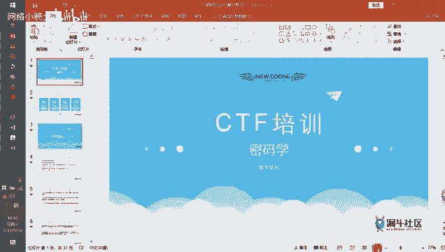


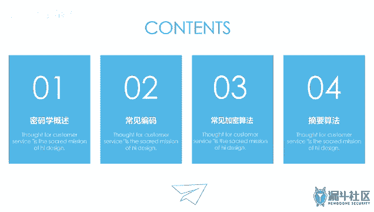


在本节课中，我们将继续学习CTF竞赛中的密码学知识。上一节我们介绍了密码学的概述和基本概念，本节中我们来看看几种常见的编码方式、加密算法以及摘要算法。内容将尽可能简单直白，让初学者能够看懂。

## 密码学概述与发展 🔍

密码学的发展经历了古典、近代和现代三个阶段。CTF题目中，古典密码和近代密码的题目较为常见，而现代密码的题目通常难度较大，因为现代加密算法具有更强的不可逆性。

编码和加密是两个不同的概念。编码更像是一种映射关系，例如自己创造一套符号来代表特定含义。而加密则涉及更复杂的算法，旨在混淆数据，使其难以被识别。

加密算法主要分为两类：对称密钥算法和非对称密钥算法。

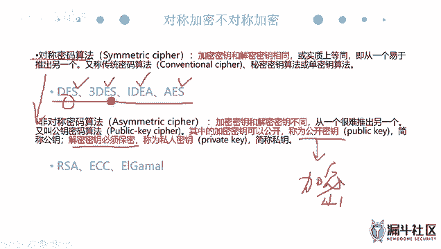

*   **对称密钥算法**：加密和解密使用同一个密钥。其特点是加密效率高。常见的算法包括DES、3DES、IDEA和AES。其中，AES被认为是目前最强的对称加密算法。
    *   **公式/代码示例**：`密文 = encrypt(明文, 密钥)`；`明文 = decrypt(密文, 密钥)`
*   **非对称密钥算法**：使用一对密钥，即公钥和私钥。公钥用于加密，可以公开；私钥用于解密，必须保密。这种算法更安全，但加密效率较低。RSA是最常见的非对称加密算法。
    *   **公式/代码示例**：`密文 = encrypt(明文, 公钥)`；`明文 = decrypt(密文, 私钥)`

此外，还有一种**摘要算法**（或称哈希算法），如MD5和SHA系列。它用于验证数据的完整性，其特点是输入数据的微小变化会导致输出结果的巨大差异，并且过程不可逆。

## 常见编码方式 📝

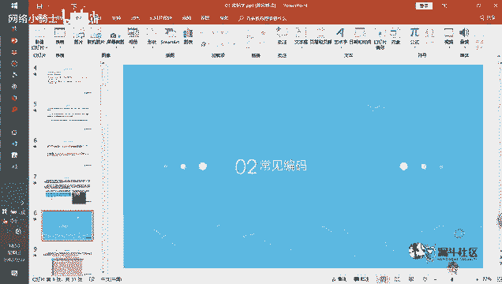

以下是几种在CTF中常见的编码方式及其特点。

### ASCII码

ASCII码是最早的计算机编码标准，最初只有128个字符（7位），后来扩展为256个字符（8位）。它主要包含英文字母、数字和常见符号。

*   **特点**：每个字符对应一个十进制数字（如‘A’对应97）。
*   **工具**：可使用“小葵多功能转换工具”或在线网站进行编码/解码。
*   **Python示例**：
    ```python
    # 字符转ASCII码
    ascii_value = ord('A')  # 输出: 97
    # ASCII码转字符
    character = chr(97)     # 输出: 'A'
    ```

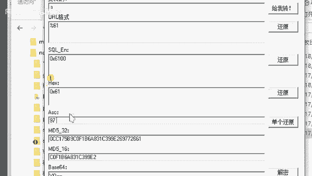

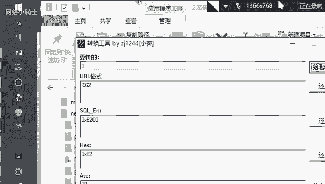

### Base64编码

Base64编码是一种基于64个可打印字符来表示二进制数据的方法。

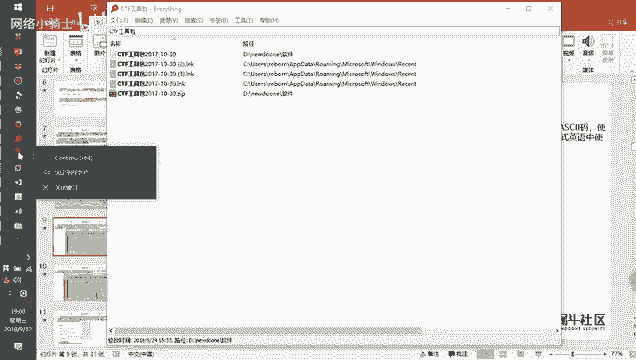

*   **原理**：将每3个8位字节的数据转换为4个6位字节，然后在每个6位字节前补两个0，形成4个8位字节。
*   **特点**：编码后的数据长度会增加约1/3，末尾常带有`=`或`==`作为填充标志。
*   **工具**：浏览器开发者工具、在线解密网站或CTF工具包中的工具均可解码。

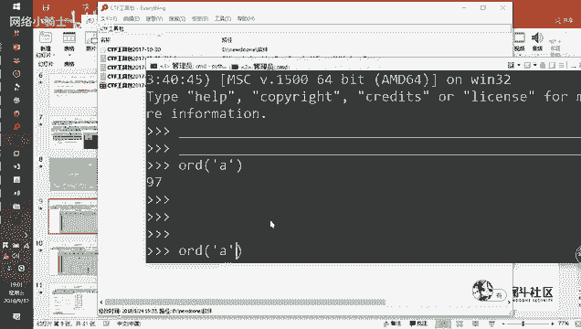

### URL编码

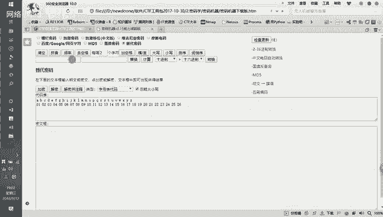

URL编码（百分号编码）主要用于将URL中的特殊字符转换为安全传输的格式。

*   **原理**：将字符的ASCII码转换为十六进制，并在前面加上百分号`%`。
*   **特点**：编码后的字符串中包含大量`%`符号。
*   **工具**：浏览器地址栏、开发者工具或在线工具均可方便地进行编解码。

### Unicode编码

Unicode编码旨在为全世界所有字符提供统一的编码方案。

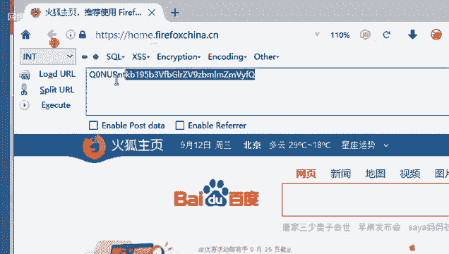

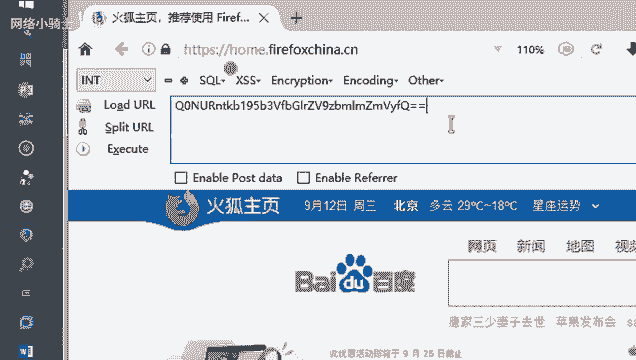

*   **特点**：使用16位（2字节）表示一个字符，范围远大于ASCII码。编码形式常为`\uXXXX`（例如`\u0041`代表‘A’）。
*   **工具**：支持Unicode的文本编辑器或在线转换工具可以处理。

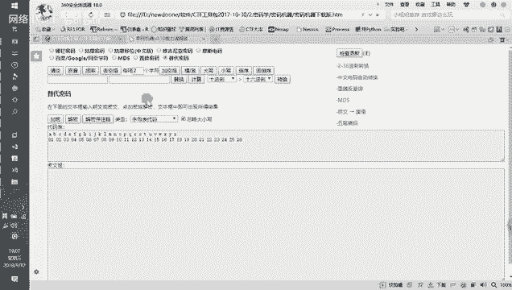

### JavaScript混淆

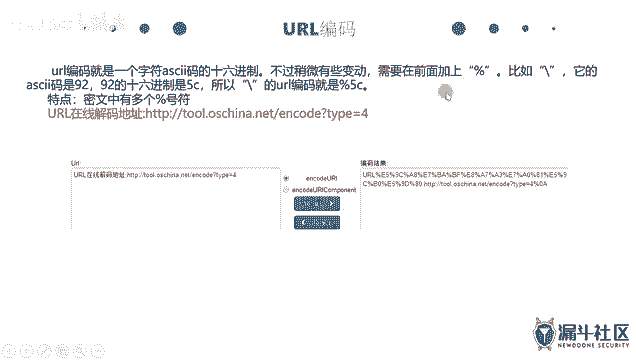

JavaScript混淆不是严格意义上的编码，而是一种保护前端代码的技术。

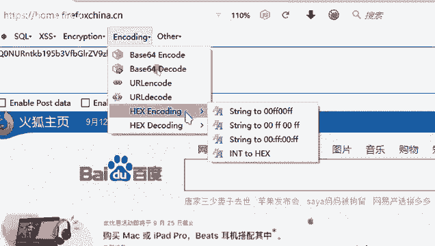

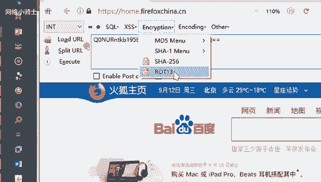

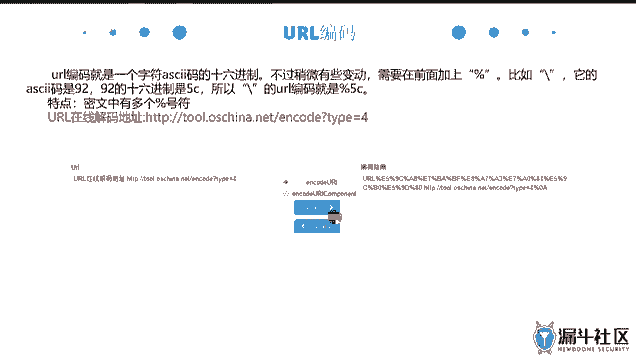

*   **特点**：将可读的JavaScript代码转换为难以直接阅读的形式，如将字符串转换为十六进制（`\x41`）或Unicode形式。
*   **解密**：通常可以直接将混淆后的代码粘贴到浏览器控制台中执行，即可看到原始效果或输出。

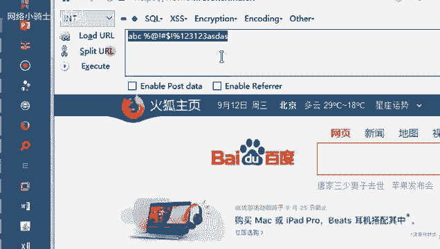

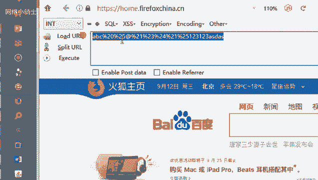

## 工具与资源 🛠️

在CTF比赛中，熟练使用工具至关重要。以下是推荐的资源：

1.  **离线工具包**：如提供的CTF工具包，内含“小葵多功能转换工具”、“密码机器”等，无需联网即可使用。
2.  **在线解密网站**：例如 `ctf.ssleye.com` 或 `www.cryptool.org`，集成了多种编码和加密算法的在线工具。
3.  **浏览器开发者工具**：内置的编码/解码功能（如Base64、URL编解码）非常便捷。
4.  **学习资料**：建议阅读《编码学的故事》等文章，有助于理解计算机编码的来龙去脉。

## 总结 📚

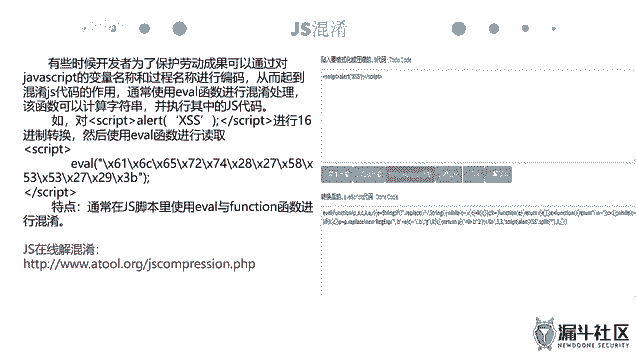

本节课中我们一起学习了CTF密码学的下半部分内容。我们回顾了密码学的发展，区分了编码与加密的概念，并重点介绍了对称加密、非对称加密以及摘要算法。随后，我们详细探讨了ASCII、Base64、URL、Unicode等常见编码方式的特点、识别方法和解密工具，也简要了解了JavaScript混淆。掌握这些基础知识和工具的使用，是解开CTF中密码学题目的第一步。记住，多练习、多使用工具是提升解题能力的关键。