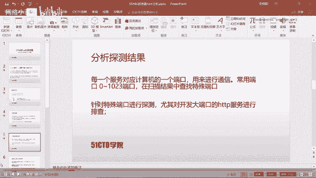
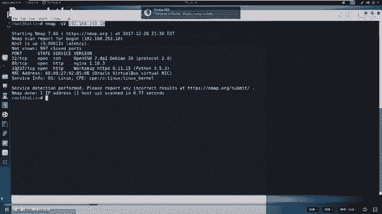
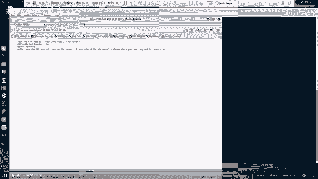
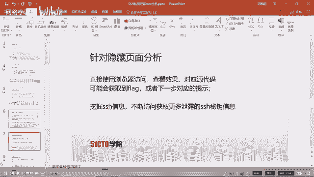
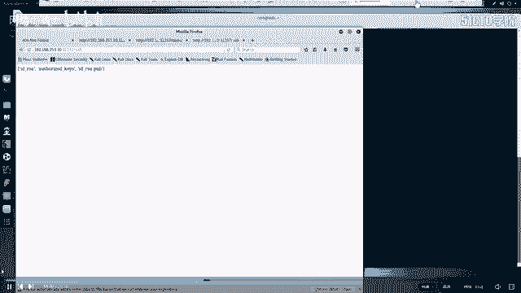
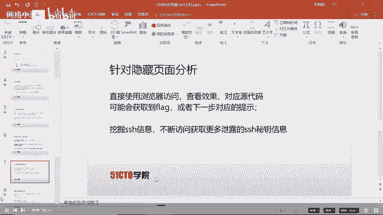
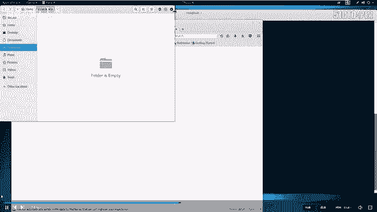
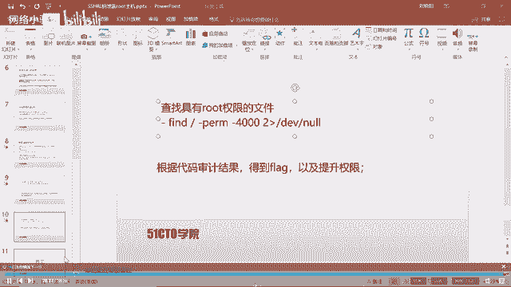
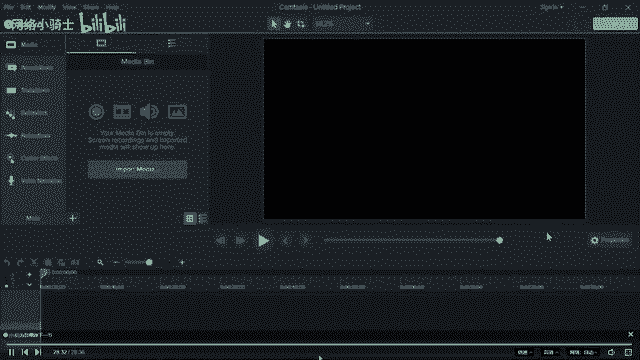

# CTF夺旗赛教程：P6：SSH私钥泄露

## 概述
在本节课中，我们将学习CTF比赛中一种常见漏洞类型：SSH私钥泄露。我们将从一个给定的IP地址开始，通过信息收集、服务探测、文件发现，最终利用泄露的私钥登录目标主机，并尝试提升权限以获取最终的flag。

---

## CTF比赛环境介绍
在深入学习具体技术之前，我们先了解一下CTF比赛的常见环境设置。理解环境有助于我们制定正确的攻击策略。

CTF比赛环境主要分为两种：

1.  **局域网环境**：攻击机和靶场机器位于同一局域网。选手通过Web方式访问一台预置的攻击机（通常是Kali Linux），并使用这台攻击机对靶场进行测试。选手通常无需自带设备。
2.  **自带设备环境**：比赛方只提供一个网络接口。选手需要自备个人电脑（PC）及所有必要的渗透测试工具。选手的设备可以连接互联网查询资料，目标是直接攻击举办方提供的靶场机器IP地址。

无论哪种环境，最终目的都是渗透靶场机器，获取flag值。

---

## 实验环境与目标
上一节我们介绍了比赛环境，本节我们来看看本次课程的具体实验设置。

*   **攻击机 (Kali Linux) IP**: `192.168.253.12`
*   **靶场机器 IP**: `192.168.253.10`

我们的目标是获取靶场机器上的flag。

---

## 信息收集：端口与服务探测
拿到目标IP后，第一步永远是信息收集。我们需要知道目标开放了哪些服务，这些服务就是潜在的突破口。



我们使用 `nmap` 工具进行端口扫描和服务识别。



```bash
nmap -sV 192.168.253.10
```

扫描结果显示靶机开放了以下关键服务：
*   SSH服务 (端口 22)
*   HTTP服务 (端口 80)
*   另一个HTTP服务 (端口 31337)



在计算机中，每个服务都对应一个端口（0-65535）。知名服务通常使用0-1023端口，例如HTTP(80)、SSH(22)。我们的扫描发现了不常见的端口31337，这通常需要重点关注。

---

## 深入探测：Web服务分析
既然发现了不常见的HTTP服务（端口31337），我们自然要优先对其进行深入分析。对于Web服务，最直接的探测方式就是使用浏览器访问。

我们访问 `http://192.168.253.10:31337`。页面没有直接显示有用信息。在CTF中，网页源代码常常隐藏线索。



我们查看页面源代码，但依然没有发现flag。这时，我们需要探测该Web目录下是否存在隐藏文件或目录。

以下是探测Web目录隐藏内容的常用命令：

```bash
dirb http://192.168.253.10:31337/
```

`dirb` 扫描结果显示了几个有趣的条目：
*   `/robots.txt`
*   `/.ssh/`



---



## 文件发现与初步利用
`dirb` 工具帮助我们发现了潜在的关键文件，接下来我们对它们逐一进行分析。

首先访问 `/robots.txt`。这个文件用于指示搜索引擎哪些目录可以或不可以抓取，在CTF中常用来隐藏敏感文件路径。

我们在 `robots.txt` 中发现了一条记录：`Disallow: /.taxes`。这提示我们存在一个名为 `.taxes` 的文件。

直接访问 `http://192.168.253.10:31337/.taxes`，我们成功找到了第一个flag。这是一个好的开始。



接着，我们访问 `/.ssh/` 目录。这个目录通常存放SSH服务的密钥文件。我们发现该目录下似乎有文件列表。

---

## SSH私钥泄露与获取
`.ssh` 目录的发现是本节课的核心。SSH服务使用非对称加密进行认证。客户端持有私钥（如 `id_rsa`），服务器端存有对应的公钥（`id_rsa.pub`）。如果私钥泄露，攻击者就可能用它来认证登录。

我们尝试访问 `/.ssh/id_rsa`，浏览器竟然开始下载这个私钥文件！同时，我们还发现了一个 `authorized_keys` 文件（它记录了哪些公钥可以登录），但公钥通常存储在服务器端，我们无需下载。

我们将下载的 `id_rsa` 私钥文件保存到攻击机的桌面。

---

## 私钥登录尝试与障碍
拿到私钥后，我们首先尝试用它直接登录靶机。使用 `ssh` 命令的 `-i` 参数指定私钥文件。

首先，需要给私钥文件设置正确的权限（仅所有者可读）。
```bash
chmod 600 id_rsa
```

然后尝试登录。但我们不知道用户名。回顾之前下载的 `authorized_keys` 文件内容，里面包含一行记录：`ssh-rsa ... smog@...`。这暗示用户名可能是 `smog`。

我们尝试登录：
```bash
ssh -i id_rsa smog@192.168.253.10
```

系统提示需要密码。这说明这个私钥文件本身被密码保护着，我们需要先破解这个密码。

---

## 破解SSH私钥密码
私钥被加密保护，我们需要使用工具破解其密码。我们使用 `ssh2john` 将私钥格式转换为 `john` 密码破解工具能识别的格式。

```bash
ssh2john id_rsa > rsa_crack
```

然后，使用 `john` 工具配合密码字典进行破解。这里使用经典的 `rockyou.txt` 字典。
```bash
john --wordlist=/usr/share/wordlists/rockyou.txt rsa_crack
```

破解成功，得到私钥密码：`starwars`。

---

## 成功登录与权限提升
现在，我们使用密码解密的私钥进行登录：
```bash
ssh -i id_rsa smog@192.168.253.10
# 输入密码: starwars
```

登录成功！我们以 `smog` 用户身份进入了靶机。但在其主目录下没有找到flag。

我们切换到根目录 `/` 查找，发现了 `flag.txt`，但当前用户没有读取权限。这说明我们需要将权限从普通用户 `smog` 提升到 `root`。

我们查找系统中所有设置了SUID权限的文件（这些文件运行时可能以文件所有者权限执行）。`root` 拥有的SUID文件是提权的重点。
```bash
find / -perm -4000 2>/dev/null
```

在列表中，我们发现一个可疑文件：`/read_message`。同时，根目录下还有一个它的源码文件 `read_message.c`。

查看源码 `cat /read_message.c`，我们进行了代码审计。发现程序逻辑是：输入一个名字，如果名字前5个字符与内置字符串 `smog` 匹配，就会执行一个 `message` 数组中的命令，而这个 `message` 数组的内容来源于我们的输入。

这存在命令注入漏洞。我们可以通过精心构造输入，让程序执行我们想要的命令，例如启动一个shell。

运行程序并注入命令：
```bash
/read_message
# 输入: smogAAAAA/bin/sh
```

由于程序具有SUID权限且属于root，我们成功获得了一个具有root权限的shell。

最后，读取flag：
```bash
whoami # 显示 root
cat /flag.txt
```

---

## 总结
本节课我们一起学习了CTF中SSH私钥泄露漏洞的完整利用流程：

1.  **信息收集**：使用 `nmap` 扫描目标，发现开放服务。
2.  **Web探测**：访问非常规端口服务，使用 `dirb` 发现隐藏目录（`/.ssh/`, `robots.txt`）。
3.  **获取私钥**：从Web目录下载泄露的SSH私钥文件（`id_rsa`）。
4.  **破解密码**：使用 `ssh2john` 和 `john` 破解受密码保护的私钥。
5.  **登录系统**：使用私钥和破解的密码登录目标主机。
6.  **权限提升**：通过查找SUID文件、审计源代码，利用命令注入漏洞获得root权限。
7.  **获取Flag**：最终读取受保护的flag文件。





关键点在于：CTF挑战往往需要层层递进，不放过任何细微线索（如非常规端口、隐藏文件、源码注释），并将各个发现联系起来，才能最终完成目标。