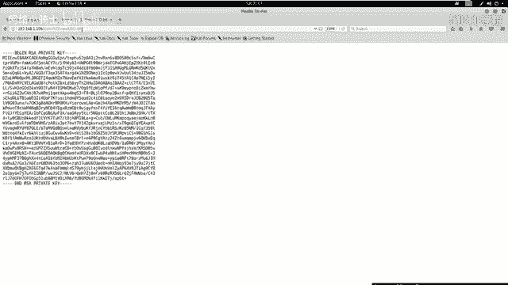
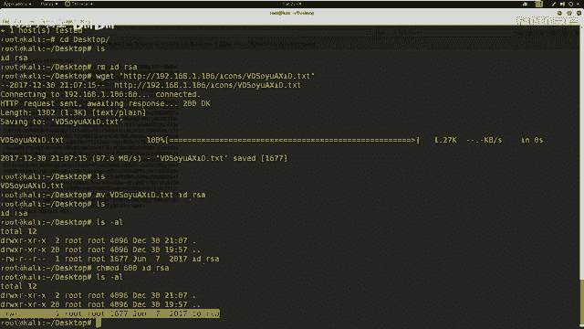
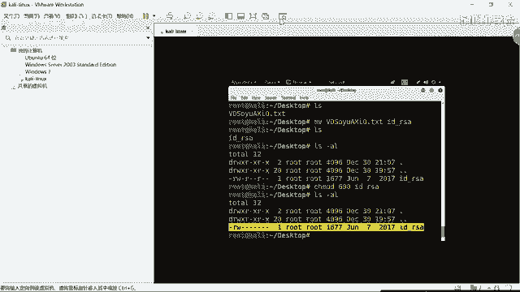
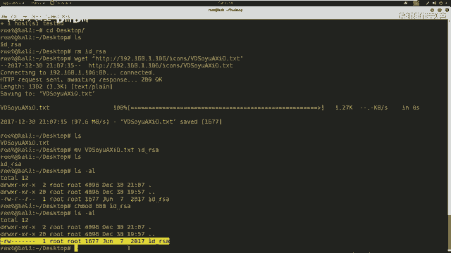
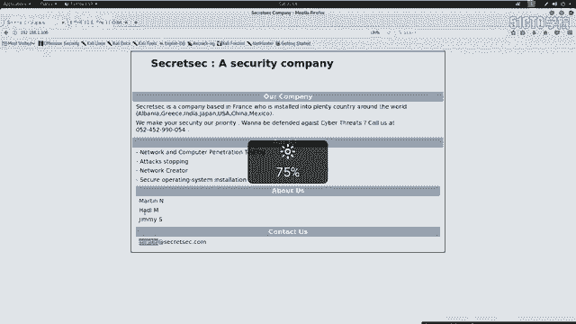
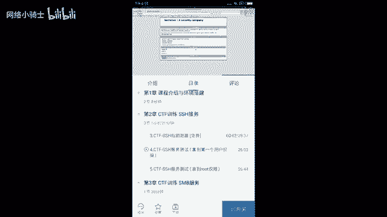
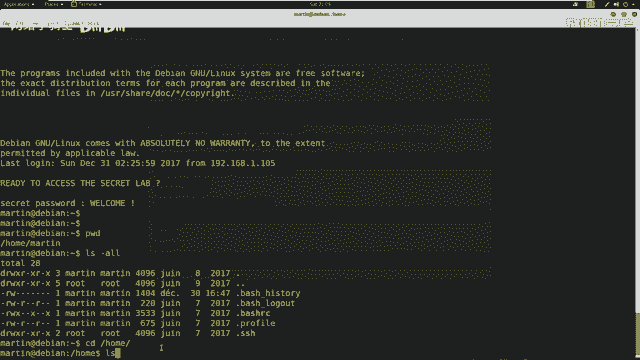
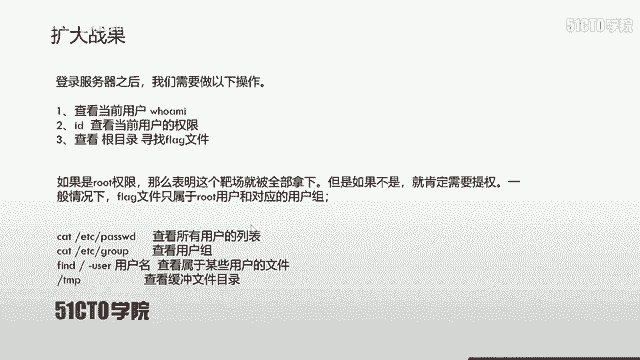

# CTF夺旗赛教程：P7：SSH服务渗透

## 概述
在本节课中，我们将学习针对SSH服务的渗透测试方法。我们将从信息收集开始，逐步探测目标，最终利用发现的弱点获取系统权限并找到Flag。

---

## SSH协议简介
上一节我们介绍了课程的整体目标，本节中我们来了解一下SSH协议本身。

SSH是Secure Shell的缩写，由网络小组制定。其目标是在应用层基础上建立安全协议。目前，SSH广泛用于远程登录操作，提供安全性保障。

这种安全性源于SSH协议对用户名、密码及所有传输信息都进行了加密，从而在一定程度上避免了信息泄露问题。SSH最初是Linux上的一个程序，后来因其功能强大被移植到其他平台。Windows和各种Linux发行版都支持运行SSH服务。

SSH服务默认基于**TCP 22端口**。

---

## SSH认证机制
了解了SSH的基本概念后，我们来看看它的两种主要认证方式。

### 基于口令的安全验证
只要你知道账户和密码，就可以使用SSH客户端登录到远程主机。在此过程中，所有传输的数据（包括密码）都被加密，这在一定程度上能防止中间人攻击嗅探你的凭据。

然而，这种机制无法防止服务器被冒充的中间人攻击。

### 基于密钥的安全验证
这种方式需要依靠密钥对。用户自己创建一对密钥，并将公钥存放在需要访问的服务器上。登录时，客户端使用私钥与服务器上的公钥进行匹配验证。如果匹配成功，则允许登录。

在大部分CTF比赛中，私钥文件常被命名为 **`id_rsa`**，公钥文件则被命名为 **`id_rsa.pub`**。这是使用密钥生成工具时的默认命名规则。

---

## SSH认证的安全弱点
以上我们已经对SSH认证机制有了初步认识。下面我们来看看这两种认证机制存在哪些安全弱点。

### 基于口令验证的弱点
基于口令的验证方式无法逃避暴力破解攻击。如果用户名存在弱口令，攻击者可以使用工具快速破解密码，从而通过SSH客户端连接服务器。

通过此方式获取的权限不一定是root权限，可能需要进一步提权。

### 基于密钥验证的弱点
我们需要对目标主机进行大量信息收集。如果能够获取到泄露的用户名及其对应的私钥文件，就可以尝试使用该密钥进行远程登录，这个过程可能不需要密码。

以下是利用泄露私钥登录的典型过程：
1.  修改私钥文件权限为`600`（仅所有者可读写）。
2.  使用SSH客户端指定私钥文件进行登录。

**登录命令示例：**
```bash
chmod 600 id_rsa
ssh -i id_rsa username@target_ip
```
同样，通过此方式登录获得的权限也不一定是root权限，可能需要后续提权。

---

## 实验环境与目标
下面我们介绍一下本次CTF实验的环境。

*   **攻击机**：Kali Linux， IP: `192.168.1.105`
*   **靶机**：Linux， IP: `192.168.1.106`

在CTF比赛中，我们的目标非常明确：获取靶机上的Flag值，并提升到root权限。所有操作都应围绕这个目的展开。

---

## 第一步：信息探测
明确了目标后，我们开始第一步：信息探测。对于给定的靶机IP，我们首先需要探测其开放的服务。

我们使用Nmap工具进行探测。以下是常用的几条命令：

**探测开放的服务及版本：**
```bash
nmap -sV 192.168.1.106
```

**探测靶机全面信息：**
```bash
nmap -A -v 192.168.1.106
```

**探测操作系统类型：**
```bash
nmap -O 192.168.1.106
```
通过以上扫描，我们可能收集到靶机的完整信息。

在实际操作中，扫描结果显示靶机开放了以下关键端口：
*   **22端口**：SSH服务 (协议版本 2.0)
*   **80端口**：HTTP服务 (Apache 2.4.10)
*   111端口等其它服务。

---

## 第二步：信息分析与敏感信息挖掘
我们对收集到的信息进行分析，寻找其中的敏感信息和安全弱点。

对于开放SSH服务（22端口）的靶机，主要考虑两点：
1.  是否可以通过暴力破解用户名和密码，直接SSH登录。
2.  服务器是否存在私钥泄露问题。如果找到私钥，需检查私钥是否加密。若加密，则需破解密码。同时，必须找到对应的用户名才能登录。

对于开放HTTP服务（80端口）的靶机，则考虑：
1.  通过浏览器访问Web服务，获取页面展示信息。
2.  使用目录扫描工具，探测隐藏目录或文件，寻找敏感信息。

**特别注意大于1024的端口**，这些非标准端口可能由用户自定义，例如8080端口，可能开放着Web服务。

接下来，我们对扫描结果进行深入挖掘。

### Web信息挖掘
使用浏览器访问靶机的HTTP服务 (`http://192.168.1.106`)。在“About Us”页面中，我们发现了一些人名，如`martin`、`jim`、`hans`，这些很可能就是系统用户名。

### 目录扫描
我们使用`dirb`工具扫描Web目录，寻找隐藏文件或目录。
```bash
dirb http://192.168.1.106
```
在扫描结果中，我们发现了一个名称奇特的文件。访问该文件，其内容包含“RSA PRIVATE KEY”，这正是SSH的私钥信息。我们成功挖掘到了关键敏感信息。

### 使用Nikto扫描
我们也可以使用Nikto漏洞扫描器进行辅助探测。
```bash
nikto -host 192.168.1.106
```
扫描结果会列出可能有趣的目录、文件以及服务器配置信息。在分析时，要特别注意`config`类配置文件或其他标明为`interesting`的项目。

---

## 第三步：利用敏感信息渗透
挖掘到敏感信息后，我们就可以利用它进行渗透。本节我们利用获取到的SSH私钥尝试登录。

操作步骤如下：
1.  下载私钥文件到本地。
2.  修改私钥文件权限为`600`。
3.  使用SSH命令配合私钥和之前发现的用户名进行登录。



**具体操作命令如下：**
```bash
# 1. 下载私钥 (假设私钥URL为 http://192.168.1.106/.../id_rsa)
wget http://192.168.1.106/path/to/id_rsa

# 2. 重命名并修改权限
mv id_rsa id_rsa
chmod 600 id_rsa





# 3. 尝试使用挖掘到的用户名登录
ssh -i id_rsa martin@192.168.1.106
```
执行后，我们成功以`martin`用户身份登录到靶机。



**注意**：如果私钥有密码保护，则需要先使用`ssh2john`等工具转换格式，并用`john`破解密码后才能使用。





---

## 第四步：权限提升与Flag寻找
登录成功后，我们获得了初始立足点。接下来需要评估当前权限并寻找Flag。

首先，检查当前用户权限：
```bash
id
```
命令显示当前用户并非root，只是一个普通用户。因此，我们需要进行权限提升。



常见的后续操作包括：
*   查看当前用户目录和系统其他目录，寻找敏感文件或信息。
*   尝试使用`sudo -l`查看当前用户能以root身份执行哪些命令。
*   寻找系统上的SUID文件、计划任务、弱权限服务等提权向量。
*   最终，Flag文件通常位于根目录(`/`)、用户家目录或特定目录下，且只允许root用户读写。

由于提权涉及更多技术，我们将在下节课详细介绍。

---

## 总结
本节课中，我们一起学习了SSH服务渗透的基本流程：
1.  **信息收集**：使用Nmap扫描目标，识别开放端口和服务。
2.  **弱点分析**：针对SSH服务，思考口令破解和密钥泄露两种攻击路径。
3.  **敏感信息挖掘**：通过访问Web页面和目录扫描，发现了潜在的用户名和泄露的SSH私钥。
4.  **利用与初始访问**：利用泄露的私钥和对应的用户名，成功通过SSH登录靶机。
5.  **后续行动**：登录后确认当前为非root权限，为下一步的权限提升做好准备。



整个过程体现了CTF比赛中从外到内、逐步深入的渗透测试思路。下节课，我们将聚焦于如何将普通用户权限提升至root权限。