# CTF学习：第二期：SQL注入（1）🧑‍💻

在本节课中，我们将要学习CTF（Capture The Flag）竞赛中一种非常常见且基础的Web安全漏洞——SQL注入。我们将从概念入手，理解其原理，并通过简单的例子来掌握最基础的注入方法。

## 概述

SQL注入是一种将恶意的SQL代码插入或“注入”到Web应用的输入参数中，从而欺骗后端数据库执行非预期命令的攻击技术。理解SQL注入是Web安全学习的基石。

## 什么是SQL注入？💉

上一节我们概述了本课程的目标，本节中我们来看看SQL注入的核心定义。

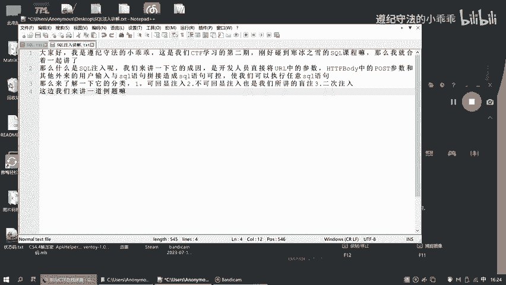

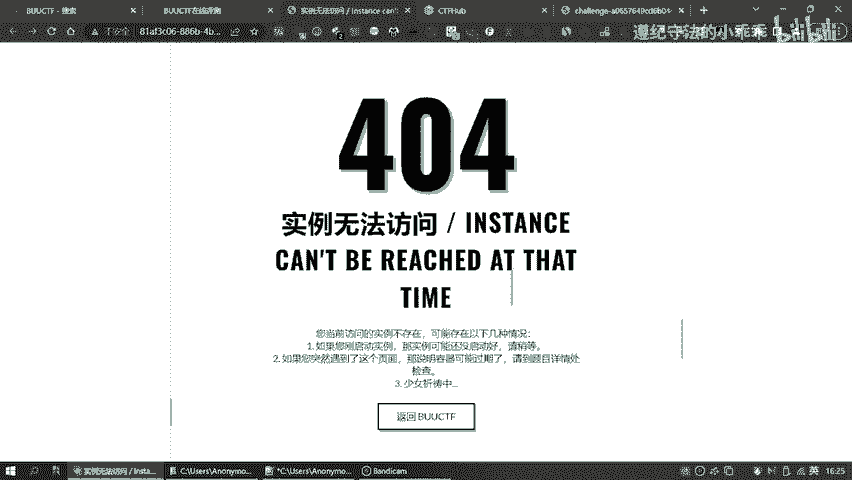

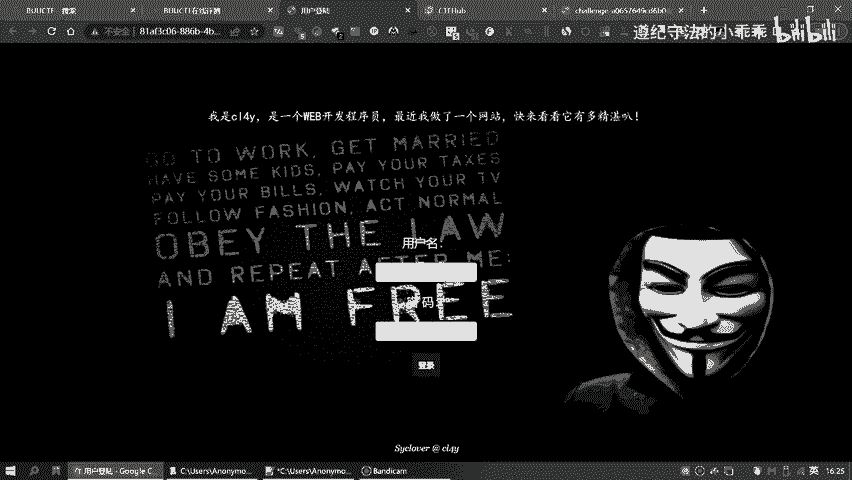

SQL注入发生在Web应用程序未能对用户输入进行有效验证或过滤时。攻击者可以利用这一点，在输入字段（如登录框、搜索框）中提交一段精心构造的SQL代码。当应用程序将这段输入拼接到原始的SQL查询语句中并发送给数据库执行时，就会导致数据库执行攻击者设定的操作。

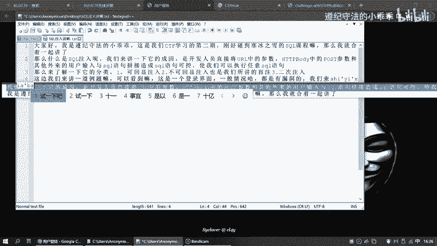

其核心过程可以概括为以下代码逻辑：
```sql
-- 应用程序预期的查询（例如用户登录）
SELECT * FROM users WHERE username = ‘用户输入的用户名’ AND password = ‘用户输入的密码’;

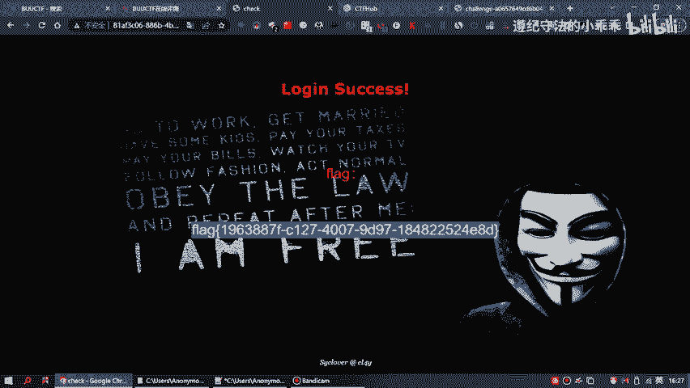

-- 攻击者输入：在用户名处输入 `admin‘ --`
-- 最终拼接成的恶意查询
SELECT * FROM users WHERE username = ‘admin’ -- ’ AND password = ‘任意密码’;
```
在上面的例子中，`--` 在SQL中是注释符，它使得后面的密码验证条件被注释掉，从而只要用户名为 `admin` 即可登录成功。

## SQL注入的危害🚨

理解了SQL注入是什么之后，我们来看看它能造成哪些危害。成功的SQL注入攻击可以导致非常严重的后果。

以下是SQL注入可能带来的一些主要危害：

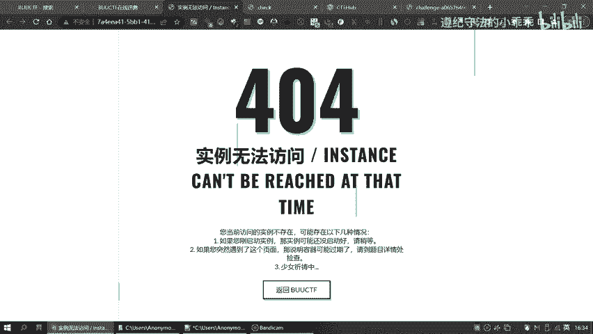

*   **数据泄露**：攻击者可以读取数据库中的敏感信息，如用户个人信息、密码哈希、商业数据等。
*   **数据篡改**：攻击者可以修改、添加或删除数据库中的数据，破坏数据完整性。
*   **权限提升**：通过注入，攻击者可能获得更高的数据库操作权限，甚至系统权限。
*   **拒绝服务（DoS）**：通过执行消耗大量资源的SQL语句，使数据库服务器瘫痪。
*   **进一步渗透**：在某些数据库配置下，攻击者可能利用数据库功能执行系统命令，从而完全控制服务器。

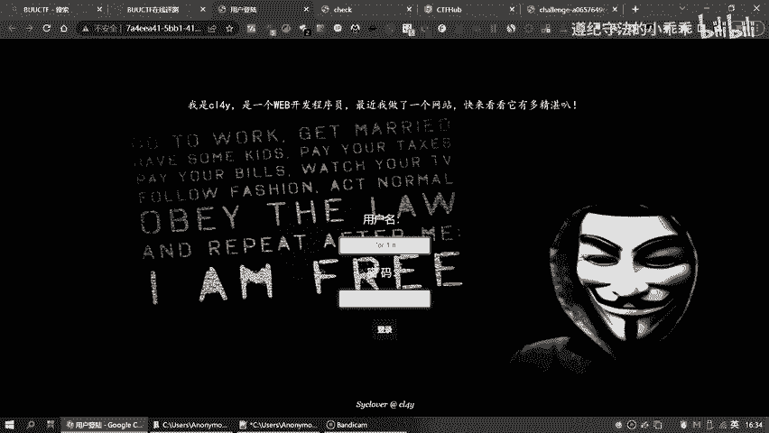

## 注入的基本类型：联合查询注入🔗

SQL注入有多种利用方式，本节我们介绍最常见的一种——联合查询注入。这是利用 `UNION` 操作符将恶意查询结果附加到原始查询结果之后的方法。

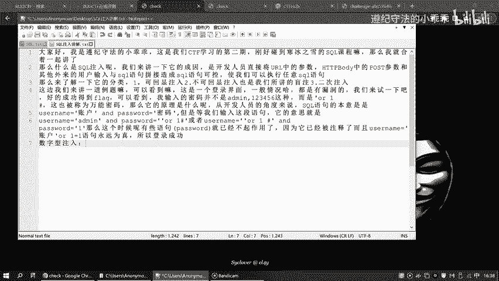

要成功进行联合查询注入，需要满足几个条件，并遵循特定的步骤。

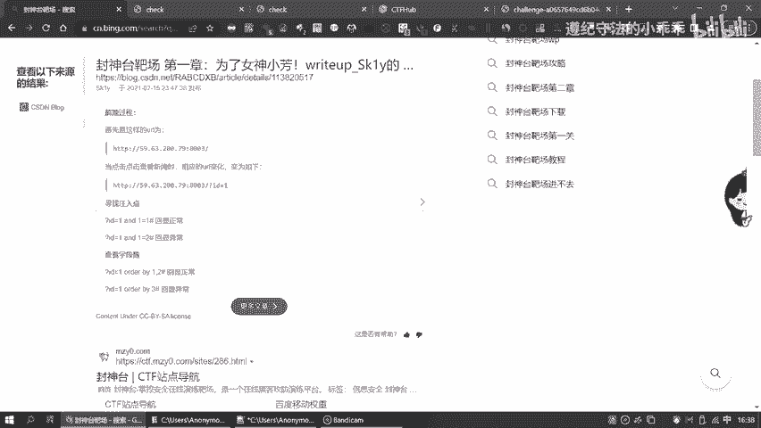

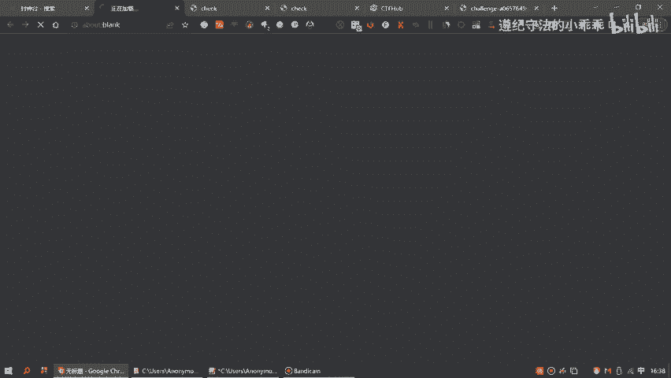

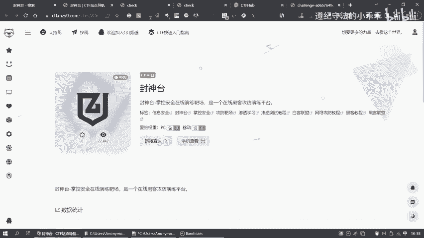

以下是进行联合查询注入的关键步骤：

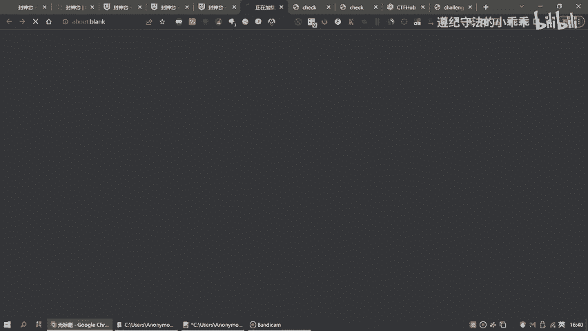

1.  **判断注入点**：首先需要找到存在SQL注入漏洞的输入参数。通常通过提交单引号 `‘`、`and 1=1`、`and 1=2` 等测试 payload，观察页面返回结果是否异常来判断。
2.  **确定字段数**：使用 `ORDER BY` 子句来猜测原始查询返回的列数。例如：`?id=1 order by 5--`，如果页面正常，说明列数>=5；如果报错，则列数<5。通过递增数字，直到找到准确的列数。
3.  **探测回显位**：在确定列数（假设为3）后，使用 `UNION SELECT` 来探测哪些列的内容会显示在页面上。例如：`?id=-1 union select 1,2,3--`。页面中显示的数字（如2和3）就是我们可以用来回显数据的位置。
4.  **获取数据**：利用回显位，替换数字为我们想查询的信息。例如，在回显位2和3处查询数据库名和当前用户：`?id=-1 union select 1, database(), user()--`。

## 总结

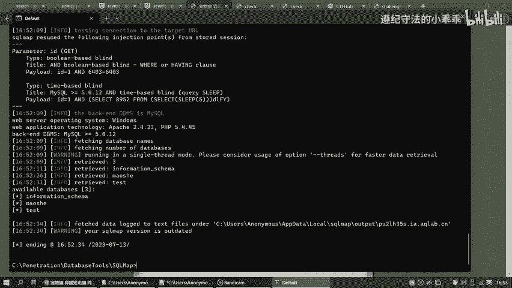

本节课中我们一起学习了SQL注入的基础知识。我们首先了解了SQL注入的定义和基本原理，即通过构造恶意输入来干扰正常的SQL查询逻辑。接着，我们探讨了SQL注入可能带来的多种严重危害。最后，我们详细介绍了联合查询注入这一基本类型，学习了从判断注入点到最终获取数据的完整步骤。

掌握这些概念是进一步学习更复杂SQL注入技术（如报错注入、布尔盲注、时间盲注等）的前提。在后续课程中，我们将基于这些基础，深入探讨更多的注入技巧和防御方法。