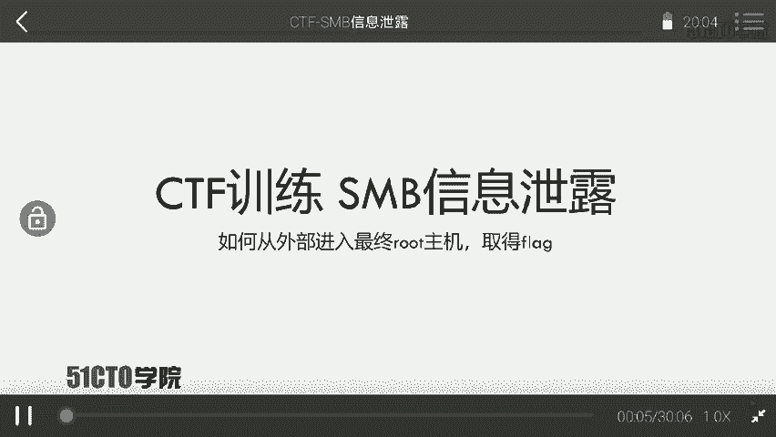
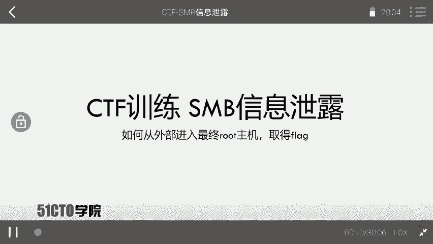
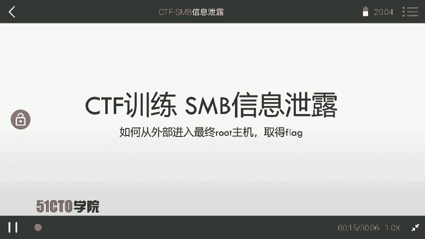

# CTF夺旗教程：P10：SMB信息泄露

在本节课中，我们将学习如何利用SMB（Server Message Block）协议的信息泄露漏洞。我们将从信息收集开始，逐步探测目标主机开放的SMB服务，并最终通过泄露的信息获取主机权限，提升至root权限，从而取得目标flag值。

## 什么是SMB协议？

上一节我们明确了学习目标，本节中我们来了解一下SMB协议的基础知识。

SMB是Server Message Block的缩写。它是一个通信协议，由微软和英特尔公司在1987年制定，主要作为微软网络的通信协议。后来Linux系统移植了SMB协议，并将其改名为SAMBA。



SMB协议基于TCP/IP协议栈，通常使用的端口号是**139**和**445**。该协议主要用于在网络上访问共享文件、打印机等计算机资源。用户可以通过开启文件夹共享功能来使用SMB协议，这样网络上的其他计算机就能通过该协议连接并访问共享资源。

以下是一个简单的网络拓扑示意图：假设一台计算机开放了SMB协议并设置了共享文件夹，那么网络中的另一台机器就可以通过SMB协议连接到这台计算机，并下载其上的资源。



## 实验环境搭建

了解了SMB的基本概念后，我们来看看本次实验所使用的环境。



本次实验环境配置如下：
*   **攻击机**：使用Kali Linux系统，IP地址为 `192.168.253.12`。
*   **靶机**：使用Linux系统，IP地址为 `192.168.253.17`。

我们的最终目标是获取靶机上的flag值。这意味着我们需要想尽一切办法获取靶机的控制权限。

## 渗透测试流程概述

拿到靶机IP地址后，我们首先需要进行信息探测。这是渗透测试中至关重要的一步。

渗透测试的核心流程是：对目标机器进行扫描，探测其开放的服务，并寻找服务中存在的安全弱点。本质上，渗透就是针对目标机器开放的服务进行漏洞探测，通过发送精心构造的数据包来利用这些漏洞，最终获取机器的最高权限。

## 实战步骤详解

下面，我们将按照标准的渗透测试流程，一步步完成从信息收集到获取flag的全过程。

### 第一步：信息收集与端口扫描

首先，我们需要探测靶机开放了哪些端口和服务。这里我们使用强大的端口扫描工具Nmap。

以下是使用Nmap进行扫描的基本命令：
```bash
nmap -sV -sC -O 192.168.253.17
```
*   `-sV`: 探测服务版本。
*   `-sC`: 使用默认脚本进行扫描。
*   `-O`: 尝试识别操作系统。

扫描结果可能显示靶机开放了**445端口**，并运行着**SMB服务**。这确认了我们的目标服务是存在的。

### 第二步：枚举SMB共享信息

发现SMB服务后，下一步是枚举该服务上的共享资源列表。我们可以使用`smbclient`工具。

以下是枚举SMB共享列表的命令：
```bash
smbclient -L //192.168.253.17 -N
```
*   `-L`: 列出可用的共享。
*   `-N`: 以空密码进行匿名登录尝试。

执行命令后，我们可能会发现一个名为`public`或类似名称的可匿名访问的共享文件夹。

### 第三步：访问共享并发现信息泄露

找到可访问的共享后，我们尝试连接并查看其内容。

使用以下命令连接SMB共享：
```bash
smbclient //192.168.253.17/public -N
```
连接成功后，可以使用`ls`命令列出文件，使用`get <文件名>`命令下载文件。

在共享目录中，我们可能会发现一些本不应公开的文件，例如系统配置文件、备份文件或包含敏感信息的文本文件。这正是“信息泄露”漏洞的体现。例如，我们可能找到一个包含用户名和密码哈希的文件。

### 第四步：利用泄露信息提升权限

假设我们通过信息泄露获得了一个用户的密码哈希。接下来，我们可以尝试破解此哈希或直接使用它进行身份验证。

如果泄露的是明文密码，我们可以直接尝试登录。如果是哈希，可能需要使用`john`或`hashcat`等工具进行破解。
```bash
john --format=NT hash.txt --wordlist=/usr/share/wordlists/rockyou.txt
```
获得有效凭据后，我们可以尝试通过SSH或其他服务登录靶机。
```bash
ssh username@192.168.253.17
```

### 第五步：权限提升与获取Flag

成功登录后，我们可能只拥有普通用户权限。最终目标是获取`root`权限。

我们需要进行本地权限提升侦查。可以尝试以下方法：
1.  查找具有SUID权限的特殊文件：`find / -perm -u=s -type f 2>/dev/null`
2.  查看用户是否有`sudo`权限：`sudo -l`
3.  检查内核版本，寻找公开漏洞。

利用找到的提权方法（例如利用一个有漏洞的SUID程序或内核漏洞），将权限提升至`root`。成为`root`后，就可以在系统的特定位置（如`/root`目录下或桌面）找到最终的`flag`文件。
```bash
cat /root/flag.txt
```


## 课程总结

本节课中，我们一起学习了SMB信息泄露漏洞的完整利用链。我们从信息收集和端口扫描开始，发现了开放的SMB服务；接着通过枚举找到了可匿名访问的共享，并从中发现了敏感信息泄露；然后利用泄露的凭证成功登录系统；最后通过权限提升技术获得`root`权限，成功读取了flag。这个流程清晰地展示了如何将一点点的信息泄露逐步扩大，最终完全控制目标系统。