# CTF夺旗赛入门：P12：13. 实战演练 - 信息探测与Flag获取 🚩

在本节课中，我们将学习在CTF夺旗赛中，如何通过系统性的信息探测来发现并获取目标机器上的Flag。我们将使用Kali Linux作为攻击机，对一个模拟的靶场环境进行实战演练。

---


## 概述

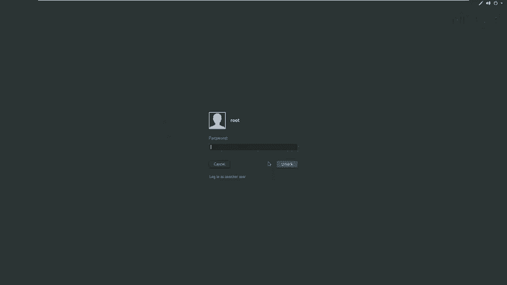

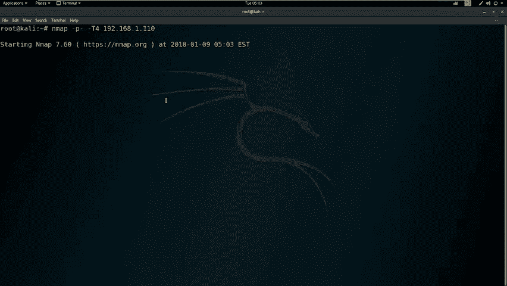

CTF是一种流行的信息安全竞赛形式，英文全称为“Capture The Flag”，可直译为“夺得旗帜”或意译为“夺旗赛”。其核心流程是：参赛团队通过信息对抗、程序分析等手段，率先从主办方提供的比赛环境中找到一串特定格式的字符串（即Flag）并提交，从而获得分数。

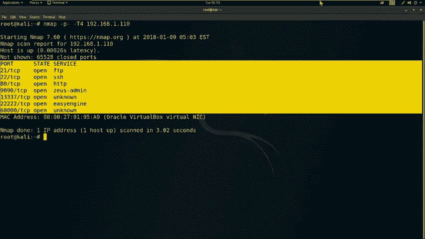

为了完成目标，我们需要利用所有可用的方法。本次实验环境如下：
*   **攻击机**：Kali Linux，IP地址为 `192.168.1.111`
*   **靶机**：Linux系统，IP地址为 `192.168.1.110`

我们的所有操作都将围绕一个核心目的展开：**获取靶机上的Flag值**。

---

## 第一步：信息探测

在获得靶机IP地址后，第一步是进行信息探测，以了解目标开放了哪些服务。

### 端口扫描

我们可以使用 `nmap` 工具来探测靶机开放的端口。以下是两个常用的扫描命令：

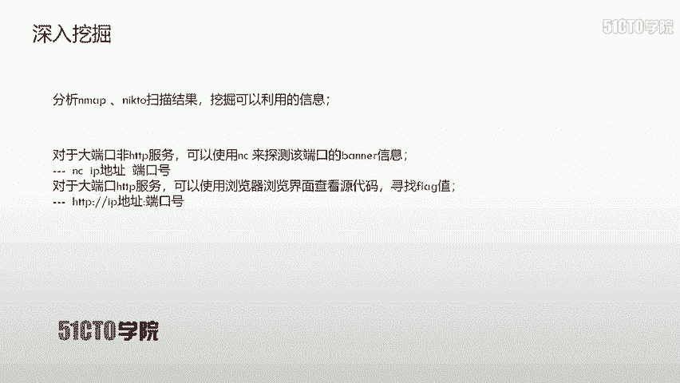

1.  **快速全端口扫描**：此命令扫描所有端口（0-65535），并使用最快速度。
    ```bash
    nmap -p- -T4 192.168.1.110
    ```
    执行后，`nmap` 会列出所有开放的端口及其对应的服务。

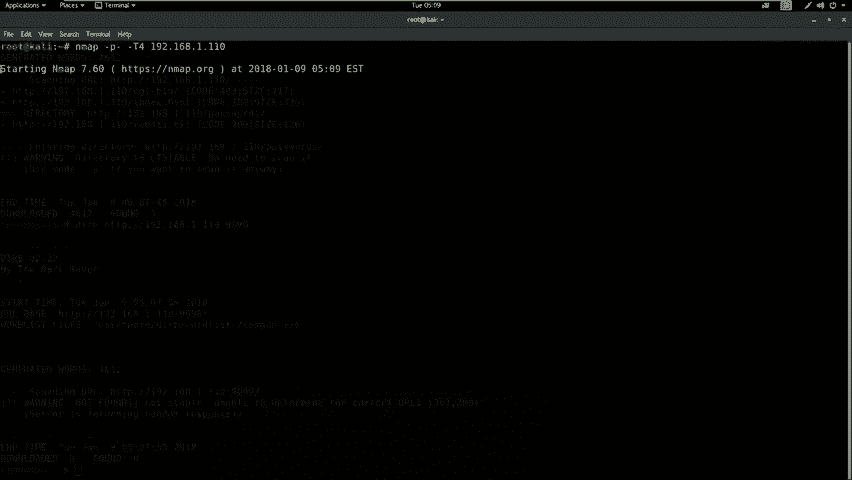

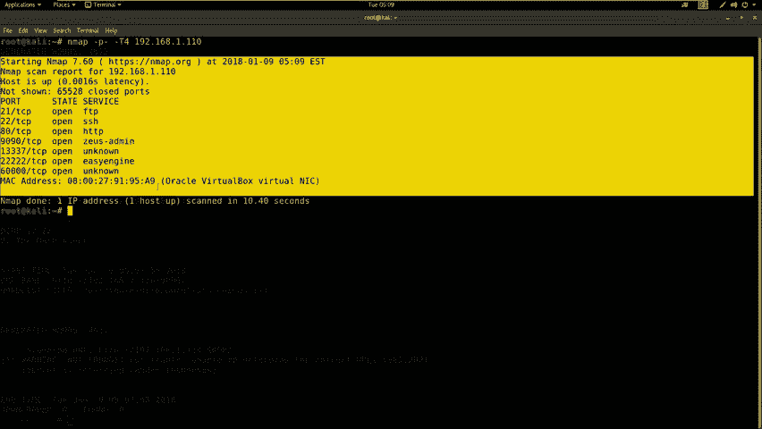

2.  **全面信息扫描**：此命令使用所有扫描模块，获取更详细的信息。
    ```bash
    nmap -T4 -A -v 192.168.1.110
    ```
    需要注意的是，全面扫描有时可能会遗漏某些端口，因此**结合使用以上两条命令**是更稳妥的做法。

### Web服务敏感信息探测

对于开放的HTTP服务（如80、8080、9090端口），我们可以使用专门工具探测其敏感目录或文件。

1.  **使用 `nikto` 扫描**：`nikto` 可以检测Web服务器上的潜在危险文件和配置。
    ```bash
    # 扫描80端口（可省略端口号）
    nikto -host http://192.168.1.110
    # 扫描非80端口（如9090）
    nikto -host http://192.168.1.110:9090
    ```

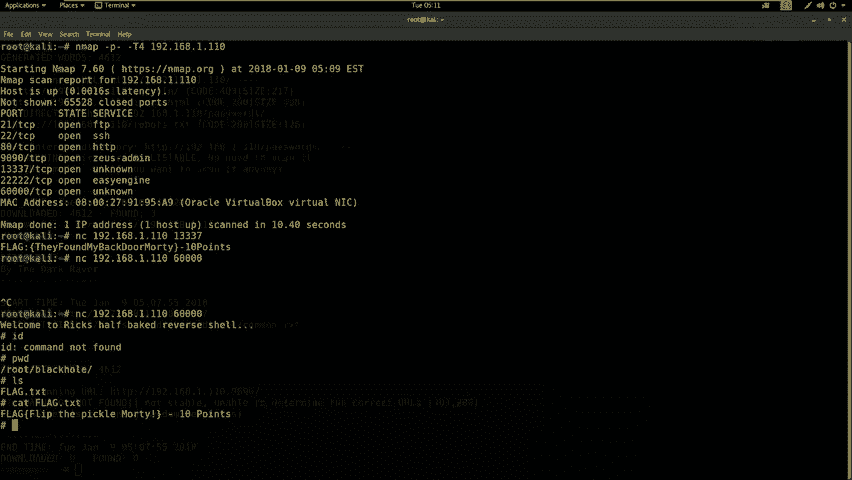

2.  **使用 `dirb` 扫描**：`dirb` 是一个Web内容扫描器，用于寻找隐藏的目录和文件。
    ```bash
    # 扫描80端口
    dirb http://192.168.1.110
    # 扫描9090端口
    dirb http://192.168.1.110:9090
    ```

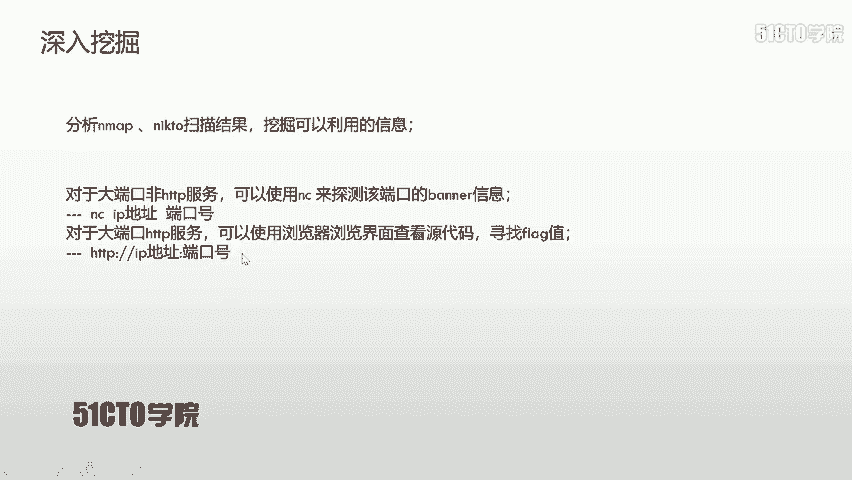

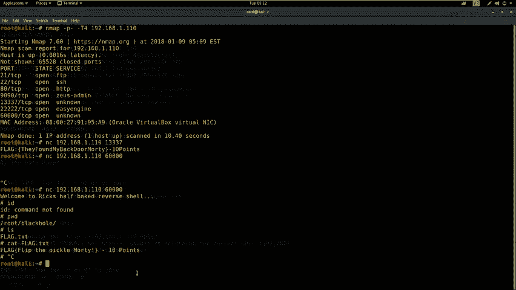

---

## 第二步：分析结果与深入挖掘

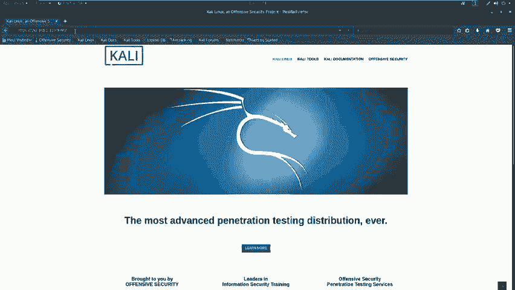

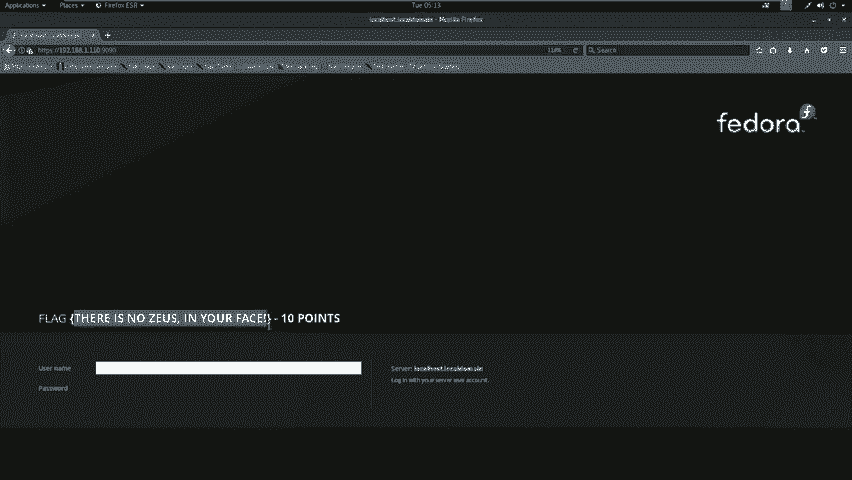

在完成初步探测后，我们需要分析扫描结果，并挖掘其中可利用的信息。

### 处理未知服务的大端口

扫描结果中可能出现一些运行在非常见端口（大端口）上的未知服务。我们可以使用 `netcat (nc)` 工具连接这些端口，获取其Banner信息，其中可能直接包含Flag。

```bash
# 连接靶机的13337端口
nc 192.168.1.110 13337
```
执行后，可能会直接返回一个Flag值。

### 访问Web服务界面

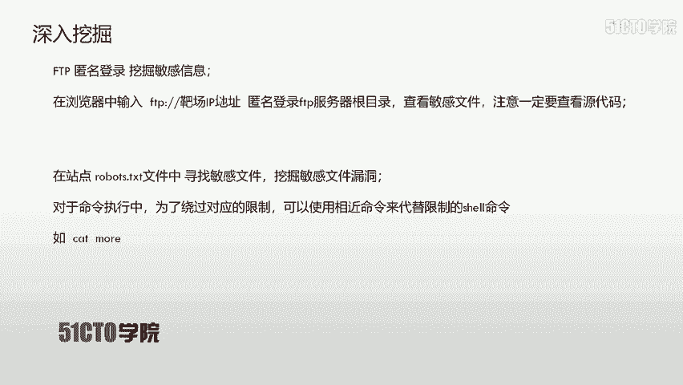

如果扫描发现大端口运行的是HTTP服务（例如9090端口），我们可以直接使用浏览器访问该地址，并查看网页源代码，寻找可能隐藏的Flag。
访问格式为：`http://靶机IP:端口号`，例如 `http://192.168.1.110:9090`。

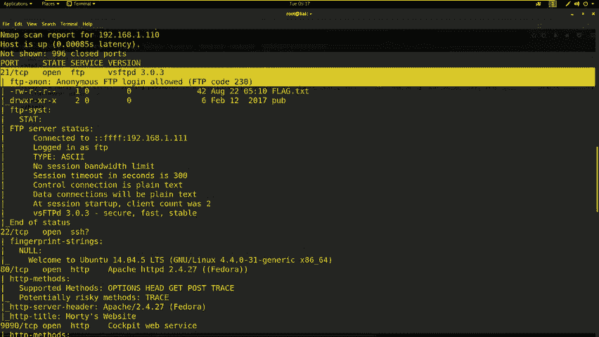

### 检查敏感目录与文件

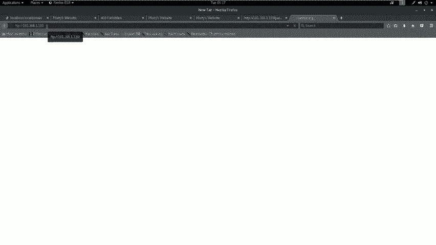

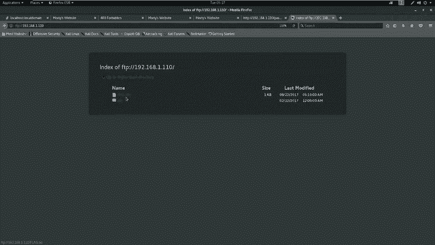

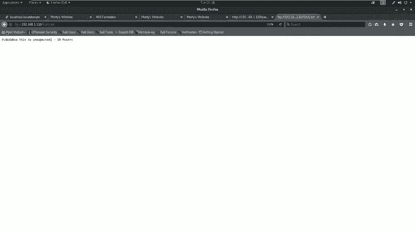

根据 `dirb` 或 `nikto` 的扫描结果，访问发现的敏感目录。例如，扫描可能发现 `/passwords/` 目录，访问后可能找到 `flag.txt` 文件。同时，要留意网页注释、隐藏链接等可能泄露信息的地方。

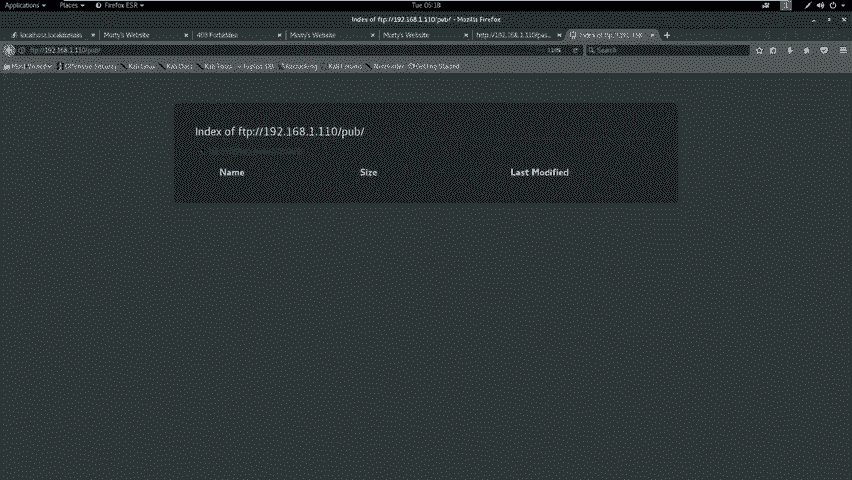

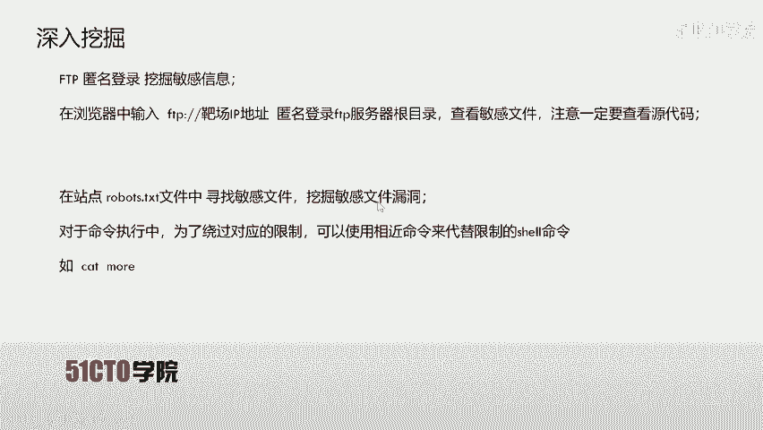

### 利用FTP匿名登录


如果扫描发现21端口（FTP服务）支持匿名登录，可以直接在浏览器中访问 `ftp://靶机IP`。在FTP服务器的根目录下，可能存放着包含Flag的文件。

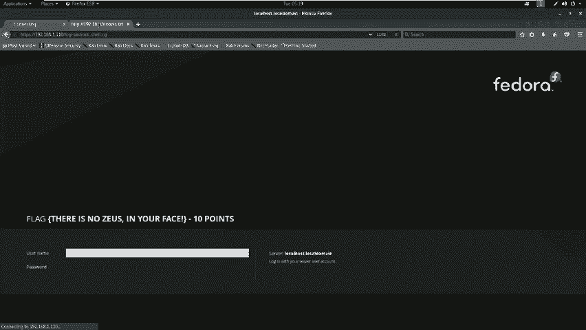

### 检查Robots文件

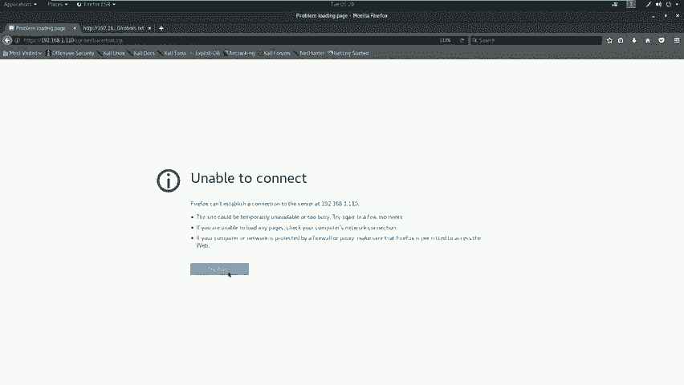

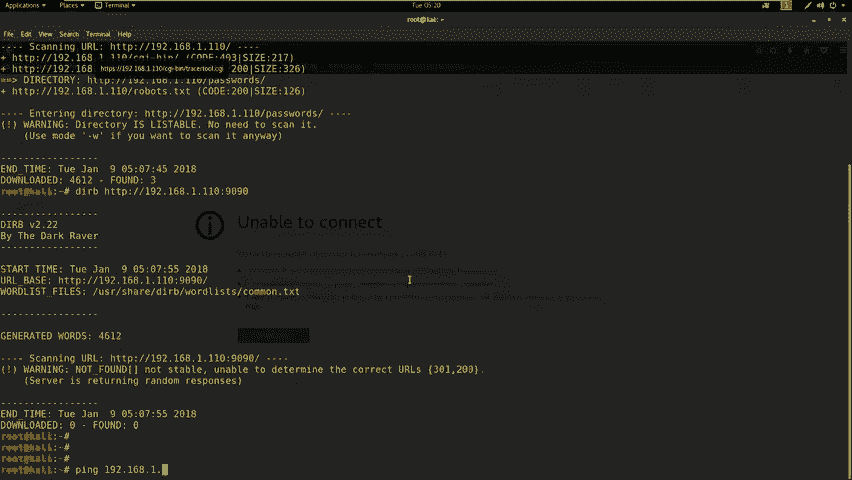

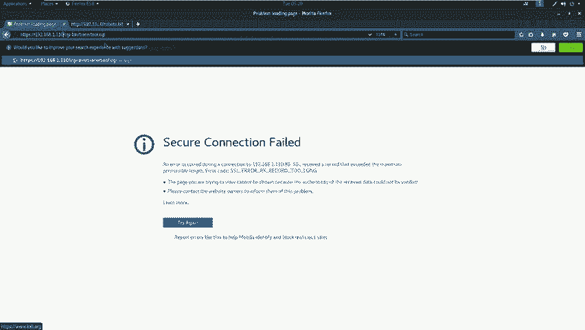

Web站点的 `robots.txt` 文件通常会列出不希望被爬虫访问的目录。这些目录有时会包含敏感信息或测试接口。访问 `http://靶机IP/robots.txt` 并检查其中列出的路径。

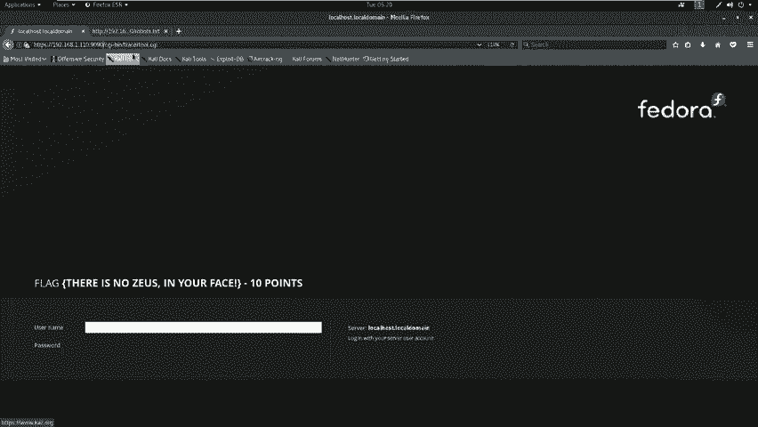

---

## 第三步：漏洞利用与权限提升

通过深入分析，我们可能会发现一些漏洞点，并借此获得更高权限。

### 命令注入漏洞测试

在探测过程中，可能会发现一些交互式页面（例如一个执行 `traceroute` 的CGI页面）。这可能存在命令注入漏洞。我们可以尝试在参数后添加系统命令进行测试。

例如，原始请求可能是向 `ip` 参数提交 `127.0.0.1`。测试命令注入：
```bash
# 在参数后添加分号及系统命令 id
127.0.0.1; id
```
如果页面返回了当前执行命令的用户信息，则证明存在命令注入漏洞。

### 绕过命令限制

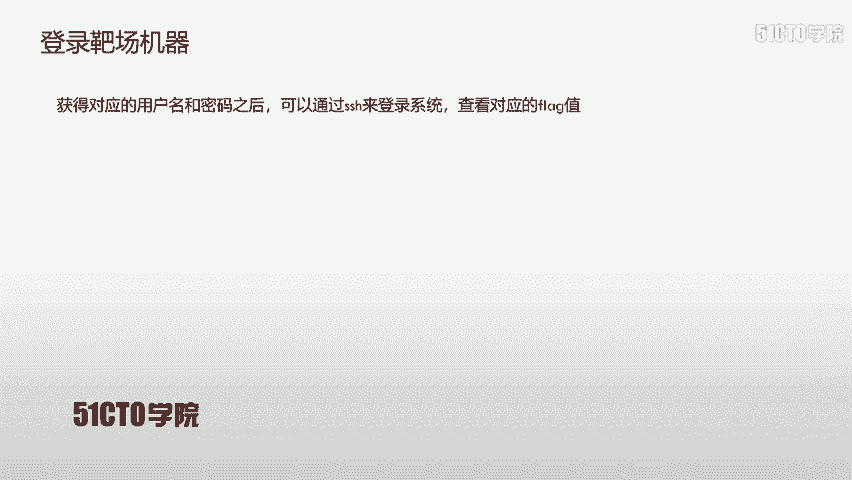

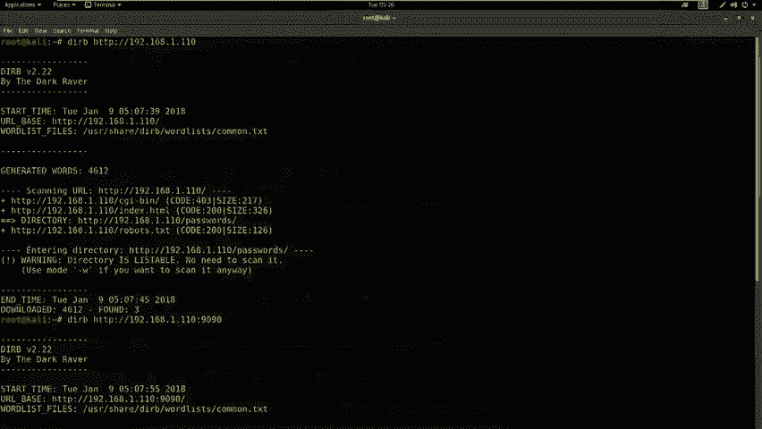

靶机可能对某些命令（如 `cat`）进行了过滤。此时可以尝试使用功能相近的命令进行绕过，例如使用 `more`、`less` 或 `head` 命令来读取文件。
```bash
# 使用 more 命令读取 /etc/passwd 文件
127.0.0.1; more /etc/passwd
```
从 `/etc/passwd` 文件中可以获取系统用户名。

### 尝试远程登录

结合之前从网页源码等处获取的密码信息，以及从 `/etc/passwd` 中发现的用户名，可以尝试通过SSH服务登录靶机。注意，SSH服务可能运行在非默认的22端口。
```bash
# 使用用户名和密码登录靶机的5522端口
ssh summer@192.168.1.110 -p 5522
```
登录成功后，即可在靶机文件系统中寻找Flag文件。如果 `cat` 命令被禁用，同样可以使用 `more` 命令来查看文件内容。

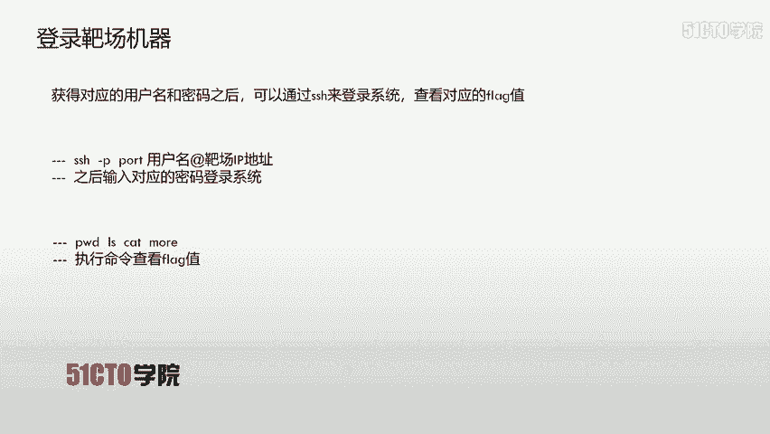

---

## 总结

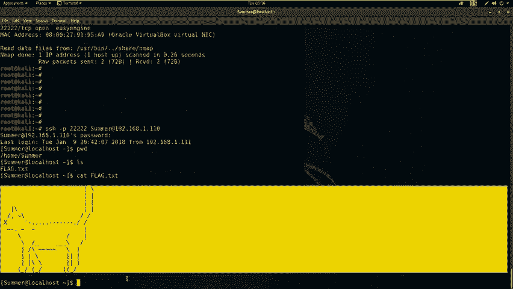

本节课我们一起学习了CTF比赛中进行信息探测和获取Flag的完整流程：

1.  **全面探测**：使用 `nmap`、`nikto`、`dirb` 等工具对靶机进行端口、服务和Web内容的全面扫描，不放过任何细节。
2.  **深入分析**：对发现的每一个服务（如HTTP、FTP、SSH、未知大端口服务）进行手动检查，包括访问界面、查看源代码、测试匿名登录等。
3.  **漏洞利用**：对可疑的交互点（如CGI页面）进行命令注入等漏洞测试，并学会使用相近命令（如用 `more` 代替 `cat`）绕过限制。
4.  **组合信息**：将各处收集到的信息（如用户名、密码）组合起来，尝试突破权限边界（如通过SSH登录），最终在文件系统中找到Flag。

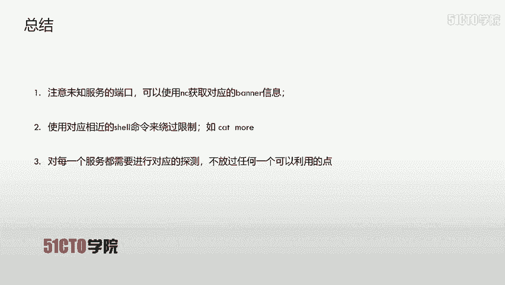

核心要点在于：**耐心、细致、多尝试**。每一个开放的端口，每一项服务，都可能成为获取Flag的关键。希望大家通过本次实战演练，能够掌握CTF入门的基本方法和思路。