# CTF教程天花板：1：网络安全学习路线图 🗺️

在本节课中，我们将一起了解一套完整的网络安全学习路线图。这套路线图旨在帮助初学者、求职者或希望转行进入网络安全领域的朋友，系统地规划学习路径，掌握从基础到进阶的核心技能。

## 概述

针对许多朋友提出的关于如何入门网络安全、如何准备求职面试等问题，我特意整理并录制了一套完整的教程。教程内容超过70GB，包含视频课程、推荐阅读的电子书籍、面试经验以及网络安全渗透测试中常用的工具。接下来，我将为大家详细介绍我们规划的学习路线。

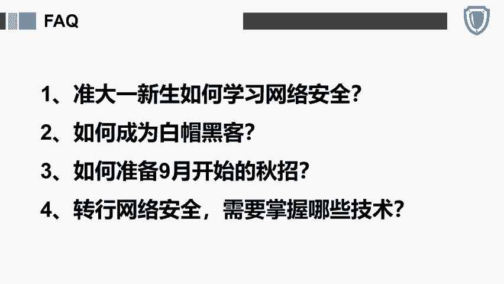

## 学习路线总览

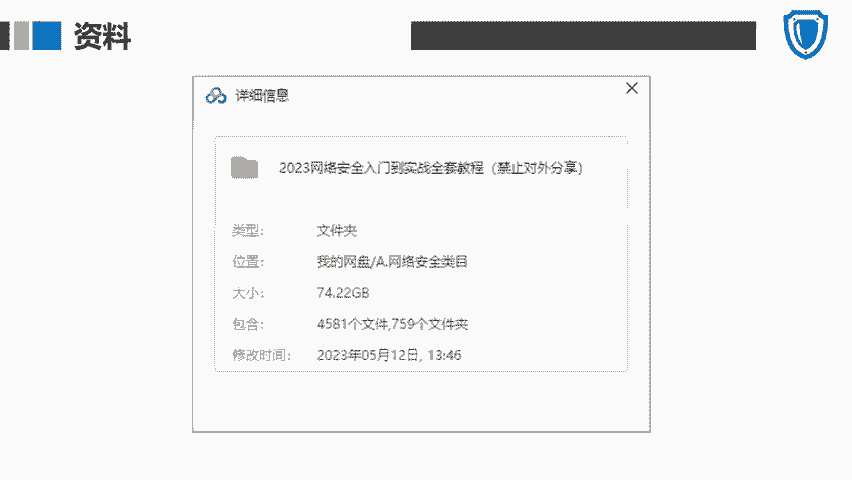

我将完整的学习路线划分为四个主要板块，它们分别是：**安全基础**、**渗透技术**、**渗透进阶**和**逆向审计**。这四个板块由浅入深，构成了一个系统的知识体系。

上一节我们介绍了学习路线的整体框架，本节中我们来看看第一个板块的具体内容。

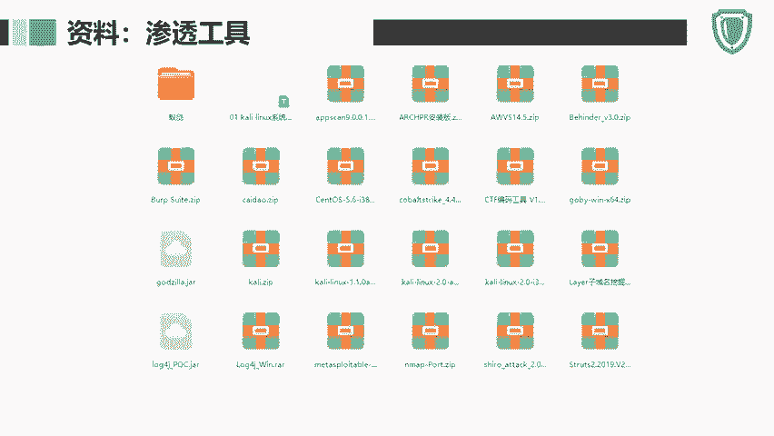

## 板块一：安全基础 🏗️

安全基础板块是构建网络安全知识体系的基石。以下是该板块需要学习的主要内容：

*   **行业与法规**：了解网络安全行业概况及相关法律法规。
*   **Linux操作系统**：掌握Linux系统中各种常用命令。
*   **计算机网络**：学习网络协议、架构等基础知识。
*   **编程语言**：学习前后端开发涉及的相关编程语言。
*   **数据库基础**：掌握数据库的基本原理与操作。

## 板块二：渗透技术 ⚔️

掌握了基础知识后，我们进入实战性更强的渗透技术板块。这个板块主要聚焦于发现和利用系统漏洞。

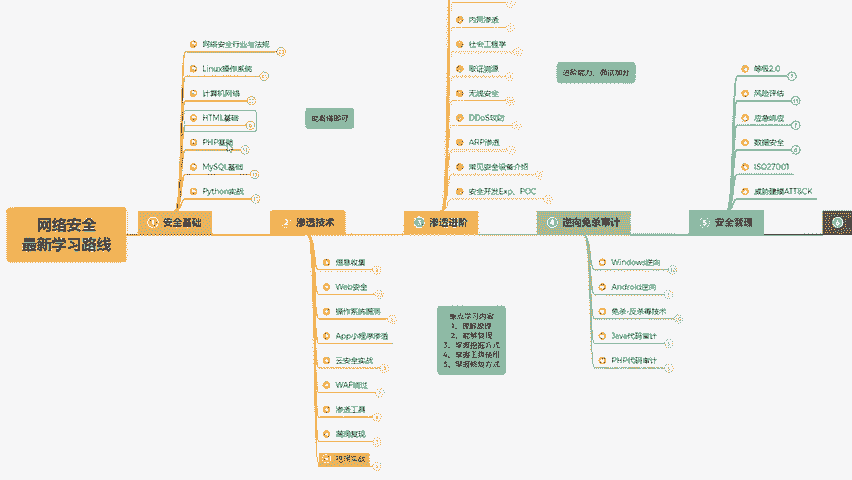

以下是Web应用常见的漏洞类型：

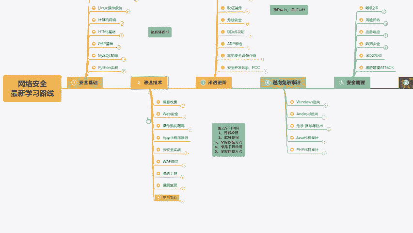

*   **SQL注入**：通过构造恶意SQL语句，干扰数据库查询。
*   **XSS（跨站脚本）**：在网页中注入恶意脚本，影响其他用户。
*   **CSRF（跨站请求伪造）**：诱骗用户在当前已登录的Web应用上执行非本意的操作。
*   **文件上传漏洞**：利用上传功能上传恶意文件。
*   **文件包含漏洞**：通过包含恶意文件执行代码。
*   **SSRF（服务器端请求伪造）**：攻击者诱使服务器向内部或第三方系统发起请求。
*   **XXE（XML外部实体注入）**：利用XML解析器的功能读取系统文件或发起网络请求。
*   **远程代码执行**：直接或间接在目标服务器上执行任意代码。
*   **逻辑漏洞**：利用业务逻辑缺陷进行攻击。
*   **密码暴力破解**：尝试大量密码组合以破解账户。

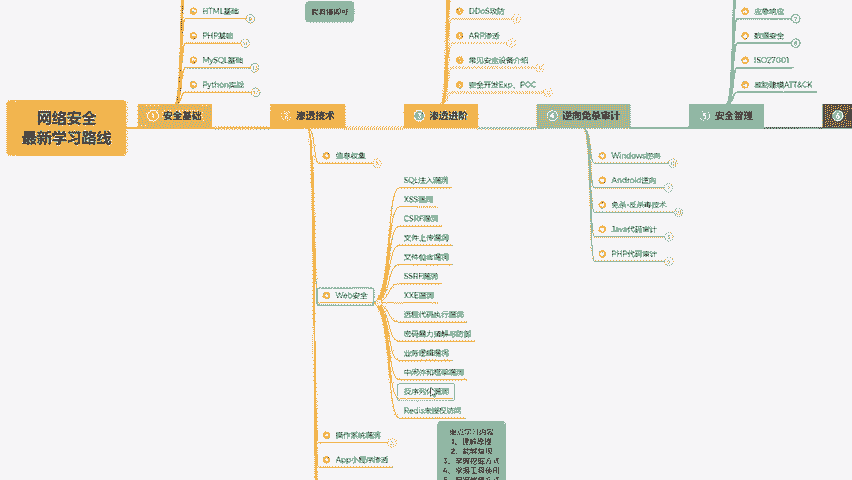

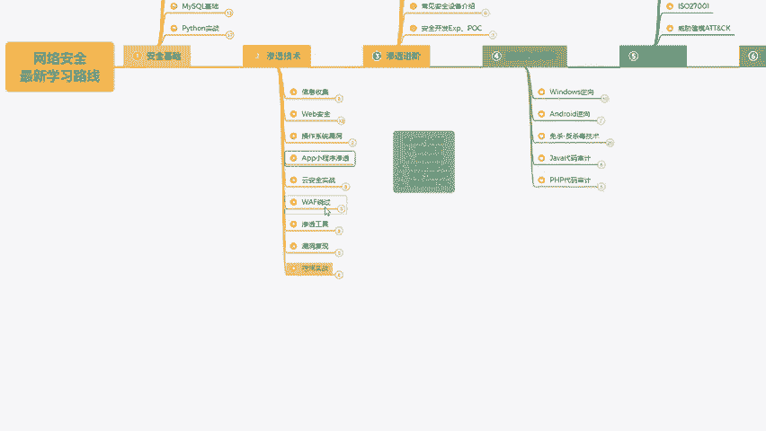

除了Web漏洞，本板块还包括以下内容：

*   **其他平台漏洞**：涉及操作系统、云环境、APP和小程序等的渗透测试。
*   **WAF绕过技术**：学习如何绕过Web应用防火墙的检测。
*   **常用工具**：掌握如 **Metasploit Framework (MSF)**、**Cobalt Strike (CS)**、**Burp Suite (BP)**、漏洞扫描工具以及各类一体化渗透测试平台的使用。
*   **漏洞复现与靶场实战**：在模拟环境中复现热门漏洞并进行实战练习。
*   **漏洞挖掘实战**：将所学技术应用于实践，例如参与公益SRC、企业SRC、CNVD漏洞平台、众测项目等，以提升实战技能。

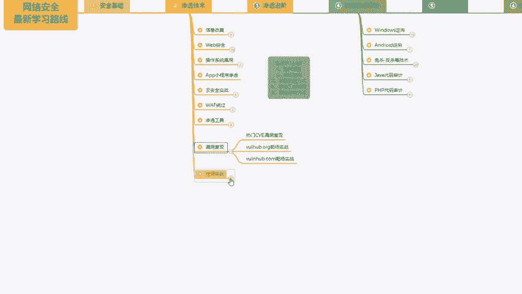

## 板块三：渗透进阶 🚀

在掌握了核心渗透技术后，我们可以向更深入的领域探索。渗透进阶板块将介绍更专业和复杂的技术与概念。

以下是渗透进阶板块的学习要点：

*   **渗透与后渗透框架/工具**：深入学习高级攻击框架和权限维持工具。
*   **权限提升**：研究在已获取初始权限后，如何提升至更高系统权限。
*   **隧道技术**：学习建立隐蔽通信通道的方法。
*   **内网渗透**：掌握在企业内部网络中进行横向移动和信息收集的技术。
*   **社会工程学**：了解利用人性弱点进行攻击的方法。
*   **取证与溯源**：学习攻击痕迹分析和攻击者溯源技术。
*   **无线安全**：研究Wi-Fi等无线网络的安全与攻击。
*   **工控系统（ICS/SCADA）渗透**：了解工业控制系统的安全测试。
*   **DDoS攻击与防御**：学习分布式拒绝服务攻击的原理与防护。
*   **安全设备**：熟悉防火墙、IDS/IPS等常见安全设备。
*   **EXP与POC编写**：学习编写漏洞利用程序和概念验证代码。

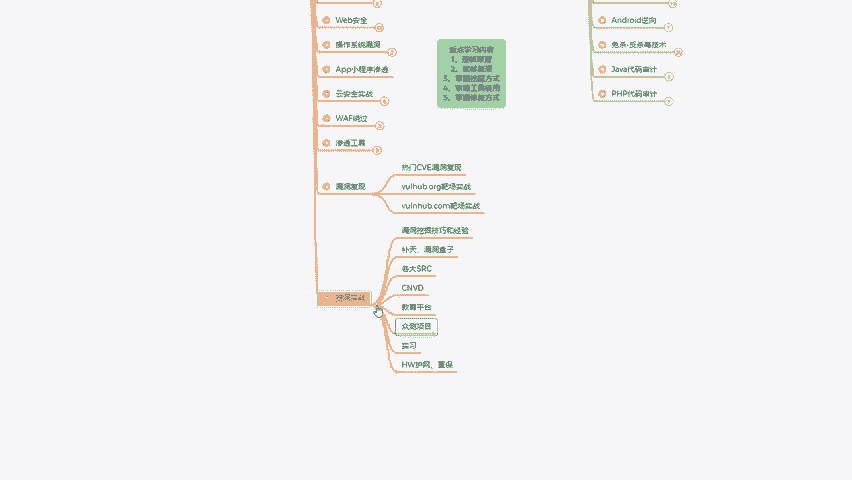

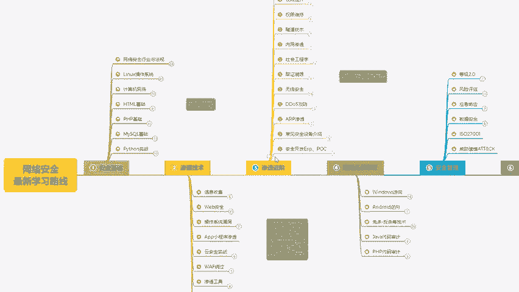

## 板块四：逆向审计 🔍

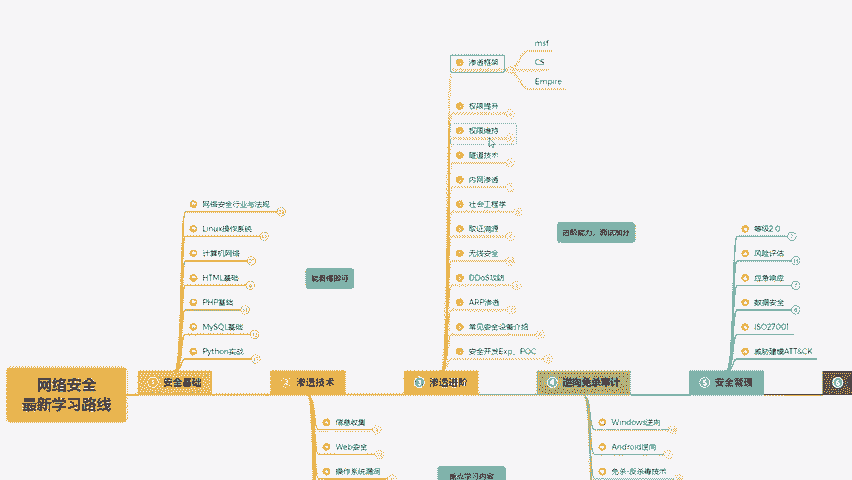

最后一个板块侧重于防御和深度分析。逆向审计能力对于理解恶意软件、分析漏洞成因至关重要。

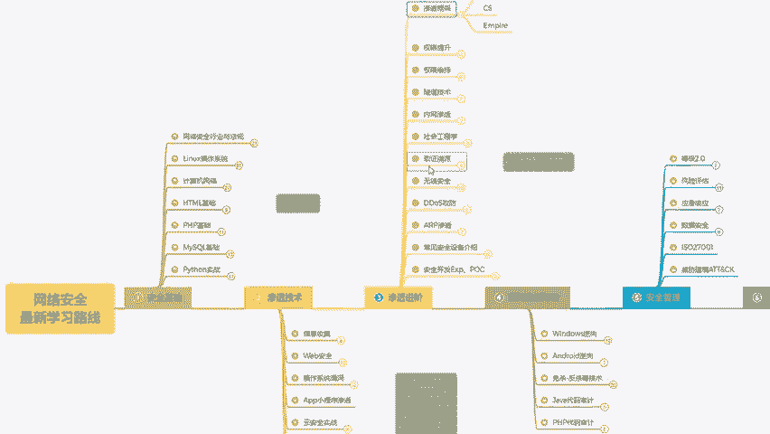

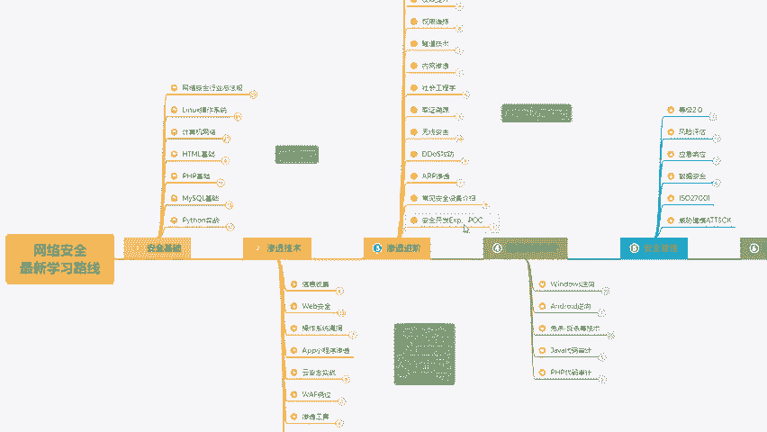

以下是逆向审计板块的核心学习内容：

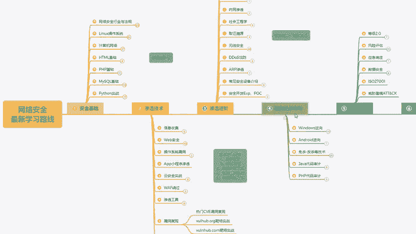

*   **Windows逆向分析**：分析Windows平台下的可执行文件。
*   **Android逆向分析**：分析Android应用程序。
*   **免杀技术**：了解恶意软件如何逃避杀毒软件的检测。
*   **代码审计**：通过审查源代码（如**Java**、**PHP**）来发现安全漏洞。

## 教程获取与总结

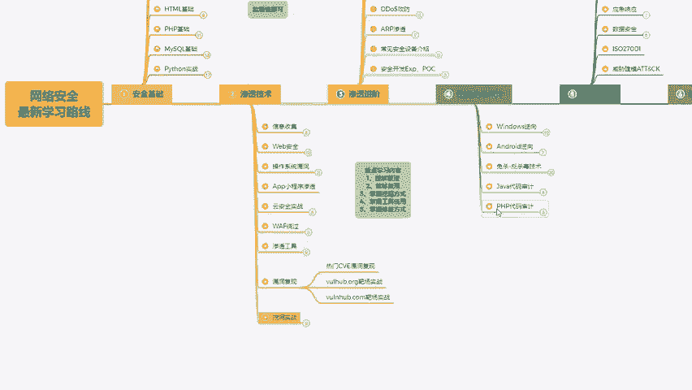

我将手把手带领大家，按照这个路线图从零开始学习网络安全技术。

如果你需要本教程中提到的课件、笔记、源码或工具，可以查看我的视频评论区，我已经将获取方式放在那里，所有资料均可无偿免费分享给大家。

希望这套教程能帮助大家在自学网络安全的道路上少走弯路。如果你觉得这套教程对你有帮助，也可以转发给有需要的人。你的支持是我持续更新的动力。

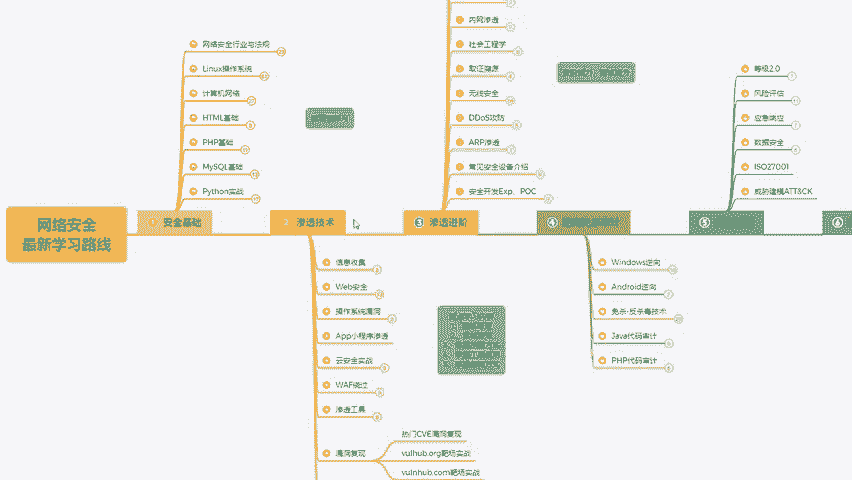

本节课中我们一起学习了网络安全的系统学习路线图，它涵盖了从安全基础、渗透技术到渗透进阶和逆向审计的完整知识体系。遵循这个路线，持之以恒地学习和实践，你将能够逐步建立起扎实的网络安全技能。