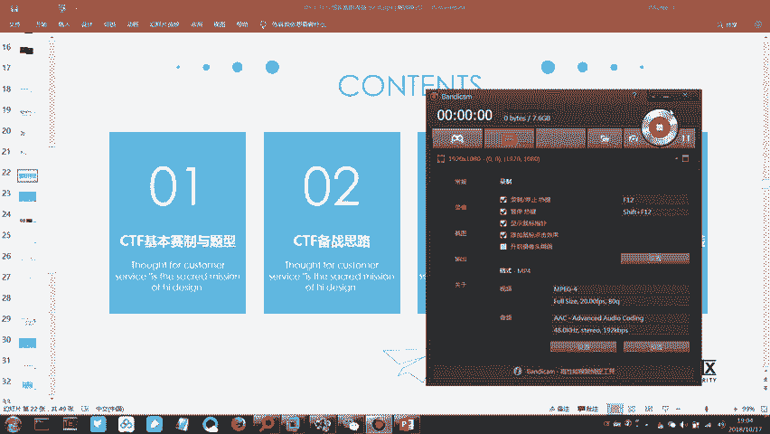
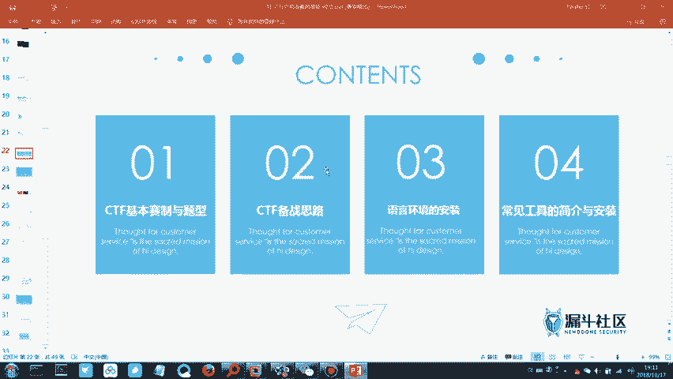
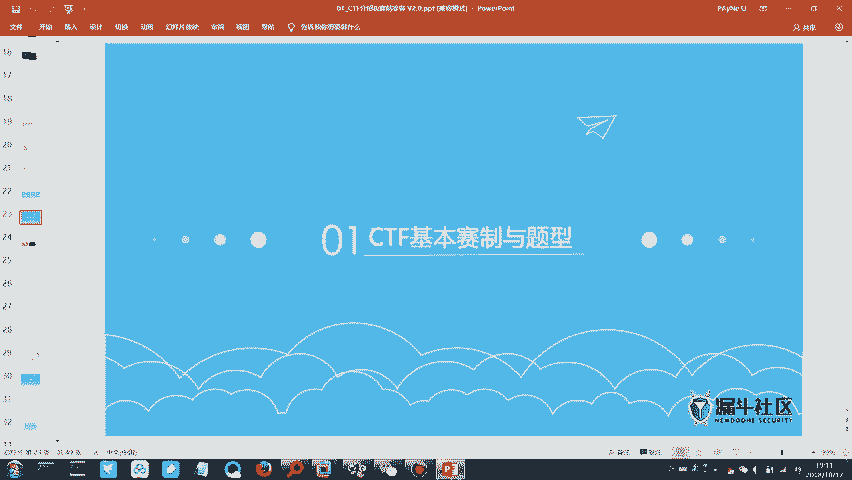
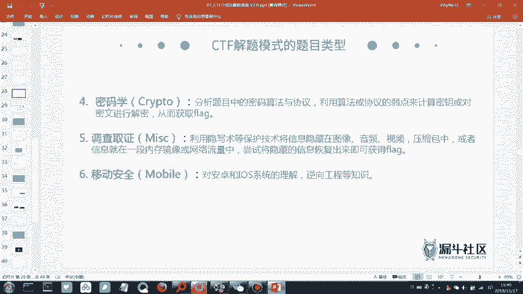
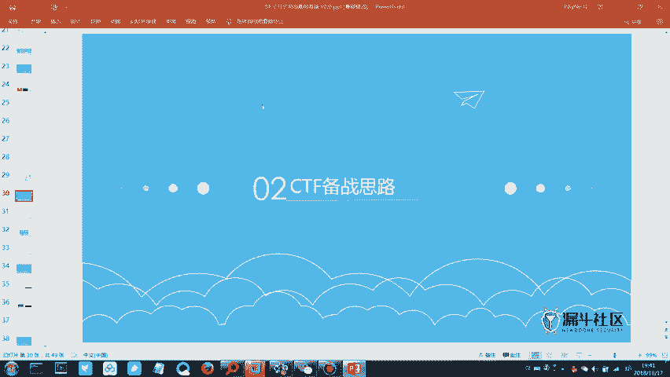

# CTF教程：2：CTF赛制与工具介绍 🚩

在本节课中，我们将要学习CTF比赛的基本赛制、常见题型以及备赛所需的核心工具。通过本节课，你将了解如何开始准备一场CTF比赛。

## 概述

上节课我们介绍了信息安全的基本概念、行业趋势以及从业方向。本节课我们将正式进入CTF相关模块，首先了解CTF比赛的基本规则和题目类型，然后介绍备赛思路和必备工具。

## CTF基本赛制与题型

CTF的全称是**Capture The Flag**，即“夺旗赛”。比赛目标是尽可能多地获取`flag`。比赛方会部署题目服务器，选手通过解题获取`flag`并提交得分，最终根据总分排名。

### 比赛模式

CTF比赛主要有三种模式：

1.  **解题模式 (Jeopardy)**：选手独立解题，获取`flag`得分。题目分数通常随时间递减。
2.  **攻防模式 (Attack-Defense)**：每个队伍既需要攻击其他队伍的服务器获取`flag`，也需要防守自己的服务器。比赛更具对抗性。
3.  **综合渗透模式**：选手攻击比赛方提供的目标服务器（如网站），发现漏洞并获取`flag`，无需相互攻击。

本次省级比赛初赛为线上解题模式，决赛通常上午为解题模式，下午为综合渗透模式。

### 常见题目类型

以下是CTF比赛中常见的六种题目类型，按通常的入门难度从易到难排序：

*   **杂项 (Miscellaneous)**：考察范围非常广泛，可能涉及信息隐写、数据分析、取证、图片处理等。技术点不深但很杂，是较好的入门方向。
*   **密码学 (Crypto)**：考察各种编码、加密算法和摘要算法。解题关键在于识别加密方式并使用工具或脚本进行解码。例如Base64编码、凯撒密码、MD5等。
*   **Web安全 (Web)**：考察网站漏洞利用，如SQL注入、跨站脚本(XSS)、文件上传漏洞、代码审计等。需要了解Web应用的工作原理和常见漏洞。
*   **逆向工程 (Reverse Engineering)**：分析给定的程序（如Windows的`.exe`或安卓的`.apk`），理解其逻辑，最终获取`flag`。需要一定的编程和汇编基础。
*   **二进制安全 (Pwn)**：通常指通过漏洞利用技术攻破服务端程序，获取系统权限。这是CTF中最难的题型之一。
*   **移动安全 (Mobile)**：通常指安卓应用的逆向与漏洞分析，可归入逆向工程范畴。

对于备赛时间有限的初学者，建议将主要精力集中在**杂项、密码学和Web安全**这三个题型上。

## 备赛思路与工具介绍

了解了赛制和题型后，我们来看看如何为比赛做准备。备赛不仅需要学习知识，还需要搭建合适的环境和工具。

### 备赛思路

我们的学习路径应遵循**由易到难**的原则：

1.  **优先攻克杂项 (Misc)**：通过大量刷题积累经验和解题思路。
2.  **学习密码学 (Crypto)**：熟悉常见编码和加密方式，掌握相关解码工具。
3.  **研究Web安全 (Web)**：理解常见Web漏洞原理和利用方法。
4.  **后续挑战**：在有时间和精力后，可以尝试学习逆向工程和二进制安全。初期目标可以是看懂别人写的解题报告（WriteUp，简称WP）。

### 必备工具与环境

以下是开始CTF学习前必须安装的几类工具：

**编程语言环境**

某些题目需要运行或编写脚本，以下三种语言的运行环境是基础：

*   **Java环境**：用于运行一些Java编写的工具或题目。
    *   安装JDK并配置环境变量。
*   **Python环境**：CTF中最常用的脚本语言，用于编写解题脚本。
    *   安装Python 3.x版本。
*   **PHP环境**：用于本地调试Web题目或运行PHP脚本。
    *   可以安装集成的环境包如XAMPP。

**核心工具软件**

以下两个工具在CTF中几乎必不可少：

*   **虚拟机软件 (如VMware Workstation)**：用于搭建和运行各种靶机、测试环境，避免对主机系统造成影响。
*   **Burp Suite**：一个强大的Web漏洞扫描和渗透测试平台，主要用于拦截、查看和修改浏览器与服务器之间的HTTP/HTTPS流量，是Web题目的神器。

**其他工具**

比赛通常会提供一个“CTF工具包”，里面包含数十种针对不同题型的工具（如Wireshark用于分析网络流量包`.pcap`，Stegsolve用于图片隐写分析等）。在实际解题时，应善于利用这些工具和在线解码网站。

## 总结

本节课我们一起学习了CTF比赛的核心内容。我们了解了CTF是一项“夺旗赛”，其常见模式包括解题、攻防和综合渗透。我们认识了六种主要的题目类型：杂项、密码学、Web安全、逆向工程、二进制安全和移动安全，并明确了由易到难的备赛学习路径。最后，我们介绍了开始CTF学习必须准备的编程语言环境和核心工具，如Python、Burp Suite和虚拟机软件。

掌握这些基础知识后，你就可以着手搭建自己的练习环境，并开始针对性地进行学习和刷题了。下节课我们将开始实践，学习具体工具的使用方法。