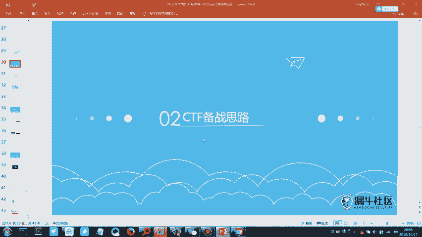
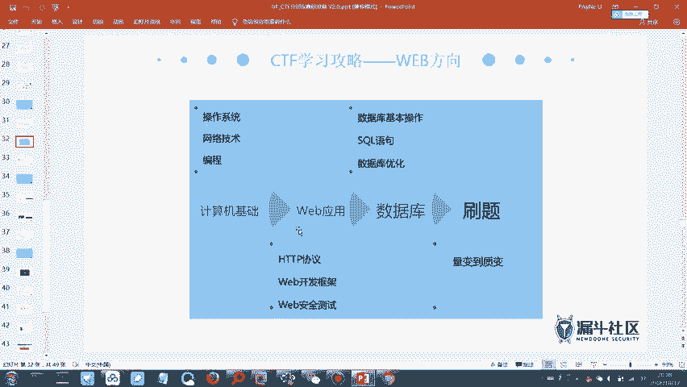
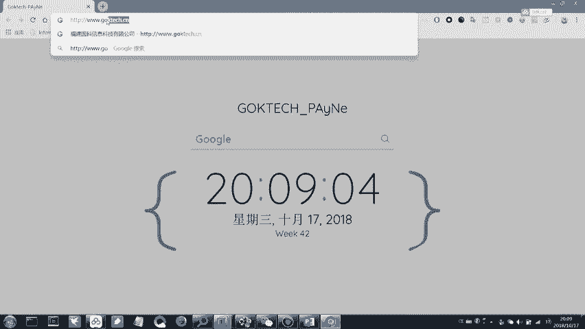
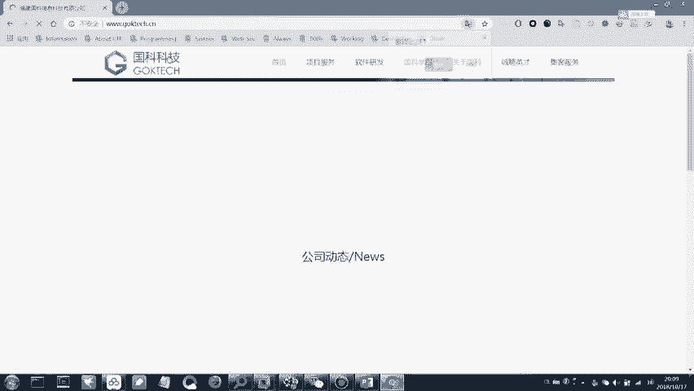
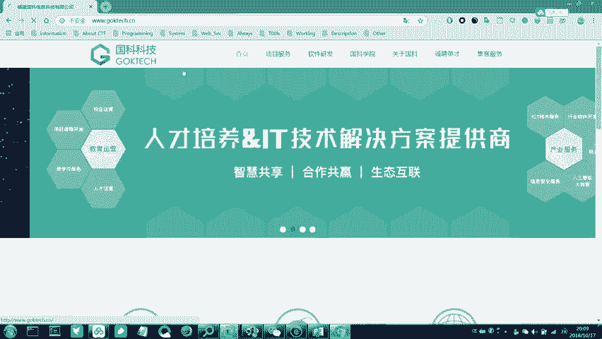
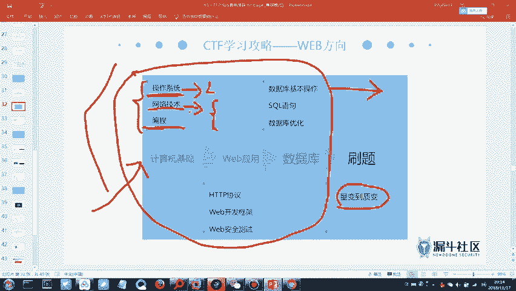
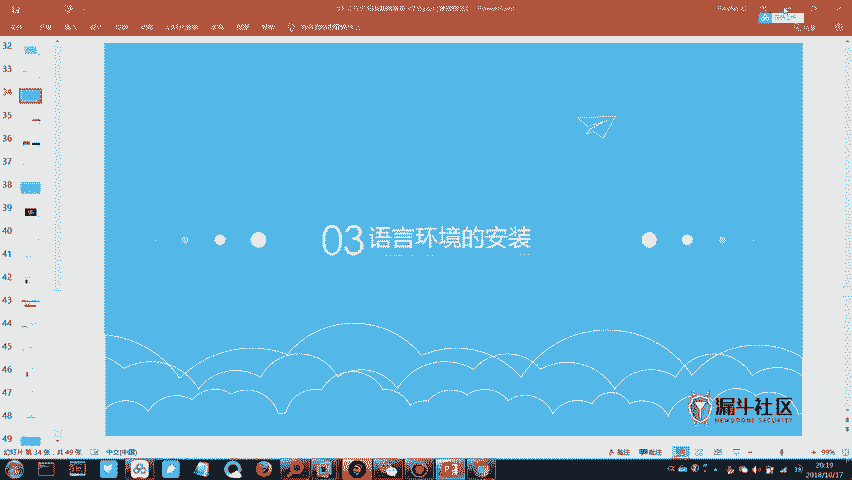
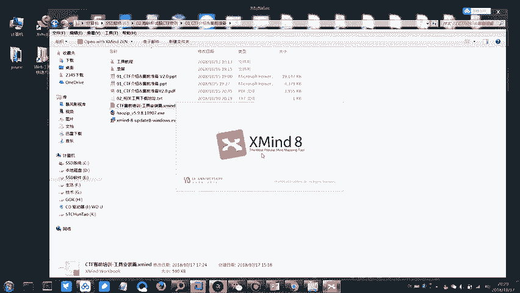
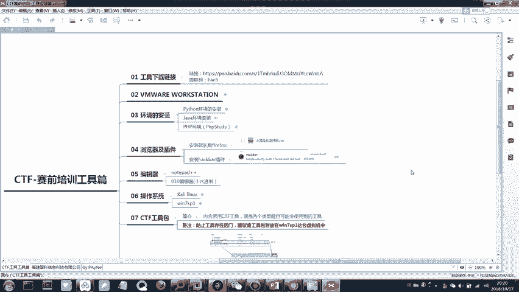

# CTF教程：3：CTF赛制介绍与工具介绍 🚩



在本节课中，我们将学习CTF比赛的备赛思路，了解需要掌握的核心知识体系，并介绍一些实用的工具和练习平台。

## 备赛思路梳理

上一节我们介绍了CTF的基本概念和模式，本节中我们来看看如何为CTF比赛做准备。梳理适合自己的备赛思路，需要对CTF所需的技术知识有一定理解。

CTF比赛所需的知识分为两大模块：基础知识和专项知识。

### 基础知识模块
以下是基础知识模块包含的内容：
1.  **Linux系统基本使用**：需要懂一些基本的Linux命令，例如进入目录、查看文件等。这在使用Kali Linux等渗透测试系统时会很有帮助。
2.  **网络协议分析**：涉及网络流量数据包的分析。需要具备类似HCNA或CCNA水平的网络技术基础，以便理解IP通信等过程。
3.  **编程能力**：这属于拔高项，并非必须，但掌握后会更有利。





### 专项知识模块
专项知识又分为两个主要方向：
*   **Pwn（二进制漏洞利用） + 逆向工程 + 密码学**：这个方向难度相对较高。
*   **Web安全 + 杂项（Misc）**：这个方向涉及的技术点相对集中，更注重漏洞原理的利用和信息收集能力。





## 具体技能学习路线

以下是建议的技能学习路线，每个部分只需掌握基础，无需精通。

### 操作系统与网络
*   **Linux命令**：掌握基本命令即可，例如 `cd`（进入目录）、`ls`（查看文件）。
*   **网络技术**：理解基础的网络通信原理，如IP地址、路由等。

### Web应用安全
*   **HTTP/HTTPS协议**：必须掌握。HTTP是Web通信的基础协议。HTTPS可以理解为 `HTTPS = HTTP + TLS/SSL`，提供了加密传输，更安全。
*   **数据库与SQL**：需要掌握基本的SQL增删查改语句。例如：
    ```sql
    SELECT * FROM users WHERE id=1; -- 查询
    INSERT INTO users (name) VALUES ('test'); -- 插入
    UPDATE users SET name='admin' WHERE id=1; -- 更新
    DELETE FROM users WHERE id=1; -- 删除
    ```
    理解SQL是学习SQL注入漏洞的前提。

### 学习方法与心态
CTF注重知识的广度而非深度。建议对每个部分稍作了解，然后通过大量刷题来积累经验和思路。如果在学习过程中对某个方向产生浓厚兴趣，可以深入钻研。

遇到不懂的知识点，可以随时通过搜索引擎（如Google，可能需要VPN访问）查询。这是一个从量变到质变的过程。

## 练习平台推荐

以下是刷题练习的平台，量变到质变的过程就从这里开始。

**题目平台：**
*   **实验吧**：题目相对友好，适合入门。
*   **BugKu CTF**：题目难度适中，适合初学者。
*   **i春秋CTF大本营**：包含大量历年比赛真题，难度较高，适合进阶练习。

**参考答案（WP）：**
*   实验吧等平台通常自带题解。
*   也可以在各平台的Writeup专区或相关论坛查找答案。

建议初学者从实验吧和BugKu CTF开始，建立信心后再挑战i春秋上的真题。



## 工具安装与实践

现在进入今晚的实践操作部分：工具的安装与使用。

1.  请打开群文件中下载的思维导图软件（Xmind）。
2.  用Xmind打开群文件中分享的思维导图文件，里面包含了知识体系的梳理，可供后续学习参考。

---







本节课中我们一起学习了CTF的备赛知识框架，明确了需要掌握的基础和专项技能，并获得了实用的练习平台和工具。记住，学习CTF的关键在于广泛涉猎、勤于练习，并在实践中不断巩固和深化理解。