# CTF培训：5：杂项的基本解题思路上半部分 🧩

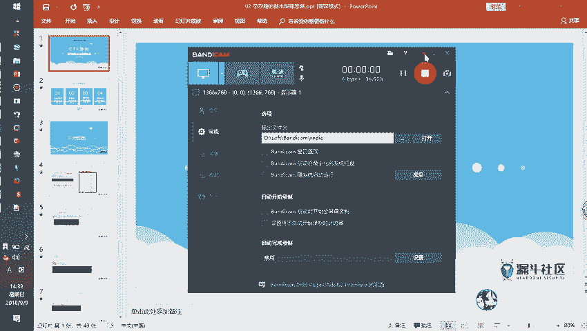


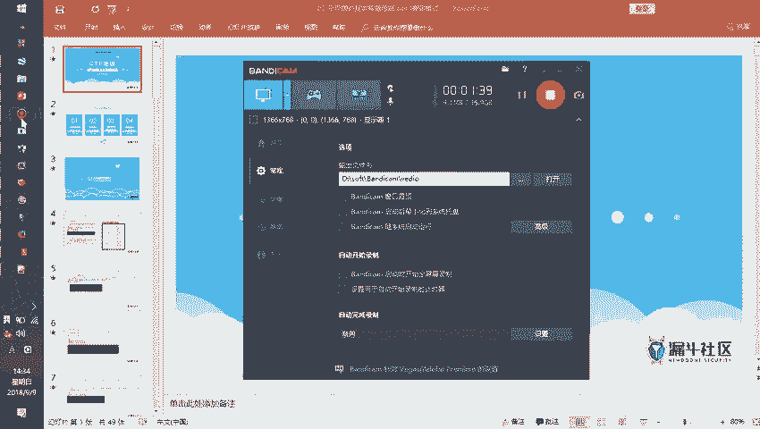

## 概述
在本节课中，我们将学习CTF比赛中杂项（Misc）题型的基本解题思路。杂项题目内容庞杂，但核心在于掌握各类文件的分析与处理工具。本节课将重点介绍文件操作与隐写、图片隐写两大核心部分，通过具体案例和工具演示，帮助初学者建立解题框架。

---

## CTF五大题型简介
在深入杂项之前，我们先了解CTF比赛的五大常见题型。


1.  **Web**：考察网站安全漏洞，如SQL注入、XSS等。
2.  **杂项（Misc）**：内容广泛，涉及文件分析、隐写、流量分析等。
3.  **密码学（Crypto）**：考察各种加密算法的分析与破解。
4.  **逆向工程（Reverse Engineering）**：分析程序二进制代码，理解其逻辑。
5.  **破解（Pwn）**：利用程序漏洞获取系统控制权。

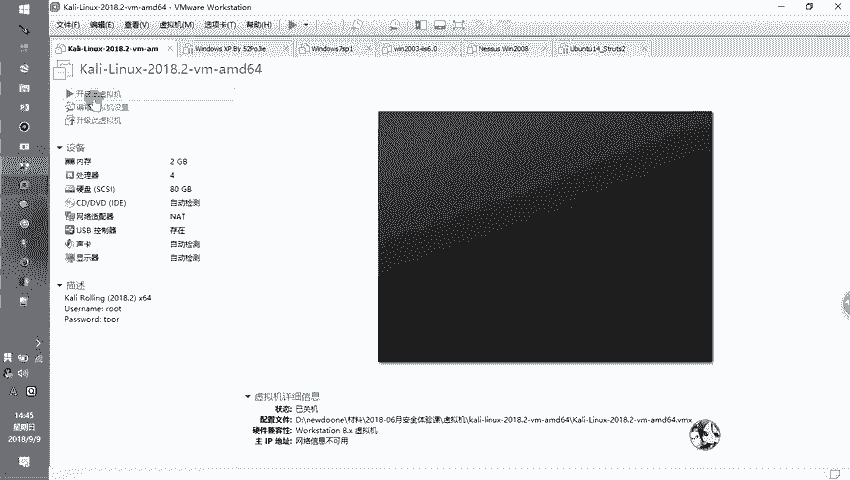

其中，Web、杂项和密码学是短期内可以通过培训掌握并拿分的关键点。逆向和破解则需要更长时间的学习和积累。

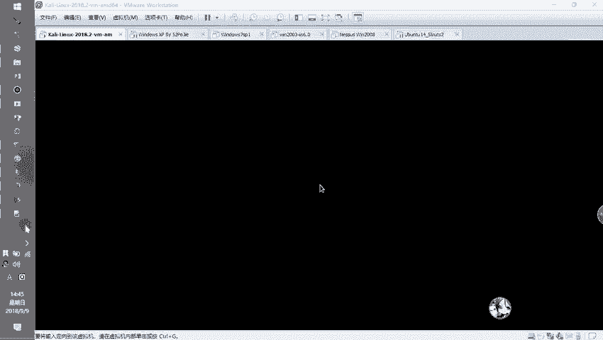

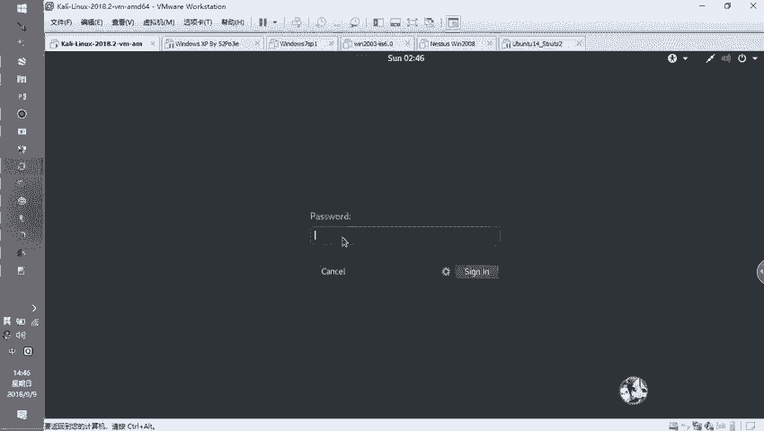

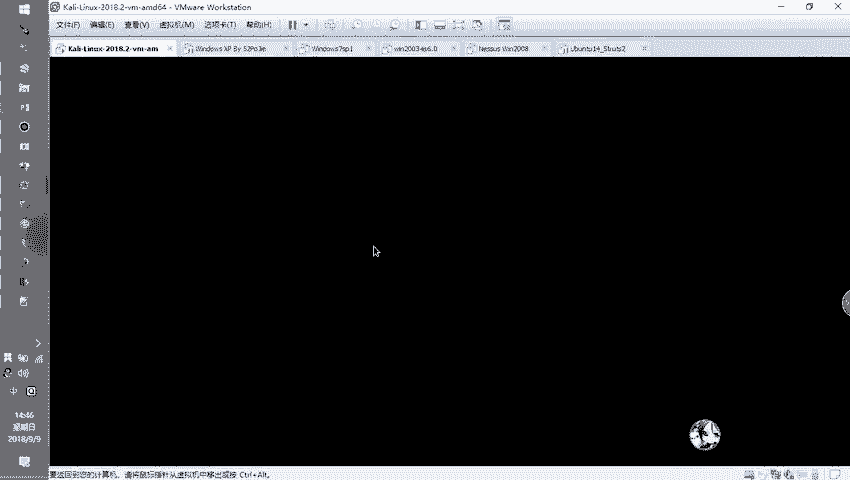

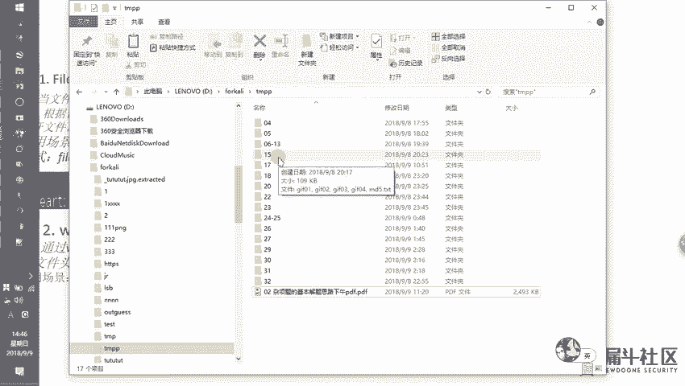

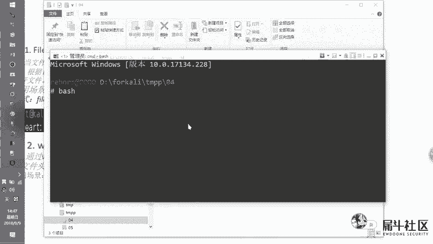

> 杂项和密码学是不分家的。很多题目会综合多个考点，考察选手的综合能力和快速学习能力。

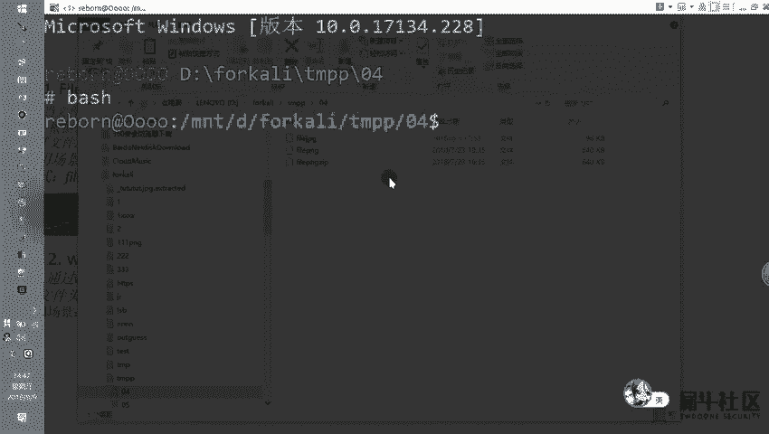

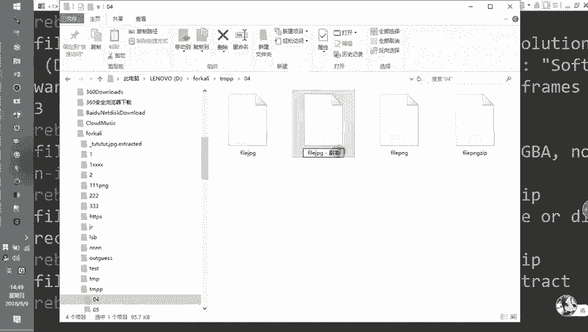

---

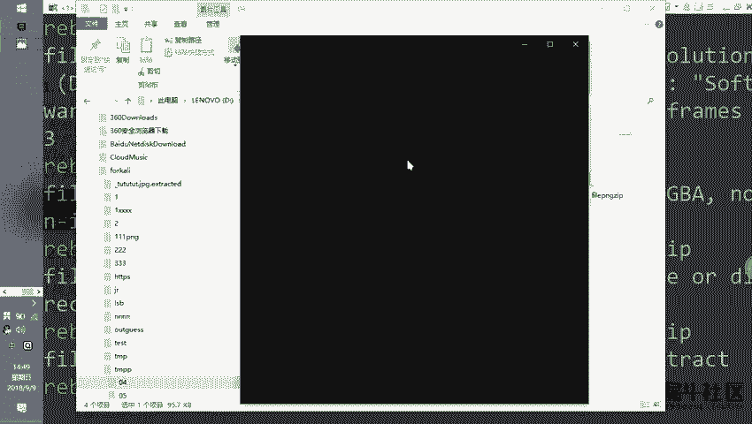

## 第一部分：文件操作与隐写 📁

### 文件类型识别
处理任何文件的第一步，都是识别其真实类型。出题人常常会删除或修改文件的后缀名来增加难度。

**工具：`file` 命令**
在Linux环境下，可以使用 `file` 命令来识别文件类型。该命令通过分析文件的**文件头（Magic Number）**来判断类型。

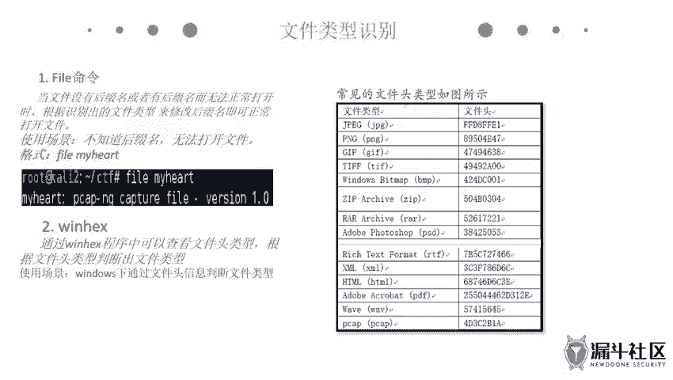

**公式/代码：**
```bash
file <文件名>
```
例如，识别一个无后缀文件：
```bash
file mystery_file
# 输出可能为：JPEG image data, JFIF standard 1.01
```

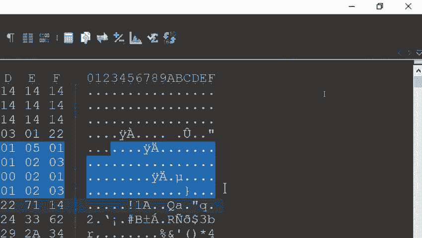

**原理**：每种文件格式都有特定的文件头。例如：
*   JPEG: `FF D8 FF E0`
*   PNG: `89 50 4E 47`
*   ZIP: `50 4B 03 04`

如果文件头被破坏或修改，`file` 命令可能无法识别或识别错误，这时就需要进行文件修复。

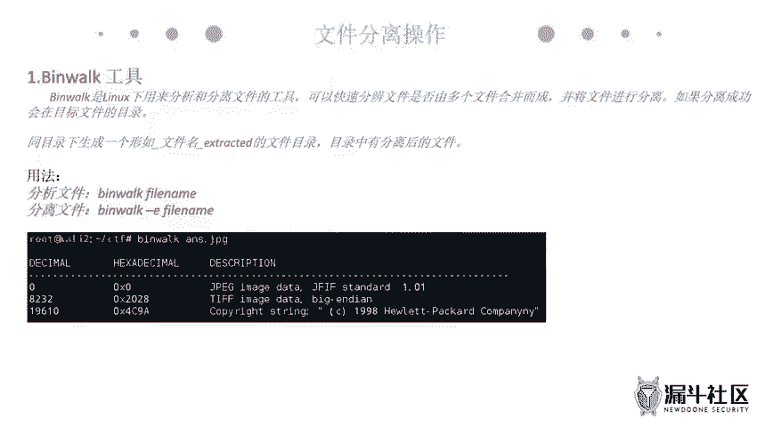

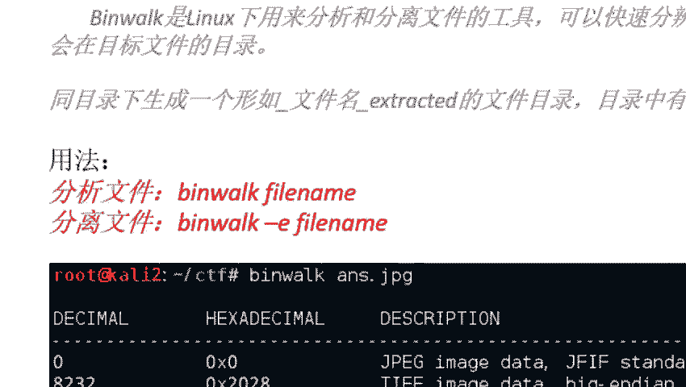

### 十六进制编辑器
当需要查看或直接修改文件底层数据（包括文件头）时，就需要用到十六进制编辑器。

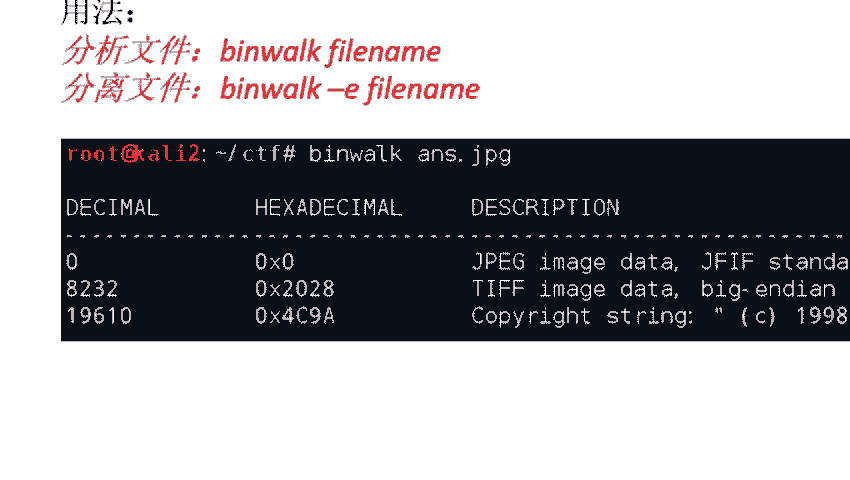

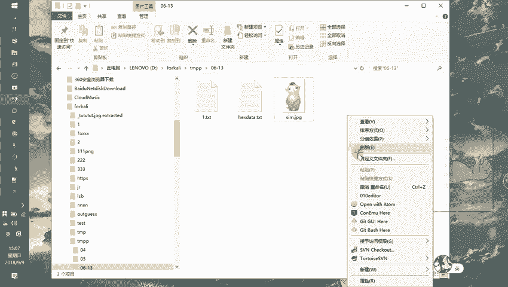

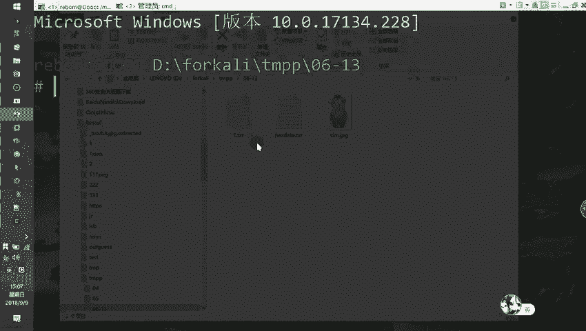

**推荐工具：**
1.  **010 Editor**：功能强大，推荐使用。
2.  **WinHex**：老牌工具，但可能需破解。
3.  **Notepad++** + `Hex Editor` 插件：轻量级选择。

**基本操作**：使用编辑器打开文件，可以看到三栏信息：地址（Address）、十六进制数据（Hex）、可打印字符（Text）。最简单的隐写可能就是将flag直接以文本形式写在文件的开头或末尾。

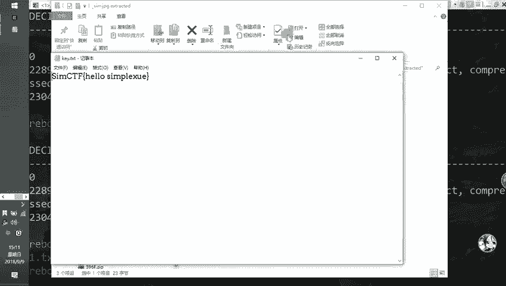


### 文件头修复
当文件因头部损坏而无法打开时，就需要进行修复。

**解题步骤：**
1.  用 `file` 命令查看，若显示为 `data`，则可能是文件头问题。
2.  用十六进制编辑器（如010 Editor）打开文件。
3.  根据文件应有的类型，在文件起始位置补上或修正正确的文件头。
    *   例如，一个PNG图片的文件头应为 `89 50 4E 47 0D 0A 1A 0A`。

### 文件分离
一个文件（如图片）中可能隐藏了其他文件（如压缩包、文本）。我们需要将其分离出来。

以下是几种文件分离的方法：

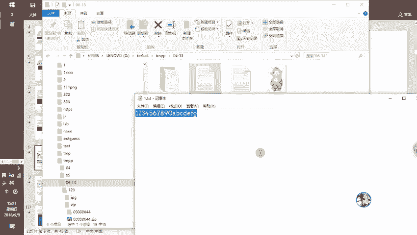

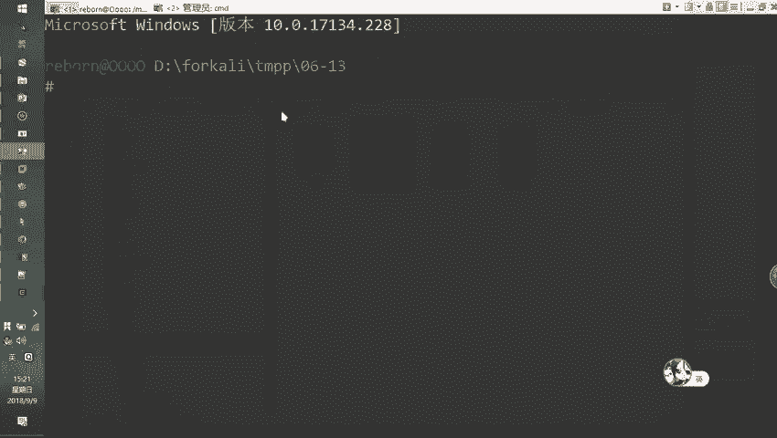

**方法一：使用 `binwalk` 工具**
`binwalk` 可以自动分析文件中嵌入的其他文件。

**代码：**
```bash
# 分析文件结构
binwalk image.jpg

# 自动分离所有嵌入的文件
binwalk -e image.jpg
```
分离后的文件会保存在 `_image.jpg.extracted` 目录中。

**方法二：使用 `foremost` 工具**
`foremost` 是另一个自动分离工具，有时比 `binwalk` 更有效。

**代码：**
```bash
foremost -i image.jpg -o output_dir
```
文件将按类型分类保存在 `output_dir` 目录中。

**方法三：使用 `dd` 命令进行手动精确分离**
当自动工具失效时，可以使用 `dd` 命令手动切割文件。这需要知道目标数据的起始偏移量和大小。

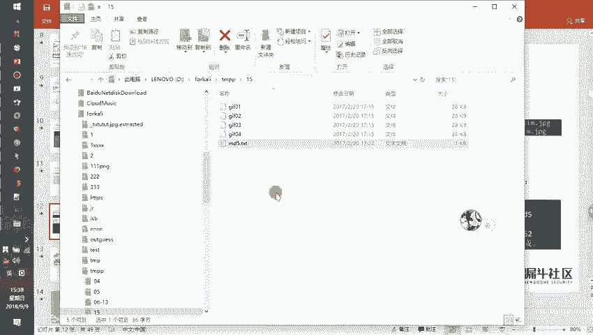

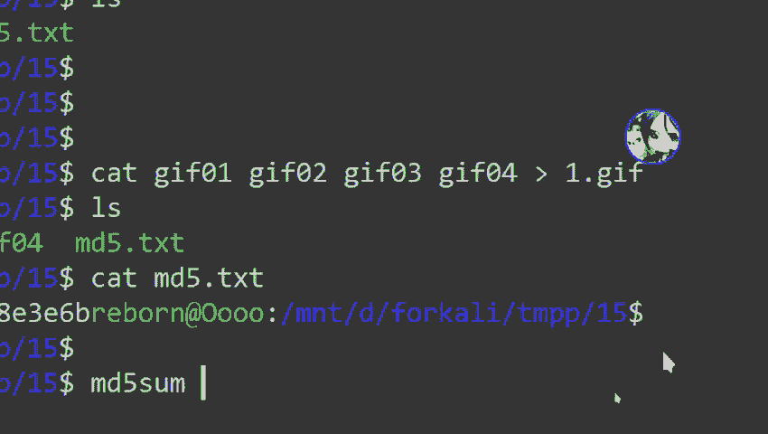

**代码：**
```bash
# 从文件开头跳过 22895 字节，读取后续数据并保存为 zip 文件
dd if=combined.jpg of=hidden.zip bs=1 skip=22895
```
*   `if=`：输入文件
*   `of=`：输出文件
*   `bs=`：块大小（字节）
*   `skip=`：跳过的块数
*   `count=`：读取的块数（可选）

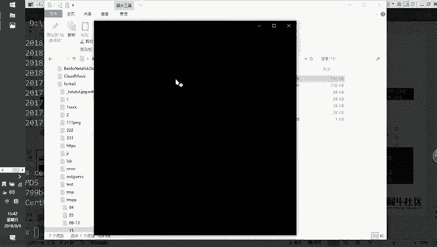

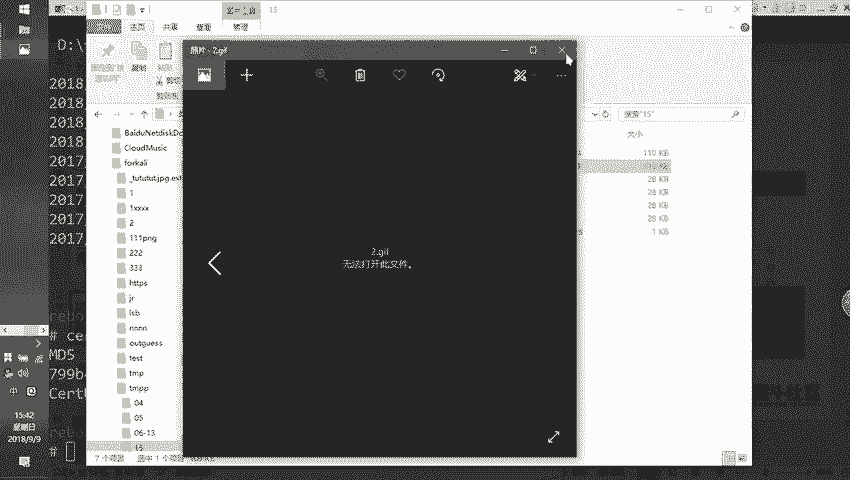

**方法四：使用十六进制编辑器手动选择保存**
在010 Editor中，可以直接用鼠标选中目标数据的十六进制区域，右键选择 `Save Selection` 另存为新文件。

### 文件合并
与分离相反，有时题目会将一个文件分割成多个碎片，需要你将其合并。

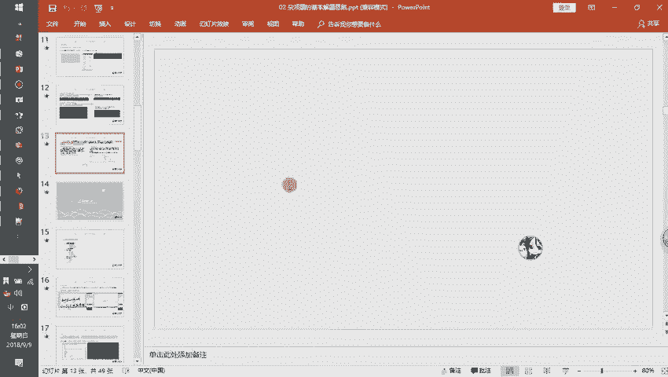


**在Linux下使用 `cat` 命令：**
```bash
cat part1 part2 part3 > merged_file
```

**在Windows下使用 `copy` 命令：**
```cmd
copy /B part1 + part2 + part3 merged_file
```
合并后，可能需要校验文件的MD5值是否与题目给出的一致，以确认合并正确。

### 十六进制数据转储
有时题目给的是一个包含十六进制ASCII码的文本文件，需要将其还原为原始二进制文件。

**操作步骤：**
1.  用十六进制编辑器（如010 Editor）新建一个文件。
2.  选择 `File` -> `Import` -> `Hex Text`，导入文本文件。
3.  编辑器会自动将形如 `504B0304` 的文本转换为十六进制数据。
4.  将文件另存为正确的格式（如 `.zip`）。

### 字符串搜索
最基础的隐写查找方法。

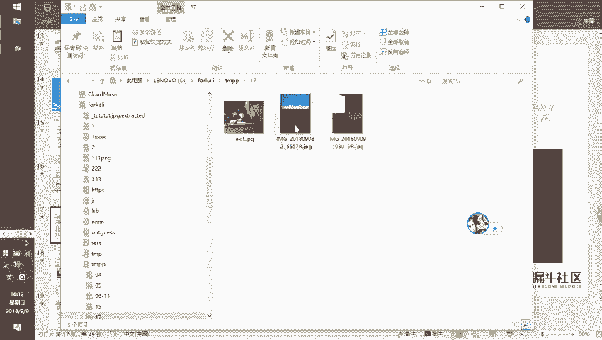

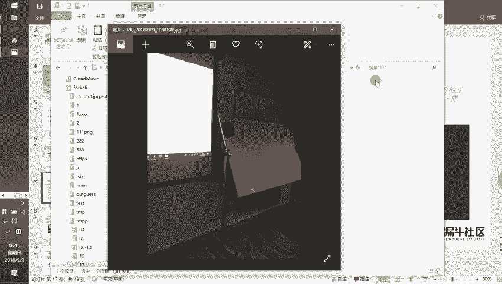

**操作：** 用高级文本编辑器（如Notepad++、Sublime Text）或十六进制编辑器打开文件，使用搜索功能（Ctrl+F）查找常见关键词，如 `flag`、`key`、`ctf` 等。

---

## 第二部分：图片隐写 🖼️

上一节我们介绍了通用的文件操作，本节中我们来看看专门针对图片的隐写技术。图片隐写的方式多种多样。

### 1. 细微颜色差别/图片操作
有时信息隐藏在两张看似相同的图片的差异中。

**工具：Stegsolve**
这是一个Java编写的图片分析工具，可以方便地对图片进行各种操作。

**常见操作：**
*   **异或（XOR）、加（ADD）、减（SUB）**：对两张图片的像素进行逐位运算，可能得到隐藏的二维码或其他图像。
*   **通道查看（Channel）**：单独查看图片的R、G、B或Alpha通道。

**解题思路**：如果题目给了两张相似的图片，尝试用Stegsolve打开一张，然后通过 `Analyse` -> `Image Combiner` 加载另一张，并切换不同的操作模式（如XOR, SUB等），观察是否出现隐藏信息。

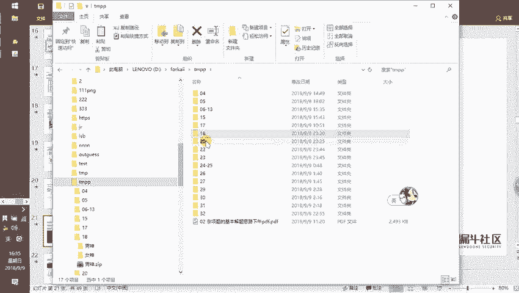

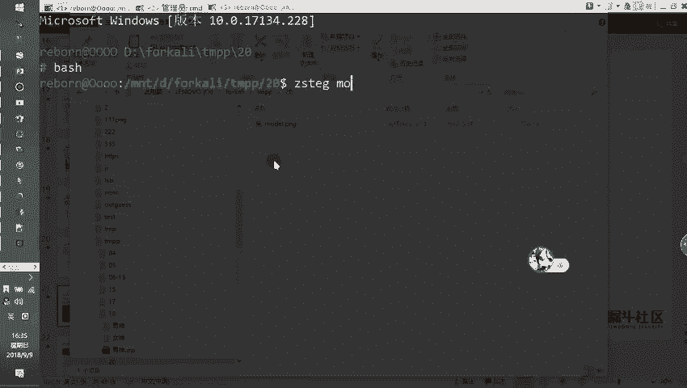

### 2. EXIF信息
EXIF是嵌入在图片中的元数据，可能包含拍摄时间、设备型号，甚至**GPS地理位置**。

**查看方法：**
*   **Windows**：右键图片 -> `属性` -> `详细信息`。
*   **Linux命令**：`exiftool <图片名>`
*   **在线工具/软件**：很多图片查看器也支持。

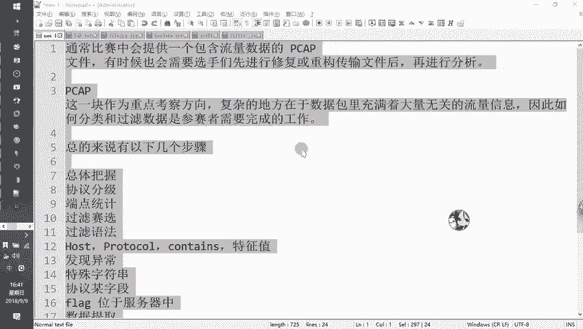

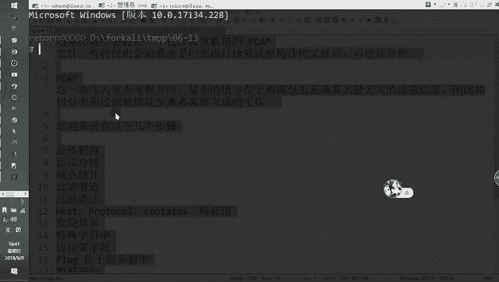

**考点**：Flag或提示可能直接写在EXIF的注释（Comment）字段中。如果包含GPS坐标，可以在地图软件中定位。

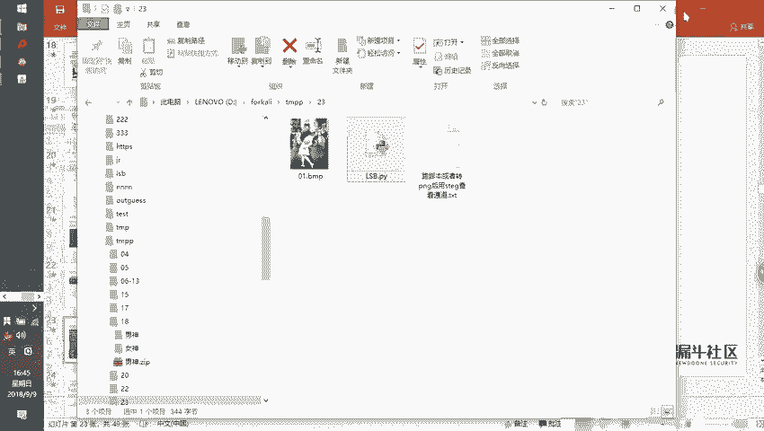

### 3. 最低有效位隐写
这是最常见的图片隐写技术之一。原理是修改像素RGB值的最低有效位（LSB, Least Significant Bit），因为人眼察觉不到这种微小的颜色变化，但可以编码隐藏信息。

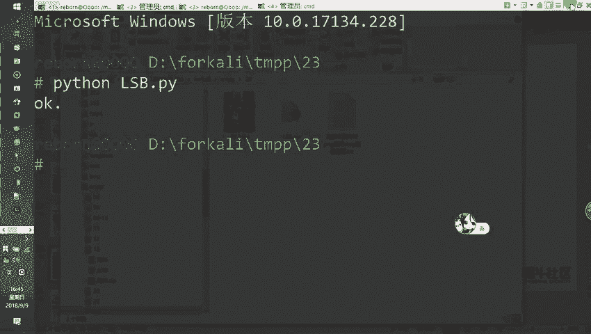

**工具与方法：**

*   **Stegsolve**：在 `Analyse` -> `Data Extract` 界面，勾选相应的位平面（Bit Planes），特别是RGB通道的LSB（如Red plane 0, Green plane 0, Blue plane 0），尝试不同的顺序（如RGB, BGR），在预览中查找可读文本。
*   **zsteg**：一个命令行工具，能自动尝试多种LSB隐写方案，并输出所有可能隐藏的数据。
    **代码：** `zsteg image.png`
*   **wbStego**：一个图形化工具，支持在BMP图片中隐写。有时需要先将图片转换为BMP格式。
*   **Python脚本**：当以上工具不适用或需要定制时，可以自己编写脚本提取LSB信息。

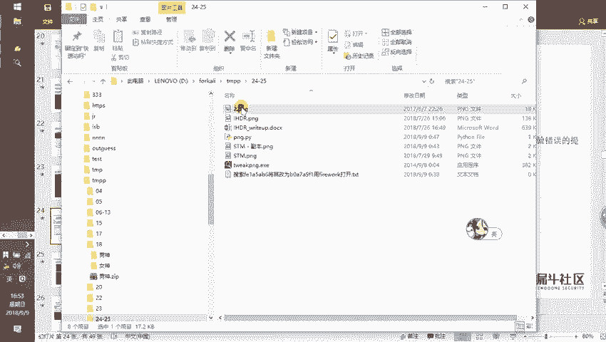

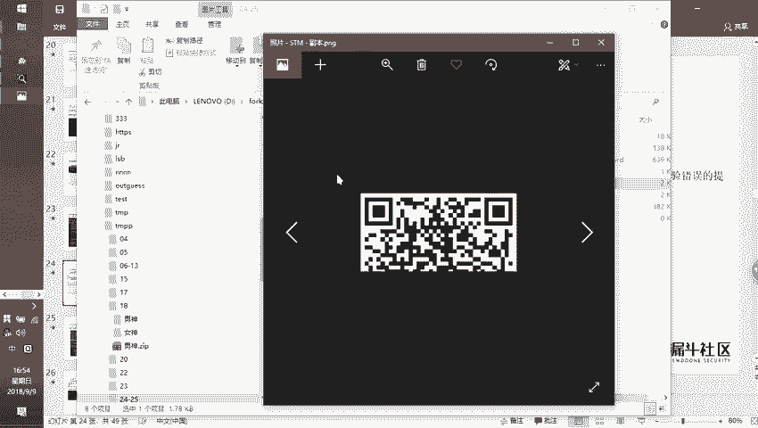

### 4. 图片修复
图片文件结构可能被破坏，导致无法正常显示。

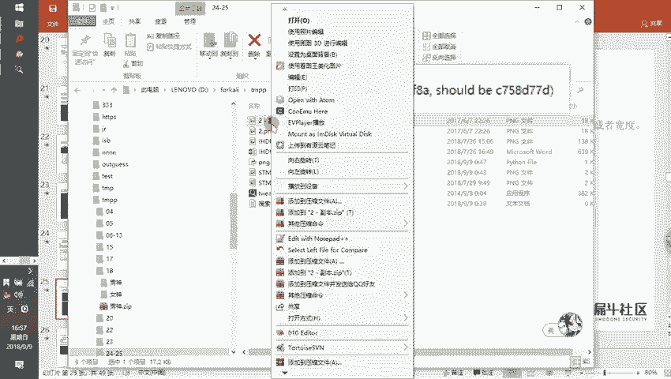

**常见问题与工具：**
*   **CRC校验错误**：PNG图片的`IHDR`块有一个CRC校验值。如果图片被修改，校验会失败。可以使用 `TweakPNG` 这类工具打开图片，它会提示正确的CRC值，然后用十六进制编辑器修正即可。
*   **长宽修改**：更常见的是，出题人修改了PNG图片`IHDR`块中的高度或宽度值，导致图片只显示一部分。我们需要计算正确的长宽值。
    *   **方法**：使用Python脚本，利用未修改的CRC值倒推出正确的高度。修正高度后，完整的图片（可能包含flag）就会显示出来。

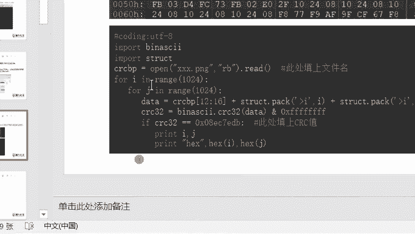

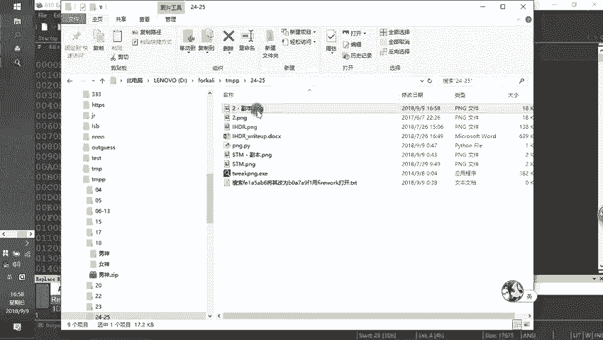

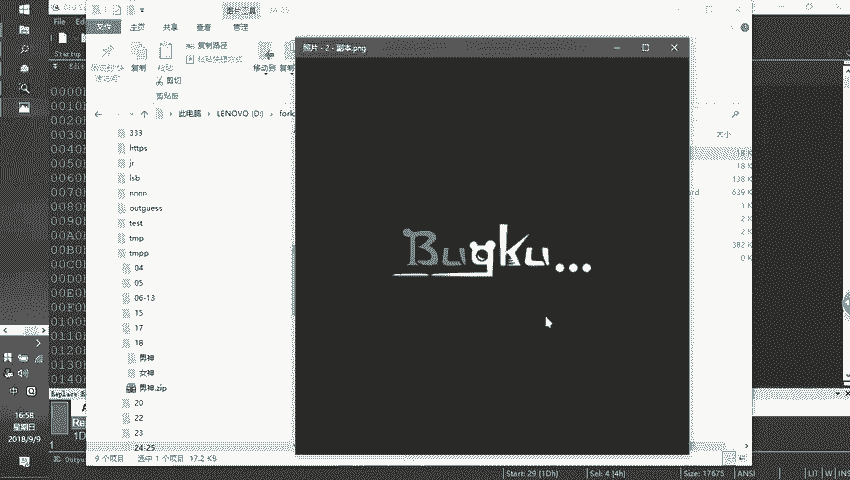

### 5. 图片加密
图片本身可能被某种算法加密。

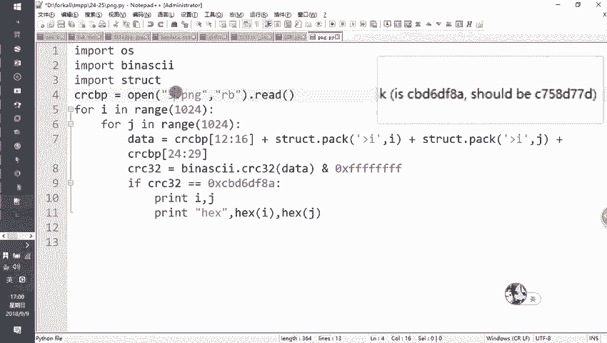

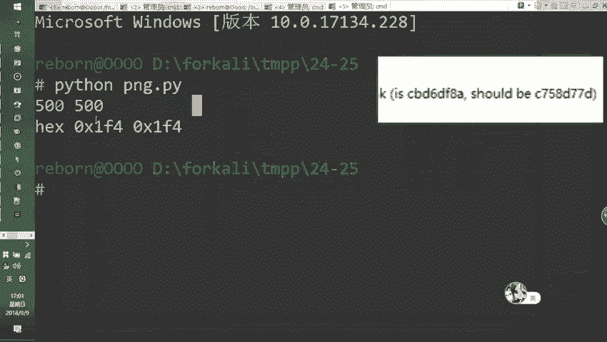

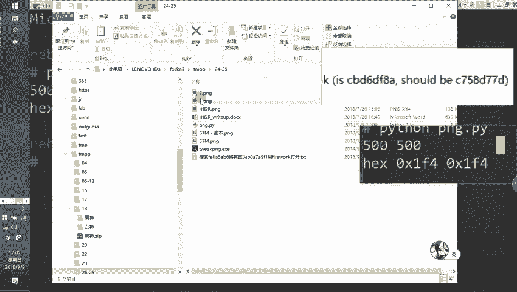

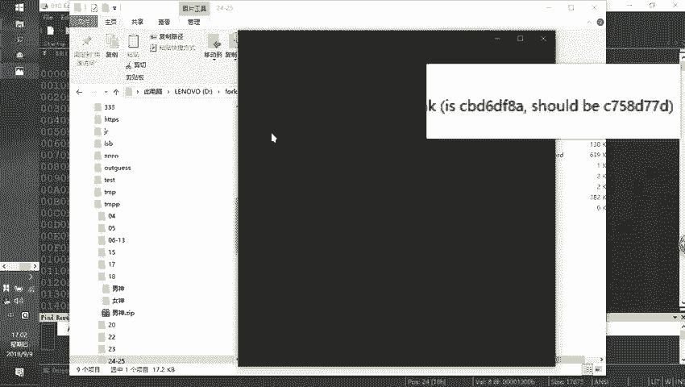

**解题思路：**
1.  **识别算法**：题目名称或描述可能给出提示（如`outguess`、`F5`）。对于JPEG，可以使用 `stegdetect` 工具进行检测。
    **代码：** `stegdetect -s 10.0 image.jpg` （提高敏感度）
2.  **使用对应工具解密**：
    *   **outguess**：`outguess -r encrypted.jpg flag.txt`
    *   **F5**：使用Java包 `F5Steg.jar` 解密。
    *   **其他工具**：如 `steghide`、`jphide` 等，均有对应的提取命令。

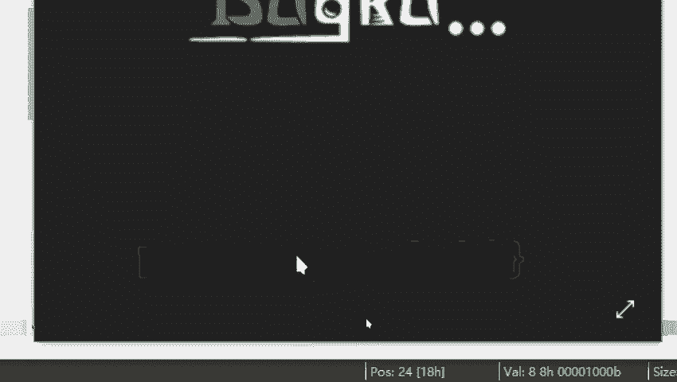

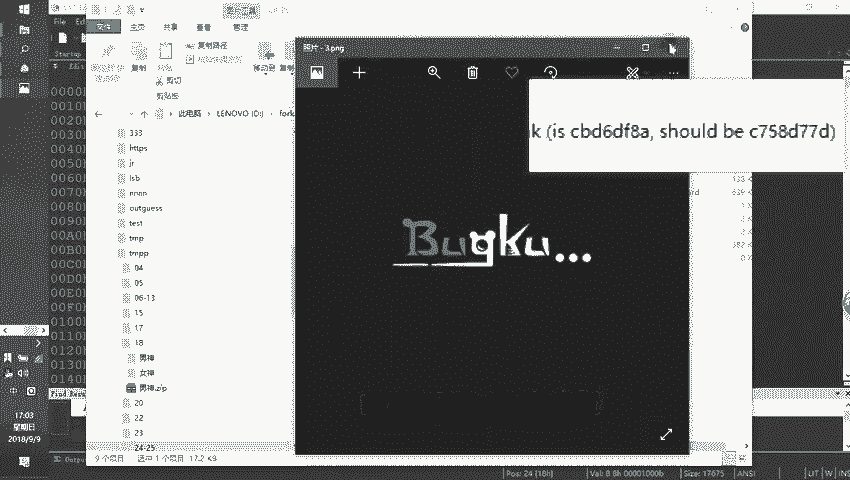

### 6. 二维码处理
千辛万苦得到的二维码可能无法直接扫描。

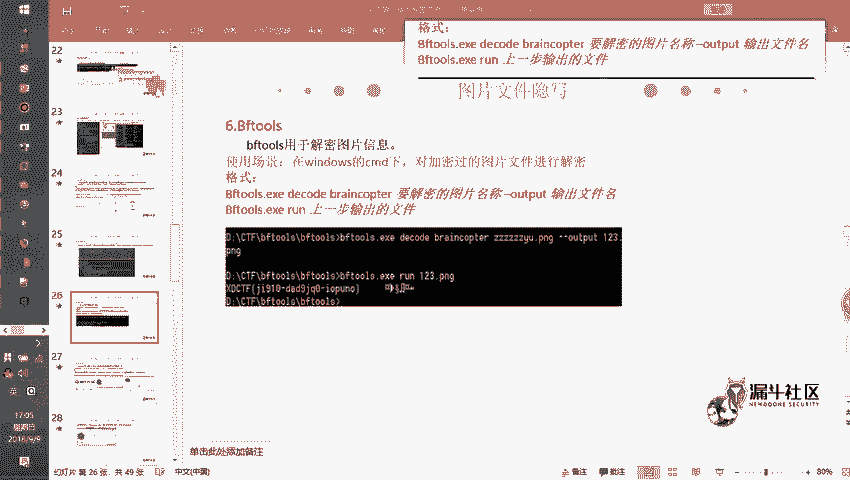

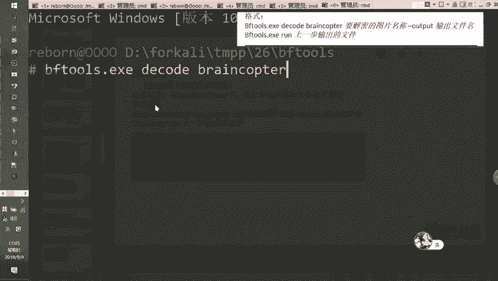

**常见处理：**
*   **取反（反色）**：二维码需要黑白对比分明。用画图工具选中图片，右键选择“反色”，将黑变白、白变黑。
*   **补全定位点**：有时二维码的定位标记被破坏，需要根据格式手动修补。
*   **通道分离**：彩色二维码可能信息藏在某个颜色通道里，用Stegsolve查看各个通道，找到清晰的二维码图像。

**进阶情况**：可能得到多个二维码，分别提供密文、密钥和加密算法（如DES），需要综合密码学知识进行解密。

---

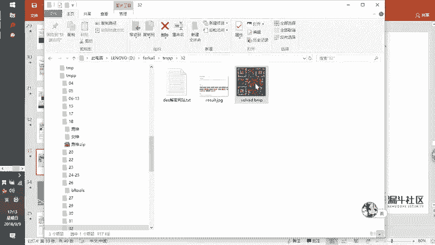

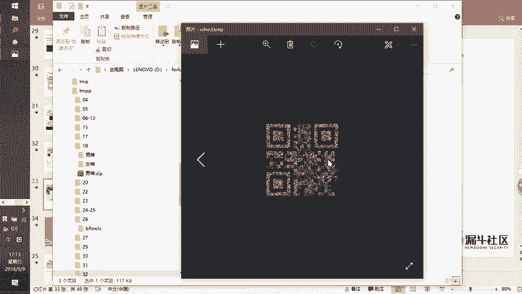

## 总结
本节课我们一起学习了CTF杂项题型中文件操作与图片隐写的核心解题思路。


*   **文件操作**：关键在于识别文件类型、修复文件结构、分离/合并文件，以及基础的字符串搜索。熟练使用 `file`、`binwalk`、`dd` 和十六进制编辑器是基础。
*   **图片隐写**：涉及面更广，包括分析图片差异（Stegsolve）、查看EXIF信息、提取LSB隐写（zsteg, Stegsolve）、修复损坏图片以及解密被加密的图片。


杂项题目“杂”的特点要求我们掌握大量工具，并具备灵活运用的能力。遇到新题型时，快速学习和联想是关键。下节课我们将继续学习杂项中的压缩包分析和流量取证技术。