# CTF培训：7：密码学下半部分 🧩

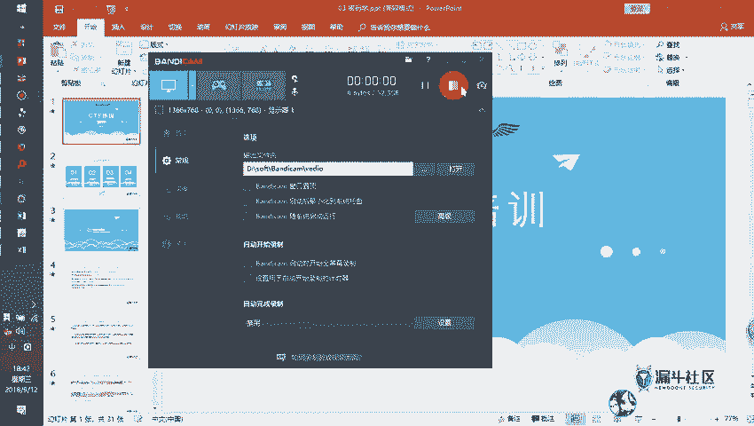

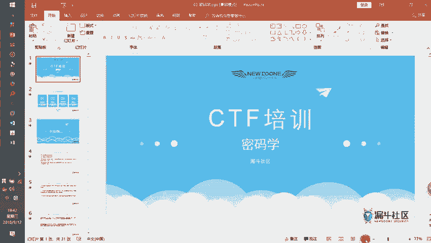

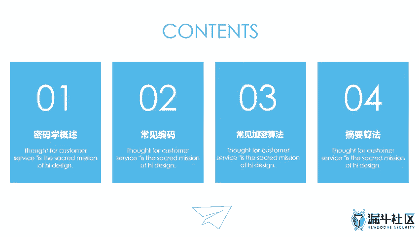

在本节课中，我们将学习密码学的基础知识，包括编码、加密算法和摘要算法的概念与区别。课程内容旨在让初学者能够理解并掌握CTF中常见的密码学题型。

## 密码学概述

上一节我们介绍了密码学的整体框架，本节中我们来看看密码学的具体分类和发展历程。

密码学常见的有两种类型：编码和加密。这两者是不一样的概念。此外，还有一种叫做摘要算法。

密码学的发展经历了几个阶段。CTF题目中会涉及多种题型，包括古典密码学，即古代人们如何进行数据加密。近代密码学则与战争时期的电报加密相关。现代密码学涉及的题目难度通常较大，因为它保证了数据的不可逆性，采用了较强的加密方式。初学者接触的练习题多为古典或近代密码，而难题通常属于现代密码。

编码学是密码学的一个分支，它可能并不完全等同于密码。编码更像是一种映射关系。例如，你可以创造一套自己的符号，每个符号代表一个意思，写成文章发给另一个人，只有他知道编码的含义。加密则是另一种形式，它通过算法对数据进行混淆，使其难以区分原始内容。

编码题，如ASCII、Unicode、URL或Base64编码，通常比加密题简单，可能直接用工具就能解决。加密题则需要了解更多信息，例如密钥、明文和密文。

加密涉及两种主要算法：对称密钥算法和非对称密钥算法。

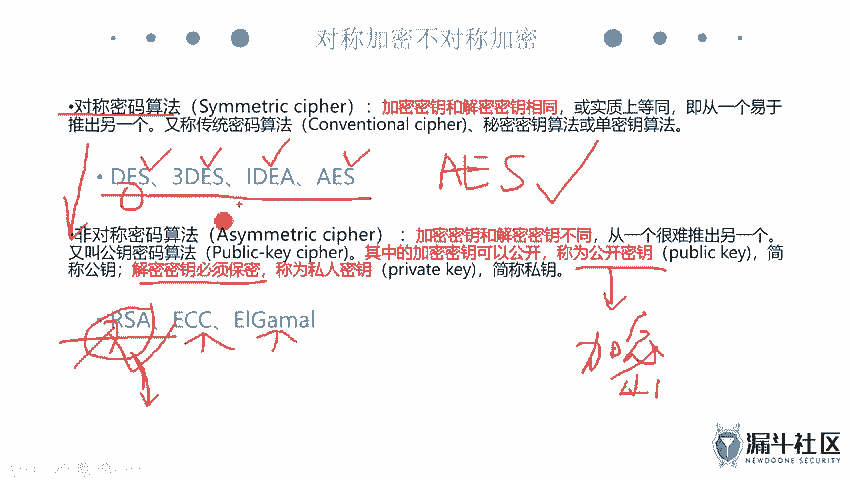

对称密钥算法中，加密和解密使用同一个密钥。这就像用同一把钥匙既能锁门也能开门。

非对称密钥算法使用两个密钥：一个用于加密（公钥），一个用于解密（私钥）。公钥可以公开给所有人，但只有持有私钥的人才能解密。这种算法的复杂度远高于对称密钥算法。例如，用对称密钥加密1GB数据可能只需几十分钟，而非对称密钥可能需要一两天，因为其加密过程更为复杂。

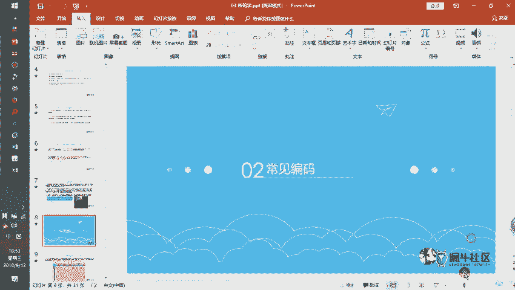

以下是常见的对称密钥算法：
*   **DES**：早期常用。
*   **3DES**：在DES基础上将密钥长度扩展三倍。
*   **IDEA**：一种对称密钥算法。
*   **AES**：目前公认最强的对称密钥算法，尚未被破解。

非对称密钥算法是现代密码学难题的集中领域，其中RSA算法最为常见和常考。要深入理解RSA，需要一定的数学基础，如费马定理。本课程不会深入讲解RSA，而是聚焦于更常见和简单的加密算法。

## 摘要算法

接下来，我们看看摘要算法。摘要算法，也称为哈希算法，主要用于验证数据的完整性。例如，数据从A点传输到B点时，需要确保数据未被篡改或破坏。摘要算法就是用来实现这种数据完整性校验的。

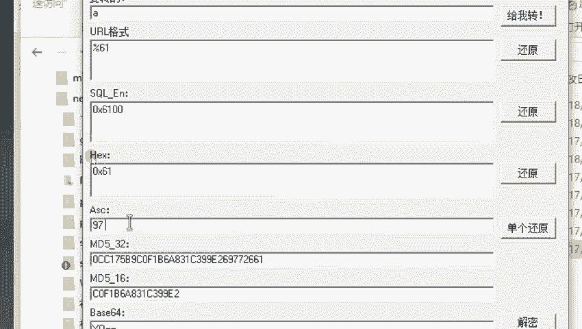

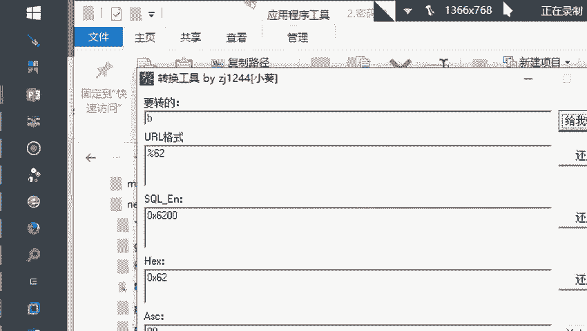

哈希算法主要有两种：
*   **MD5**：一种不可逆的算法。
*   **SHA** 系列：与MD5同级别的哈希算法。

这种算法的特点是，任何微小的输入变化都会导致输出结果截然不同。例如，在网上下载软件时，官方通常会提供MD5或SHA值供用户校验。如果下载后计算出的哈希值与官方不一致，则说明文件可能被篡改或含有病毒。

## 常见编码

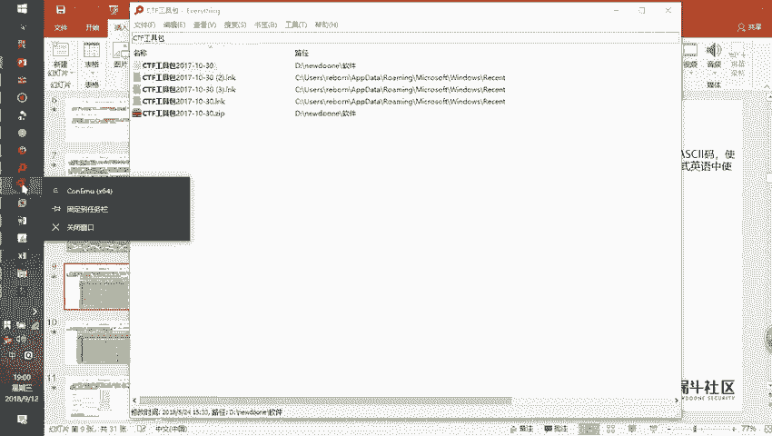

现在，我们进入常见的编码部分。首先介绍ASCII码。

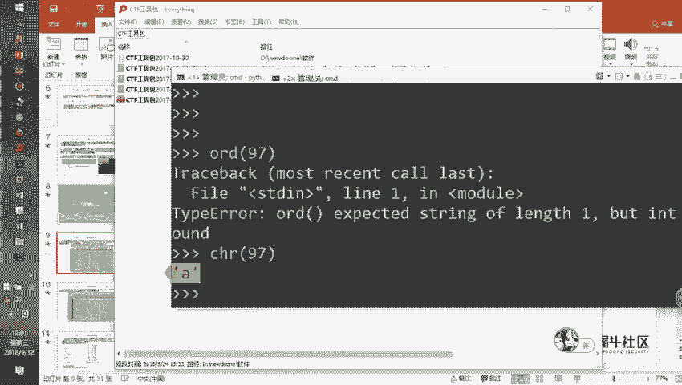

ASCII码是计算机早期使用的一种编码。由于计算机最初由美国人发明，主要考虑英语字符，所以ASCII码最初只有7位，共128个字符（2^7=128）。后来扩展为8位，共256个字符，称为扩展ASCII码。

在CTF工具包中，有一些常用解密工具，例如“小葵多功能转换工具”和“米斯特”。这些工具可以处理多种编码转换。

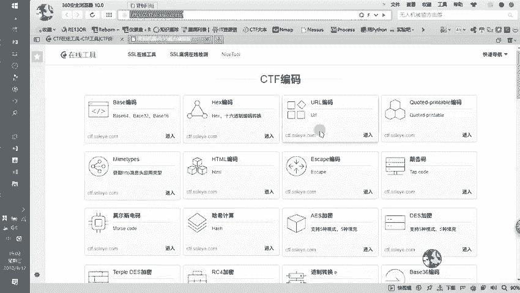

例如，在“小葵”工具中输入“ABC123”，它可以进行多种格式转换，如URL编码、SQL编码、十六进制、ASCII码、Base64、MD5等。加密操作点击“一键加密”，还原操作则点击下方对应的“还原”项。

ASCII码字符分为可打印字符和不可打印字符。可打印字符包括字母、数字和常见符号；不可打印字符则是一些控制字符，如空字符、正文开始/结束标记等。

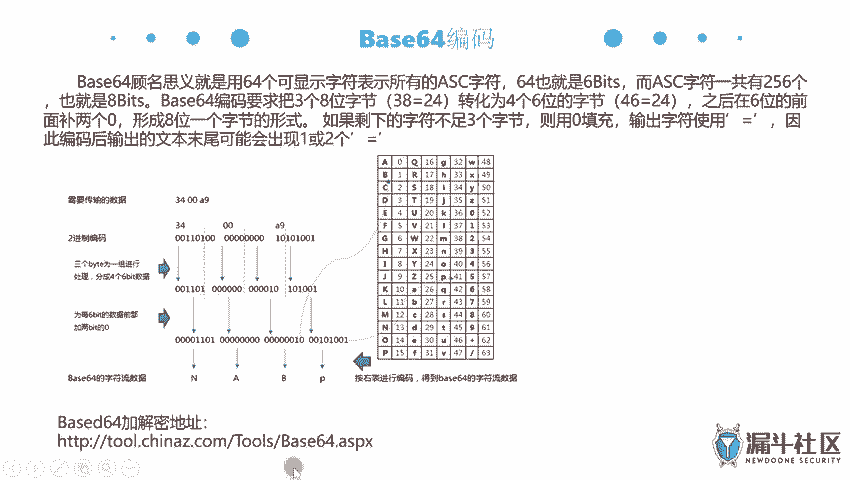

在编写解密脚本时，了解ASCII码的顺序和范围很有帮助。在Python中，可以使用 `ord()` 函数将字符转换为ASCII码，使用 `chr()` 函数将ASCII码转换回字符。

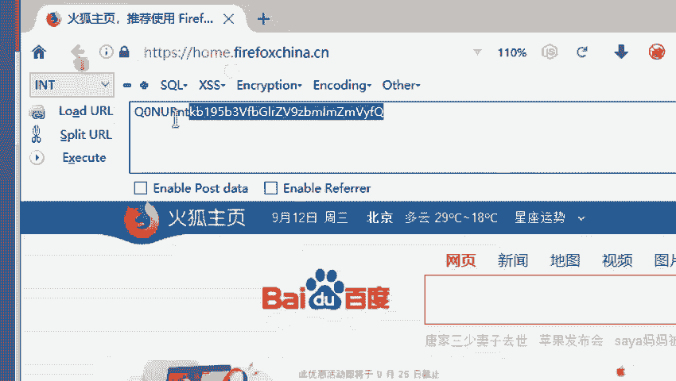

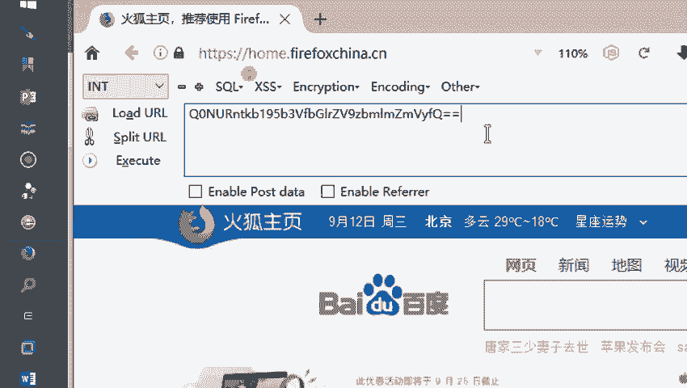

除了专用工具，还有一些优秀的在线网站集成了多种CTF编码/解密工具，非常方便使用。

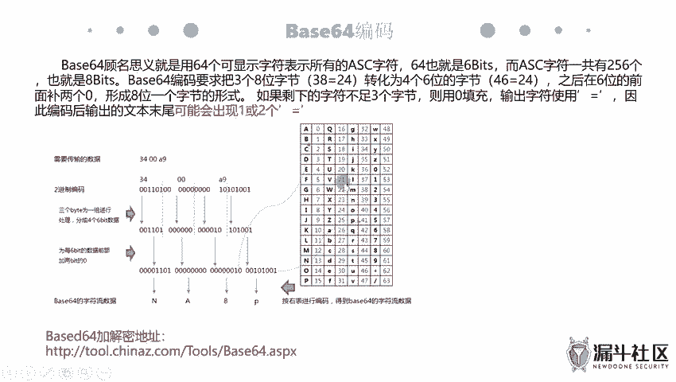

接下来是Base64编码。Base64编码的特点是将每3个8位字节（共24位）的数据，重新分组为4个6位字节（同样24位）。然后，在每个6位字节前补两个0，形成4个8位字节。因此，经过Base64编码的数据长度通常会变长。

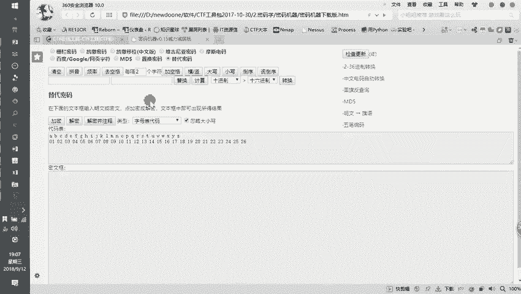

Base64编码的一个显著特征是编码结果末尾常有一个或两个等号（`=`）。如果解密时因等号被去除而失败，可以尝试补上一到两个等号再解密。

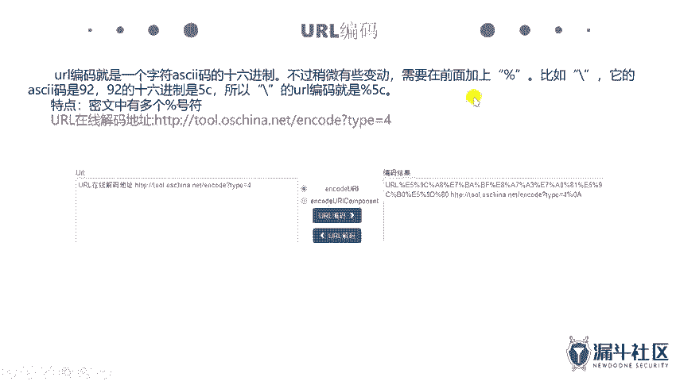

Base64也有自己的对照表，但通常我们直接使用工具进行编解码。

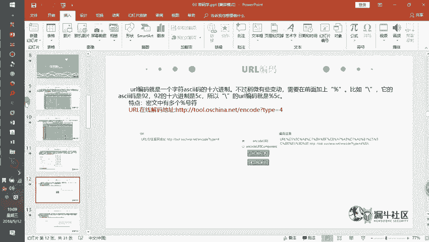

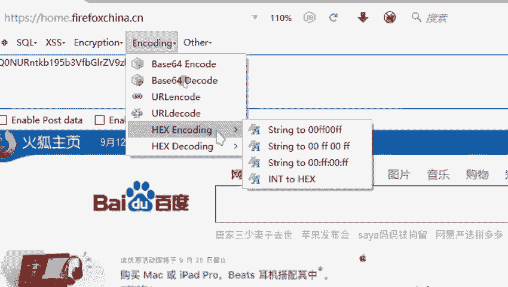

另一种常见编码是URL编码（或称百分号编码）。它主要用于网址中，因为URL通常不能直接包含中文或某些特殊符号。URL编码的原理是：先获取字符的ASCII码，然后将其转换为十六进制，最后在前面加上百分号（`%`）。

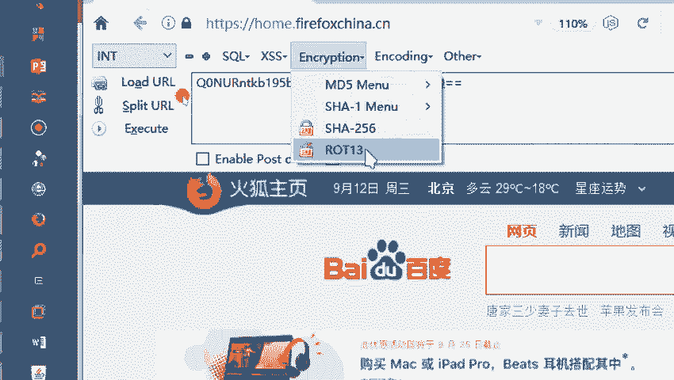

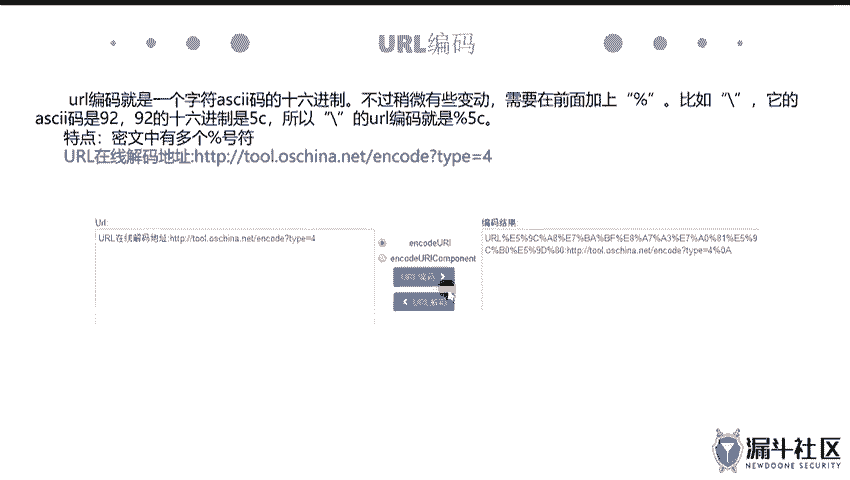

因此，当你看到一串包含很多“%”的字符时，很可能就是URL编码。在浏览器开发者工具或“小葵”等工具中，都可以方便地进行URL编解码。

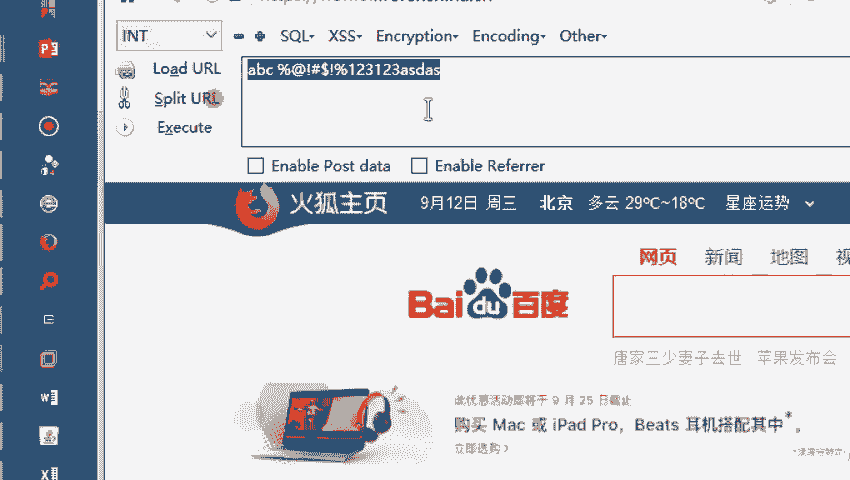

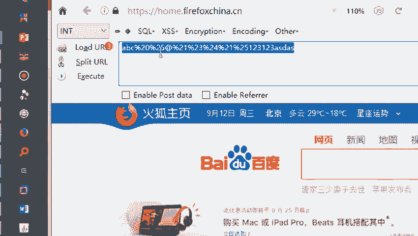

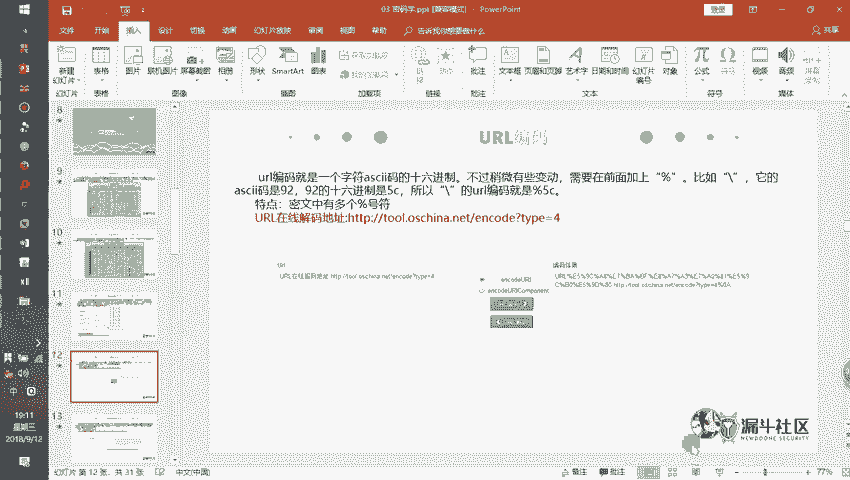

然后是Unicode编码。Unicode编码的前256位与ASCII码兼容。它被开发出来是为了支持世界上各种不同的语言和符号。ASCII码最多支持256个字符（2^8），而Unicode使用两个字节（16位），最多可支持65536个字符（2^16），足以涵盖绝大多数字符集。

Unicode编码后的一个特点是字符串中常包含“\u”后跟四位十六进制数的形式（例如 `\u0041` 代表 ‘A’）。看到这种格式，就可以考虑是Unicode编码。

最后，还有一种形式是JavaScript代码混淆。JavaScript是一种网页前端脚本语言。浏览器本身就是JavaScript的解析器。混淆是一种保护代码逻辑的手段。

例如，一段原始的JavaScript弹窗代码 `alert(‘xss’)`，经过十六进制编码混淆后可能变成 `\x61\x6c\x65\x72\x74\x28\x27\x78\x73\x73\x27\x29`。要解密这种混淆，最简单的方法就是将其复制到浏览器的开发者控制台（Console）中直接运行，浏览器会自动解析并执行它。

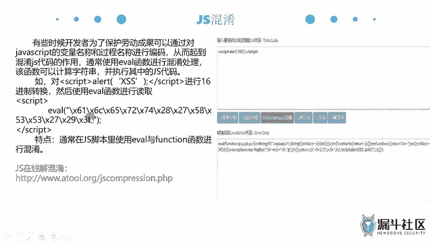

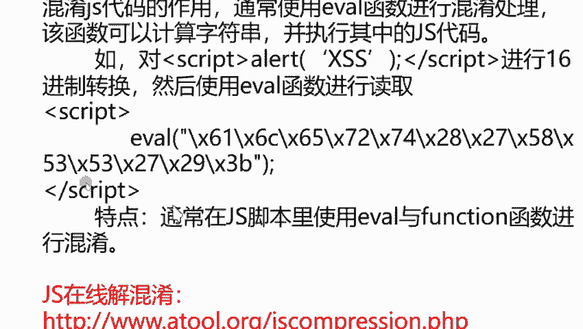

## 总结

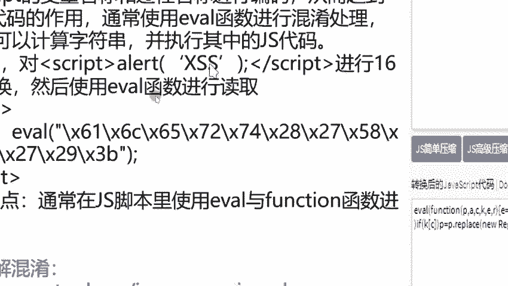

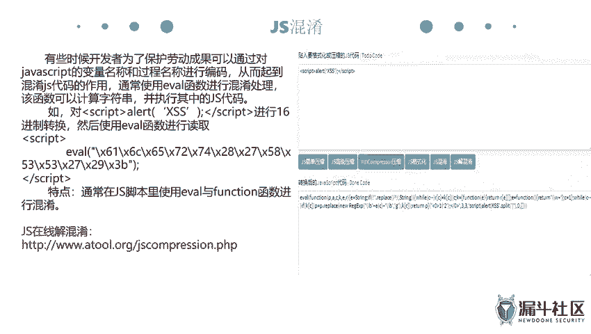

本节课中，我们一起学习了密码学的核心组成部分。我们区分了编码、加密和摘要算法的不同，了解了对称加密与非对称加密的基本原理。我们还详细探讨了CTF中常见的几种编码方式：ASCII、Base64、URL编码、Unicode以及简单的JavaScript混淆，并介绍了使用工具和浏览器进行解密的基本方法。掌握这些基础知识是解决CTF密码学题目的第一步。