# CTF入门教程：P7：SSH私钥泄露攻击实战

在本节课中，我们将学习CTF比赛中一种常见的安全问题：SSH私钥泄露。我们将通过一个模拟的靶场环境，演示如何利用泄露的私钥文件，从外部网络渗透进入靶场主机，并最终获取其最高权限（root权限），从而取得目标flag。

## 比赛环境概述

在深入学习具体攻击方法之前，我们先了解一下CTF比赛中常见的两种比赛环境设置。

以下是两种主要的比赛环境类型：

1.  **局域网环境**：攻击机和靶场机器位于同一局域网中。选手通过Web方式访问一台预置的攻击机（通常是Kali Linux），并使用这台攻击机对靶场机器进行测试和攻击。选手通常无需自带设备，所有工具由举办方提供。
2.  **自带设备环境**：举办方仅提供一个网络接口。参赛选手需要自备个人电脑（PC）以及渗透测试所需的各种工具。选手的电脑可以接入互联网查询资料。举办方会提供靶场机器的IP地址，选手直接使用自己的设备进行攻击。

## 实验环境搭建

上一节我们介绍了比赛环境，本节中我们来看看本次课程的具体实验环境配置。

*   **攻击机（Kali Linux）**：IP地址为 `192.168.253.12`
*   **靶场机器**：IP地址为 `192.168.253.10`

我们的目标是获取靶场机器上的flag值。

## 信息收集与探测

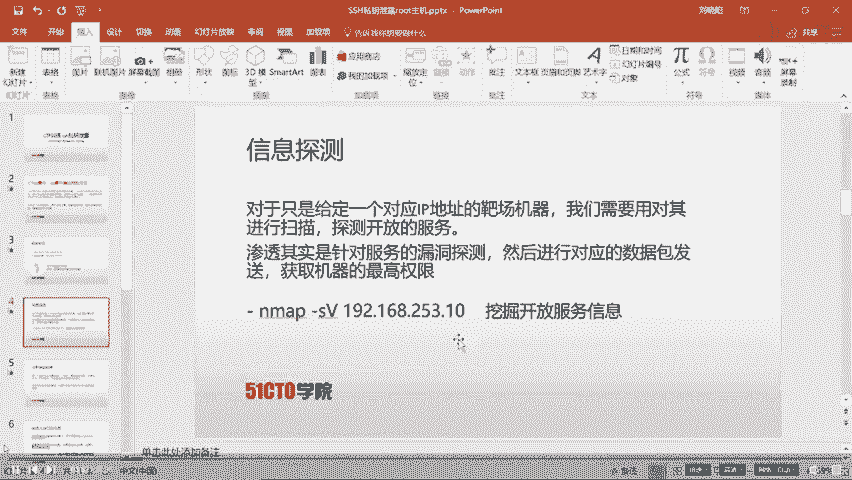

无论参加何种CTF比赛，渗透测试的第一步都是信息收集。在获得靶场IP地址后，我们需要探测其开放的服务和端口。

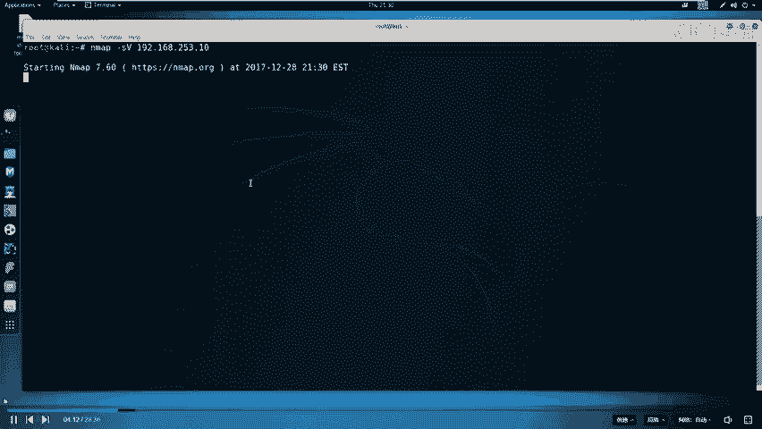

以下是信息收集的基本步骤：

1.  **使用Nmap进行端口扫描**：探测靶场机器开放了哪些服务。
    ```bash
    nmap -sV 192.168.253.10
    ```
    扫描结果显示靶场开放了SSH服务（端口22）和两个HTTP服务（端口80和31337）。

2.  **分析扫描结果**：计算机上的每个服务都对应一个端口（0-65535），通过端口通信实现功能。常见服务使用知名端口（如HTTP-80， SSH-22， MySQL-3306）。我们需要关注非常规端口（如31337）的服务，它们可能隐藏着突破口。

## Web服务深入探测

上一节我们通过Nmap发现了开放的HTTP服务，本节中我们来看看如何对Web服务进行深入探测。

探测结果显示端口31337运行着HTTP服务。我们首先通过浏览器访问该服务。

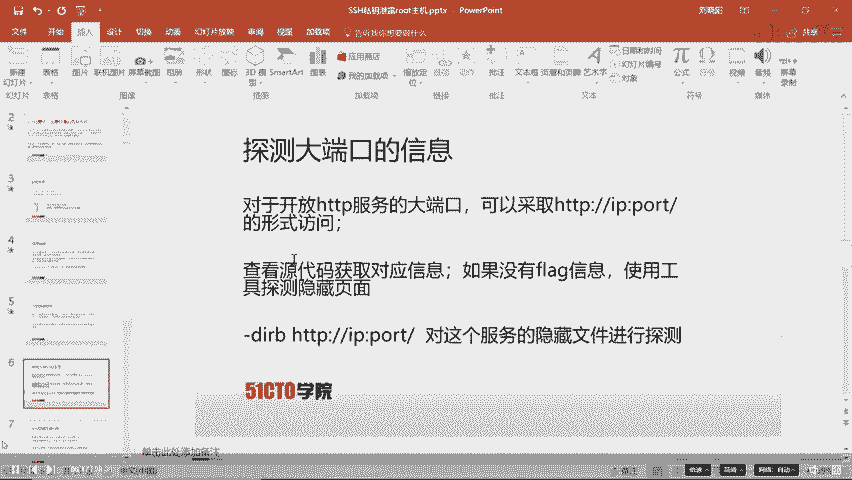

1.  **访问Web页面**：在浏览器中打开 `http://192.168.253.10:31337`。页面本身没有显示flag信息。
2.  **查看页面源代码**：在CTF中，重要信息常隐藏在HTML源代码中。右键点击页面并选择“查看页面源代码”，但本次未发现有用信息。
3.  **探测隐藏目录和文件**：当页面和源码无果时，需要探测该Web服务下是否存在隐藏的文件或目录。我们使用`dirb`工具进行目录爆破。
    ```bash
    dirb http://192.168.253.10:31337/
    ```
    扫描结果中，`/.ssh/` 和 `/robots.txt` 两个路径引起了我们的注意。

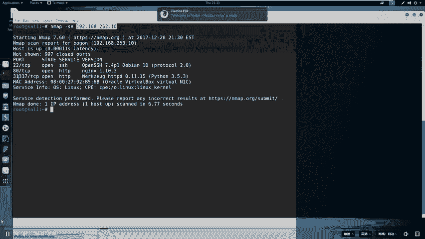

## 分析关键文件获取线索

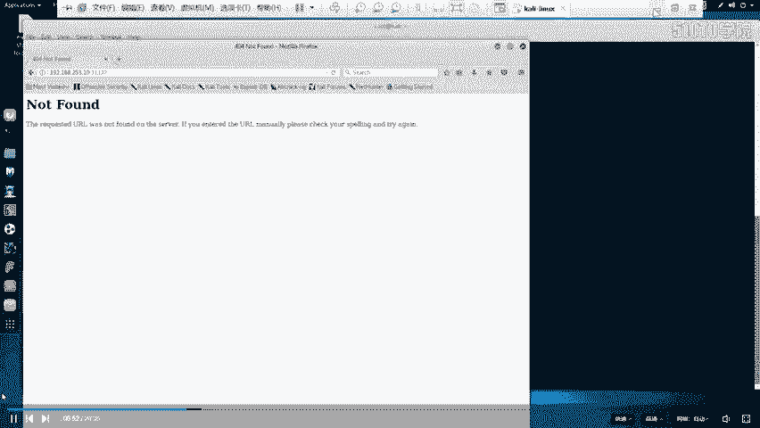

上一节我们使用dirb发现了潜在的关键文件，本节中我们逐一进行分析。

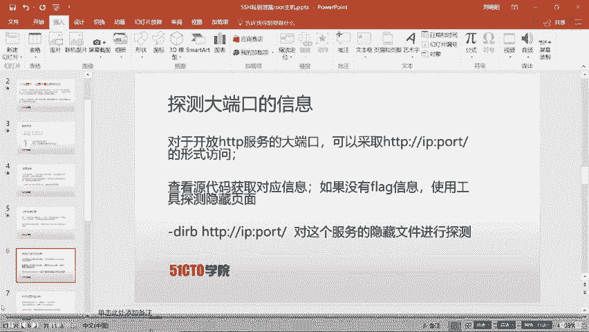

以下是针对发现文件的初步分析：

1.  **分析 `/robots.txt`**：`robots.txt` 文件用于指示网络爬虫（如搜索引擎）哪些目录或文件不应被访问。我们打开该文件：
    ```
    User-agent: *
    Disallow: /.bashrc
    Disallow: /.profile
    Disallow: /taxes
    ```
    文件显示禁止爬取 `/taxes` 路径。访问 `http://192.168.253.10:31337/taxes`，我们成功找到了第一个flag。

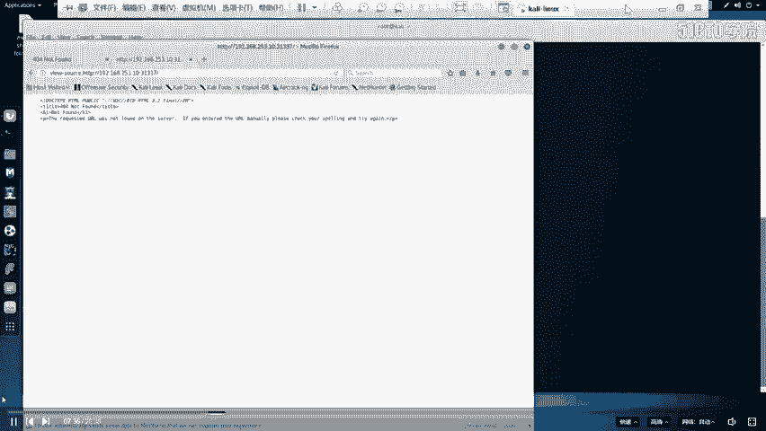

2.  **分析 `/.ssh/` 目录**：`.ssh` 目录通常用于存放SSH连接所需的密钥文件。访问该目录，我们发现了一个名为 `id_rsa` 的文件，这很可能是一个SSH私钥。

## 利用泄露的SSH私钥

上一节我们发现了泄露的SSH私钥文件，本节中我们来看看如何利用它进行渗透。

SSH（Secure Shell）是一种用于远程安全登录的协议。其认证方式通常基于公钥加密体系：

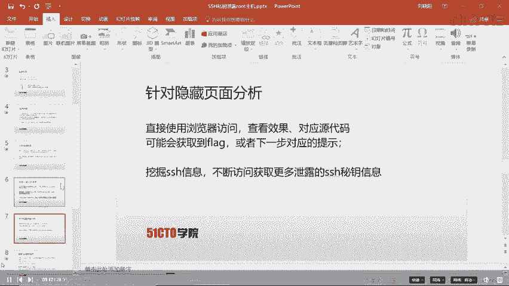

*   服务器端存放用户的**公钥**（如 `id_rsa.pub`）。
*   客户端使用对应的**私钥**（如 `id_rsa`）进行身份验证。
*   当私钥与服务器上的公钥匹配时，即可建立连接。

现在，我们获得了靶场服务器上可能有效的私钥文件。以下是利用步骤：

1.  **下载私钥文件**：从 `http://192.168.253.10:31337/.ssh/id_rsa` 将私钥文件保存到攻击机本地。
2.  **修改私钥文件权限**：SSH要求私钥文件权限必须严格，通常只有所有者可读。
    ```bash
    chmod 600 id_rsa
    ```
3.  **尝试SSH登录**：使用获取的私钥尝试登录靶场机器。我们需要猜测用户名，常见的尝试有 `root`， `admin`， 或者通过其他信息收集获得。
    ```bash
    ssh -i id_rsa root@192.168.253.10
    ```
    如果私钥有效且用户正确，我们将成功获得一个远程Shell。

## 权限提升与获取Flag

成功通过SSH登录后，我们可能处于一个普通用户权限。最终目标是获取 `root` 权限。

以下是常见的提权思路：

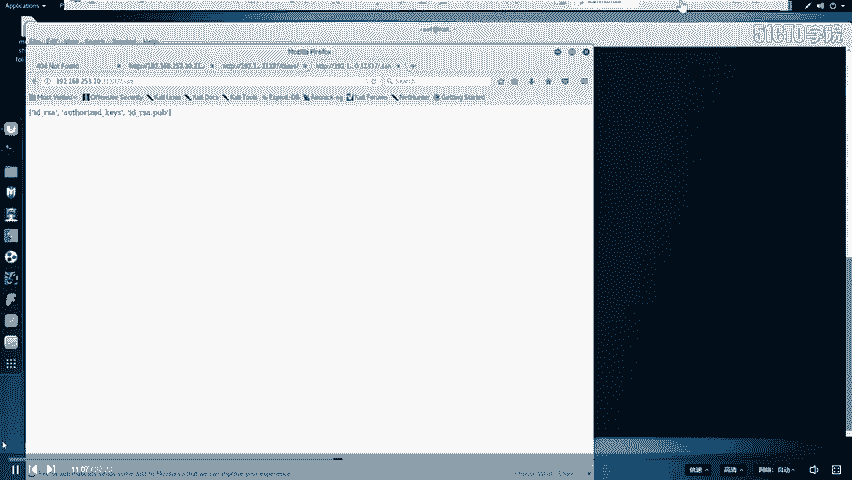

1.  **查看当前用户权限**：使用 `id` 或 `sudo -l` 命令查看当前用户可以执行哪些特权命令。
2.  **寻找系统漏洞**：检查系统内核版本、运行的服务、具有SUID权限的文件等，寻找可利用的本地提权漏洞。
3.  **利用配置错误**：例如，某些关键配置文件可由当前用户写入，从而注入恶意代码。

在完成提权，获得 `root` 权限后，便可以在文件系统中搜索最终的flag文件（通常名为 `flag`， `proof.txt` 或位于 `/root` 目录下），并读取其内容。

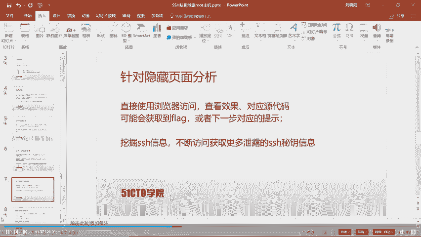

## 课程总结

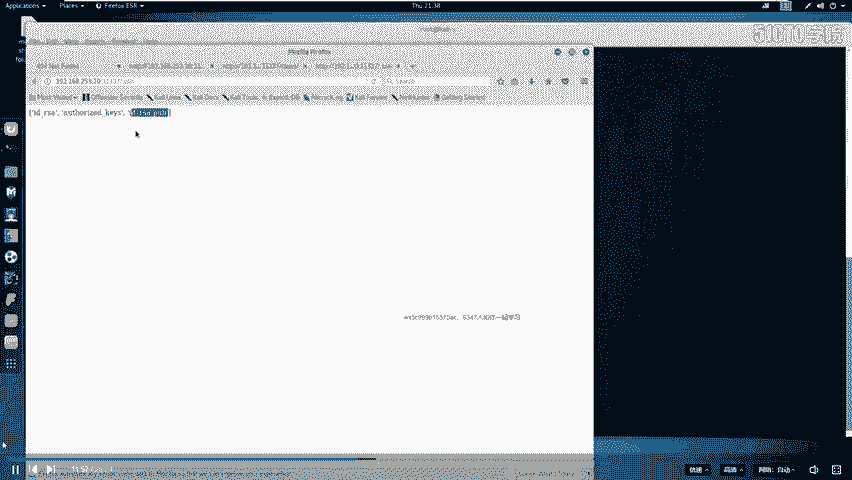

本节课中我们一起学习了CTF中SSH私钥泄露漏洞的完整利用链。我们首先通过Nmap进行信息收集，发现开放服务；接着利用dirb扫描Web目录，发现了关键的 `robots.txt` 和 `.ssh/id_rsa` 私钥文件；通过分析 `robots.txt` 找到了第一个flag；最后利用泄露的SSH私钥成功登录靶场主机，并通过权限提升技术获取了root权限和最终flag。整个流程涵盖了从外部信息收集到内部权限提升的完整渗透测试思路。