# CTF教程：P8：SSH服务渗透（获取首个用户权限）🔑

在本节课中，我们将学习如何对SSH服务进行渗透测试，从外部主机进入目标靶机，最终获取root权限并取得flag。首先，我们来介绍SSH协议。

## SSH协议简介

SSH协议是Secure Shell的缩写，由网络小组制定。其目标是建立在应用层基础上的安全协议。目前，SSH协议广泛用于远程登录操作，提供安全性保障。

这种安全性源于SSH协议对用户名、密码以及发送到远程服务器的所有信息都进行了加密。这在一定程度上避免了信息泄露问题。SSH协议最初是Linux上的一个程序，后来因其功能强大被移植到其他平台。Windows和各种Linux发行版都支持运行SSH服务。

SSH服务基于TCP协议的22端口。

## SSH认证机制

上一节我们介绍了SSH协议，本节中我们来看看它的两种主要认证机制。

### 基于口令的安全验证

只要知道账户和对应密码，就可以使用SSH客户端登录到开放SSH服务的远程主机。在此过程中，所有发送的用户名、密码和数据都经过加密，这在一定程度上能防止中间人攻击嗅探你的凭据。

但这种机制无法防止服务器被冒充的中间人攻击。

### 基于密钥的安全验证

这种验证方式需要依靠密钥。首先，用户需要创建一对密钥，并将公钥放在需要访问的服务器上。登录时，用户使用自己的私钥与远程服务器的公钥进行匹配。如果匹配成功，则登录服务器并获取对应权限；如果匹配失败，则登录失败。

以下是关于密钥命名的要点：
*   在大部分CTF比赛中，私钥通常命名为 `id_rsa`。
*   公钥通常命名为 `id_rsa.pub`。
*   这也是使用密钥生成工具时的默认命名规则。

## SSH认证机制的安全弱点

以上我们已经对SSH协议认证机制有了初步认识。下面我们来看看这两种认证机制存在哪些安全弱点。

### 基于口令验证的弱点

基于口令和密码的安全验证，难以逃脱暴力破解攻击。如果对应的用户名存在弱口令，攻击者可以通过安全工具快速破解密码，然后使用SSH客户端连接到服务器，实现对服务器的初步控制。

需要注意的是，通过这种方式获取的服务器权限不一定是root权限。如果不是，则需要进行权限提升，直到获得root权限为止。

### 基于密钥验证的弱点

首先，我们需要对目标主机进行大量信息收集。如果能够获取到泄露的用户名及其对应的私钥，就可以使用该用户名和私钥进行远程登录。在这个过程中，可能不需要知道该用户的密码。

以下是利用泄露私钥登录的过程：
1.  修改私钥文件的权限为仅所有者可读可写，使用 `chmod 600` 命令。
2.  使用SSH客户端，通过 `-i` 参数指定私钥文件进行登录。命令格式为：`ssh -i [私钥文件] [用户名]@[主机地址]`。

同样，通过此方式登录获得的权限也不一定是root权限。如果不是，也需要进一步提权。

## 实验环境与信息收集

下面我们介绍一下本次CTF的实验环境。
*   **攻击机**：Kali Linux，IP地址为 `192.168.1.105`。
*   **靶机**：Linux机器，IP地址为 `192.168.1.106`。

在CTF比赛中攻击靶机时，必须牢记目的性：获取靶机上的flag值并提升至root权限。所有操作都应围绕此目的展开，这样才能更快速地成功。

首先需要进行第一步：信息探测。对于给定IP地址的靶机，渗透前首先要考虑其开放的服务。我们使用Nmap进行信息探测。

以下是常用的Nmap扫描命令：
*   `nmap -sV [靶机IP]`：探测靶机开放的服务及版本。
*   `nmap -A -v [靶机IP]`：探测靶机的全面信息。
*   `nmap -O [靶机IP]`：探测靶机使用的操作系统类型及版本。

扫描结果显示，靶机开放了22端口（SSH服务）、80端口（HTTP服务）等。

## 信息分析与弱点挖掘

我们对收集到的信息进行分析，挖掘其中的敏感信息和安全弱点。

对于开放22端口（SSH服务）的靶机，主要考虑两点：
1.  是否可以通过暴力破解获取用户名和密码，从而直接登录。
2.  服务器是否存在私钥泄露问题。如果存在，则可以利用私钥登录。此时需考虑私钥是否被密码加密。若已加密，则需先破解密码。同时，还需要找到使用该私钥的用户名。

对于开放80端口（HTTP服务）的靶机，主要考虑两点：
1.  通过浏览器访问服务，获取页面展示的信息。
2.  使用目录扫描工具探测网站目录，寻找敏感信息。

需要特别注意大于1024的端口，这些端口可能由用户自定义，例如8080端口，可能开放着HTTP服务。

接下来，我们对扫描结果进行深入挖掘。

### 挖掘HTTP服务信息

首先，使用浏览器访问靶机的HTTP服务（`http://192.168.1.106`），寻找可利用信息，例如SSH的用户名。

在浏览网站页面时，在“About Us”等位置发现了可能的人名，如 `martin`、`jim`、`hanks`，这些很可能就是系统用户名。

### 挖掘目录与敏感文件

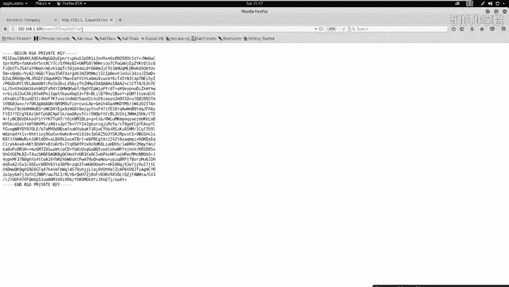

其次，使用目录扫描工具（如`dirb`）扫描网站目录，访问`robots.txt`等文件，寻找敏感信息。尤其要注意寻找命名奇特的文件，它们可能包含密钥等信息。

使用命令 `dirb http://192.168.1.106` 进行扫描。在扫描结果中，发现了一个可疑文件，访问后确认其内容为SSH私钥（`id_rsa`）。我们成功挖掘到了关键信息。

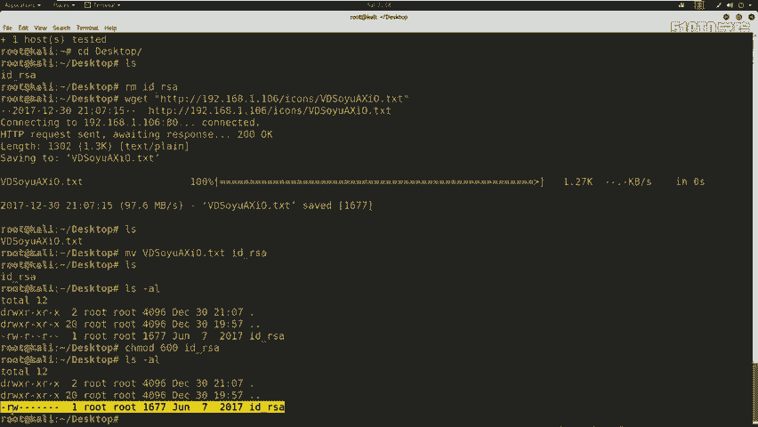

此外，也可以使用`nikto`扫描器挖掘敏感信息，命令为 `nikto -host [靶机IP]`。扫描时会特别注意`config`等配置文件。

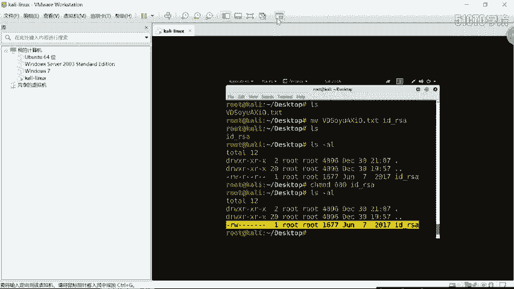

## 利用私钥登录靶机

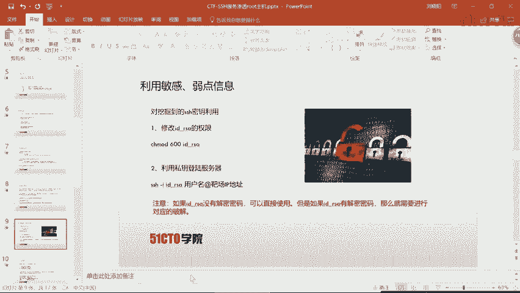

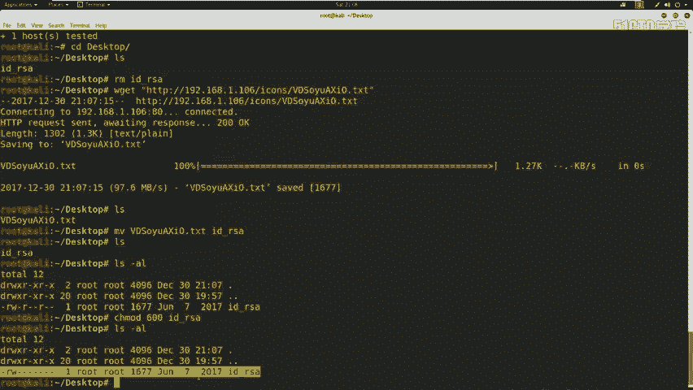

挖掘到敏感信息后，即可利用其进行渗透。我们已获得SSH私钥，接下来利用它远程登录服务器。

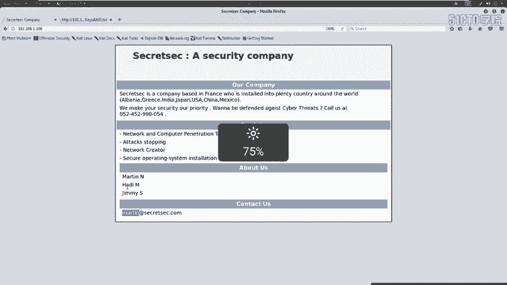

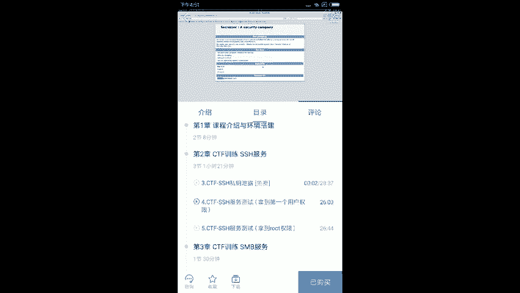

利用私钥登录服务器的步骤如下：
1.  修改私钥文件权限：`chmod 600 id_rsa`
2.  使用SSH命令登录：`ssh -i id_rsa [用户名]@[靶机IP]`

如果私钥有解密密码，则需要先使用`ssh2john`等工具转换格式，并用`john`进行破解。本节课涉及的私钥无密码。

现在，我们在Kali攻击机上进行操作：
1.  使用`wget`下载私钥文件。
2.  将文件重命名为`id_rsa`。
3.  修改权限：`chmod 600 id_rsa`。
4.  尝试登录。我们需要用户名，根据之前信息收集的结果，尝试使用`martin`用户。
5.  执行登录命令：`ssh -i id_rsa martin@192.168.1.106`。

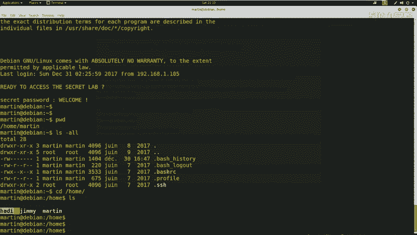

登录成功！我们获得了`martin`用户的shell权限。

## 权限确认与后续步骤

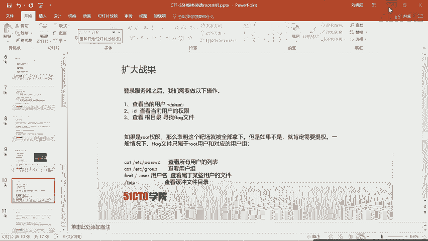

登录后，我们需要确认当前权限，并寻找flag。
*   使用 `id` 命令查看当前用户权限，发现只是普通用户，并非root。
*   切换到`/home`目录，`ls`查看用户列表，确认存在`martin`、`jim`、`hanks`等用户。
*   由于当前不是root权限，因此需要进一步进行权限提升，才能访问属于root的flag文件。

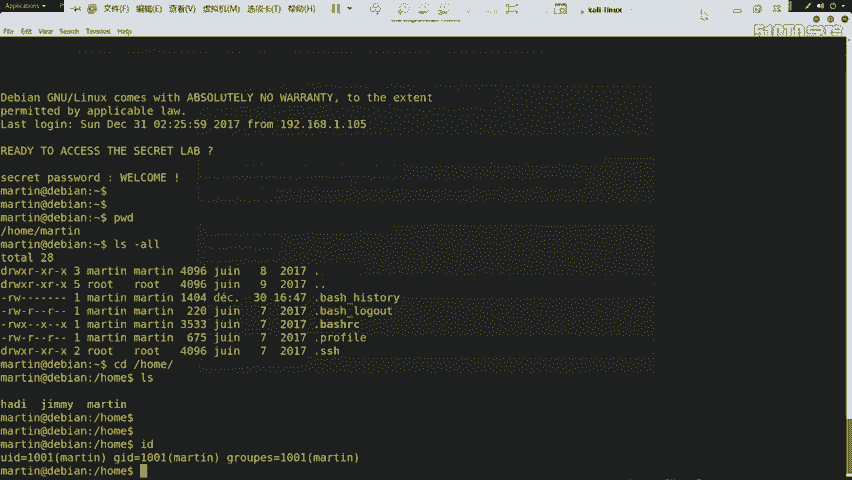

本节课中，我们一起学习了SSH协议、其认证机制与安全弱点，并通过信息收集、弱点挖掘、利用泄露的私钥成功获得了首个用户权限。下节课，我们将介绍如何从普通用户权限提升至root权限。

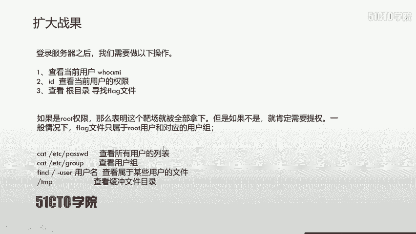

---
**注意**：本教程仅供网络安全学习与CTF竞赛练习使用，请勿用于非法渗透测试。