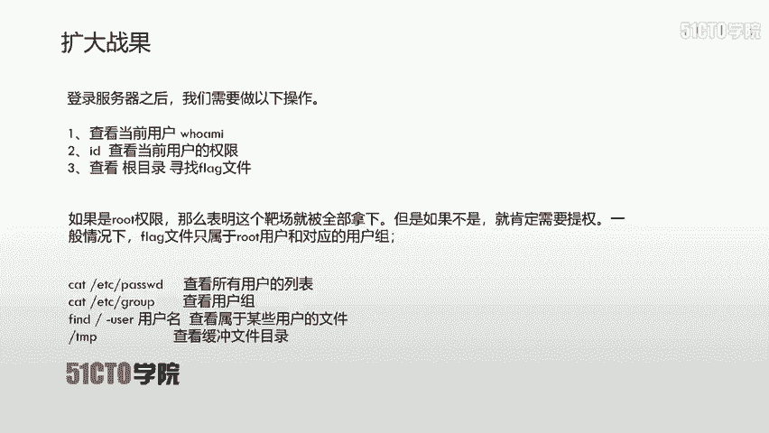
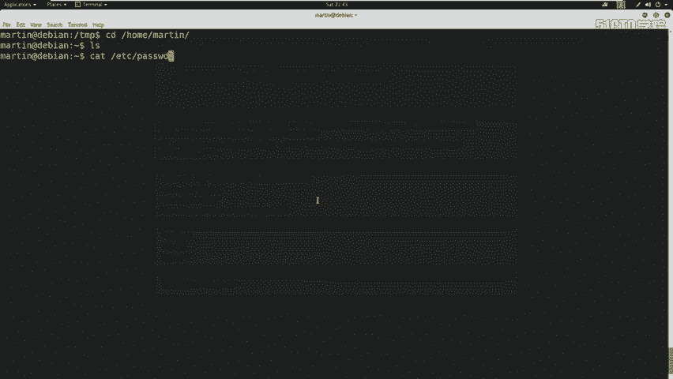
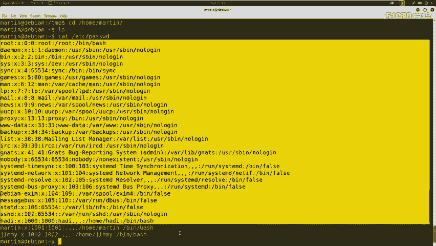
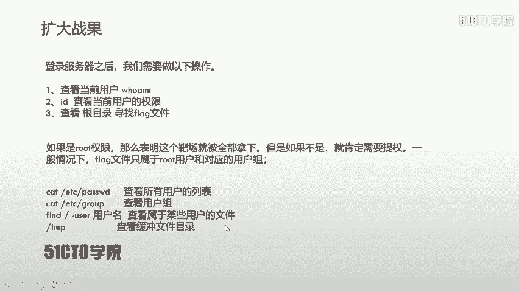
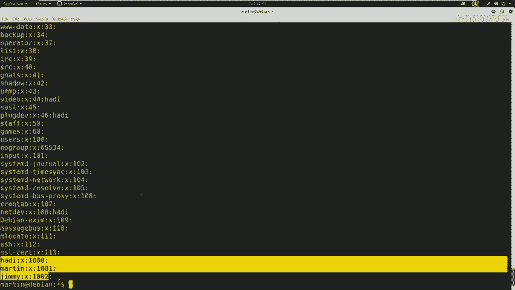
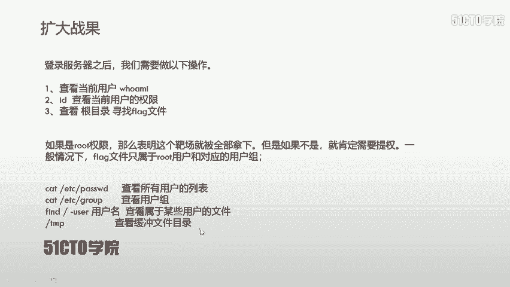
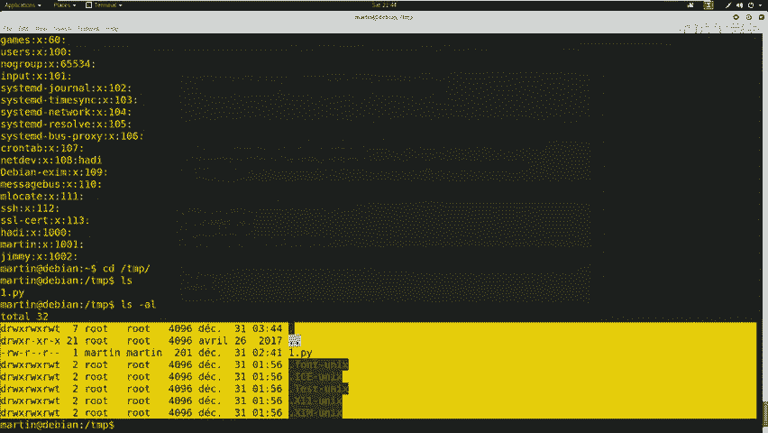

# CTF教程：P9：SSH服务测试（获取root权限）

在本节课中，我们将学习如何利用已获得的SSH访问权限，从普通用户提权至root用户，从而获取受保护的flag文件。我们将通过一系列系统信息收集和权限提升技巧来完成这一目标。

上节课我们使用martin用户成功登录了服务器，并通过`id`命令确认了该用户并非root权限用户。由于flag文件通常属于root用户及其用户组，因此我们需要进行权限提升。

在进行提权操作之前，我们可以先使用几条命令来收集系统配置信息，这有助于我们寻找提权路径。

以下是几条常用的信息收集命令：



*   **`cat /etc/passwd`**：查看系统上所有用户的列表。
*   **`cat /etc/group`**：查看系统上所有用户组的列表。
*   **`find / -user <用户名> 2>/dev/null`**：查找属于特定用户的所有文件。
*   检查临时目录`/tmp`，查看是否存在可利用的临时文件或脚本。



现在，让我们在主机上实际操作这些命令。首先，查看所有用户：

```
cat /etc/passwd
```



执行后，可以看到用户列表，其中包含`jim`、`martin`、`heading`以及`root`等用户。



接下来，查看所有用户组：

```
cat /etc/group
```



执行后，会显示包括`handing`、`martin`、`j`在内的众多用户组信息。

此外，我们还可以切换到临时目录`/tmp`进行查看：

```
cd /tmp
ls -la
```



在该目录下，可能会发现一些文件，例如一个名为`1.py`的Python脚本（注：此为示例，实际环境中可能不存在或为其他文件）。如果没有明显文件，也可能存在一些隐藏文件。这个目录常被用于存放临时文件，有时会包含有用的信息或脚本。

通过以上步骤，我们完成了初步的信息收集。在掌握了系统用户、用户组和部分文件信息后，我们就可以更有针对性地寻找权限提升的方法。



本节课中，我们一起学习了在获取初始SSH访问权限后，如何通过查看`/etc/passwd`、`/etc/group`以及检查`/tmp`目录来收集系统信息，为后续的提权操作做好准备。信息收集是渗透测试中至关重要的一步，它能帮助我们更好地理解目标环境。