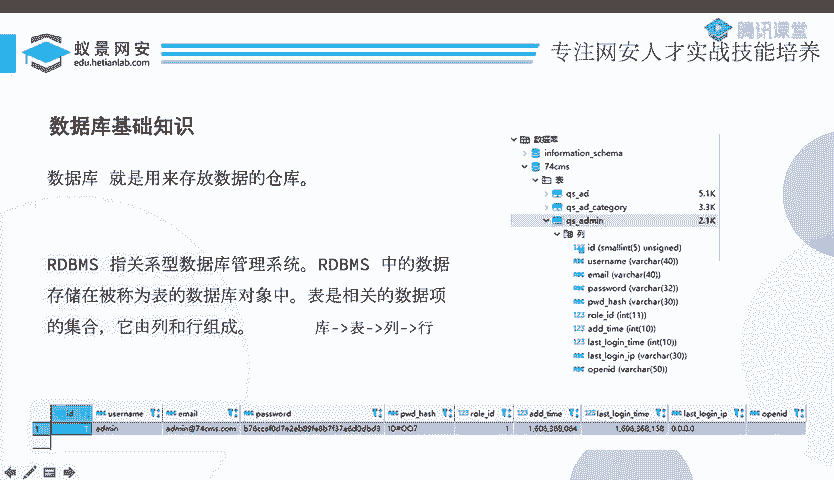
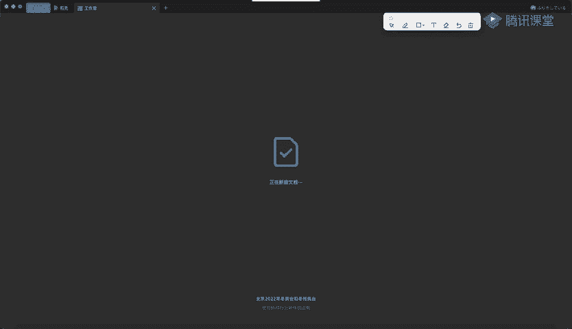
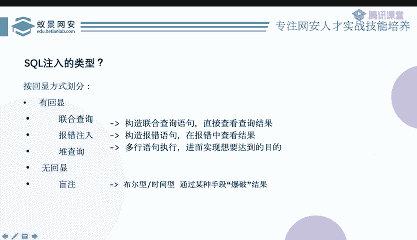

# CTF教程：P10：ctf-web09_MySQL基础 🗄️

在本节课中，我们将学习MySQL数据库的基础知识，并了解SQL注入攻击的基本原理与分类。课程内容分为三大部分：MySQL基础、联合查询注入和报错注入。我们将从最简单的概念开始，逐步深入。

## 第一部分：MySQL基础

上一节我们介绍了课程的整体结构，本节中我们来看看MySQL数据库的基础知识。

数据库是存放数据的仓库。在CTF比赛中，超过90%的题目都使用MySQL数据库，因此它是我们的学习重点。

关系型数据库管理系统（RDBMS）将数据存储在称为“表”的对象中。表是相关数据项的集合，由列和行组成。我们可以用一个简单的结构来理解：**库 -> 表 -> 列 -> 行**。



为了更直观地理解，我们可以将其与Excel表格进行类比：
*   一个Excel文件相当于一个**数据库**。
*   文件中的一个工作表（Sheet）相当于一张**表**。
*   工作表的表头（如ID、Username）相当于**列**。
*   工作表中的每一行数据相当于**行**。



数据库本身无法理解人类的自然语言指令。我们需要一种特定的语言来与数据库交互，这种语言就是**结构化查询语言（SQL）**。SQL用于管理关系型数据库，范围包括数据的插入、查询、更新和删除等操作，即常说的“增删改查”。

以下是几个基础的SQL操作语句示例：
```sql
SHOW DATABASES; -- 显示所有数据库
USE database_name; -- 使用某个数据库
SHOW TABLES; -- 显示当前数据库中的所有表
```

## 第二部分：SQL注入原理与分类

了解了数据库和SQL的基本概念后，本节我们来看看什么是SQL注入。

SQL注入是指将SQL代码插入或添加到应用程序的输入参数中，这些参数被传递给后台的SQL服务器加以解析并执行。简单来说，当用户能够控制SQL语句的一部分，并且其输入被直接拼接到SQL语句中执行时，就可能产生SQL注入。

SQL注入产生的核心条件是：
1.  用户能够控制输入参数。
2.  用户的输入被拼接到SQL语句中。
3.  拼接后的SQL语句被数据库执行。

攻击者通过构造特殊的输入，让数据库执行非预期的SQL命令，从而获取、篡改或删除数据库中的数据。

根据攻击时获取信息的方式（即回显方式），SQL注入主要分为两大类：**有回显注入**和**无回显注入（盲注）**。

有回显注入可以根据回显内容的不同，进一步细分为以下几种常见类型：
*   **联合查询注入**：利用 `UNION` 操作符将多个查询结果合并到一起返回。
*   **报错注入**：通过构造SQL语句触发数据库报错，并从错误信息中获取数据。
*   **堆叠注入**：执行多条SQL语句（取决于数据库和配置是否支持）。

在CTF比赛中，联合查询注入通常较为简单，正式比赛中较少出现；而盲注则是考察的重点和难点。

## 第三部分：联合查询与报错注入简介

上一节我们介绍了SQL注入的分类，本节中我们简要了解一下联合查询注入和报错注入的概念。

**联合查询注入**的核心是利用SQL的 `UNION` 操作符。`UNION` 用于合并两个或多个 `SELECT` 语句的结果集。攻击者通过构造 `UNION SELECT` 语句，将恶意查询的结果与原查询结果一并返回，从而直接获取数据。

**报错注入**的原理是故意构造错误的SQL语句，触发数据库报错。如果数据库将错误信息（其中可能包含查询数据）返回给前端，攻击者就能从这些错误信息中提取出所需数据，例如利用 `updatexml()`、`extractvalue()` 等函数。



本节课中我们一起学习了MySQL数据库的基础结构、SQL语言的作用，以及SQL注入攻击的基本原理和主要分类（联合查询注入、报错注入、盲注等）。理解这些基础概念是后续深入学习各类注入技巧的基石。