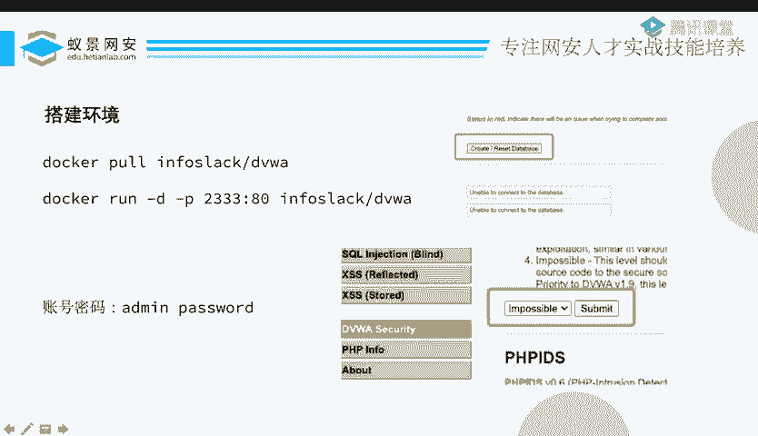
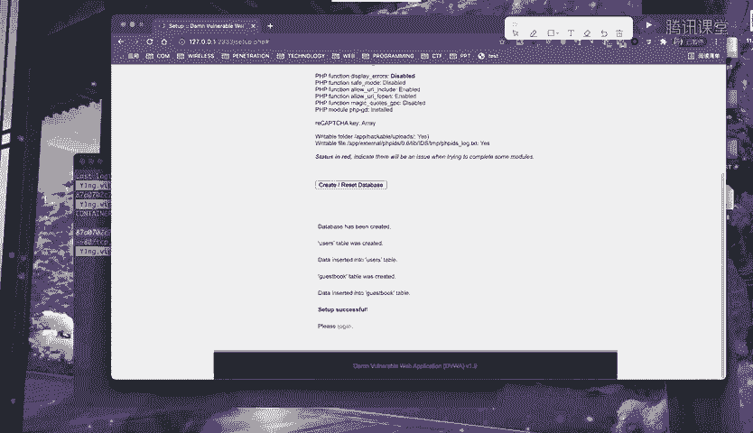
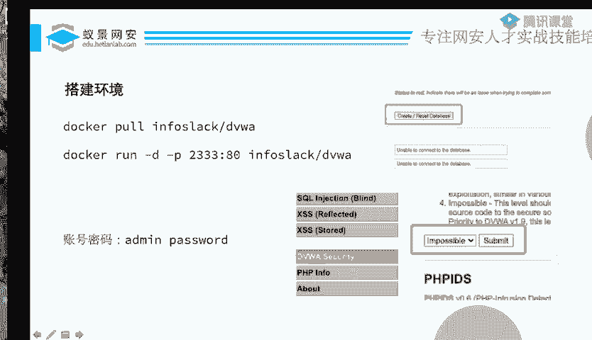
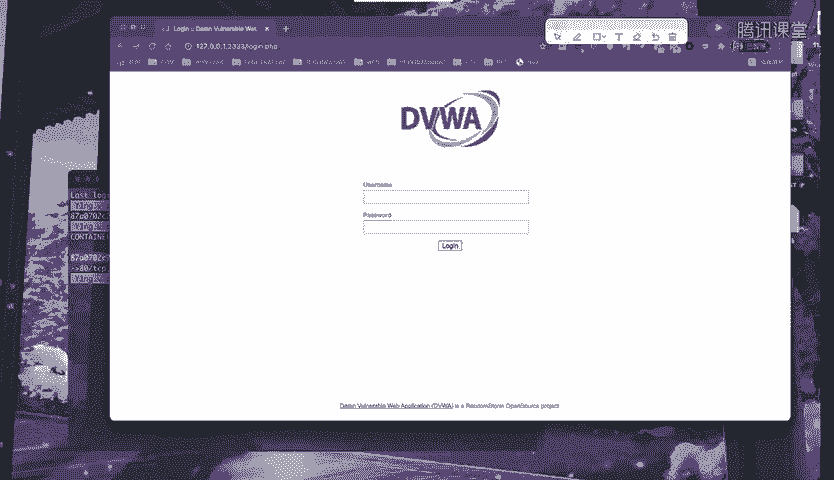
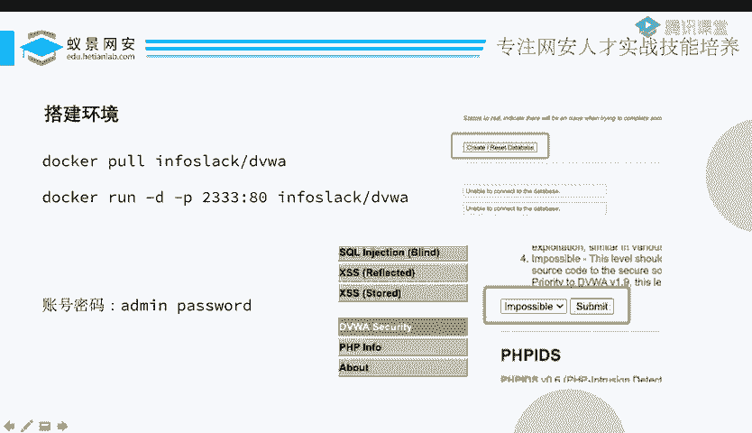

# CTF教程：P11：DVWA靶场搭建 🎯

## 概述
在本节课程中，我们将学习如何搭建一个名为DVWA的Web安全测试靶场。DVWA是一个集成了多种常见Web漏洞的练习环境，是学习CTF-Web方向和安全测试的绝佳工具。我们将使用Docker这一容器化技术来快速部署它，确保环境搭建过程简单高效。

## 准备工作
上一节我们介绍了一些基础概念，本节中我们来看看如何实际操作。首先，我们需要准备一个可用的靶场环境。DVWA靶场可以通过多种方式部署，但使用Docker是最为便捷的方法之一。

以下是部署DVWA靶场所需的步骤：

1.  **拉取并运行Docker镜像**：我们将使用一条Docker命令来启动靶场。
2.  **访问并初始化靶场**：容器启动后，我们需要通过浏览器访问并进行初始设置。
3.  **调整安全等级**：为了进行有效的漏洞练习，我们需要将靶场的默认安全等级从“不可能”调整为“低”。

## 详细步骤



### 1. 启动DVWA容器
我们使用Docker来运行DVWA。如果你没有现成的DVWA镜像，Docker会自动从仓库拉取。

执行以下命令：
```bash
docker run -d -p 2333:80 vulnerables/web-dvwa
```
*   **`docker run`**：运行容器的命令。
*   **`-d`**：让容器在后台运行。
*   **`-p 2333:80`**：将容器内部的80端口映射到宿主机的2333端口。
*   **`vulnerables/web-dvwa`**：指定要运行的Docker镜像名称。

命令执行后，Docker会开始工作。如果你是第一次运行，需要下载镜像，这可能需要一些时间。

### 2. 验证容器状态
容器启动后，可以使用以下命令查看运行状态：
```bash
docker ps
```
该命令会列出当前运行的Docker容器。你应该能看到一个容器，其端口映射为 `0.0.0.0:2333->80/tcp`，这表示部署成功。

### 3. 访问并初始化DVWA
现在，打开你的浏览器，访问 `http://localhost:2333` 或 `http://你的服务器IP:2333`。



页面加载后，你会看到DVWA的欢迎界面。由于是首次启动，数据库尚未配置。

你需要点击页面上的 **`Create / Reset Database`** 按钮来初始化数据库。系统会提示数据库创建成功，并自动跳转到登录页面。





### 4. 登录系统
DVWA有默认的登录凭证：

*   **用户名**：`admin`
*   **密码**：`password`

输入以上用户名和密码，点击登录，即可成功进入DVWA主界面。

### 5. 调整安全等级
登录后，你会在左侧菜单栏看到各种漏洞类型，例如暴力破解、命令注入、文件上传等。

但在开始练习之前，有一个关键步骤：**调整安全等级**。点击左侧的 **`DVWA Security`** 选项。

在安全设置页面，你会看到 **`Security Level`** 选项。它默认设置为 **`Impossible`**（不可能）。这个等级意味着所有漏洞都已被彻底修复，无法用于练习。

为了能够进行漏洞利用练习，我们需要将其修改为较低等级。对于初学者，建议先设置为 **`Low`**（低）。选择“Low”后，点击“Submit”提交更改。

至此，你的DVWA靶场已经完全搭建并配置妥当，可以开始进行各种Web安全漏洞的学习和实战练习了。



## 总结
本节课我们一起学习了如何使用Docker快速搭建DVWA Web安全测试靶场。我们完成了从拉取镜像、运行容器、访问初始化、登录到调整安全等级的完整流程。现在，你已经拥有了一个功能完备的漏洞练习环境，为后续深入学习CTF-Web题目和各种Web漏洞技术打下了坚实的基础。下一节，我们将利用这个靶场，开始实际的漏洞探索之旅。