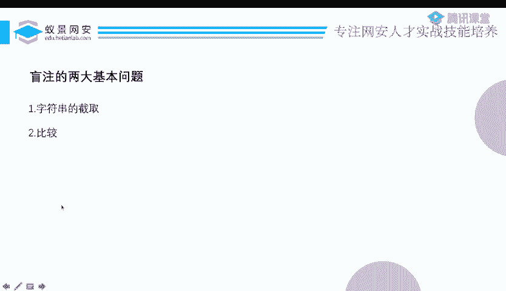
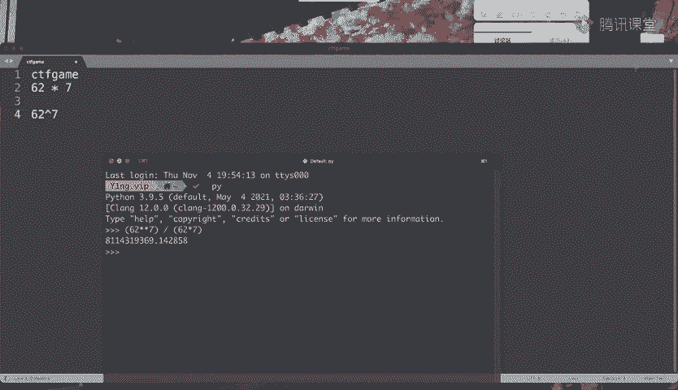
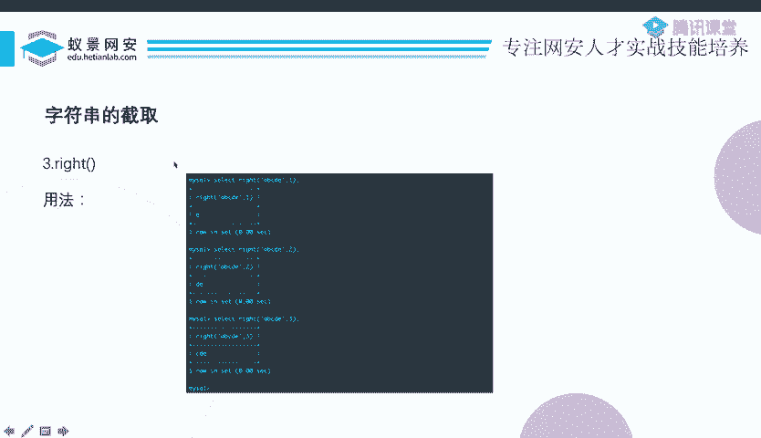
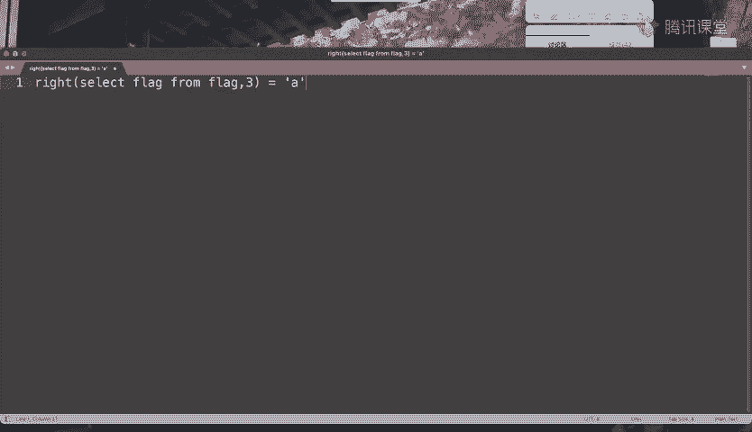
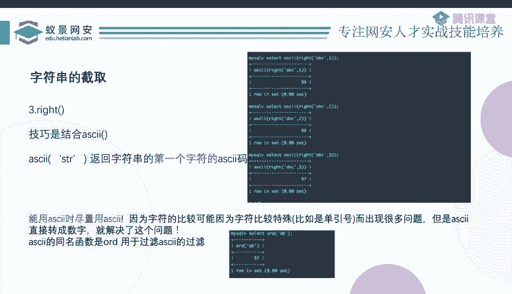
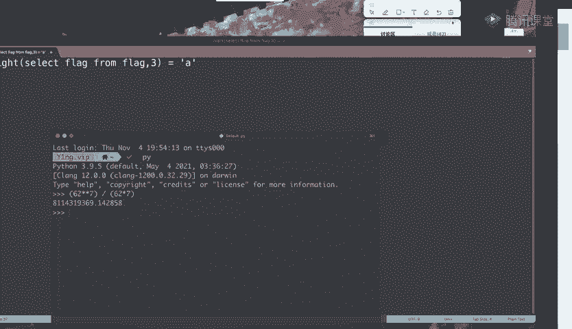
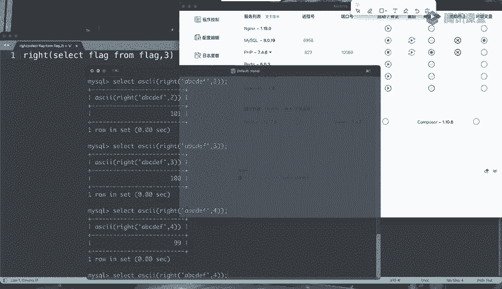

# CTF教程：P13：ctf-web12_布尔盲注1 🎯

在本节课中，我们将要学习CTF Web安全挑战中的一种重要技术——布尔盲注。我们将从基本概念入手，理解其工作原理，并学习如何通过字符串截取与比较来逐位爆破出数据库中的隐藏信息。

## 概述

上一节我们介绍了SQL注入的分类。本节中我们来看看其中一种无回显的注入类型——盲注。盲注主要分为布尔盲注和时间盲注两大类。本节课我们将重点探讨布尔盲注的核心原理与实践方法。

## 布尔盲注的基本原理

布尔盲注的核心在于，虽然页面不会直接返回数据库查询的具体数据，但会根据SQL查询语句执行的成功或失败，呈现出两种不同的“状态”。这种状态差异就是我们的突破口。

以下是两种常见的布尔状态体现：
*   **页面内容不同**：例如，查询成功时显示用户信息，查询失败时显示“用户不存在”或空白。
*   **HTTP状态码不同**：例如，登录成功返回302重定向，登录失败返回200并提示错误。
*   **HTTP响应头不同**：例如，登录成功会在响应头中设置新的Cookie或Location字段，失败则没有。
*   **基于错误的盲注**：通过触发SQL错误来获取信息，这将在后续章节详细讨论。

这些不同的“状态”本质上反映了后台SQL查询语句执行的真（True）或假（False）。因此，我们可以通过精心构造SQL语句，并观察页面状态的变化，来推断出数据库中的信息。

## 从简单测试到盲注利用

在寻找注入点时，我们常使用 `id=1 and 1=1` 和 `id=1 and 1=2` 这样的Payload。其逻辑是：
*   `id=1 and 1=1` 整个条件为真，页面正常显示。
*   `id=1 and 1=2` 整个条件为假，页面显示异常。

这里，`1=1` 和 `1=2` 就是两个布尔表达式，它们的值（真或假）直接决定了整个SQL查询的结果，进而影响了页面的回显。

布尔盲注的精髓就在于：**我们可以将这个简单的布尔表达式替换成任何我们想要探测的数据库查询**。

例如，将 `1=1` 替换为：
```sql
substring(database(),1,1)='a'
```
这个表达式的含义是：判断当前数据库名称的第一个字符是否等于字母 ‘a’。它同样只返回真或假。

如果页面在 `=`‘a’ 时显示正常状态，在 `=`‘b’ 时显示异常状态，那么我们就知道数据库名的首字母是 ‘a’。通过遍历62种可能（26个小写字母+26个大写字母+10个数字），我们一定能确定这一位的字符。

## 盲注的核心：两大基本问题

通过上面的例子，我们可以将布尔盲注抽象为两个必须解决的基本问题：**字符串截取** 和 **字符串比较**。

### 1. 字符串截取



为什么必须截取？假设我们要爆破的字符串是 `CTFgame`（7位字符）。如果不进行截取，直接爆破整个字符串，我们需要尝试的排列组合数量是 `62^7`（约352亿次），这在实战中是不可行的。

如果我们将字符串逐位截取，每次只爆破一位，那么最多只需要尝试 `62 * 7 = 434` 次。效率提升了数亿倍。因此，**将目标数据拆分成小块（通常是一位字符）是盲注高效进行的前提**。



### 2. 字符串比较

为什么必须比较？截取之后，我们需要判断这一小段数据是什么。`substring(database(),1,1)='a'` 中的 `='a'` 就是一种比较操作。通过不断地改变比较对象（‘a’, ‘b’, ‘c’…），并观察页面状态的布尔变化，我们才能确定该位置的真实字符。

**所有复杂的盲注技巧（如LIKE注入、正则注入、位运算注入等），本质上都是围绕“如何更高效或更隐蔽地进行字符串截取和比较”而展开的。**

## 字符串截取方法汇总

以下是MySQL中常用的字符串截取函数及其在盲注中的应用：

**1. SUBSTRING / SUBSTR / MID**
这是最常用、最精确的截取函数。
*   **语法**：`SUBSTRING(str, start, length)`
*   **盲注应用**：`SUBSTRING((SELECT database()), 1, 1)` 表示截取查询结果的第1位字符。
*   **注意**：如果逗号(,)被过滤，可以使用 `FROM ... FOR ...` 语法替代：`SUBSTRING((SELECT database()) FROM 1 FOR 1)`。

**2. LEFT / RIGHT**
这两个函数用于从左侧或右侧开始截取指定长度的字符串。
*   **语法**：`RIGHT(str, length)`
*   **盲注应用**：`RIGHT((SELECT database()), 1)` 表示截取查询结果的最后1位字符。
*   **局限**：无法直接精确截取中间某一位。但可以配合其他技巧使用（见下文）。



## 字符串比较与优化的关键：ASCII()函数

直接使用字符进行比较（如 `=‘a’`）存在一个问题：如果目标字符是单引号(`’`)、反斜杠(`\`)等SQL元字符，会破坏语句语法，导致判断失效。

一个强大且通用的解决方案是使用 `ASCII()` 函数。它将字符转换为其对应的ASCII码（数字）。

**ASCII()函数的优势：**
1.  **避免语法干扰**：比较对象变成了数字（如97），完全避免了特殊字符带来的语法问题。
2.  **扩展比较方式**：数字不仅可以判断相等(`=`)，还可以判断大小(`>`, `<`)，从而实现**二分查找**，极大提高爆破效率。例如，判断 `ASCII(…) > 100` 是否为真，可以快速缩小字符范围。
3.  **赋能非精确截取函数**：这是最关键的一点。`ASCII()` 函数只返回字符串**首字符**的ASCII码。





我们可以利用这个特性，让 `RIGHT()` 这类函数变得“精确”起来。
例如，要获取字符串 `‘ABCDEF’` 的倒数第3位（即’D’）：
*   错误尝试：`RIGHT(‘ABCDEF’, 3)` 得到 `‘DEF’`，无法单独判断’D’。
*   正确方法：`ASCII(RIGHT(‘ABCDEF’, 3))`。`RIGHT(‘ABCDEF’, 3)` 的结果是 `‘DEF’`，其首字符是 ‘D’。因此，整个表达式返回 ‘D’ 的ASCII码——68。
*   这样，我们通过控制 `RIGHT(str, N)` 中的 `N`，就能精确地获取倒数第 `N` 位的ASCII码值。



**实战Payload示例：**
要爆破数据库名倒数第2位的字符，可以使用：
```sql
id=1 AND ASCII(RIGHT((SELECT database()), 2)) > 100
```
通过判断这个表达式为真或为假，并结合二分查找法，我们就能高效地确定该字符。

## 总结

本节课中我们一起学习了布尔盲注的核心知识：
1.  **原理**：利用SQL查询成功与失败时页面状态的布尔差异，来推断数据。
2.  **核心**：将盲注抽象为 **字符串截取** 和 **字符串比较** 两大基本问题。
3.  **方法**：
    *   掌握 `SUBSTRING`, `RIGHT`, `LEFT` 等截取函数。
    *   掌握使用 **`ASCII()`函数** 将字符比较转化为数字比较，这是优化盲注、绕过过滤的关键技巧。
    *   理解 `ASCII(RIGHT(str, N))` 这种组合如何实现精确的逐位爆破。



布尔盲注虽然比联合查询注入步骤繁琐，但其思路清晰，通过脚本自动化可以高效完成。理解并熟练运用本节课的内容，是攻克Web方向CTF题目的重要一步。