# CTF教程：P14：ctf-web13_布尔盲注2 🔍

在本节课中，我们将要学习布尔盲注的高级技巧，特别是如何利用数字比较和二分查找法来大幅提升注入效率。我们还将探讨当常见函数被过滤时，如何使用替代函数和特殊技巧来完成字符串截取与比较。

---

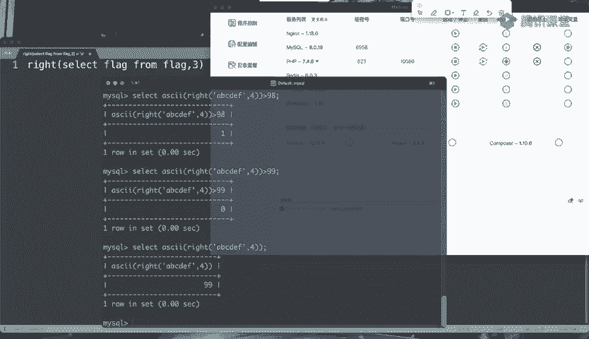

## 利用数字比较与二分查找法 ⚡

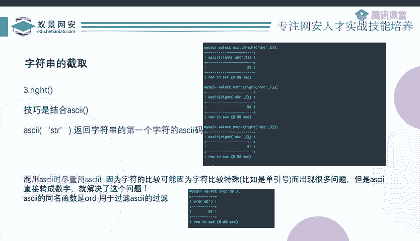

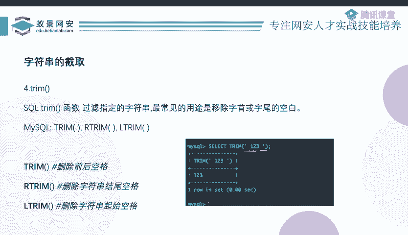

上一节我们介绍了基本的布尔盲注原理。本节中我们来看看如何通过数字比较来优化注入过程。

假设我们不知道目标字符的ASCII码值。传统的做法是从1开始逐一比较，最多需要比较127次。但如果我们使用大于（`>`）和小于（`<`）运算符，就可以采用二分查找算法。

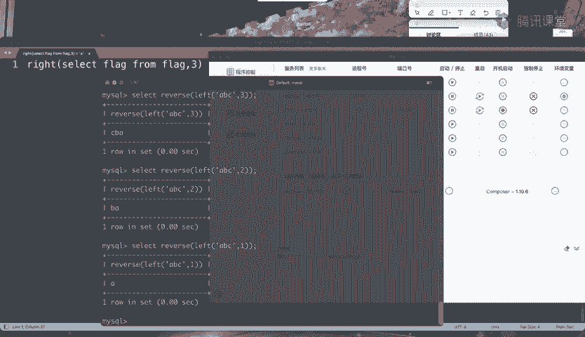

例如，判断一个字符的ASCII码值：
1.  询问它是否大于1（是）。
2.  询问它是否大于100（否）。
3.  询问它是否大于50（是）。
4.  询问它是否大于90（是）。
5.  询问它是否大于95（否）。
6.  询问它是否大于97（是）。
7.  询问它是否大于98（是）。
8.  询问它是否大于99（否）。

通过不到10次比较，我们就能确定该值为98。对于127个可能的ASCII值，使用二分查找最多只需要 **log₂(127) ≈ 7次** 比较，这极大地减少了请求次数和时间。

**核心公式**：二分查找将比较次数从 **O(n)** 降低到 **O(log n)**。

如果`ASCII()`函数被过滤，可以使用其同名函数`ORD()`进行绕过。

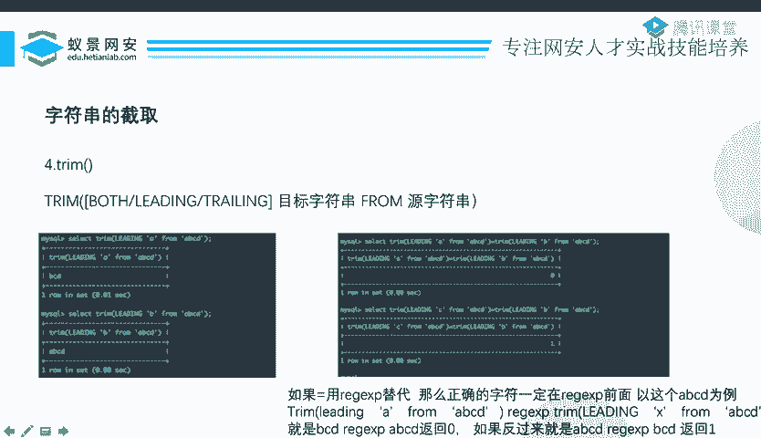

使用数字比较主要有三个优点：
1.  实现精确的字符定位。
2.  排除特殊字符的干扰。
3.  可以使用二分法，显著加快注入速度。

---

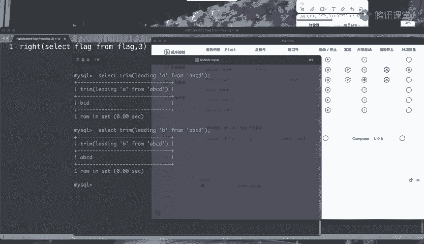

## 字符串截取函数的替代方案 🛠️

除了常见的`SUBSTR()`、`MID()`、`RIGHT()`函数，我们还可以使用`LEFT()`函数。

`LEFT(str, length)`函数从字符串左侧开始截取指定长度。但此时，变化的将是字符串的尾部字符，而非首字符，这不利于我们逐位判断。

**技巧**：结合`REVERSE()`函数使用。先将字符串反转，这样尾部字符的变化就变成了首字符的变化，然后就可以继续套用`ASCII()`或`ORD()`函数进行处理。

**示例代码**：
```sql
ASCII(REVERSE(LEFT((SELECT database()),1)))
```

---

## 使用TRIM函数进行截取判断 🧩

`TRIM()`函数本用于移除字符串首尾的空白字符。但其扩展用法`TRIM(LEADING/TRAILING/BOTH ‘target’ FROM ‘str’)`可以移除首尾的指定字符串。

*   `BOTH`：移除首尾。
*   `LEADING`：仅移除开头。
*   `TRAILING`：仅移除结尾。

例如：
*   `TRIM(LEADING ‘A’ FROM ‘ABCD’)` 返回 `‘BCD’`。
*   `TRIM(LEADING ‘B’ FROM ‘ABCD’)` 返回 `‘ABCD’`（因为字符串不以’B‘开头，无法移除）。

虽然`TRIM()`本身不能直接截取，但可以通过巧妙的比较来实现字符判断。以下是利用`TRIM()`判断首字符的逻辑：

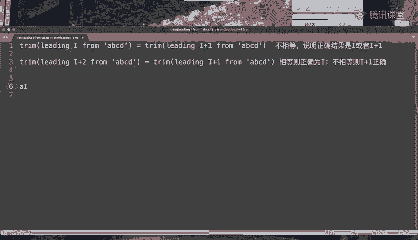

1.  **定位可能区间**：遍历字符`i`，比较 `TRIM(LEADING i FROM str)` 和 `TRIM(LEADING i+1 FROM str)` 是否相等。
    *   如果相等，说明`i`和`i+1`都不是字符串的正确起始字符。
    *   如果不相等，说明正确起始字符是`i`或`i+1`中的一个。
2.  **确定精确字符**：在发现不相等后，再比较 `TRIM(LEADING i+1 FROM str)` 和 `TRIM(LEADING i+2 FROM str)`。
    *   如果相等，则正确字符是`i`（因为`i+1`和`i+2`都不是起始字符）。
    *   如果不相等，则正确字符是`i+1`（因为`i+1`和`i+2`中必有一个是起始字符，而可能区间已锁定在`i`和`i+1`）。

找到第一位字符后，即可用`TRIM(LEADING ‘已知字符’ FROM str)`移除它，然后继续判断下一位字符。

---

## 其他比较运算符与注意事项 📌

以下是其他可用于布尔盲注的比较方法：

**LIKE操作符**：
*   用于模糊匹配。`%`代表任意字符序列。
*   **关键点**：在没有使用`%`通配符的情况下，`LIKE`与等号（`=`）的功能完全相同。如果等号被过滤，可以优先考虑使用`LIKE`。

**正则表达式（REGEXP/RLIKE）**：
*   用于进行正则匹配。默认是**大小写不敏感**的。
*   **技巧**：如果需要区分大小写，在表达式前加上`BINARY`关键字，例如：`SELECT ‘a’ REGEXP BINARY ‘A’` 将返回0（假）。

**BETWEEN...AND...操作符**：
*   用于判断一个值是否在某个闭区间内。`BETWEEN a AND b` 等价于 `>= a AND <= b`。
*   **脚本技巧**：可以直接让上下界相等，例如 `BETWEEN 2 AND 2`，这等价于判断值是否等于2，无需扩大判断范围。

**IN操作符**：
*   用于判断一个值是否属于一个集合。例如 `SELECT ‘a’ IN (‘a’, ‘b’, ‘c’)`。
*   同样，它默认是**大小写不敏感**的，如需敏感匹配，应使用`BINARY`。

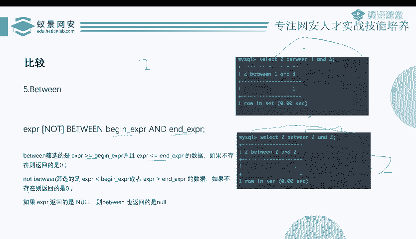

---

## 异或（XOR）注入的应用场景 🔗

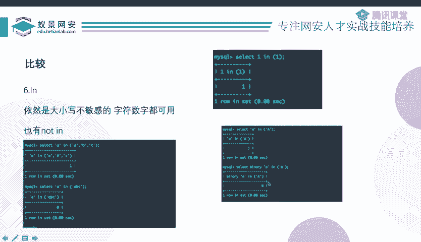

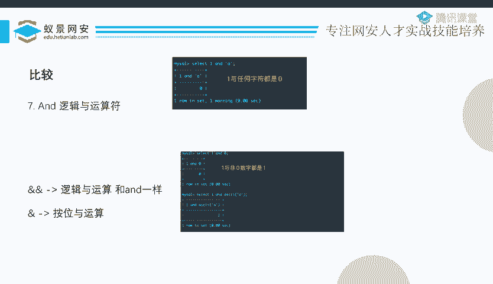

异或注入常用于一种特定场景：**当注释符（如`#`, `-- `）被禁用时**。

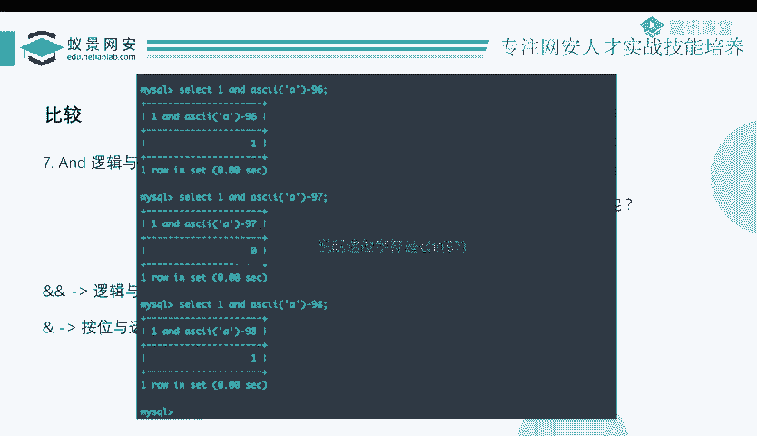

回顾普通注入，我们通过输入 `1‘ and 1=1 #` 来闭合前面的引号并注释掉后面的部分。如果不能用注释符，后面的引号就会破坏语法。

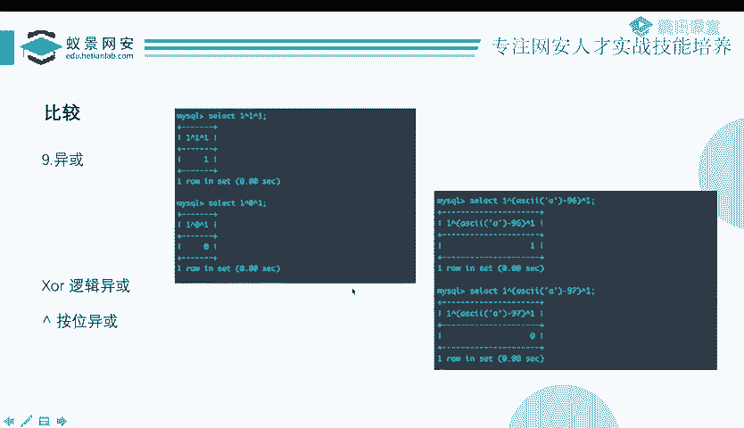

此时，可以构造如下的payload：
`1‘ and 1=1 and ’1‘=’1`
这样，我们手工构造的最后一个 `’1‘` 与源码中最后的引号形成了闭合。

但在实际注入中，`1=1`需要替换为复杂的布尔判断表达式（如截取比较）。如果`AND`等关键字也被过滤，就可以利用**异或（XOR）** 或**连等**的特性。

**构造原理**：
`1‘ XOR ( (SUBSTR((SELECT database()),1,1)) = ‘a’ ) AND ’1‘=’1`
*   整个表达式的结果取决于 `XOR` 中间括号内布尔表达式的真假。
*   如果布尔表达式为真（返回1），则 `1 XOR 1 = 0`。
*   如果布尔表达式为假（返回0），则 `1 XOR 0 = 1`。
*   页面会根据最终结果为0或1呈现不同的状态，从而实现布尔盲注。

除了`XOR`，也可以使用连等号：`1‘ = (布尔表达式) = ’1‘`，其原理类似。

---

## 总结 🎯

本节课中我们一起学习了布尔盲注的进阶技术：
1.  **效率提升**：通过将字符转换为ASCII码进行数字比较，并应用**二分查找算法**，可以指数级减少注入请求次数。
2.  **函数绕过**：当常见截取函数被过滤时，可以使用`LEFT()`+`REVERSE()`或`TRIM()`等函数配合特定逻辑实现字符判断。
3.  **多样比较**：熟悉`LIKE`、`REGEXP`、`BETWEEN`、`IN`等操作符在盲注中的应用及大小写敏感问题的处理（使用`BINARY`）。
4.  **特殊场景**：在**注释符被禁用**时，可以利用**异或（XOR）注入**或**连等**技巧来构造有效的注入语句，确保查询语法正确闭合。

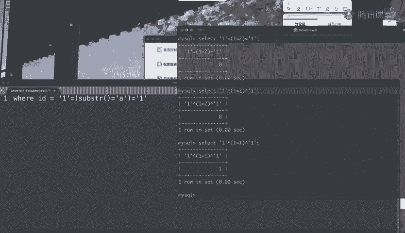

掌握这些技巧，能帮助你更灵活、高效地应对各种布尔盲注的挑战。