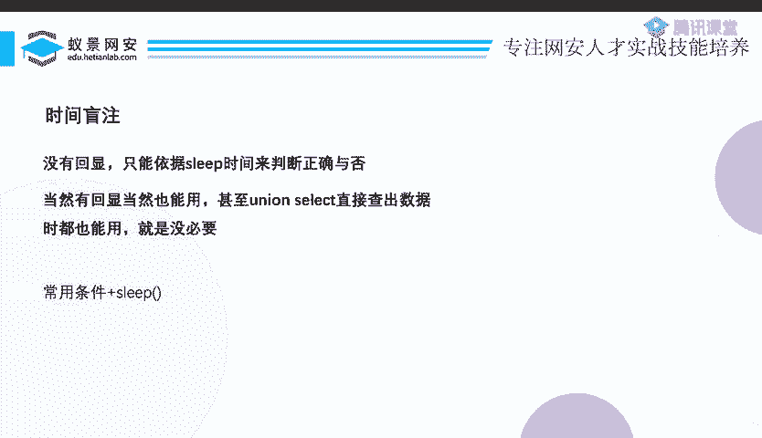
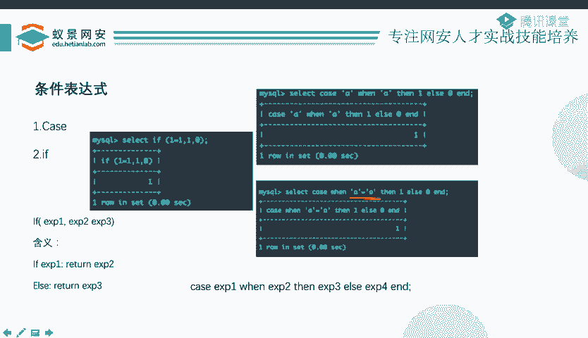
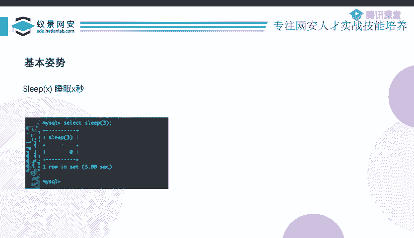

# CTF教程：P15：ctf-web14_延时盲注 🔍

在本节课中，我们将要学习CTF Web安全挑战中的延时盲注技术。延时盲注是当目标网站没有明确的布尔型回显（如成功/失败）时，通过观察网页响应时间来判断SQL查询结果的一种注入方法。

上一节我们介绍了布尔盲注，它依赖于两种不同的页面回显。本节中我们来看看当网站只有一种“查询成功”的回显时，我们该如何应对。

## 延时盲注的原理 ⏳

延时盲注的核心思想是利用数据库的延时函数。当构造的SQL查询条件为真时，触发一个延时操作（如等待数秒）；条件为假时，则不延时。通过测量网页的响应时间，我们就可以推断出查询条件的真假，从而逐步获取数据。

以下是实现延时的核心方法，主要使用条件表达式配合`sleep`函数。

*   **`IF` 函数**：语法为 `IF(expr1, expr2, expr3)`。如果表达式 `expr1` 为真，则返回 `expr2` 的结果，否则返回 `expr3` 的结果。
*   **`CASE` 语句**：有两种常见写法。一种是 `CASE value WHEN compare_value THEN result ELSE result END`，判断 `value` 是否等于 `compare_value`。另一种是 `CASE WHEN condition THEN result ELSE result END`，直接判断 `condition` 条件是否为真。
*   **`SLEEP` 函数**：`SLEEP(seconds)` 会让数据库查询暂停指定的秒数。

将条件表达式与 `SLEEP` 结合，即可构造延时注入的Payload。例如：
*   `IF(1=1, SLEEP(5), 0)` 如果 `1=1` 成立，则延时5秒。
*   `CASE WHEN 1=1 THEN SLEEP(5) ELSE 0 END` 效果相同。

当注入的SQL语句触发延时后，数据库会暂停响应。正在等待查询结果的Web服务器（如PHP）也会随之等待，导致网页加载时间变长。作为攻击者，我们通过观察页面是否“转圈”以及转圈的时长，就能判断注入的条件是否成立。

## 其他延时方法 📚

除了 `SLEEP` 函数，还存在一些其他可以制造数据库延时的方法，但在CTF考核中相对少见。

以下是几种可能的替代方案：
*   **`BENCHMARK` 函数**：通过重复执行一个表达式来消耗CPU时间，例如 `BENCHMARK(1000000, MD5('test'))`。
*   **笛卡尔积**：构造复杂的多表关联查询，产生巨大的临时结果集以拖慢查询速度。
*   **`GET_LOCK` 函数**：利用数据库锁机制制造竞争和等待。
*   **正则表达式**：通过计算密集型或灾难性的正则匹配来耗尽资源。

这些方法原理较为复杂，且应用场景有限。初学者掌握基于 `SLEEP` 的延时注入即可应对绝大多数情况。如需深入了解，可参考相关技术文档。

## 总结 🎯

本节课中我们一起学习了延时盲注技术。我们了解到，当目标网站没有布尔型回显时，可以通过构造 `IF` 或 `CASE` 条件表达式，在其为真时触发 `SLEEP` 函数延时。通过精确测量网页的响应时间，我们就能像布尔盲注一样，逐位推断出数据库中的信息。这是一种需要耐心但非常有效的注入手段。