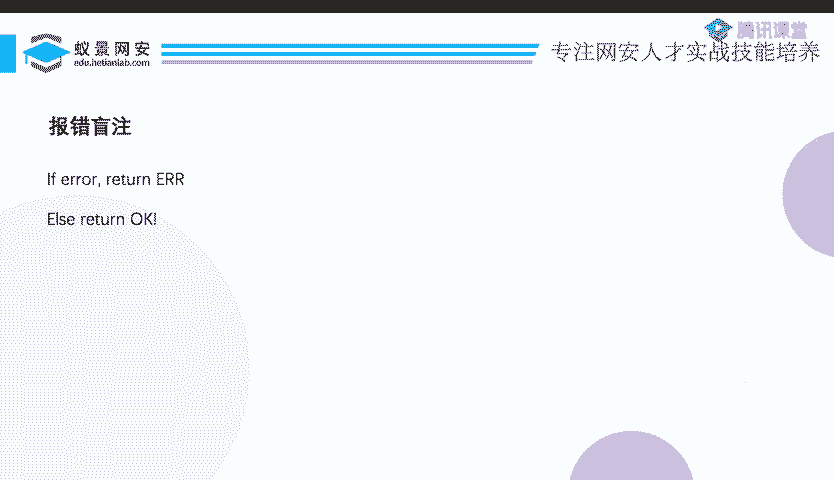
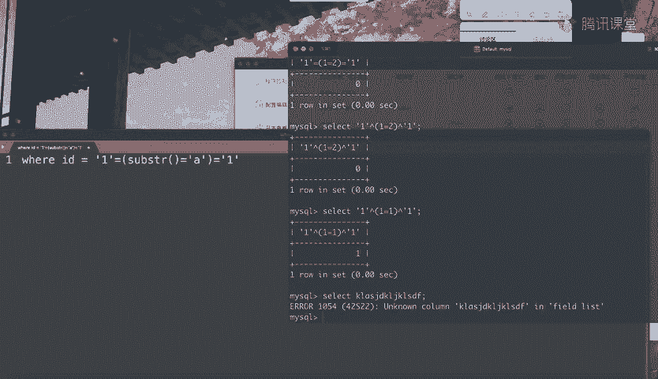
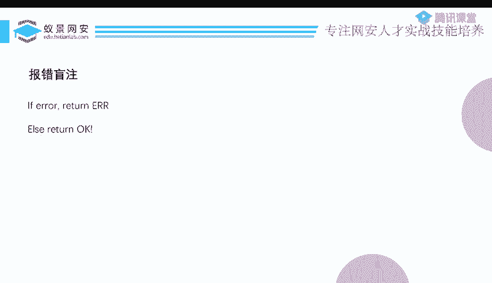
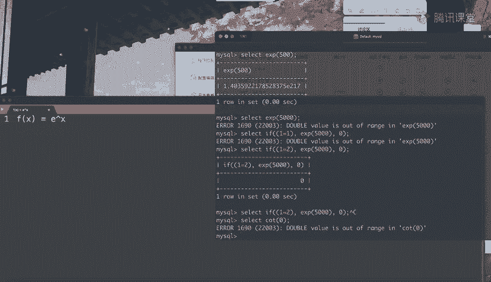
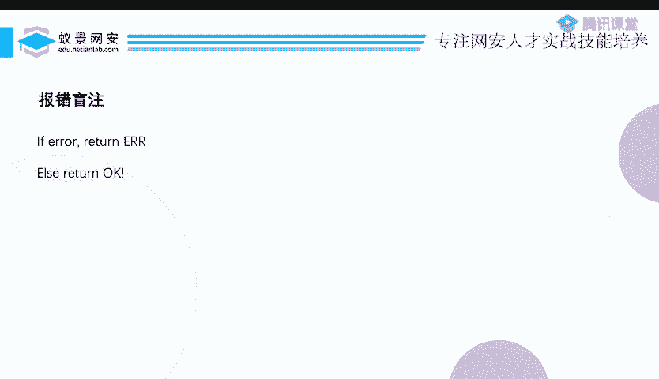

# CTF教程：P16：ctf-web15_报错盲注 🔍

在本节课中，我们将要学习一种特殊的SQL注入技术——报错盲注。这是一种基于布尔盲注思路的变体，但在特定场景下非常有用。我们将探讨其原理、适用场景以及如何构造有效的注入语句。

---

## 概述



上一节我们介绍了布尔盲注和延时盲注，本节中我们来看看报错盲注。报错盲注是布尔盲注的一个小分支，但在某些特定过滤场景下，它可能是唯一可行的注入方法。其核心特点是，服务器仅返回“查询出错”或“查询正常”两种状态，而不会泄露具体的错误信息或查询结果。

## 什么是报错盲注？

报错盲注是指，当MySQL查询语句执行出错时，服务器返回一个通用的“出错”提示；当查询正常执行时，则返回“OK”。它只有这两种简单的返回状态。

基于这种情况，如何进行注入呢？如果查询不出错，总是返回“OK”，我们首先会考虑延时盲注。但如果常见的延时函数（如`sleep()`）被过滤，我们就需要寻找其他方法。此时，我们可以利用“有选择性地触发错误”这一机制来构造布尔条件。

## 与常规报错注入的区别

昨天我们讲解了常规的报错注入，利用`updatexml()`或`extractvalue()`等函数，可以将查询结果从错误信息中泄露出来。



但报错盲注与之不同。在报错盲注场景下，即使出错，服务器也**不会显示具体的错误内容**，只会告知“出错”。因此，昨天那些用于泄露信息的报错注入技术在此完全失效。

同时，如果错误是**无条件必然出现**（如输入语法错误）或**必然不出现**，我们也无法利用。关键在于，我们必须能够**有条件地控制错误是否发生**，从而将“出错”与“正常”作为布尔判断的依据。



## 核心思路：构造条件性错误

我们的目标是构造一个SQL表达式，使得：
*   当某个条件为真时，执行一个会引发错误的函数。
*   当条件为假时，不执行该函数，从而不报错。

这类似于延时盲注的逻辑，只是将“延时”替换为“触发错误”。

以下是实现这一思路的关键：
1.  整个注入语句的语法必须正确，能够通过初步解析。
2.  利用`IF(condition, true_expression, false_expression)`语句。
3.  当`condition`为真时，执行`true_expression`，而这个表达式需要包含一个能在特定条件下引发错误的函数。

## 可用的报错函数

那么，什么样的函数可以“有条件地”引发错误呢？以下是两个典型的例子：

### 1. `EXP()` 函数
`EXP(x)`函数返回自然常数 *e* 的 *x* 次方（*e^x*）。这是一个指数增长极快的函数。

当 *x* 的值过大时，计算结果会超出MySQL能处理的数值范围，从而引发“DOUBLE value is out of range”错误。

**利用公式：**
```sql
IF(条件, EXP(5000), 0)
```
*   当`条件`为真时，执行`EXP(5000)`，由于结果过大而报错。
*   当`条件`为假时，返回0，查询正常。

### 2. `COT()` 函数
`COT(x)`是三角函数余切。当 *x* 为0时，`COT(0)`在数学上趋于无穷大，同样会导致数值溢出错误。

**利用公式：**
```sql
IF(条件, COT(0), 0)
```
*   当`条件`为真时，计算`COT(0)`引发错误。
*   当`条件`为假时，返回0。

基于此思路，你可以寻找其他能产生极大值或非法运算（如除零）的数学函数来触发错误。

## 注入流程示例

假设我们想判断数据库名的第一个字符是否为‘a’，可以构造如下语句：

```sql
IF(SUBSTR(DATABASE(),1,1)='a', EXP(5000), 0)
```

1.  如果数据库首字符是‘a’，则执行`EXP(5000)`，服务器返回“出错”。
2.  如果不是‘a’，则返回0，服务器返回“OK”。



通过遍历字符，并观察每次请求是“出错”还是“OK”，我们就能逐位推断出数据库名、表名、字段名及具体数据，其脚本编写框架与布尔盲注脚本大同小异。

---

## 总结



本节课中我们一起学习了报错盲注技术。我们了解到，当服务器只返回“出错”和“正常”两种状态，且常规延时函数被禁用时，报错盲注是一种有效的解决方案。其核心在于利用`IF`语句和`EXP()`、`COT()`等能触发数值范围错误的函数，有条件地构造查询错误，从而将“是否报错”作为一个布尔判断条件，进行数据盲猜。掌握这一技术能帮助你在更严格的过滤环境下完成SQL注入攻击。