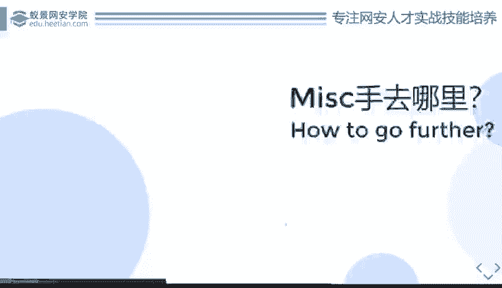
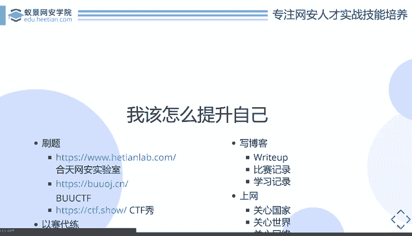
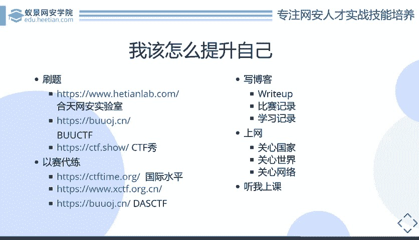

# CTF教程：P17：MISC该怎么去学习

在本节课中，我们将要学习如何有效地学习CTF中的MISC（杂项）方向。我们将探讨从初学者到进阶者的学习路径，包括刷题、写博客、关注行业动态等具体方法，帮助你构建系统的知识体系并持续进步。

上一节我们介绍了MISC方向的特点，本节中我们来看看如何系统地学习MISC。

## 🎯 如何开始学习与进步

对于MISC方向的学习者，首先需要明确前进的方向和方法。核心在于主动积累和练习。

### 📚 首要方法：刷题

刷题是学习任何CTF方向的基础。通过大量练习，可以积累解题思路和知识点。如果能将CTF发展至今出现的所有MISC题目都练习一遍，水平将得到极大提升。

刷题不仅能增加思路，还能帮助你在遇到新题时，联想到过去做过的类似题目，从而借鉴解法。

以下是几个推荐的刷题平台：

*   **攻防世界（HackTheBox Lab）**：提供丰富的实战环境。
*   **BUUOJ**：由赵金同学搭建的永久免费CTF平台。
*   **CTFshow**：需注意部分题目可能需要付费，且题目质量参差不齐。

建议优先寻找并练习国内外大型赛事（如“网鼎杯”、“强网杯”）的历年真题，这些题目更具参考价值。

### 🏆 以赛代练

参加比赛是检验和提升水平的有效方式。

*   **国际比赛**：可以通过CTFtime网站参与每周都有的国际赛事。这有助于拓宽思路，了解不同的安全研究方向。有时甚至能遇到国内比赛直接引用的原题。
*   **国内月赛**：例如XCTF、DasCTF等，通常难度较高。建议在有一定基础（例如刷题半年后）再尝试。即使无法解出，赛后阅读他人的“Writeup”（解题报告）也是重要的学习过程。

### ✍️ 知识内化：写博客

对于知识点非常分散的MISC方向，建立个人知识库至关重要。写博客是极佳的方式。

你可以购买学生云服务器搭建WordPress，或使用GitHub Pages配合Hexo等静态博客框架。

写博客不仅限于记录Writeup，还应包括：
*   比赛心得与感悟。
*   工具使用记录。
*   日常学习笔记。

**关键点**：阅读他人的Writeup后，务必自己重新做一遍题目，并撰写属于自己的解题报告。这个过程才是真正将知识消化吸收。

### 🌐 关注行业动态

MISC题目常与最新的安全事件或技术突破相关联。主动关注安全界动态，是变被动学习为主动学习的关键。

例如：
*   王小云院士的MD5碰撞研究公开后，很快出现了相关的MISC题目。
*   Apache服务器爆出漏洞后，相关考点也迅速出现在赛题中。

因此，多关注安全新闻、技术论文，能让你提前接触到可能成为考点的知识，学习效率更高。

### 🧑‍🏫 系统化学习

最后，参加系统的课程学习（例如本系列课程）可以帮助你梳理MISC的基础知识和常见套路。虽然这不能让你立刻成为顶尖高手，但能为你的整体水平提升打下坚实基础，构建学习框架。

本节课中我们一起学习了MISC方向的有效学习方法。我们强调了刷题和实战练习的重要性，介绍了如何通过写博客来内化分散的知识点，并建议主动关注安全动态以拓宽视野。记住，持续练习、总结和主动学习是提升CTF技能的不二法门。