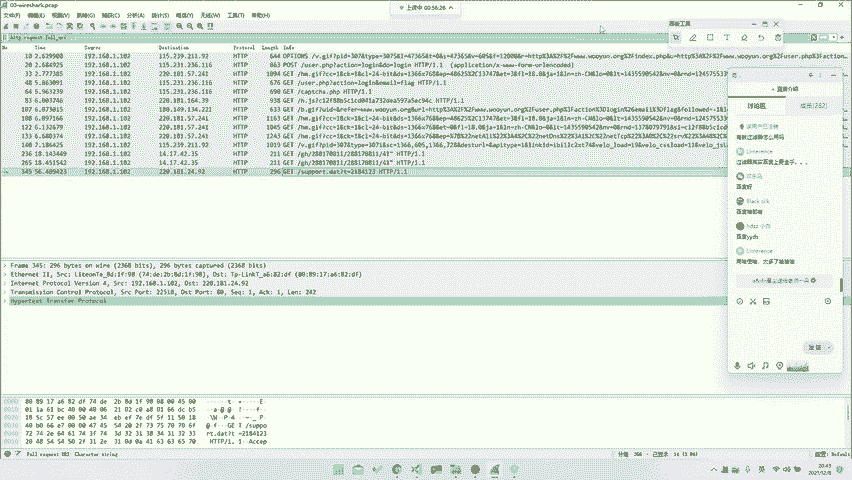
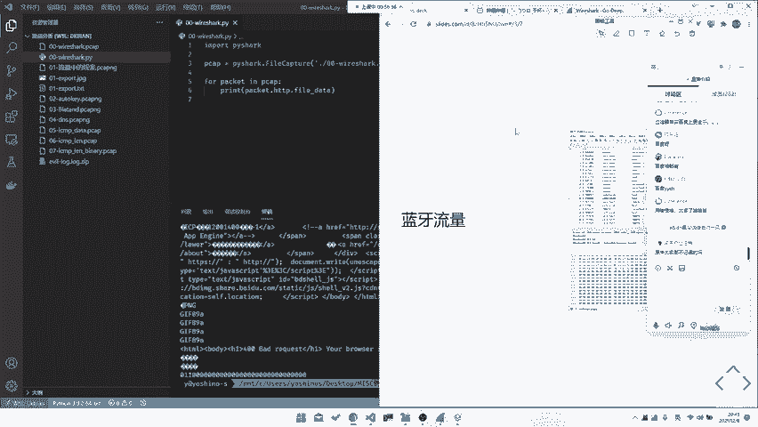

# CTF教程：P18：ctf-web17_基础之流量种类

## 概述
在本节课中，我们将学习CTF比赛中流量分析题目所涉及的各种流量种类。理解不同协议层和类型的流量是分析网络数据包的基础。

## 流量种类概述
流量分析主要涉及网络流量、USB流量以及其他通信协议流量。最常见的分析对象是网络流量。

## OSI七层模型与流量分析
上一节我们介绍了流量种类的整体概念，本节中我们来看看OSI七层模型如何对应不同的流量分析场景。OSI模型将网络通信分为七层，但并非每一层都是CTF题目的常见考点。

以下是各层协议在CTF中可能出现的情况：
*   **物理层**：如以太网物理层协议（802.3等），通常不考虑。
*   **数据链路层**：如以太网帧，考察不多。
*   **网络层**：如IP、ICMP协议，可能出现。
*   **传输层**：如TCP、UDP协议，考察非常多。
*   **会话层**：如SMB、DNS协议，可能作为分析对象。
*   **表示层**：如加密协议（TLS/SSL），在Web中涉及。
*   **应用层**：如HTTP、FTP协议，考察最多且形式多样。

在TCP/IP四层模型中，数据链路层通常被忽略。网络层是能考察到的最底层协议。

## 各层协议详解
上一节我们按层梳理了可能考察的协议，本节中我们来看看其中一些重点层和协议的具体情况。

### 网络层与传输层
网络层协议（如IP、ARP）可能被修改或用于信息统计。传输层协议（TCP/UDP）则关注端口号、连接状态（如TCP三次握手）等。理解这些基础概念对流量分析至关重要。

### 应用层协议
应用层协议考察最多，形式也最丰富。

以下是常见的应用层协议考察方向：
*   **工控协议**：如Modbus、S7comm，是一个较新的考察方向。
*   **HTTP协议**：常涉及SQL注入、文件上传等攻击流量的分析。
*   **FTP协议**：考察相对较少。
*   **TLS/SSL协议**：可能涉及中间人攻击等场景。
*   **自定义协议**：这是最大的难点，需要手动分析协议格式和字段。

分析自定义协议需要耐心查找资料并善于发现数据中的规律。

## 非网络流量分析
除了网络流量，CTF中还会出现其他类型的通信流量分析。

### USB流量
USB流量主要分为三类设备。

以下是USB设备的三种类型：
1.  **USB UART**：仅用于数据传输。
2.  **USB HID**：人体输入设备，如键盘、鼠标、游戏手柄。这是最常分析的USB流量类型。
3.  **USB Mass Storage**：大容量存储设备，如U盘、移动硬盘。

我们通常分析的是低速USB HID设备流量。任何有通信的地方都可能产生可分析的流量。

### 其他协议流量
此外，还可能遇到蓝牙、ZigBee等无线通信协议，甚至I2C、SPI等硬件总线协议封装在TCP流中的情况。

## 流量包结构实例
上一节我们介绍了多种流量类型，本节中我们通过Wireshark工具来看看一个真实流量包的结构。一个完整的网络数据包（如HTTP）在Wireshark中会分层显示。

以下是一个HTTP数据包的分层示例：
*   **Frame**：物理帧概览。
*   **Ethernet II**：数据链路层，包含源和目的MAC地址。
*   **Internet Protocol Version 4**：网络层，包含源和目的IP地址。
*   **Transmission Control Protocol**：传输层，包含源和目的端口、序列号、确认号等。
*   **Hypertext Transfer Protocol**：应用层，包含HTTP请求/响应的完整内容。

通常我们从应用层开始分析。过滤器（Filter）的使用是分析的关键，可以通过查阅官方文档或搜索引擎来掌握常用过滤语法。

## 总结
本节课中我们一起学习了CTF流量分析涉及的各类流量。我们从OSI模型出发，了解了从网络层到应用层，再到USB、蓝牙等非网络流量的常见考察点。掌握这些流量种类和基本结构，是进行深入流量分析的第一步。善于使用工具和搜索引擎是解决此类问题的必备技能。