# CTF教程：P19：ctf-web18_基础之需要的工具 🛠️

在本节课中，我们将学习CTF杂项（Misc）中流量分析部分所需的基础知识和核心工具。流量分析并非拿来即用，它需要一定的计算机网络或通信协议基础。本节将简要介绍这些基础，并重点讲解进行流量分析必须掌握的工具及其应用场景。

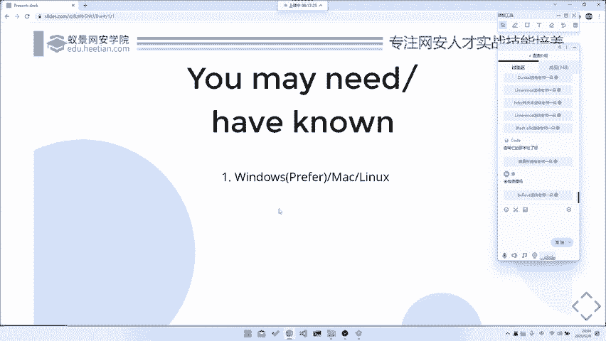

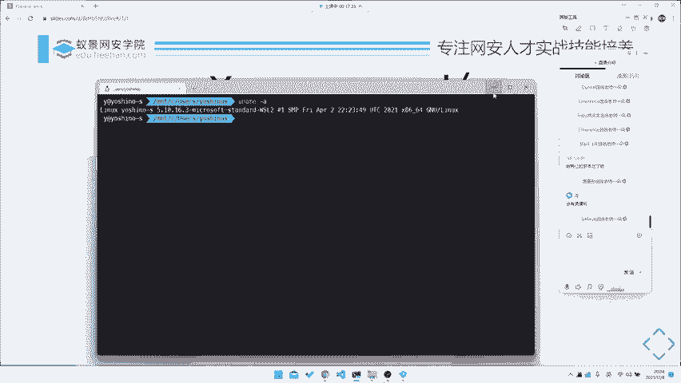

## 网络基础与课程准备

上一节我们介绍了流量分析的背景，本节中我们来看看学习前需要做的准备。

进行流量分析需要一定的计算机网络知识。例如，理解TCP/IP模型、HTTP协议等是分析网络数据包的基础。若想深入学习，需要阅读《计算机网络》等相关书籍，但这需要投入较多时间，建议课后自行补充。

以下是本课程对学习环境的要求：
*   **操作系统**：对平台依赖不高，但建议使用Windows或Linux系统。
*   **推荐环境**：最佳配置是Windows系统搭配一个WSL（Windows Subsystem for Linux）环境，或使用Linux虚拟机。Mac用户使用虚拟机亦可。

## 流量分析的发展方向

流量分析在CTF竞赛中属于杂项，但其技能最终会应用于更广泛的网络安全领域。

在国内CTF中，杂项内容分散；而在国外，流量分析通常归属于**取证（Forensics）**或**网络分析（Network Analysis）** 这两个方向。其未来的进阶发展方向主要有三个：

1.  **大规模流量与异常检测**：例如，从海量网络数据中识别攻击流量、爬虫行为等异常。这类似于工作中的安全运营中心（SOC）或端点检测与响应（EDR）场景。在某些CTF题目中，也可能需要从数万条流量记录中批量提取信息。
2.  **数字取证**：协助进行网络取证调查，例如分析中间人攻击数据包，或协助执法部门分析犯罪嫌疑人的网络活动记录。
3.  **协议逆向辅助**：通过抓取和分析应用程序的网络通信包，来辅助理解其私有协议的结构，从而进行协议逆向工程。

现阶段，我们主要学习对单个数据包文件的特定分析。掌握这些技巧后，才能进一步处理大规模甚至实时的流量分析任务。

## 核心分析工具

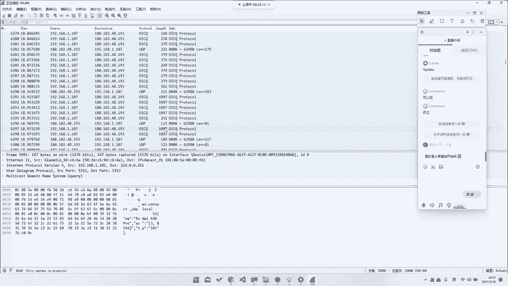

接下来，我们进入正题，介绍流量分析中最核心、最强大的工具集。

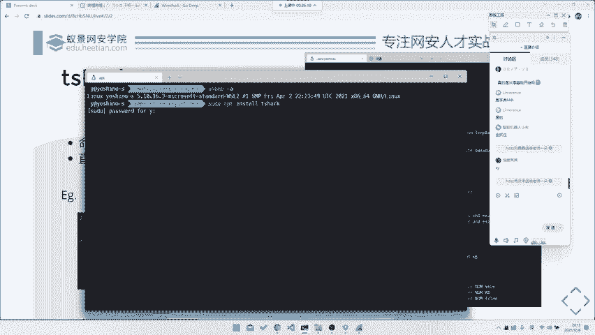

### Wireshark：图形化流量分析神器 🦈

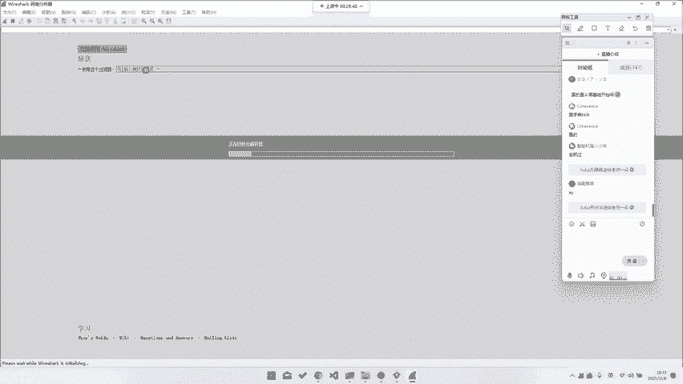

Wireshark 是全球最著名、使用最广泛的网络协议分析器。它功能极其强大，支持分析包括HTTP、TCP/IP在内的标准协议，以及Modbus、蓝牙、802.11（Wi-Fi）甚至USB等各类协议。

**安装与基本应用**：
*   **安装**：通过搜索引擎访问Wireshark官网下载对应版本安装即可。
*   **动态抓包**：启动Wireshark，选择网卡（如Wi-Fi适配器），即可开始捕获所有流经该网卡的数据包，并能实时解析多种协议。
*   **静态分析**：打开已有的数据包文件（`.pcap`、`.pcapng`），进行深入分析。其图形界面友好，适合初学者。

**基础操作示例**：
面对一个包含Web登录流量的数据包，寻找Flag的典型步骤如下：
1.  在Wireshark中打开数据包文件。
2.  在过滤栏输入 `http` 筛选HTTP协议数据包。
3.  找到`POST`登录请求，右键点击该数据包。
4.  选择 **“追踪流” -> “HTTP流”**。
5.  在弹出的窗口中，可直接看到明文传输的登录参数，如 `password=flag{...}`。

Wireshark还提供丰富的统计功能（如“统计”->“对话”），有助于从宏观把握流量特征。

### TShark：命令行版的Wireshark 💻

当需要进行自动化处理或批量导出数据时，图形界面的Wireshark可能不够高效。此时，需要使用其命令行版本——TShark。

**安装与使用**：
*   **安装**：在Ubuntu/Debian上可使用 `sudo apt install tshark` 安装。
*   **基本命令**：`tshark -r file.pcap -Y “过滤表达式”` 用于读取并过滤数据包。

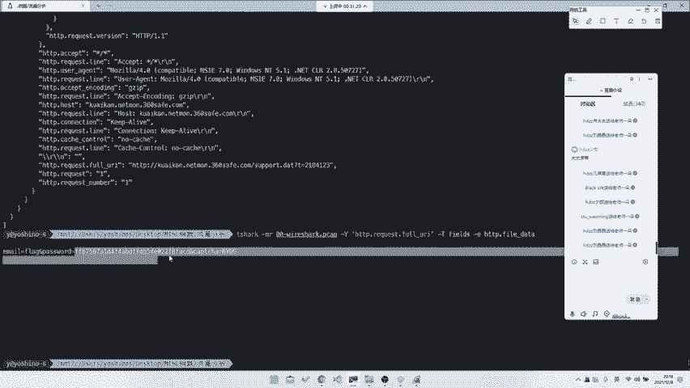

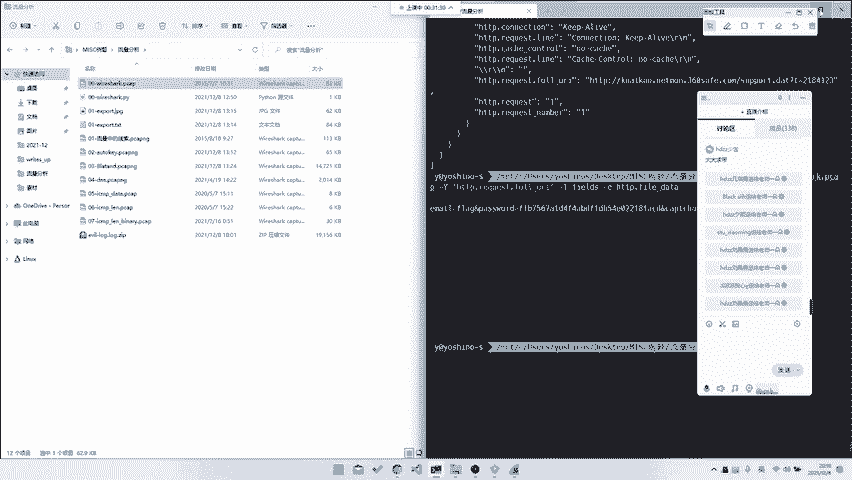

**实战命令示例**：
针对上述登录题目，使用TShark快速提取Flag：
*   **方法一：提取HTTP请求体**
    ```bash
    tshark -r capture.pcap -Y “http.request” -T fields -e http.file_data
    ```
    此命令会过滤出所有HTTP请求，并打印出请求体（如POST数据），从中即可找到Flag。
*   **方法二：跟随特定TCP流**
    ```bash
    tshark -r capture.pcap -z “follow,tcp,ascii,0” -q
    ```
    此命令可以ASCII形式输出第0个TCP流的全部内容，方便查看整个会话。

### PyShark：Python集成分析库 🐍

对于CTF选手，经常需要编写脚本进行复杂或批量处理。PyShark提供了Python接口来调用Wireshark的解析能力。

**简单脚本示例**：
以下Python脚本实现了与上述TShark命令类似的功能：
```python
import pyshark

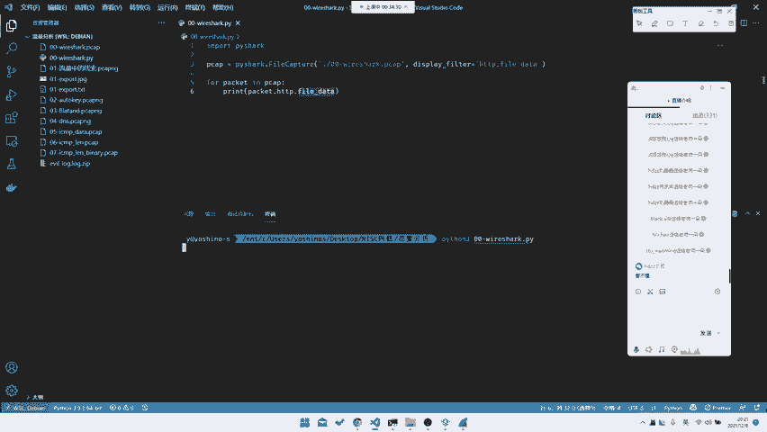

cap = pyshark.FileCapture(‘capture.pcap’, display_filter=“http”)
for pkt in cap:
    if hasattr(pkt.http, ‘file_data’):
        print(pkt.http.file_data)
cap.close()
```
通过Python，我们可以灵活地对提取的数据进行进一步解码、计算或匹配，适应更复杂的题目需求。

### 其他辅助工具

除了Wireshark生态，还有一些特色工具：
*   **科来网络分析系统**：国产的优秀网络分析工具，在流量统计、会话分析、异常流量宏观展示方面非常直观。适用于需要快速统计“访问量最大IP”、“异常请求”等题目场景。

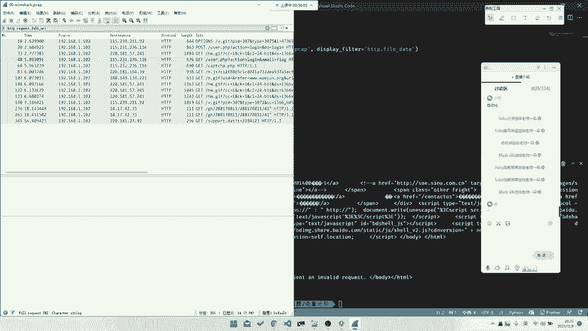

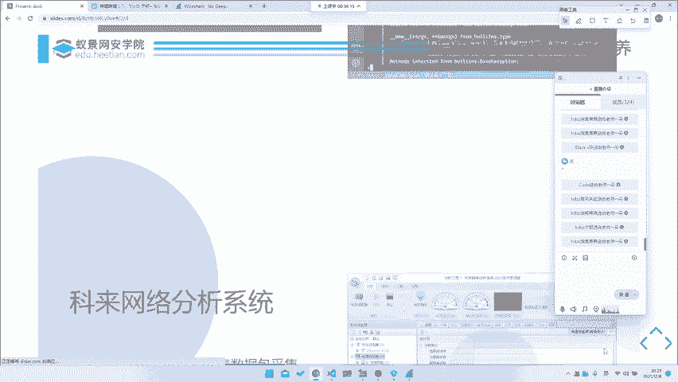

然而，在绝大多数CTF流量分析题目中，**Wireshark（配合TShark）仍是主力工具**，因此本课程将重点围绕其展开。


---

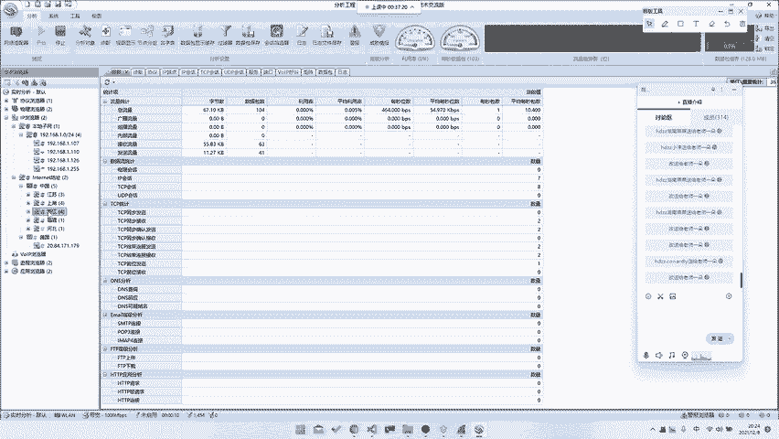

本节课中我们一起学习了流量分析的基础定位、发展方向以及核心工具链。我们了解到，Wireshark是分析的起点，TShark便于自动化，而PyShark则能与自定义脚本深度集成。掌握这三者，就为解开各类CTF流量分析题目打下了坚实的工具基础。下一节，我们将开始运用这些工具，解析具体的实战题目。