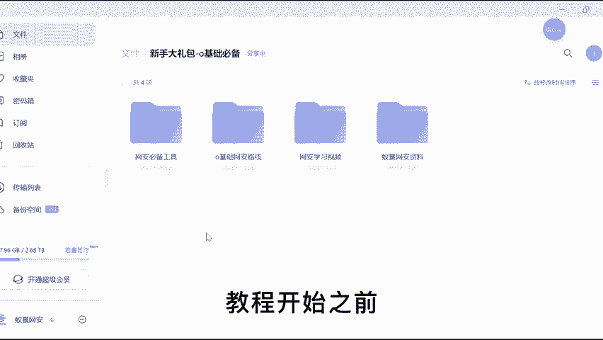
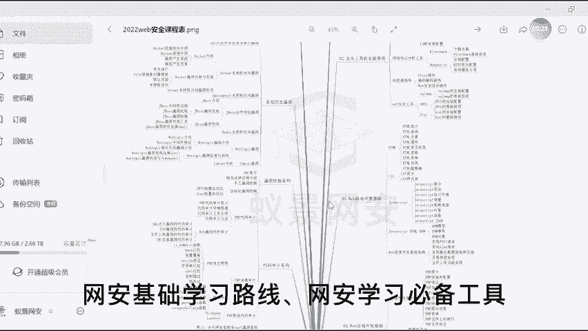
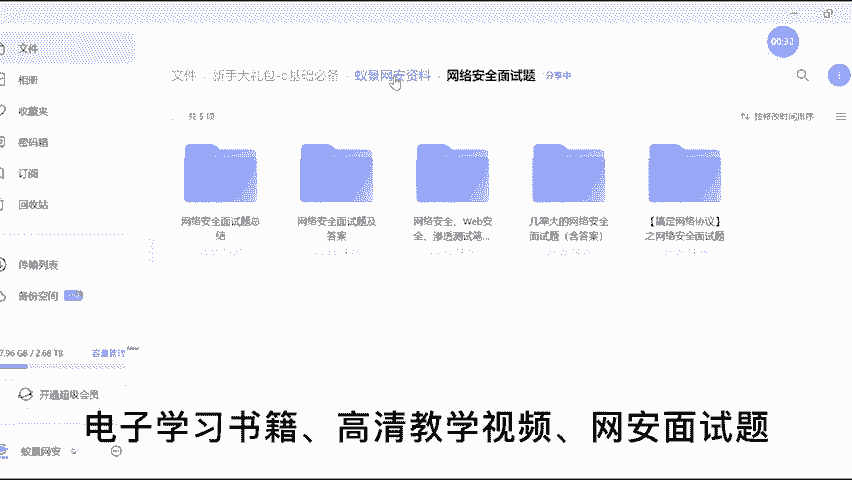
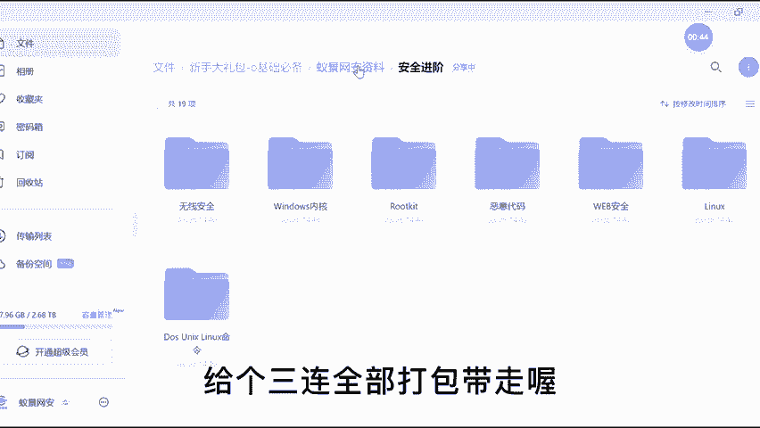

# CTF教程：P1：课程笔记与网络安全教程分享 🛡️

在本节课中，我们将学习CTF（Capture The Flag）竞赛的基础知识，并了解本系列教程的结构与学习资源。课程将涵盖CTF的四个主要方向：Web安全、Pwn、杂项（Misc）和逆向工程。

## 概述

CTF是一种流行的网络安全竞赛形式，参赛者通过解决各类安全挑战来获取“旗帜”（Flag）。掌握CTF技能对于理解网络安全核心概念至关重要。

## 课程资源

在开始具体学习前，以下是为初学者准备的全套学习资源。

*   **网安基础学习路线图**：提供清晰的学习路径指引。
*   **网安学习必备工具集**：包含实践所需的各种软件与工具。
*   **精选电子学习书籍**：涵盖从基础到进阶的理论知识。
*   **高清教学视频**：配合教程的视觉化学习材料。
*   **网安面试题库**：帮助学习者检验知识并为求职做准备。

## 教程结构

上一节我们介绍了本课程附带的资源，本节中我们来看看教程的核心安排。本系列教程旨在通过持续练习帮助学习者系统提升。

以下是教程的主要内容模块：

1.  **ctf-web**：专注于Web应用安全，涉及SQL注入、XSS、CSRF等漏洞。
2.  **ctf-pwn**：专注于二进制漏洞利用，涉及栈溢出、格式化字符串等。
    *   核心概念示例：栈溢出基本原理可通过 `buffer[固定大小]` 写入超长数据来理解。
3.  **ctf-misc**：涵盖杂项知识，如隐写术、编码分析、网络流量分析等。
4.  **ctf-逆向**：专注于软件逆向工程，涉及静态分析与动态调试。

## 学习方法

为了保证学习效果，建议遵循“每日一练”的原则。通过解决大量练习题来巩固理论知识并积累实战经验。

## 总结

本节课中，我们一起学习了CTF竞赛的基本概念、本教程提供的丰富学习资源以及课程涵盖的四个主要技术方向。坚持每日练习是掌握这些技能的关键。下一节，我们将进入第一个实战主题——Web安全基础。