# CTF教程：P20：ctf-web19_拿到题目该做什么之关键点提取与信息收集 🎯

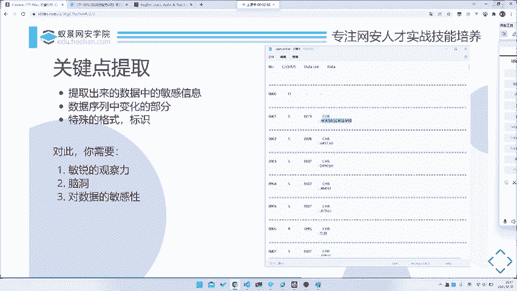

在本节课中，我们将学习CTF解题流程中至关重要的一步：**关键点提取与信息收集**。面对海量的数据或复杂的题目，如何快速定位核心信息并利用外部资源，是解题效率的关键。

上一节我们介绍了数据的初步分析与预处理，本节中我们来看看如何从处理过的数据中提取关键信息，并进行有效的信息搜集。

## 关键点提取 🔍

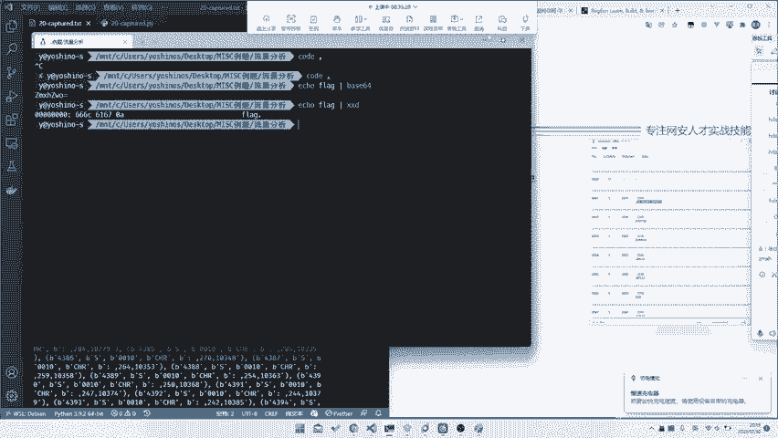

关键点提取，即从数据中找出我们需要关注的核心部分。一个时间序列或数据包中可能包含成千上万行数据，我们不可能逐一分析所有内容。虽然所有数据都可能有用，但分析时必须抓住重点。

以下是提取关键点的几个主要方向：

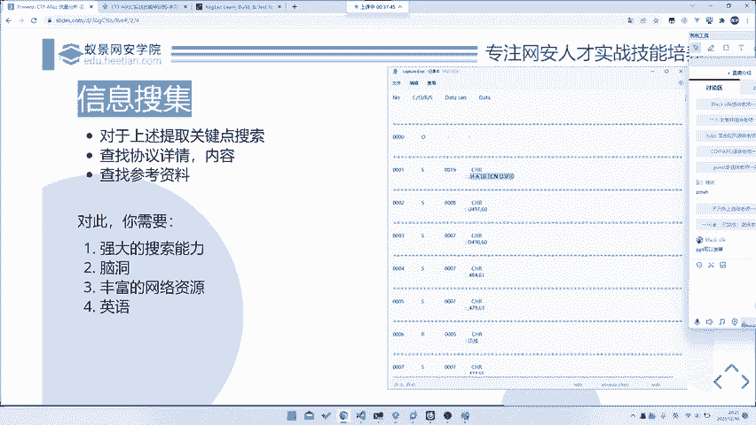

**1. 敏感或变化的部分**
首先应关注数据中明显变化或可能包含敏感信息的部分。例如，在一个数据集中，`number`字段可能只是单调递增的序号，价值不大。而`data`字段的内容每次都可能不同，这很可能就是我们需要分析的重点。

**2. 特殊格式或关键词**
数据中具有特殊格式的字符串或关键词也至关重要。这些特征能帮助我们判断流量或数据的类型。例如，看到`ZMxHZ`这样的字符串，熟悉Base64编码的同学可能会立刻警觉。识别这些格式是后续搜索的基础。

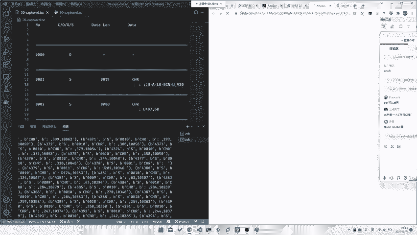

提取关键点需要具备以下几种能力：
*   **敏锐的观察力**：能快速发现数据中的变化规律和异常点。
*   **一定的“脑洞”**：有时需要跳出常规思维，与出题人的思路对齐。
*   **数据敏感度**：对常见编码格式（如Base64、Hex）或特定模式有快速识别能力。

## 信息搜集 🌐

提取出关键词后，下一步就是利用它们进行信息搜集。信息安全领域讲究“不要重复造轮子”，很多题目可能基于已知协议或已有公开解法。

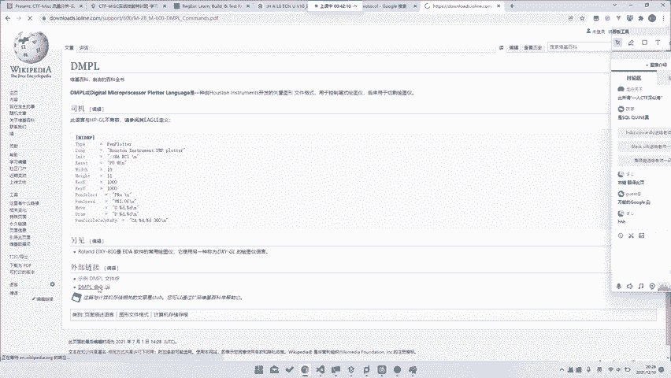

信息搜集主要查找以下内容：
*   **协议详情**：如果题目涉及特定协议，查找该协议的官方文档或详解。
*   **类似题目或Write-up**：搜索是否有原题或类似的解题报告。
*   **工具或脚本**：查找是否有现成的解析工具或脚本可用。

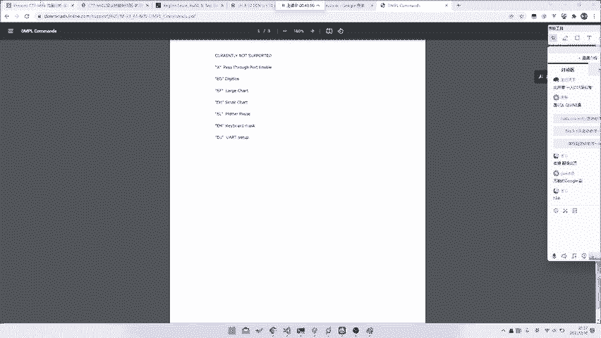

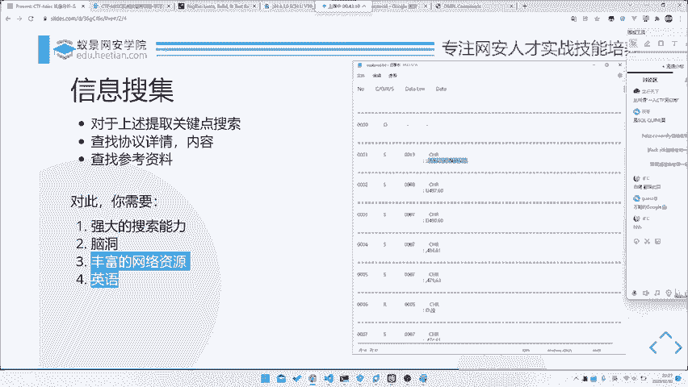

有效的信息搜集需要以下技能：
*   **搜索技巧**：掌握搜索引擎的高级语法，能精准定位信息。
*   **丰富的资源储备**：收藏夹里应有各类安全论坛、工具网站和文档库。
*   **外语能力**：特别是英语能力。很多一手资料和协议文档都是英文的。有时甚至需要其他语言能力，例如曾有题目只在韩文网站上有相关讨论。

## 实战演练：从搜索到解题 🛠️

让我们通过一个例子来串联以上步骤。假设我们从一个数据包中提取到了一个关键词 `DMPL`。

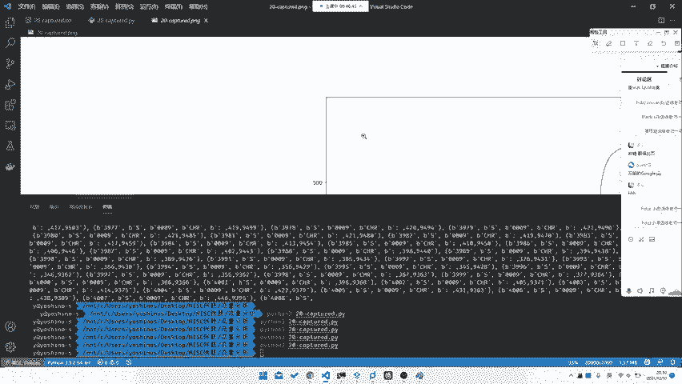

1.  **初步搜索**：在百度中搜索“DMPL”，结果可能只显示它与“刻字机”相关，信息有限。
2.  **调整关键词**：利用英语能力，搜索“DMPL protocol”。这次我们找到了英文资料，显示它是“Digital Microprocessor Plot Language”，一种用于绘图仪的向量图文件格式。
3.  **找到文档**：进一步搜索，找到了DMPL命令的官方文档，其中详细说明了`UP`（提笔）、`DOWN`（落笔）、`MOVE`（移动）等指令。
4.  **理解与解题**：根据文档理解数据含义，编写脚本解析坐标和笔触状态，即可绘制出隐藏的图形或Flag。

即使在不完全理解`UP`/`DOWN`指令的情况下，仅提取坐标数据并绘图，有时也能直观地得到Flag。这体现了关键点提取（这里是坐标数据）的直接作用。

## 总结 📝

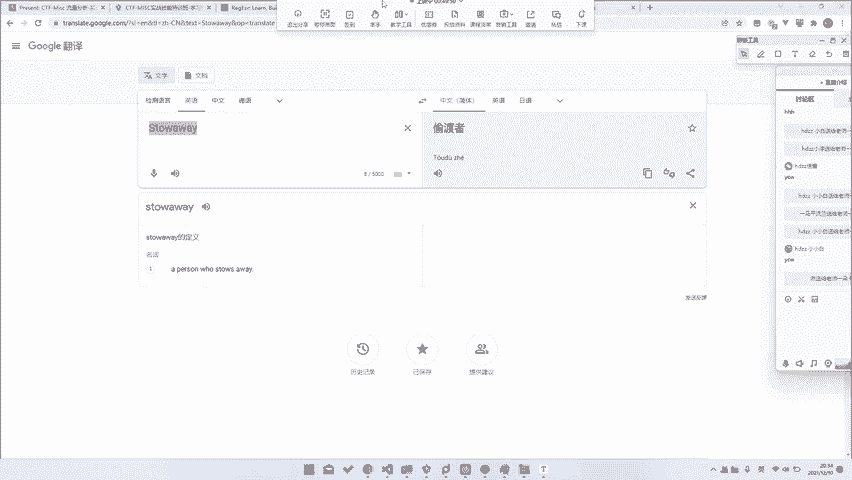

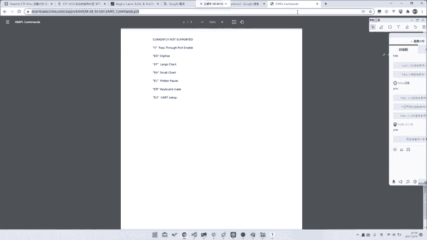

本节课中我们一起学习了CTF解题的核心思维流程：
1.  **关键点提取**：从数据中筛选出**变化的部分**和**特殊格式**作为重点。
2.  **信息搜集**：利用提取出的关键词，运用**搜索技巧**和**外语能力**查找协议、文档或类似解法。

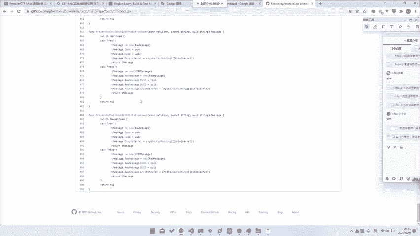

这套“**分析 -> 提取 -> 搜索**”的方法论，无论是处理简单的流量分析题，还是复杂的逆向协议题，都是普遍适用的高效路径。掌握它，能帮助你在CTF赛场上更快地拨开迷雾，直击要害。