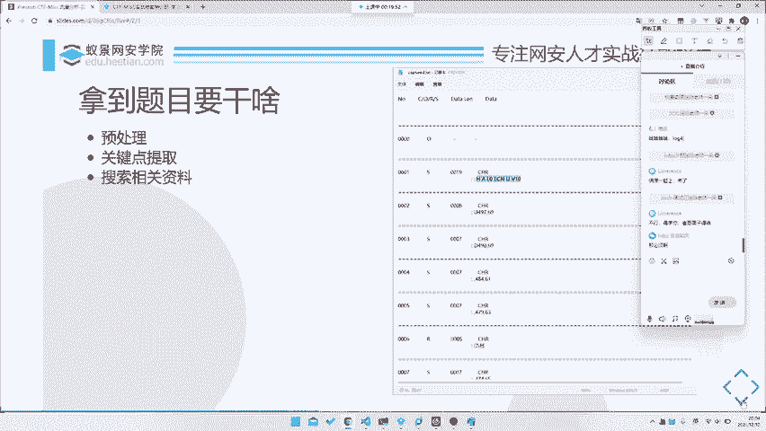
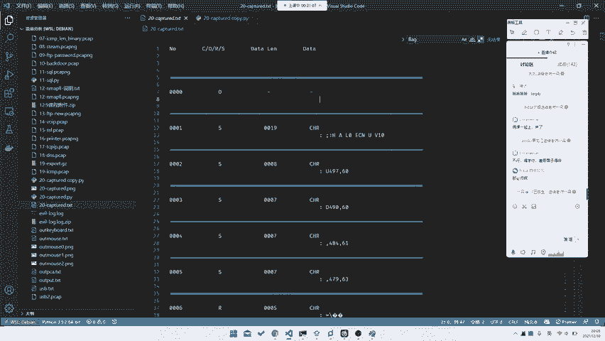
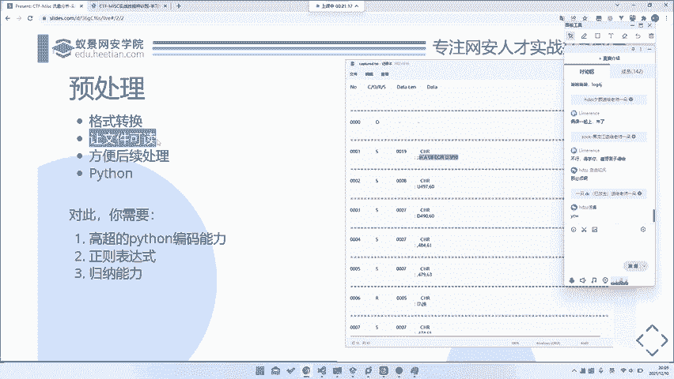
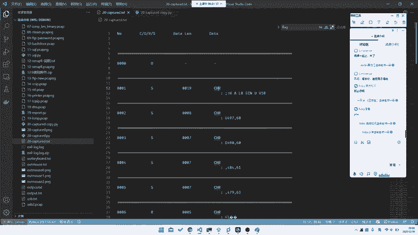
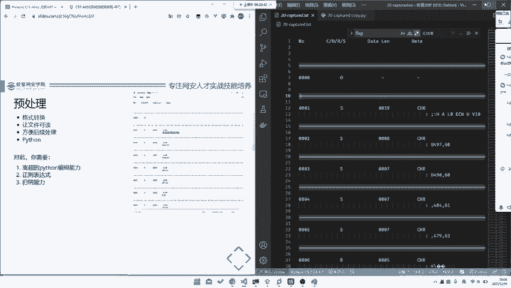
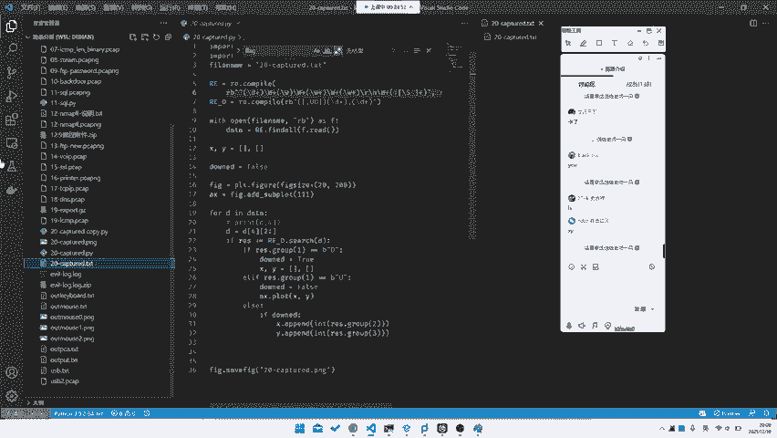
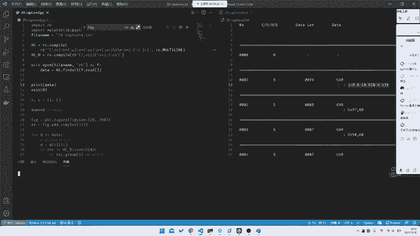
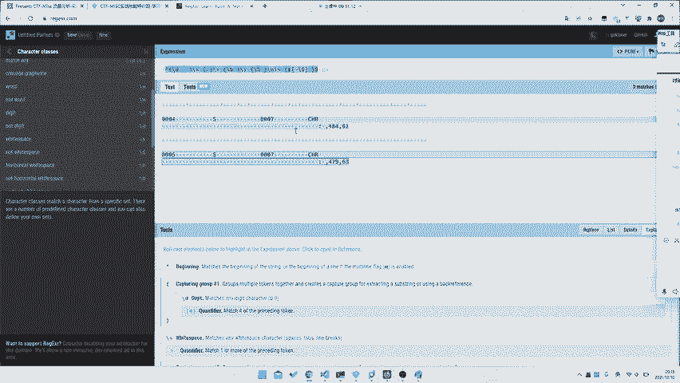
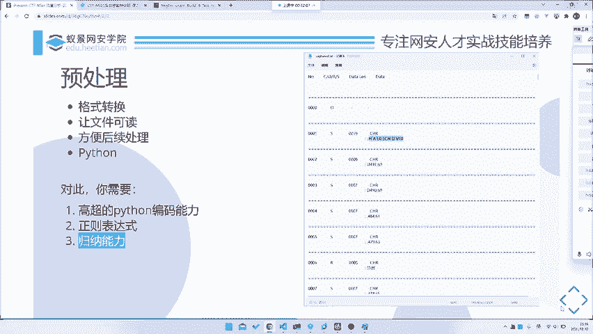

# CTF教程：P21：拿到题目该做什么之预处理 🧩



在本节课中，我们将学习如何入手一道全新的CTF题目。我们将通过一个具体的例子，完整地讲解从拿到题目到最终解出的全过程，重点聚焦于第一步：**预处理**。预处理的目标是将杂乱的原始数据转化为清晰、可读、便于后续分析的格式。

---

## 为什么要进行预处理？🤔

上一节我们介绍了入手新题目的整体思路。本节中，我们来看看第一步——预处理。当我们拿到一个题目文件时，它可能包含大量杂乱无章的数据，直接阅读或搜索关键信息（如`flag`）往往效率低下甚至无效。预处理的目的就是**整理数据格式**，使其变得**结构化**和**可操作**，为后续的关键点提取和分析打下基础。



例如，我们拿到一个名为`web20`的题目文件，内容如下（仅为示意）：
```
0000 CORS 1234 dataline data CHR(...
...
4794 ...
```
这个文件有近24000行，包含`number`、`CORS`、`dataline`、`data`等字段，但排列不规则。直接全局搜索`flag`是找不到的。因此，我们必须先对其进行预处理。



---

## 预处理的核心：格式转化与规律提取 🔍



预处理的核心是**格式转化**，或者说**让文件变得可读**。我们需要从原始数据中找出规律，并将其转化为结构化的格式，如JSON、CSV或便于程序处理的列表。

观察示例数据，我们可以发现以下规律：
1.  每行似乎包含多个由空格分隔的字段。
2.  某些行在`data`字段后，会跟一个以冒号`:`开头的行，冒号后还有内容。
3.  数据似乎是按`number`字段（如0000, 0001...）顺序排列的时间序列。

因此，我们可以将数据的格式归纳为：一个包含多个字段（例如5个）的数据行，有时会附带一个额外的冒号行。



---

## 实现预处理：使用Python与正则表达式 🐍

以下是实现预处理的具体步骤，我们将使用Python和正则表达式来完成。

### 步骤一：编写正则表达式匹配模式



我们需要编写一个正则表达式来匹配并提取出每行中的关键字段。根据观察到的规律，模式需要匹配：行首的数字ID、单个字母、另一串字符、以及`data`字段和可能存在的冒号行内容。

以下是一个示例的正则表达式模式：
```python
import re

pattern = r'^(\d+)\s+(\w)\s+(\S+)\s+data\s+(\S+)(?:\r?\n:\s*(.*))?'
```
**公式解释**：
*   `^(\d+)`：匹配行首的一个或多个数字（`number`字段）。
*   `\s+(\w)`：匹配空格后的一单个字母字符。
*   `\s+(\S+)`：匹配空格后的一串非空格字符。
*   `\s+data\s+(\S+)`：匹配“data”关键字及其后的一串非空格字符。
*   `(?:\r?\n:\s*(.*))?`：这是一个非捕获分组，用于匹配可选的换行后，以冒号开头并跟随任意内容的行。

### 步骤二：读取文件并提取数据



编写Python脚本，应用正则表达式读取文件并提取出结构化的数据。

```python
import re

pattern = r'^(\d+)\s+(\w)\s+(\S+)\s+data\s+(\S+)(?:\r?\n:\s*(.*))?'
compiled_pattern = re.compile(pattern, re.MULTILINE)

with open('web20_data.txt', 'r', encoding='utf-8') as f:
    content = f.read()

matches = compiled_pattern.findall(content)
for match in matches:
    print(match)  # 输出形如 (‘0000‘, ‘C‘, ‘1234‘, ‘CHR(...)‘, ‘:xxx‘) 的元组
```
运行这段代码，我们将得到一个清晰的、结构化的数据列表。每个匹配项是一个元组，包含了我们提取出的各个字段。

### 步骤三：验证与调整

提取后，需要检查数据是否符合预期。可以利用在线正则表达式测试工具（如 [regex101.com](https://regex101.com)）来调试和优化你的正则表达式。将样例数据粘贴到工具中，实时测试匹配效果，确保所有需要的数据都被正确捕获。

---

## 预处理所需的关键能力 🛠️

完成预处理步骤，你需要具备以下能力：

1.  **基础的Python编程能力**：能够熟练地使用Python进行文件读写、字符串处理和循环操作。无需非常深入，但需保证效率。
2.  **正则表达式技能**：正则表达式是文本处理的利器。你需要理解如何编写模式来匹配、分组和提取特定规律的文本。
    *   **学习建议**：使用 [regex101.com](https://regex101.com) 这类交互式网站进行学习和测试，它能够可视化解释你的表达式并高亮匹配结果。
3.  **观察与归纳能力**：这是预处理的前提。你必须能够从看似混乱的数据中，发现其排列、重复或编码上的规律。

---



## 总结 📝

本节课中，我们一起学习了CTF解题的第一步——**预处理**。我们通过一个实际例子，演示了如何将杂乱的原始文本数据，通过**观察规律**、**编写正则表达式**和**使用Python脚本**，转化为结构清晰、便于后续分析的数据格式。预处理是高效解题的基石，它能帮助我们从数据的“汪洋大海”中，搭建起通向答案的“结构化桥梁”。



在接下来的章节中，我们将基于预处理好的数据，进入下一个关键步骤：**关键信息点的提取与分析**。