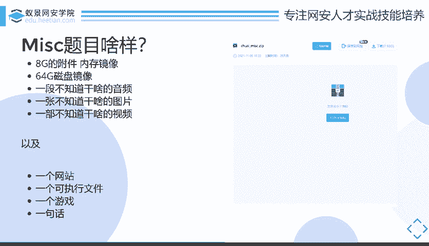
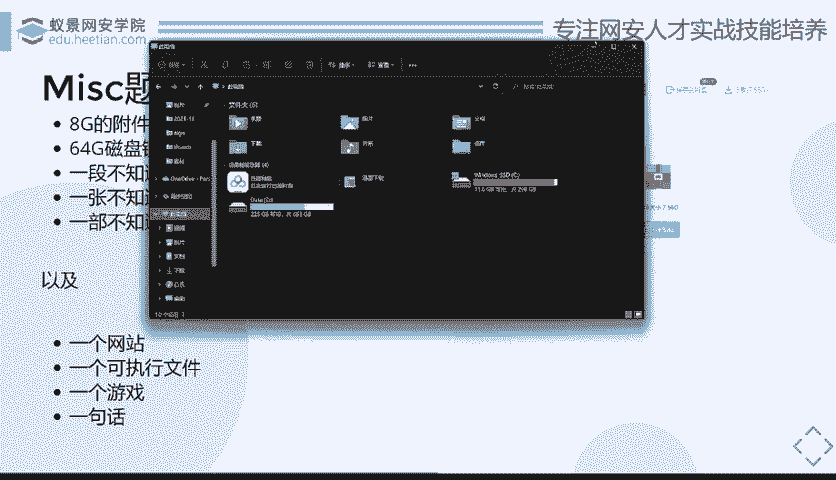

# CTF教程：P22：什么是MISC

在本节课中，我们将要学习CTF中MISC（杂项）类别的定义、特点、所需技能以及其在比赛和职业发展中的定位。我们将从MISC的起源、现状以及未来方向三个方面进行探讨。

## MISC从哪里来？

首先，我们需要了解什么是MISC。通俗来讲，MISC就是“大杂烩”，它包含了多种类型的题目和资源。具体而言，它涵盖了诸如OSINT（开源情报搜集）、隐写术、取证、编码等多种专业领域。简而言之，所有你不知道如何归类的CTF题目，都可以被归为MISC。

在国内的比赛环境中，由于分类习惯，许多在国外会被细分的题目类型（如取证、隐写）都被统一归入MISC类别，这使得国内的MISC题目内容非常庞杂。

MISC类别通常被推荐给初学者，原因有三点：它是最有趣且最贴近生活的；它最容易入门，甚至不需要编程基础；它的知识最贴近实际生活中的安全场景，例如账号盗取、数据恢复、图像信息分析等。这些特性也暗示了MISC技能在未来的一个可能发展方向：数字取证，辅助执法机构办案。

然而，MISC真正深入后会发现其挑战巨大。要成为一名合格的MISC选手，你需要具备广泛的基础和工具。

以下是成为一名MISC选手所需的基础和工具：

*   **基础知识**：需要掌握Linux操作系统、计算机体系结构等。
*   **广泛的知识面**：涉及计算机、音频处理、图像处理、数字信号处理，甚至人工智能、嵌入式、区块链等领域的知识都可能需要了解。
*   **核心素质**：需要一颗热爱学习的心，因为大部分解题思路都依赖于现场快速学习新知识。
*   **工具集**：需要Kali Linux等渗透测试环境、各类破解工具（如压缩包密码破解）、取证工具（如Autopsy、取证大师）、流量分析工具、Adobe全家桶（如Photoshop）、MATLAB等数学软件，以及各种编程语言的开发环境。
*   **硬件要求**：需要一个容量巨大的硬盘，用于存储各种学习资料、工具和庞大的比赛附件（有时附件可达数个GB甚至数十GB）。

## MISC选手在干什么？

在了解了MISC的起源和所需技能后，本节我们来看看MISC选手在实战和职业中的真实处境。

在CTF战队中，通常不存在“专门”的MISC选手。因为MISC选手往往不是一个独立的角色，他们通常是知识面最广的成员。有一种观点认为，所谓的MISC选手，不应该是“Web不会、逆向做不出、Pwn看不懂、密码写不来，只能做MISC签到题”的人的自嘲。相反，一个优秀的MISC选手可能需要同时具备Web、逆向、Pwn和密码学的知识，最终却可能还是只能解决MISC中的基础题目，这说明了MISC的难度。

MISC选手的优势在于知识面极广。为了解题，他们被迫学习各种新知识，其知识广度往往超过许多专精于某一领域（如Web或逆向）的选手。他们需要懂开发、懂协议（从物理层到应用层）、懂二进制文件结构，甚至能“脑补”出文件内容。

然而，这种“广而不深”的特点，在职业发展上可能无法直接对应一个专门的“MISC工程师”岗位。相比之下，Web安全、逆向工程等领域都有更对口的细分职业方向（如渗透测试、样本分析）。CTF本身具有游戏性质，MISC在其中保留了其趣味性和挑战性的价值。

那么，在比赛现场，MISC选手实际在做什么呢？他们可能在做逆向分析、渗透测试，也可能在其他方向的题目都被解决（AK）后“摸鱼”。因为MISC题目有时非常奇特：附件可能是一个巨大的磁盘镜像、一段看似无意义的音频、一张图片，甚至是一个游戏存档（如《Minecraft》）。选手需要极大的脑洞和临场学习能力来应对。有时，对着题目发呆、想不出解法也是常态。但正是这些新颖的题目，解出后往往让人拍案叫绝。

## MISC选手去哪里？

最后，我们来探讨MISC选手的未来发展方向。虽然MISC本身可能没有完全对口的职位，但其培养出的技能和素质极具价值。

MISC所锻炼的快速学习能力、广泛的知识储备、解决问题的发散思维（脑洞）以及信息搜集能力，是网络安全领域乃至许多技术岗位都非常重要的通用能力。具体而言，MISC中的取证技能可以转向数字取证调查岗位；信息搜集（OSINT）和分析能力可用于威胁情报领域；广泛的技能基础也有助于成为安全研究或安全运维中的多面手。

因此，学习MISC不应仅仅为了比赛。它是一条锻炼综合技术素养和问题解决能力的绝佳途径。通过MISC打下的广阔基础，你可以更好地选择自己未来希望深入的专业方向，并在实际工作中灵活运用这些跨领域的知识。

本节课中我们一起学习了MISC类别的定义、特点以及成为一名MISC选手所需的技能和工具。我们也分析了MISC选手在比赛中的真实状态和面临的挑战，并探讨了通过MISC训练所能获得的、对职业发展有益的通用能力。MISC不仅是CTF中的趣味挑战，更是培养全面安全技能和思维的重要起点。